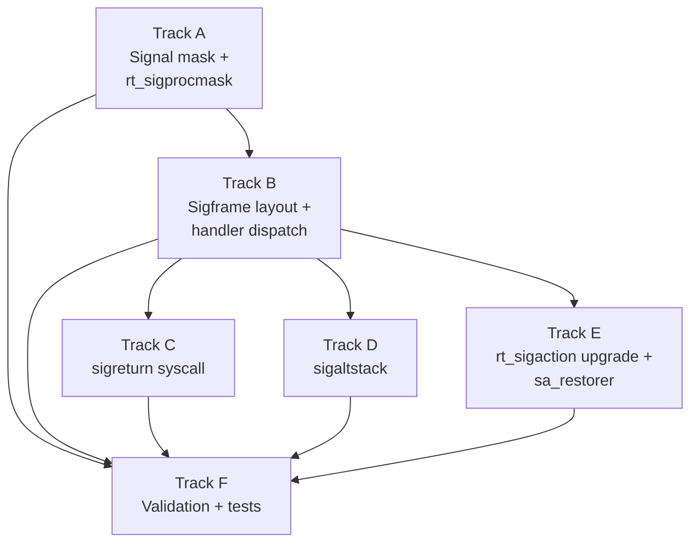

# Phase 19 — Signal Handlers: Task List

**Depends on:** Phase 18 (Directory and VFS) ✅
**Branch:** `phase-19-signal-handlers`
**Status:** Not started
**Goal:** Enable userspace programs to install and execute signal handlers via
the signal trampoline mechanism. Implement `sigreturn`, `rt_sigprocmask`,
`sigaltstack`, and the `sigframe` delivery path so ring-3 code can catch signals,
run a user-supplied handler, and resume the interrupted execution.

## Prerequisite Analysis

Current state (post-Phase 18):
- **Signal constants** (`process/mod.rs`): `SIGHUP`, `SIGINT`, `SIGKILL`,
  `SIGTERM`, `SIGCHLD`, `SIGCONT`, `SIGSTOP`, `SIGTSTP` defined (8 signals)
- **SignalAction enum**: only `Default` and `Ignore` variants — no user
  handler variant
- **Process struct**: has `pending_signals: u64` bitfield and
  `signal_actions: [SignalAction; 32]` table; no `blocked_signals` field,
  no `sigaltstack` fields, no `sa_restorer` storage
- **`sys_rt_sigaction` (syscall 13)**: parses the userspace `sigaction` struct
  (handler + flags + restorer + mask) but treats any user handler address as
  `Default` — never stores handler address or restorer
- **`sys_rt_sigprocmask` (syscall 14)**: stub that always returns 0; no actual
  masking logic
- **`check_pending_signals()`**: called after every syscall; only handles
  default actions (Terminate, Stop, Continue, Ignore) — no user handler
  dispatch path
- **`sys_kill` (syscall 62)**: fully implemented for pid, pgid, and group
- **`sigreturn` (syscall 15)**: not implemented — no dispatch entry
- **`sigaltstack` (syscall 131)**: not implemented — no dispatch entry
- **sigframe / ucontext_t**: not defined anywhere
- **Signal trampoline**: not implemented
- **`has_pending_signal()`**: exists, used to interrupt blocking syscalls

Already implemented (no new work needed):
- Signal constants and default disposition table
- `send_signal`, `dequeue_signal`, `send_sigchld_to_parent`
- `sys_kill` with pid/pgid/group semantics
- `check_pending_signals` call sites after every syscall return
- `has_pending_signal` for `EINTR` interruption of blocking syscalls
- Process group signal delivery (`send_signal_to_group`)

## Track Layout

| Track | Scope | Dependencies | Status |
|---|---|---|---|
| A | Signal mask + rt_sigprocmask | — | Not started |
| B | sigframe layout + handler dispatch | A | Not started |
| C | sigreturn syscall | B | Not started |
| D | sigaltstack | B | Not started |
| E | rt_sigaction upgrade + sa_restorer | B | Not started |
| F | Validation and tests | A, B, C, D, E | Not started |

---

## Track A — Signal Mask and rt_sigprocmask

Add a per-process blocked-signal bitfield and implement the `rt_sigprocmask`
syscall so processes can block and unblock signal delivery.

| Task | Description |
|---|---|
| P19-T001 | Add `blocked_signals: u64` field to `Process` struct in `process/mod.rs`; initialize to `0` in `spawn_process()` and `spawn_process_with_cr3()` |
| P19-T002 | Copy `blocked_signals` from parent to child in the fork path (`spawn_process_with_cr3_and_fds()`) so forked children inherit the parent's signal mask |
| P19-T003 | Define `SIG_BLOCK = 0`, `SIG_UNBLOCK = 1`, `SIG_SETMASK = 2` constants in `syscall.rs` |
| P19-T004 | Implement `sys_rt_sigprocmask(how, set_ptr, oldset_ptr, sigsetsize)`: read the old mask and copy to `oldset_ptr` if non-null; apply `SIG_BLOCK` (mask \|= set), `SIG_UNBLOCK` (mask &= !set), or `SIG_SETMASK` (mask = set); always clear `SIGKILL` (bit 9) and `SIGSTOP` (bit 19) from the result — these signals must never be blocked; return `EINVAL` for unknown `how` values or invalid `sigsetsize` (must be 8) |
| P19-T005 | Update `dequeue_signal()` to skip signals that are in the process's `blocked_signals` mask — a blocked signal stays in `pending_signals` but is not dequeued until unblocked |
| P19-T006 | After `SIG_UNBLOCK` in `sys_rt_sigprocmask`, call `check_pending_signals()` so that any newly-unblocked pending signals are delivered immediately |
| P19-T007 | Add `SIGSEGV = 11`, `SIGBUS = 7`, `SIGFPE = 8`, `SIGPIPE = 13`, `SIGALRM = 14`, `SIGUSR1 = 10`, `SIGUSR2 = 12` constants to fill out the standard signal set; update `default_signal_action()` to return `Terminate` for these |

## Track B — Sigframe Layout and Handler Dispatch

Define the signal frame structure that gets pushed onto the user stack when
delivering a signal to a user handler. Extend `SignalAction` to store handler
addresses and implement `setup_signal_frame()`.

| Task | Description |
|---|---|
| P19-T008 | Extend `SignalAction` enum to add a `Handler { entry: u64, mask: u64, flags: u64, restorer: u64 }` variant that stores the user handler address, `sa_mask`, `sa_flags`, and `sa_restorer` pointer |
| P19-T009 | Define the `Sigframe` struct in a new `kernel/src/signal.rs` module: must match the Linux `rt_sigframe` layout that musl expects — `siginfo_t` (128 bytes), `ucontext_t` containing `uc_flags`, `uc_link`, `uc_stack` (`stack_t`), `uc_mcontext` (saved GPRs: `r8`–`r15`, `rdi`, `rsi`, `rbp`, `rbx`, `rdx`, `rax`, `rcx`, `rsp`, `rip`, `rflags`), `uc_sigmask` (saved signal mask); total struct must be 16-byte aligned |
| P19-T010 | Implement `setup_signal_frame(pid, signal_num, handler_entry, sa_mask, restorer)`: read the current trap frame registers (the state at the point of interruption); compute the new user RSP (current user RSP minus `size_of::<Sigframe>()`, aligned down to 16 bytes minus 8 for call convention); write the `Sigframe` to user memory at the new RSP; set the return address (at top of frame) to `restorer` so the handler returns into `__restore_rt`; update the trap frame: `RIP = handler_entry`, `RSP = new_rsp`, `RDI = signal_num` (first argument to the handler) |
| P19-T011 | Update `check_pending_signals()` to check if the dequeued signal has a `SignalAction::Handler` — if so, call `setup_signal_frame()` instead of the default-action path; before dispatch, save the current `blocked_signals` into the sigframe's `uc_sigmask`, then set `blocked_signals |= sa_mask | (1 << signal_num)` to mask the delivered signal and any signals in `sa_mask` during handler execution |
| P19-T012 | Ensure `setup_signal_frame()` validates that the computed user stack address is in valid user-space memory (below kernel space); if not, terminate the process with `SIGSEGV` default action (prevents writing kernel memory via a corrupted user RSP) |
| P19-T013 | Add the `signal` module to `kernel/src/lib.rs` (or `main.rs` depending on crate root); ensure it is accessible from the syscall module |

## Track C — sigreturn Syscall

Implement `sys_sigreturn` (syscall 15) to restore the interrupted register state
from the sigframe and resume execution at the interrupted instruction.

| Task | Description |
|---|---|
| P19-T014 | Add syscall 15 dispatch entry in the syscall handler; route to `sys_sigreturn()` |
| P19-T015 | Implement `sys_sigreturn()`: read the current `RSP` from the trap frame (this points into the sigframe after `__restore_rt` does `mov rsp, ...` / the syscall); locate the `Sigframe` struct on the user stack; validate that the pointer is in user-space and properly aligned |
| P19-T016 | Restore all general-purpose registers from the sigframe's `uc_mcontext` into the trap frame: `rax`, `rbx`, `rcx`, `rdx`, `rsi`, `rdi`, `rbp`, `rsp`, `r8`–`r15`, `rip`, `rflags`; mask `rflags` to only restore safe bits (clear `IOPL`, `IF`, `TF` if needed — prevent privilege escalation via crafted sigframe) |
| P19-T017 | Restore the saved signal mask from `uc_sigmask` back into `process.blocked_signals`; again ensure `SIGKILL` and `SIGSTOP` bits are cleared |
| P19-T018 | After restoring registers, return from the syscall handler via the restored trap frame — the process resumes at the exact instruction that was interrupted with all registers restored; `sigreturn` does not return a value (the restored `rax` is the original pre-signal `rax`) |

## Track D — sigaltstack

Implement `sys_sigaltstack` (syscall 131) so processes can register an alternate
signal stack for handling signals (especially `SIGSEGV`) when the main stack is
exhausted.

| Task | Description |
|---|---|
| P19-T019 | Add `alt_stack_base: u64`, `alt_stack_size: u64`, `alt_stack_flags: u32` fields to `Process` struct; initialize to 0 (disabled); define `SS_DISABLE = 2`, `SS_ONSTACK = 1` constants |
| P19-T020 | Add syscall 131 dispatch entry; route to `sys_sigaltstack(ss_ptr, old_ss_ptr)` |
| P19-T021 | Implement `sys_sigaltstack`: if `old_ss_ptr` is non-null, write the current `stack_t` (base, size, flags) to userspace; if `ss_ptr` is non-null, read the new `stack_t` from userspace — if `SS_DISABLE` is set, disable the alt stack; otherwise validate `ss_size >= MINSIGSTKSZ` (2048) and store the new base/size; return `EPERM` if currently executing on the alt stack (`SS_ONSTACK` is set) and the caller tries to change it |
| P19-T022 | Update `setup_signal_frame()`: if the signal's `sa_flags` includes `SA_ONSTACK` (0x08000000) and the process has a registered alt stack that is not `SS_DISABLE` and not currently `SS_ONSTACK`, use `alt_stack_base + alt_stack_size` as the initial RSP instead of the current user RSP; set `SS_ONSTACK` flag |
| P19-T023 | On `sigreturn`, if the sigframe's `uc_stack` had `SS_ONSTACK` set, clear the `SS_ONSTACK` flag in the process's alt stack state so the alt stack can be reused for future signals |

## Track E — rt_sigaction Upgrade and sa_restorer

Upgrade `sys_rt_sigaction` to fully store user handler information including
`sa_restorer`, and define `SA_` flag constants.

| Task | Description |
|---|---|
| P19-T024 | Define `SA_RESTORER = 0x04000000`, `SA_ONSTACK = 0x08000000`, `SA_SIGINFO = 0x00000004`, `SA_NODEFER = 0x40000000`, `SA_RESETHAND = 0x80000000` flag constants (only `SA_RESTORER` and `SA_ONSTACK` will be honored in this phase; others are parsed but deferred) |
| P19-T025 | Update `sys_rt_sigaction` to store user handler addresses: when the handler value is not `SIG_DFL` (0) or `SIG_IGN` (1), create `SignalAction::Handler { entry: handler_addr, mask: sa_mask, flags: sa_flags, restorer: sa_restorer }`; continue to reject `SIGKILL` and `SIGSTOP` with `EINVAL` |
| P19-T026 | When reading the old action in `sys_rt_sigaction` (writing to `oldact`): for `SignalAction::Handler`, write back the stored `entry`, `mask`, `flags`, `restorer` fields; for `Default` write handler=0, for `Ignore` write handler=1 |
| P19-T027 | Validate `SA_RESTORER` flag: if a user handler is being installed and `sa_flags` does not include `SA_RESTORER`, log a warning — musl always sets this flag, so absence may indicate a bug; still accept the registration but use a fallback restorer address of 0 (which will fault if the handler returns, making the bug visible) |

## Track F — Validation and Tests

Validate signal handler delivery end-to-end and verify all acceptance criteria.

| Task | Description |
|---|---|
| P19-T028 | Write a test userspace binary `sigint_test.elf`: install a `SIGINT` handler via `rt_sigaction` with `SA_RESTORER` pointing to a `__restore_rt` stub (inline asm: `mov $15, %rax; syscall`); call `kill(getpid(), SIGINT)`; assert the handler ran (set a global flag); assert execution continues after `raise` returns |
| P19-T029 | Write a test binary `sigmask_test.elf`: block `SIGUSR1` via `rt_sigprocmask(SIG_BLOCK)`; send `SIGUSR1` to self; assert the handler has NOT run; call `rt_sigprocmask(SIG_UNBLOCK)` for `SIGUSR1`; assert the handler runs immediately after unblock |
| P19-T030 | Write a test binary `sigaltstack_test.elf`: register an alt stack via `sigaltstack`; install a `SIGSEGV` handler with `SA_ONSTACK`; trigger a stack overflow (recursive function); assert the handler executes on the alt stack without triple-faulting |
| P19-T031 | Acceptance: `rt_sigaction` returns `EINVAL` for `SIGKILL` and `SIGSTOP` |
| P19-T032 | Acceptance: a handler does not re-enter itself when the same signal fires during handler execution (automatic masking of the delivered signal) |
| P19-T033 | Acceptance: `rt_sigprocmask(SIG_BLOCK)` prevents delivery; `SIG_UNBLOCK` delivers the held-pending signal immediately |
| P19-T034 | Acceptance: after `sigreturn`, the process resumes at the exact interrupted instruction with all registers restored to pre-signal values |
| P19-T035 | Acceptance: nested signals with distinct numbers work — signal A fires during signal B's handler (B not in A's `sa_mask`); both handlers run; both frames restore in reverse order |
| P19-T036 | Acceptance: the kernel shell (ring-0, Phase 9) continues to work — `SIGINT` default action still terminates foreground processes; no regression |
| P19-T037 | Acceptance: `sigaltstack` marks `SS_ONSTACK` while handler runs; a second `sigaltstack` call while `SS_ONSTACK` returns `EPERM`; `SS_ONSTACK` clears on `sigreturn` |
| P19-T038 | Acceptance: musl-compiled binary using `signal()` or `sigaction()` can install and execute a handler (musl emits `rt_sigaction` with `SA_RESTORER` pointing to `__restore_rt`) |
| P19-T039 | Acceptance: sigframe is 16-byte aligned on the user stack (System V AMD64 ABI); misalignment would cause SSE faults in musl code |
| P19-T040 | Acceptance: all existing tests pass without modification (exit0, fork-test, tmpfs-test, echo-args, ls) |
| P19-T041 | `cargo xtask check` passes (clippy + fmt) |
| P19-T042 | QEMU boot validation — no panics, no regressions |
| P19-T043 | Write documentation: sigframe layout diagram, signal delivery decision tree, signal mask lifecycle, `sigreturn` explanation, `SA_RESTORER` contract with musl, stack layout before/after `setup_signal_frame()`, unblockable signals |

---

## Deferred Until Later

These items are explicitly out of scope for Phase 19:

- Real-time signals (`SIGRTMIN` through `SIGRTMAX`) and `sigqueue`
- `signalfd` — receiving signals as readable file descriptors
- FPU / SSE / AVX state save and restore in the sigframe
- Per-thread signal masks and thread-directed signal delivery (requires `clone`)
- `SA_NODEFER` flag semantics (parsed but not honored)
- `SA_RESETHAND` flag semantics (parsed but not honored)
- `SIGALRM` and `timer_create` timer signals
- `ptrace`-stop signals
- `EINTR` restart via `SA_RESTART` flag

---

## Dependency Graph

## Parallelization Strategy

**Wave 1:** Track A — signal masking is a prerequisite for correct handler
dispatch (handlers must mask signals during execution) and must land first.

**Wave 2 (after A):** Track B — sigframe layout and `setup_signal_frame()` are
the core mechanism; everything else depends on being able to push a frame.

**Wave 3 (after B):** Tracks C, D, and E can proceed in parallel — `sigreturn`
reads the frame that Track B writes, `sigaltstack` modifies the stack selection
in `setup_signal_frame`, and the `rt_sigaction` upgrade stores handler info
consumed by Track B. These three tracks touch different code paths and can be
developed independently.

**Wave 4 (after all):** Track F — end-to-end validation after all features are
in place.

## Related

- [Phase 19 Design Doc](../19-signal-handlers.md)
