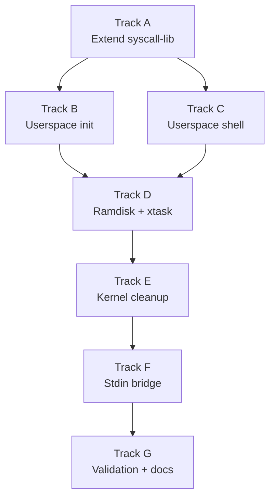

# Phase 20 — Userspace Init and Shell: Task List

**Depends on:** Phase 19 (Signal Handlers) ✅
**Goal:** Replace the kernel-resident `init_task` and `shell_task` ring-0 functions
with real ring-3 userspace processes. PID 1 becomes a `no_std` Rust binary loaded
from the ramdisk; the interactive shell is a userspace ELF that init spawns. The
kernel is no longer responsible for parsing commands or managing the interactive session.

## Prerequisite Analysis

Current state (post-Phase 19):
- **`init_task()`** (`kernel/src/main.rs:178`): kernel function that creates IPC
  endpoints (console, kbd, fat, vfs), spawns service tasks, spawns `shell_task`,
  `stdin_feeder_task`, and `p11_launcher_task`; never returns
- **`shell_task()`** (`kernel/src/main.rs:807`): kernel-mode interactive shell that
  reads from `STDIN_BUFFER`, parses commands, supports builtins (`cd`, `exit`,
  `export`, `unset`, `env`, `fg`, `bg`, `ping`, `help`), pipes (`|`), I/O
  redirection (`>`, `>>`, `<`), background jobs (`&`), environment variables
  (`$VAR` expansion), and `Ctrl-C`/`Ctrl-Z` signal delivery
- **`stdin_feeder_task()`** (`kernel/src/main.rs:710`): kernel task that reads
  scancodes from kbd service, decodes to ASCII, handles Enter/Backspace/Ctrl-C/
  Ctrl-Z, echoes to console, feeds decoded bytes into kernel stdin buffer
- **`shell_fork_exec()`** (`kernel/src/main.rs:1010`): spawns user processes
  via `spawn_user_process_with_pipe()`, relays stdout to console, handles
  redirection and background jobs
- **Syscall table** (`kernel/src/arch/x86_64/syscall.rs`): `read`, `write`,
  `open`, `close`, `fork`, `execve`, `waitpid`, `pipe`, `dup2`, `chdir`,
  `getcwd`, `kill`, `getpid`, `getppid`, `mmap`, `brk`, `exit`, `nanosleep`,
  `ioctl`, `fstat`, `stat`, `openat`, `getdents64`, `rt_sigaction`,
  `rt_sigprocmask`, `sigreturn`, `sigaltstack`, `setpgid`, `getpgid`,
  `mkdir`, `rmdir`, `unlink`, `rename`, `truncate`, `uname`
- **ELF loader** (`kernel/src/mm/elf.rs`): supports ELF64 ET_EXEC and ET_DYN,
  `setup_abi_stack_with_envp()` builds System V AMD64 ABI initial stack
- **`syscall-lib`** (`userspace/syscall-lib/src/lib.rs`): raw `syscall0`/`syscall1`/
  `syscall2` wrappers, `exit()`, `serial_print()`; missing `syscall3`–`syscall6`
  and high-level wrappers for `fork`, `execve`, `waitpid`, `pipe`, `dup2`, `read`,
  `write`, `open`, `close`, `chdir`, `kill`, `getpid`
- **Ramdisk** (`kernel/src/fs/ramdisk.rs`): embeds ELF binaries via `include_bytes!`;
  currently includes exit0, fork-test, echo-args, hello, tmpfs-test, echo, true,
  false, cat, ls, pwd, mkdir, rmdir, rm, cp, mv, env, sleep, grep, signal-test
- **Workspace Cargo.toml**: `userspace/init` and `userspace/shell` are commented out
- **No `/sbin/init` or `/bin/sh`** in the ramdisk yet
- **No `userspace/init/` or `userspace/shell/`** directories exist yet

Already implemented (no new work needed):
- Full syscall table for process lifecycle, file I/O, signals, memory (Phase 11–19)
- ELF loader with System V AMD64 ABI stack setup (Phase 11)
- Kernel-task servers: console, kbd, vfs, fat (Phase 7–8)
- Fork, exec, wait, pipe, dup2 syscall implementations (Phase 11–14)
- Signal delivery: SIGINT, SIGCHLD, SIGTSTP, user handlers (Phase 19)
- Ramdisk with coreutils ELFs (Phase 14)

## Track Layout

| Track | Scope | Dependencies |
|---|---|---|
| A | Extend syscall-lib with high-level wrappers | — |
| B | Userspace init binary | A |
| C | Userspace shell binary | A |
| D | Ramdisk and xtask integration | B, C |
| E | Kernel cleanup — remove ring-0 shell/init | D |
| F | Stdin bridge — keyboard to PID 1 fd | E |
| G | Validation and documentation | F |

---

## Track A — Extend syscall-lib

The existing `syscall-lib` only has `syscall0`–`syscall2` and a few constants.
Both init and the shell need higher-arity wrappers and safe Rust functions
for the full process lifecycle.

| Task | Description |
|---|---|
| P20-T001 | Add `syscall3`, `syscall4`, `syscall5`, `syscall6` raw wrappers to `userspace/syscall-lib/src/lib.rs` following the existing `syscall0`–`syscall2` pattern; `r10` replaces `rcx` for arg 4 per Linux ABI |
| P20-T002 | Add syscall number constants: `SYS_READ` (0), `SYS_WRITE` (1), `SYS_OPEN` (2), `SYS_CLOSE` (3), `SYS_FSTAT` (5), `SYS_LSEEK` (8), `SYS_MMAP` (9), `SYS_BRK` (12), `SYS_IOCTL` (16), `SYS_PIPE` (22), `SYS_DUP2` (33), `SYS_NANOSLEEP` (35), `SYS_KILL` (62), `SYS_CHDIR` (80), `SYS_MKDIR` (83), `SYS_GETCWD` (79), `SYS_SETPGID` (109), `SYS_GETPGID` (121) |
| P20-T003 | Add safe wrapper functions: `read(fd, buf) -> isize`, `write(fd, buf) -> isize`, `open(path, flags, mode) -> isize`, `close(fd) -> isize` |
| P20-T004 | Add safe wrapper functions: `fork() -> isize`, `execve(path, argv, envp) -> isize`, `waitpid(pid, status, flags) -> isize`, `getpid() -> isize`, `getppid() -> isize` |
| P20-T005 | Add safe wrapper functions: `pipe(fds: &mut [i32; 2]) -> isize`, `dup2(oldfd, newfd) -> isize`, `chdir(path) -> isize`, `getcwd(buf) -> isize` |
| P20-T006 | Add safe wrapper functions: `kill(pid, sig) -> isize`, `setpgid(pid, pgid) -> isize`, `nanosleep(seconds) -> isize` |
| P20-T007 | Add constants: `O_RDONLY` (0), `O_WRONLY` (1), `O_RDWR` (2), `O_CREAT` (0x40), `O_TRUNC` (0x200), `O_APPEND` (0x400), `WNOHANG` (1), `SIGINT` (2), `SIGCHLD` (17), `SIGTSTP` (20), `SIGCONT` (18), `STDIN_FILENO` (0), `STDOUT_FILENO` (1), `STDERR_FILENO` (2) |
| P20-T008 | Add a `write_str(fd, s: &str) -> isize` convenience wrapper and a `write_u64(fd, n: u64)` helper that formats a number into a stack buffer and writes it (needed for error messages without `alloc`) |

## Track B — Userspace Init Binary

Minimal `no_std` Rust binary that serves as PID 1: opens console fds,
spawns the shell, and reaps orphaned children.

| Task | Description |
|---|---|
| P20-T009 | Create `userspace/init/Cargo.toml`: `no_std` crate, depends on `syscall-lib`, target `x86_64-unknown-none` |
| P20-T010 | Create `userspace/init/src/main.rs` with `#![no_std]`, `#![no_main]`, `#[panic_handler]` that calls `syscall_lib::exit(101)`, and `#[no_mangle] pub extern "C" fn _start()` entry point |
| P20-T011 | In `_start()`: open `/dev/console` three times as fds 0 (stdin), 1 (stdout), 2 (stderr); if `/dev/console` is not yet supported, open `/dev/serial` or use fds 0/1/2 if the kernel pre-opens them for PID 1 |
| P20-T012 | Write a boot banner to stdout: `"\nm3OS init (PID 1)\n"` |
| P20-T013 | Fork and exec `/bin/sh`: call `fork()`; in child call `execve("/bin/sh", argv, envp)` with `argv = ["/bin/sh", NULL]` and `envp = ["PATH=/bin:/sbin:/usr/bin", "HOME=/", "TERM=m3os", NULL]`; in parent store the shell PID |
| P20-T014 | Enter the reap loop: infinite loop calling `waitpid(-1, &status, WNOHANG)`; if the reaped PID is the shell, re-spawn it (fork + exec `/bin/sh` again); on ECHILD (no children) call `nanosleep(1)` or a yield syscall to avoid busy-spinning |
| P20-T015 | Ensure init never exits: if the reap loop somehow breaks, write an error message and call `exit(1)` (the kernel should panic if PID 1 exits, but be defensive) |

## Track C — Userspace Shell Binary

Interactive `no_std` Rust shell: reads lines, parses commands, fork-exec-wait,
pipes, redirection, builtins.

| Task | Description |
|---|---|
| P20-T016 | Create `userspace/shell/Cargo.toml`: `no_std` crate, depends on `syscall-lib`, target `x86_64-unknown-none` |
| P20-T017 | Create `userspace/shell/src/main.rs` with `#![no_std]`, `#![no_main]`, `#[panic_handler]`, and `_start()` entry point |
| P20-T018 | Implement the prompt loop: write `"$ "` to stdout, read stdin one byte at a time into a 256-byte stack line buffer until `\n` or `\r`; handle backspace (erase last byte, write `"\x08 \x08"` to erase on screen); null-terminate the line |
| P20-T019 | Implement character echo: write each printable byte back to stdout as it is typed (since there is no TTY line discipline doing echo) |
| P20-T020 | Implement tokenizer: split the line on whitespace into an argv array (max 32 tokens); respect single-quoted strings (no expansion inside quotes); detect `\|` as pipe separator, `>` / `>>` / `<` as redirection operators, `&` as background flag |
| P20-T021 | Implement `cd` builtin: call `chdir(path)`; if no argument, `chdir("/")` |
| P20-T022 | Implement `exit` builtin: call `exit(0)` (init will re-spawn the shell) |
| P20-T023 | Implement simple command execution: `fork()`, in child call `execve(cmd, argv, envp)`; in parent call `waitpid(child_pid, &status, 0)` for foreground; print `"command not found: <cmd>\n"` if execve returns (negative errno) |
| P20-T024 | Implement PATH resolution: if the command does not start with `/`, try each directory in `PATH` (hardcoded to `/bin:/sbin:/usr/bin`) by concatenating `dir/cmd` and attempting `execve`; also try `dir/cmd.elf` for backward compatibility with ramdisk naming |
| P20-T025 | Implement two-stage pipe: detect `\|` token; call `pipe()` to get `[read_fd, write_fd]`; fork left child with `dup2(write_fd, STDOUT_FILENO)` + close both pipe fds; fork right child with `dup2(read_fd, STDIN_FILENO)` + close both pipe fds; close both pipe fds in parent; `waitpid` both children |
| P20-T026 | Implement `>` output redirection: open the target file with `O_WRONLY \| O_CREAT \| O_TRUNC`; in the child after fork, `dup2(file_fd, STDOUT_FILENO)` + `close(file_fd)`; exec the command |
| P20-T027 | Implement `>>` append redirection: same as `>` but open with `O_WRONLY \| O_CREAT \| O_APPEND` |
| P20-T028 | Implement `<` input redirection: open the source file with `O_RDONLY`; in the child after fork, `dup2(file_fd, STDIN_FILENO)` + `close(file_fd)`; exec the command |
| P20-T029 | Implement Ctrl-C handling: if the shell has a foreground child, call `kill(child_pid, SIGINT)`; if no child is running, just print a new prompt |
| P20-T030 | Print exit status: after `waitpid`, if the child exited with a non-zero status, print `"exit <code>\n"` |

## Track D — Ramdisk and Xtask Integration

Wire init and shell binaries into the build pipeline and ramdisk so they
appear at `/sbin/init` and `/bin/sh`.

| Task | Description |
|---|---|
| P20-T031 | Uncomment `"userspace/init"` and `"userspace/shell"` in workspace `Cargo.toml` members |
| P20-T032 | Update `xtask/src/main.rs` build step to compile `userspace/init` and `userspace/shell` alongside the existing Phase 11 test binaries (same target/flags: `x86_64-unknown-none`, release, `-Zbuild-std=core,compiler_builtins`) |
| P20-T033 | Copy the compiled binaries to `kernel/initrd/init.elf` and `kernel/initrd/sh.elf` |
| P20-T034 | Update `kernel/src/fs/ramdisk.rs` to embed init and sh binaries via `include_bytes!`; register init at path `/sbin/init` and sh at `/bin/sh` in the ramdisk file table |
| P20-T035 | Verify `cargo xtask image` builds successfully with the new binaries included |

## Track E — Kernel Cleanup

Remove the ring-0 init_task and shell_task from the kernel. Replace with
loading `/sbin/init` as PID 1 via the ELF loader.

| Task | Description |
|---|---|
| P20-T036 | In `kernel_main()` (`kernel/src/main.rs`): after kernel-task servers (console, kbd, vfs, fat) are spawned, load `/sbin/init` from the ramdisk via the ELF loader and transfer to ring-3 as PID 1 instead of calling `init_task()` |
| P20-T037 | Pass initial environment to PID 1 via `setup_abi_stack_with_envp()`: `PATH=/bin:/sbin:/usr/bin`, `HOME=/`, `TERM=m3os` |
| P20-T038 | Remove `shell_task()` function and all supporting code: `shell_execute()`, `shell_fork_exec()`, `shell_pipeline()`, `resolve_command()`, background job management, environment variable storage |
| P20-T039 | Remove `init_task()` function — the kernel-task server spawning (console, kbd, vfs, fat) should remain in `kernel_main` directly, not inside `init_task` |
| P20-T040 | Remove or reduce `p11_launcher_task()` if it is no longer needed (its purpose was Phase 11 test binary validation) |
| P20-T041 | Verify that kernel-task servers (console_server, kbd_server, vfs_server, fat_server) still start correctly and are reachable from userspace processes via IPC after the restructuring |

## Track F — Stdin Bridge

Ensure keyboard input reaches the userspace shell's stdin fd. The current
`stdin_feeder_task` feeds a kernel buffer; it needs to feed PID 1's fd 0 instead.

| Task | Description |
|---|---|
| P20-T042 | Evaluate how keyboard bytes currently reach userspace: does the `read(0, ...)` syscall for a userspace process block on the same buffer that `stdin_feeder_task` fills? If yes, the bridge may already work. If not, implement the connection. |
| P20-T043 | If needed: modify `stdin_feeder_task` to write decoded keyboard bytes into a kernel pipe or pseudo-device (`/dev/console`) that PID 1 has open as fd 0, so that `read(0, buf, 1)` in the shell blocks until a key is pressed |
| P20-T044 | Verify that init's fd 0 is inherited by the shell after `fork` + `execve`, so the shell's `read(0, ...)` receives keyboard input |
| P20-T045 | Verify character echo works end-to-end: shell writes typed characters to stdout (fd 1), which routes to the console/framebuffer |

## Track G — Validation and Documentation

| Task | Description |
|---|---|
| P20-T046 | Acceptance: OS boots and presents `$ ` prompt from the ring-3 shell without any ring-0 command parsing |
| P20-T047 | Acceptance: `echo hello world` prints correctly |
| P20-T048 | Acceptance: `ls \| cat` produces directory listing via a two-stage pipe |
| P20-T049 | Acceptance: `cat /sbin/init > /dev/null` (or `cat <file> > /tmp/out`) exercises I/O redirection |
| P20-T050 | Acceptance: `cd /bin && pwd` prints `/bin` |
| P20-T051 | Acceptance: Ctrl-C during a long-running child kills the child; shell returns to prompt |
| P20-T052 | Acceptance: running a nonexistent command prints an error and returns to prompt |
| P20-T053 | Acceptance: `true` exits 0 silently; `false` exits 1 with status notice |
| P20-T054 | Acceptance: orphaned children are reaped by PID 1 (no zombie accumulation) |
| P20-T055 | Acceptance: `exit` in the shell causes init to re-spawn it; a new `$ ` prompt appears |
| P20-T056 | Acceptance: `kernel/src/main.rs` no longer contains `shell_task` or `init_task` functions |
| P20-T057 | `cargo xtask check` passes (clippy + fmt) |
| P20-T058 | QEMU boot validation — no panics, no regressions |
| P20-T059 | Write `docs/16-userspace-init.md`: PID 1 contract (why init must never exit, orphan reaping), `_start` → `main` entry sequence for `no_std` Rust userspace, syscall wrapper pattern, shell fork-exec-wait loop, pipe fd plumbing diagram (parent/left-child/right-child fd state), which kernel-task servers remain in ring-0 and why |

---

## Deferred Until Later

These items are explicitly out of scope for Phase 20:

- Moving kernel-task servers (console, kbd, vfs, fat) to ring-3 (requires capability-grant IPC)
- PTY / TTY line discipline (`/dev/pts`, `termios`, raw mode, kernel-side echo)
- Job control: `SIGTSTP`, `SIGCONT`, `fg`, `bg`, process groups, sessions
- Multi-user login and `/etc/passwd`
- Shell scripting: loops, conditionals, functions, variable assignment
- Environment variable `$VAR` expansion (can be added incrementally later)
- Tab completion and readline-style line editing
- `exec` builtin, `source` / `.`
- Pipelines longer than two stages
- Subshell expansion `$(...)` and backtick substitution
- Here-documents and here-strings
- Stderr redirection (`2>`, `2>&1`) and fd duplication beyond 0/1/2
- `alloc`-based dynamic data structures in userspace (use fixed-size stack buffers)

---

## Dependency Graph

## Parallelization Strategy

**Wave 1:** Track A — extend `syscall-lib` with all the wrappers both binaries need.
This is the foundation; everything else depends on it.
**Wave 2 (after A):** Tracks B and C in parallel — init and shell are independent
binaries that both depend on `syscall-lib` but not on each other.
**Wave 3 (after B + C):** Track D — wire both binaries into xtask and the ramdisk.
**Wave 4 (after D):** Track E — remove kernel-mode shell/init code and boot into
the userspace init instead. This is the most delicate track; the system is
non-functional until the stdin bridge (Track F) is confirmed working.
**Wave 5 (after E):** Track F — verify or fix the keyboard-to-stdin path so the
shell can actually read input.
**Wave 6:** Track G — end-to-end validation. Expect iteration back to Tracks C/E/F
as integration issues surface.
