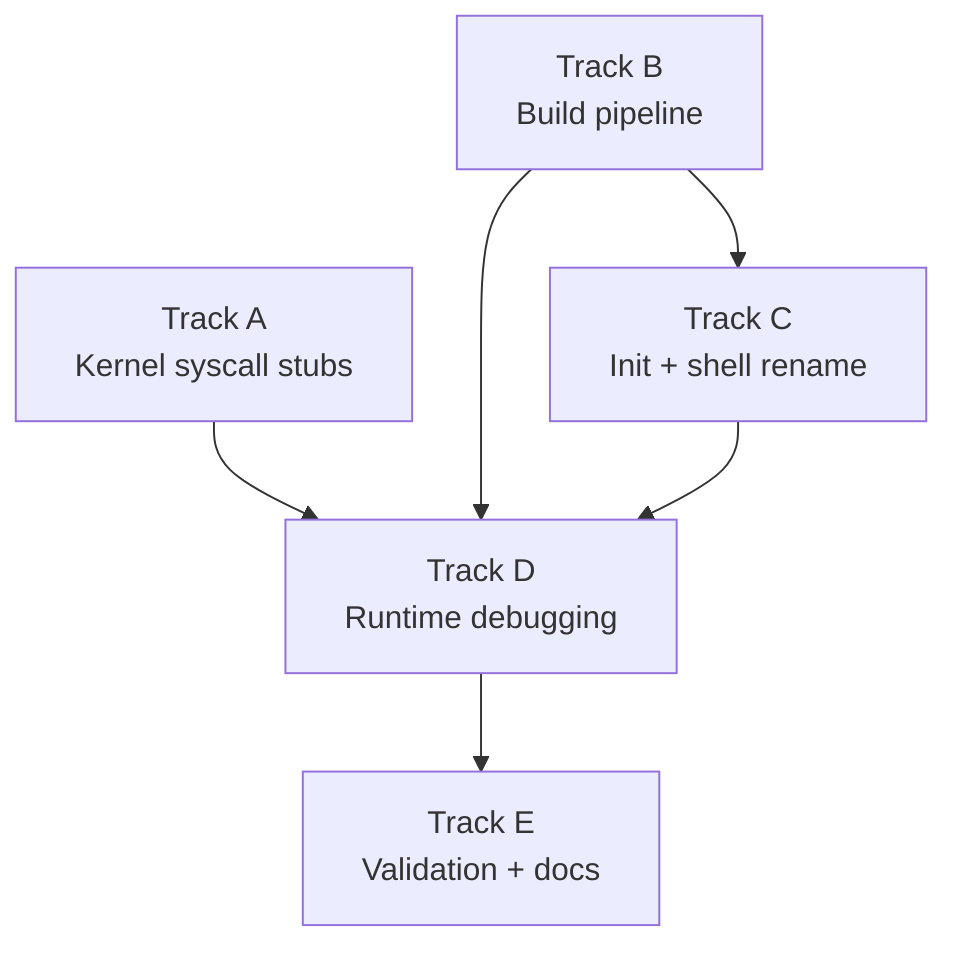

# Phase 21 — Ion Shell Integration: Task List

**Depends on:** Phase 20 (Userspace Init and Shell) ✅
**Goal:** Replace the minimal `no_std` shell from Phase 20 with
[ion](https://github.com/redox-os/ion) — the shell built for Redox OS. After
this phase `/bin/ion` is the interactive shell that userspace init spawns. The
Phase 20 shell is renamed to `/bin/sh0` and kept as a regression harness.

## Prerequisite Analysis

Current state (post-Phase 20):
- **ELF loader** (`kernel/src/mm/elf.rs`): supports ET_EXEC and ET_DYN (PIE),
  applies `R_X86_64_RELATIVE` relocations, allocates user stack with guard page
- **Ramdisk** (`kernel/src/fs/ramdisk.rs`): embeds ELF binaries via `include_bytes!`;
  musl-linked C binaries and `no_std` Rust binaries both work
- **Syscall table** (`kernel/src/arch/x86_64/syscall.rs`): covers Linux ABI
  syscalls needed for fork/exec/wait/pipe/dup2/open/read/write/close/signal,
  plus memory management (mmap, brk, munmap), filesystem (mkdir, rmdir, unlink,
  rename, getcwd, chdir, fstat, lseek, openat, getdents64), and miscellaneous
  (uname, ioctl/TIOCGWINSZ, arch_prctl/ARCH_SET_FS, set_tid_address)
- **Stdin** (`kernel/src/stdin.rs`): raw byte-at-a-time mode; keyboard bytes are
  immediately available to `read(0, ...)`
- **Process model**: fork with CoW, execve replaces address space, waitpid with
  WNOHANG, process groups (setpgid/getpgid), signals (sigaction, sigprocmask,
  SIGINT, SIGCHLD, SIGTSTP, SIGCONT)

Feasibility findings (from ion cross-compilation test):
- **Ion compiles** for `x86_64-unknown-linux-musl` in ~26s, producing a 3.7 MB
  statically linked PIE binary with no `PT_INTERP`
- **All 3,955 relocations** are `R_X86_64_RELATIVE` — supported by our ELF loader
- **Ion's `set_unique_pid()`** calls `tcgetpgrp`/`tcsetpgrp` (ioctl-based) but
  handles the error gracefully (`if let Err(err) = ...`)
- **`atty::is()`** calls `isatty()` → `ioctl(TIOCGWINSZ)` — already stubbed
- **Missing syscalls** that ion/musl/nix will likely call at runtime:
  - `fcntl` (72) — musl uses for `F_DUPFD_CLOEXEC`, `F_SETFD`
  - `getuid` (102), `geteuid` (107), `getgid` (104), `getegid` (108) — `users` crate
  - `getpgrp` (111) — nix crate
  - `access` (21) — PATH search
  - `mprotect` (10) — musl stack guard
  - `clone` (56) — musl may use instead of fork in some paths
  - `set_robust_list` (273) — musl thread init
  - `prlimit64` (302) — musl RLIMIT queries
  - `getrandom` (318) — `rand` crate initialization

## Track Layout

| Track | Scope | Dependencies |
|---|---|---|
| A | Kernel syscall stubs for ion/musl | — |
| B | Build pipeline: cross-compile ion, embed in ramdisk | — |
| C | Rename Phase 20 shell to sh0, update init with fallback | B |
| D | Runtime debugging: boot ion, fix crashes iteratively | A, B, C |
| E | Validation and documentation | D |

---

## Track A — Kernel Syscall Stubs

Ion's runtime (via musl libc and the `nix` crate) calls syscalls that our
kernel doesn't yet handle. Most can be stubbed with harmless return values;
a few need minimal implementation.

| Task | Description |
|---|---|
| P21-T001 | Add `fcntl` (72) stub: handle `F_DUPFD` (0) by finding the next free fd >= arg, `F_GETFD` (1) returns 0, `F_SETFD` (2) returns 0 (ignore close-on-exec flag), `F_GETFL` (3) returns 0, `F_SETFL` (4) returns 0; all other commands return `-EINVAL` |
| P21-T002 | Add `getuid` (102), `geteuid` (107), `getgid` (104), `getegid` (108) stubs: all return 0 (root). Single-user OS, no user/group management. |
| P21-T003 | Add `getpgrp` (111) stub: return the current process's pgid from the process table (equivalent to `getpgid(0)`) |
| P21-T004 | Add `access` (21) stub: check if the path exists in ramdisk or tmpfs; return 0 if found, `-ENOENT` if not. Ignore the mode argument (no permission model). |
| P21-T005 | Add `mprotect` (10) stub: return 0 (no-op). musl uses this for stack guard pages; our ELF loader already sets up guard pages. |
| P21-T006 | Add `set_robust_list` (273) stub: return 0 (no-op). musl's thread initialization calls this. |
| P21-T007 | Add `prlimit64` (302) stub: return `-ENOSYS`. musl queries resource limits but handles the error. |
| P21-T008 | Add `getrandom` (318) stub: fill the user buffer with bytes from a simple PRNG seeded from the TSC (or return `-ENOSYS` and let musl fall back to `/dev/urandom` which will fail gracefully via the `rand` crate's fallback). |
| P21-T009 | Add `ioctl` handling for `TCGETS` (0x5401) and `TCSETS` (0x5402): return `-ENOTTY` so ion detects it's not a real terminal and falls back to cooked mode instead of crashing. Currently ioctl returns `-EINVAL` for unknown requests which may confuse callers expecting `-ENOTTY`. |
| P21-T010 | Add `clone` (56) stub: if flags indicate a plain fork (flags=`SIGCHLD`), delegate to `sys_fork`. Otherwise return `-ENOSYS`. musl sometimes uses clone instead of fork. |
| P21-T011 | Add `pipe2` (293) stub: delegate to the existing `sys_pipe` implementation, ignoring the flags argument (O_CLOEXEC, O_NONBLOCK not needed). musl prefers pipe2 over pipe. |
| P21-T012 | Add `dup3` (292) stub: delegate to the existing `sys_dup2` implementation, ignoring the flags argument. musl prefers dup3 over dup2. |
| P21-T013 | Verify `cargo xtask check` passes after all stubs are added |

## Track B — Build Pipeline

Cross-compile ion for musl and embed it in the ramdisk alongside existing
binaries. Ion is ~3.7 MB so this significantly increases the kernel image size.

| Task | Description |
|---|---|
| P21-T014 | Add `rustup target add x86_64-unknown-linux-musl` to CI setup (if not already present) and to the setup.sh script |
| P21-T015 | Add a `build_ion()` function in `xtask/src/main.rs`: clone ion from `https://github.com/redox-os/ion` (or use a vendored copy at `xtask/vendor/ion/`), build with `cargo build --release --target x86_64-unknown-linux-musl`, copy the resulting binary to `kernel/initrd/ion.elf` |
| P21-T016 | Alternative to P21-T015: add a `xtask/vendor/` directory with a pre-built ion binary checked into git (avoids 26s build + git clone during `cargo xtask image`). Document how to rebuild it. Trade-off: larger repo but faster/more reproducible builds. |
| P21-T017 | Update `kernel/src/fs/ramdisk.rs`: add `static ION_ELF: &[u8] = include_bytes!("../../initrd/ion.elf");` and register it at `/bin/ion` and `/bin/ion.elf` in the BIN_ENTRIES table |
| P21-T018 | Verify `cargo xtask image` builds successfully with ion embedded. Check that the kernel binary size is acceptable (expect ~5-6 MB total with ion's 3.7 MB). |
| P21-T019 | Verify `readelf -l kernel/initrd/ion.elf` shows no `PT_INTERP` segment (statically linked) and all relocations are `R_X86_64_RELATIVE` |

## Track C — Init and Shell Rename

Rename the Phase 20 minimal shell to `/bin/sh0` and update init to launch
ion with a fallback to sh0.

| Task | Description |
|---|---|
| P21-T020 | Rename the shell binary: in `userspace/shell/Cargo.toml`, change `name = "sh"` to `name = "sh0"` (the `[[bin]]` name). Update xtask to copy it as `sh0.elf` instead of `sh.elf`. |
| P21-T021 | Update `kernel/src/fs/ramdisk.rs`: rename `SH_ELF` entries from `"sh"` / `"sh.elf"` to `"sh0"` / `"sh0.elf"`. Keep the `include_bytes!` pointing at `sh0.elf`. |
| P21-T022 | Update `userspace/init/src/main.rs`: change `SHELL_PATH` from `/bin/sh` to `/bin/ion`. Add a fallback: if `execve("/bin/ion", ...)` returns (failure), try `execve("/bin/sh0", ...)` before giving up. |
| P21-T023 | Update CI boot smoke test assertions: check for ion's prompt or banner instead of (or in addition to) `$ `. The ion prompt may be `ion> ` or `> ` depending on `$PROMPT`. |
| P21-T024 | Verify `cargo xtask check` and `cargo xtask image` pass with the rename |

## Track D — Runtime Debugging

Boot ion in QEMU and iteratively fix kernel-side issues. This track is
inherently iterative — each boot attempt may reveal new missing syscalls
or unexpected behavior.

| Task | Description |
|---|---|
| P21-T025 | First boot attempt: `cargo xtask run`, capture serial output, identify the first crash or unhandled syscall. Fix and repeat. |
| P21-T026 | Add a catch-all syscall log: for any unhandled syscall number, log the number and arguments before returning `-ENOSYS`. This helps identify what ion/musl needs without crashing. |
| P21-T027 | Verify musl's `__libc_start_main` runs successfully: `arch_prctl(ARCH_SET_FS)` for TLS, `set_tid_address`, stack guard via `mprotect` |
| P21-T028 | Verify `ion -c 'echo hello'` (script mode): have init exec ion with `-c` flag first. If this works, the basic ion runtime is functional. |
| P21-T029 | Verify `ion` interactive mode: boot to the ion prompt, confirm it reads stdin and prints output. If `tcgetpgrp`/`tcsetpgrp` fail, confirm ion prints a warning but continues. |
| P21-T030 | Test pipeline execution: `echo hello | cat` via ion. Verify ion's internal fork+pipe+exec matches our kernel's implementation. |
| P21-T031 | Test variable assignment and expansion: `let x = world; echo $x` should print `world`. This exercises ion's variable engine (no kernel changes needed). |
| P21-T032 | Test loop syntax: `for i in a b c { echo $i }` should print three lines. |
| P21-T033 | Test `cd /bin && pwd` — verify ion uses the `chdir` syscall and our kernel handles it correctly for ion's working directory. |
| P21-T034 | Test signal handling: `Ctrl-C` during a long-running child (e.g., `sleep 10`) should kill the child and return to the ion prompt. Verify `SIGINT` is delivered to the foreground process group, not to ion. |
| P21-T035 | Verify sh0 fallback: temporarily remove ion from the ramdisk and confirm init falls back to `/bin/sh0` and the Phase 20 shell works. |
| P21-T036 | If `getrandom` (318) is needed: implement a minimal PRNG using RDTSC as entropy source, or return `-ENOSYS` and verify ion/rand handles the fallback. |

## Track E — Validation and Documentation

| Task | Description |
|---|---|
| P21-T037 | Acceptance: `cargo xtask image` produces a disk image containing `/bin/ion` without manual intervention |
| P21-T038 | Acceptance: booting in QEMU presents the ion prompt |
| P21-T039 | Acceptance: `echo hello` prints `hello` |
| P21-T040 | Acceptance: `let x = world; echo $x` prints `world` |
| P21-T041 | Acceptance: `ls | cat` produces directory listing via ion's pipeline execution |
| P21-T042 | Acceptance: `for i in a b c { echo $i }` prints three lines |
| P21-T043 | Acceptance: `cd /tmp && pwd` prints `/tmp` |
| P21-T044 | Acceptance: `Ctrl-C` during `sleep 10` kills the child; ion returns to prompt |
| P21-T045 | Acceptance: `/bin/sh0` still boots and works as a fallback |
| P21-T046 | Acceptance: `readelf` confirms ion binary is statically linked with no `PT_INTERP` |
| P21-T047 | Acceptance: Phase 20 acceptance criteria still pass when using `/bin/sh0` |
| P21-T048 | `cargo xtask check` passes (clippy + fmt + host tests) |
| P21-T049 | QEMU boot validation — no panics, no regressions |
| P21-T050 | Write `docs/19-ion-shell.md`: musl-static binary requirement (why no `PT_INTERP`), xtask vendoring/cross-compilation, cooked vs. raw interactive mode (Phase 22), ion syntax overview, Redox OS precedent, syscall stubs added and why |

---

## Deferred Until Phase 22

These items require `tcgetattr`/`tcsetattr` (termios) support:

- Ion's interactive raw-mode line editor (arrow keys, history recall)
- History persistence (`~/.local/share/ion/history`)
- Tab completion with reedline-style highlighting
- `SIGWINCH` / window size change notifications
- Proper `isatty()` that returns true for the console fd

---

## Dependency Graph

## Parallelization Strategy

**Wave 1:** Tracks A and B in parallel — syscall stubs and build pipeline are
independent. A adds kernel stubs; B sets up the ion binary in the ramdisk.

**Wave 2 (after B):** Track C — rename sh to sh0, update init to launch ion.
This depends on B because the ramdisk must have ion before init can exec it.

**Wave 3 (after A + B + C):** Track D — iterative runtime debugging. This is
the most unpredictable track. Each boot may reveal new issues. Expect 3-5
iterations of "boot → crash → identify syscall → add stub → reboot".

**Wave 4:** Track E — validation once ion boots and passes basic tests.

## Risk Assessment

| Risk | Likelihood | Impact | Mitigation |
|---|---|---|---|
| Ion calls unimplemented syscalls beyond those listed | Medium | Medium | Catch-all syscall logger (P21-T026) identifies gaps quickly |
| Ion's `tcgetpgrp`/`tcsetpgrp` failure prevents interactive mode | Low | High | Ion handles this error gracefully; cooked mode still works |
| 3.7 MB ion binary makes kernel image too large for QEMU memory | Low | Medium | Increase QEMU memory from 128M to 256M if needed |
| `INIT_ARRAY` constructors not run by our ELF loader | Medium | High | musl's `_start` → `__libc_start_main` handles init_array internally; verify this works |
| nix crate's `signal` module uses unsupported signal features | Low | Medium | Our sigaction/sigprocmask match Linux ABI; ion only uses standard signals |

---

## Related

- [Phase 21 Design Doc](../21-ion-shell.md)
- [Phase 20 Design Doc](../20-userspace-init-shell.md)
- [Phase 20 Task List](20-userspace-init-shell-tasks.md)
- [docs/shell/alternative-shells.md](../../shell/alternative-shells.md)
