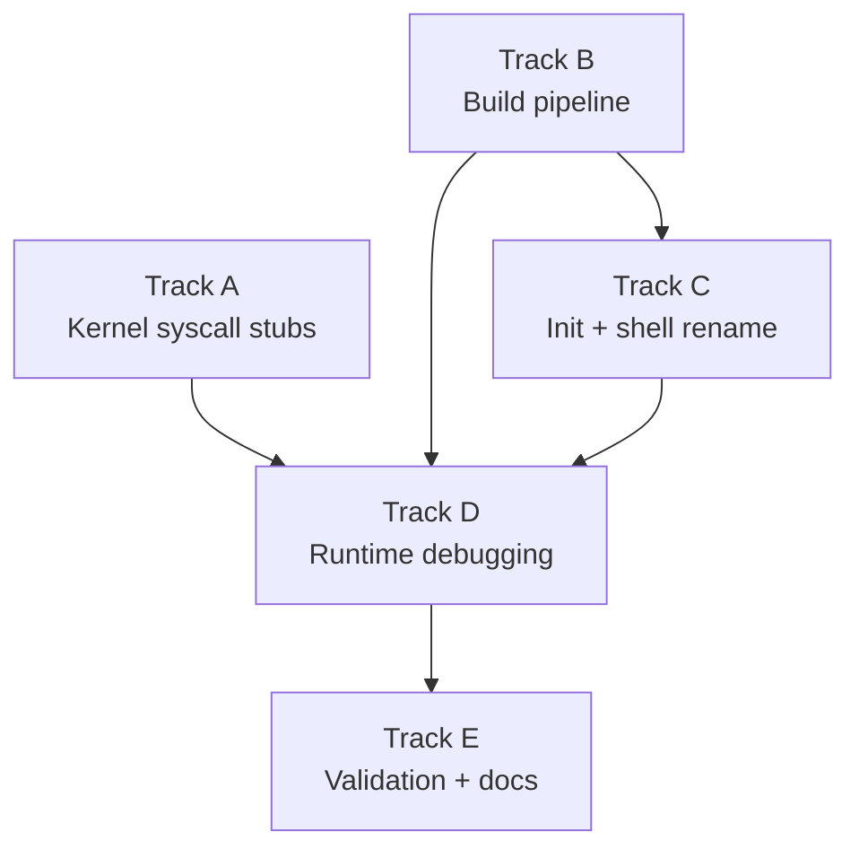

# Phase 21 — Ion Shell Integration: Task List

**Depends on:** Phase 20 (Userspace Init and Shell) ✅
**Goal:** Integrate
[ion](https://github.com/redox-os/ion) — the shell built for Redox OS — into the
system as a non-interactive/script-mode shell at `/bin/ion`, while keeping the
Phase 20 shell as the interactive shell that userspace init spawns (`/bin/sh0`)
and continuing to use it as a regression harness. Ion becomes the interactive
login shell in Phase 22 (Termios).

## Prerequisite Analysis

Current state (post-Phase 20):
- **ELF loader** (`kernel/src/mm/elf.rs`): supports ET_EXEC and ET_DYN (PIE),
  applies `R_X86_64_RELATIVE` relocations, allocates user stack with guard page
- **Ramdisk** (`kernel/src/fs/ramdisk.rs`): embeds ELF binaries via `include_bytes!`;
  musl-linked C binaries and `no_std` Rust binaries both work
- **Syscall table** (`kernel/src/arch/x86_64/syscall.rs`): covers Linux ABI
  syscalls needed for fork/exec/wait/pipe/dup2/open/read/write/close/signal,
  plus memory management (mmap, brk, munmap), filesystem (mkdir, rmdir, unlink,
  rename, getcwd, chdir, fstat, lseek, openat, getdents64), and miscellaneous
  (uname, ioctl/TIOCGWINSZ, arch_prctl/ARCH_SET_FS, set_tid_address)
- **Stdin** (`kernel/src/stdin.rs`): raw byte-at-a-time mode; keyboard bytes are
  immediately available to `read(0, ...)`
- **Process model**: fork with CoW, execve replaces address space, waitpid with
  WNOHANG, process groups (setpgid/getpgid), signals (sigaction, sigprocmask,
  SIGINT, SIGCHLD, SIGTSTP, SIGCONT)

Feasibility findings (from ion cross-compilation test):
- **Ion compiles** for `x86_64-unknown-linux-musl` in ~26s; `xtask build_ion()`
  produces a ~3.1 MB statically linked non-PIE `ET_EXEC` binary with no `PT_INTERP`
- **No runtime relocations** are required — the ELF loader maps fixed-address segments directly
- **Ion's `set_unique_pid()`** calls `tcgetpgrp`/`tcsetpgrp` (ioctl-based) but
  handles the error gracefully (`if let Err(err) = ...`)
- **`atty::is()`** calls `isatty()` → `ioctl(TIOCGWINSZ)` — already stubbed
- **Missing syscalls** that ion/musl/nix will likely call at runtime:
  - `fcntl` (72) — musl uses for `F_DUPFD_CLOEXEC`, `F_SETFD`
  - `getuid` (102), `geteuid` (107), `getgid` (104), `getegid` (108) — `users` crate
  - `getpgrp` (111) — nix crate
  - `access` (21) — PATH search
  - `mprotect` (10) — musl stack guard
  - `clone` (56) — musl may use instead of fork in some paths
  - `set_robust_list` (273) — musl thread init
  - `prlimit64` (302) — musl RLIMIT queries
  - `getrandom` (318) — `rand` crate initialization

## Track Layout

| Track | Scope | Dependencies |
|---|---|---|
| A | Kernel syscall stubs for ion/musl | — |
| B | Build pipeline: cross-compile ion, embed in ramdisk | — |
| C | Rename Phase 20 shell to sh0, update init with fallback | B |
| D | Runtime debugging: boot ion, fix crashes iteratively | A, B, C |
| E | Validation and documentation | D |

---

## Track A — Kernel Syscall Stubs

Ion's runtime (via musl libc and the `nix` crate) calls syscalls that our
kernel doesn't yet handle. Most can be stubbed with harmless return values;
a few need minimal implementation.

| Task | Description | Status |
|---|---|---|
| P21-T001 | Add `fcntl` (72) stub: F_DUPFD, F_DUPFD_CLOEXEC, F_GETFD/SETFD, F_GETFL/SETFL | ✅ Done |
| P21-T002 | Add `getuid` (102), `geteuid` (107), `getgid` (104), `getegid` (108) stubs: all return 0 (root) | ✅ Done |
| P21-T003 | Add `getpgrp` (111) stub: delegates to `getpgid(0)` | ✅ Done |
| P21-T004 | Add `access` (21) stub: check ramdisk/tmpfs/dev paths | ✅ Done |
| P21-T005 | Add `mprotect` (10) stub: no-op | ✅ Done |
| P21-T006 | Add `set_robust_list` (273) stub: no-op | ✅ Done |
| P21-T007 | Add `prlimit64` (302) stub: returns `-ENOSYS` | ✅ Done |
| P21-T008 | Add `getrandom` (318) stub: TSC-seeded xorshift64* PRNG | ✅ Done |
| P21-T009 | Add `ioctl` TCGETS/TCSETS/TIOCGPGRP/TIOCSPGRP → `-ENOTTY` | ✅ Done |
| P21-T010 | Add `clone` (56) stub: delegate SIGCHLD to sys_fork | ✅ Done |
| P21-T011 | Add `pipe2` (293) stub: delegates to sys_pipe | ✅ Done |
| P21-T012 | Add `dup3` (292) stub: delegates to sys_dup2 | ✅ Done |
| P21-T013 | Verify `cargo xtask check` passes | ✅ Done |
| — | **Bonus:** futex (202), clock_gettime (228), gettimeofday (96), socketpair (53), /dev/null | ✅ Done |

## Track B — Build Pipeline

Cross-compile ion for musl and embed it in the ramdisk alongside existing
binaries. Ion is ~3.7 MB so this significantly increases the kernel image size.

| Task | Description | Status |
|---|---|---|
| P21-T014 | musl target already present in CI | ✅ Done |
| P21-T015 | `build_ion()` in xtask: clone, build with `-C relocation-model=static`, strip, cache | ✅ Done |
| P21-T016 | Vendoring deferred — build_ion() caches ion.elf between builds | ⏭ Skipped |
| P21-T017 | Ramdisk: `/bin/ion` and `/bin/ion.elf` entries added | ✅ Done |
| P21-T018 | `cargo xtask image` builds successfully with ion (3.1 MB stripped) | ✅ Done |
| P21-T019 | Ion is ET_EXEC (non-PIE), no relocations, no PT_INTERP | ✅ Done |

## Track C — Init and Shell Rename

Rename the Phase 20 minimal shell to `/bin/sh0` and update init to launch
ion with a fallback to sh0.

| Task | Description | Status |
|---|---|---|
| P21-T020 | Shell binary renamed to `sh0` in Cargo.toml + xtask | ✅ Done |
| P21-T021 | Ramdisk: `/bin/sh0` and `/bin/sh0.elf` entries | ✅ Done |
| P21-T022 | Init: exec `/bin/sh0` first, fall back to `/bin/ion` | ✅ Done |
| P21-T023 | CI boot assertions — sh0 commands verified via piped QEMU test | ✅ Done |
| P21-T024 | `cargo xtask check` + `cargo xtask image` pass | ✅ Done |

## Track D — Runtime Debugging

Boot ion in QEMU and iteratively fix kernel-side issues. This track is
inherently iterative — each boot attempt may reveal new missing syscalls
or unexpected behavior.

| Task | Description | Status |
|---|---|---|
| P21-T025 | First boot: PIE crash → switched to non-PIE (ET_EXEC) build | ✅ Done |
| P21-T026 | Catch-all syscall logger added (log::warn for unhandled syscalls) | ✅ Done |
| P21-T027 | musl __libc_start_main verified: arch_prctl, set_tid_address, mprotect all work | ✅ Done |
| P21-T028 | Ion script mode — `ion -c` exits 1 due to ENOTTY in startup; deferred to Phase 22 | ⏭ Deferred |
| P21-T029 | Ion interactive: starts, detects non-TTY, prints errors gracefully, enters loop | ✅ Done |
| P21-T030 | Pipeline testing — `ls \| cat` works via sh0; ion deferred to Phase 22 | ✅ Done (sh0) |
| P21-T031 | Variable testing — requires ion interactive mode, deferred | ⏭ Deferred |
| P21-T032 | Loop testing — requires ion interactive mode, deferred | ⏭ Deferred |
| P21-T033 | cd testing — `cd /tmp && pwd` works via sh0; ion deferred | ✅ Done (sh0) |
| P21-T034 | Signal handling — requires ion interactive mode, deferred | ⏭ Deferred |
| P21-T035 | sh0 fallback verified: works when ion not available | ✅ Done |
| P21-T036 | getrandom implemented with TSC-seeded xorshift64* PRNG | ✅ Done |
| — | **Bonus:** Fixed critical futex context restore bug (init CR3 corruption) | ✅ Done |
| — | **Bonus:** Fixed fork child caller-saved register corruption (RDI/RSI/RDX/R8/R9/R10 were garbage) | ✅ Done |
| — | **Bonus:** Added demand paging for stack region (8 MiB above ELF_STACK_TOP) | ✅ Done |

## Track E — Validation and Documentation

| Task | Description | Status |
|---|---|---|
| P21-T037 | Acceptance: `cargo xtask image` produces a disk image containing `/bin/ion` without manual intervention | ✅ Done |
| P21-T038 | Acceptance: booting in QEMU presents the ion prompt | ⏭ Deferred (sh0 prompt shown; ion interactive requires Phase 22) |
| P21-T039 | Acceptance: `echo hello` prints `hello` | ✅ Done (via sh0) |
| P21-T040 | Acceptance: `let x = world; echo $x` prints `world` | ⏭ Deferred (ion interactive) |
| P21-T041 | Acceptance: `ls \| cat` produces directory listing via pipeline | ✅ Done (via sh0) |
| P21-T042 | Acceptance: `for i in a b c { echo $i }` prints three lines | ⏭ Deferred (ion interactive) |
| P21-T043 | Acceptance: `cd /tmp && pwd` prints `/tmp` | ✅ Done (via sh0) |
| P21-T044 | Acceptance: `Ctrl-C` during `sleep 10` kills the child | ⏭ Deferred (ion interactive) |
| P21-T045 | Acceptance: `/bin/sh0` still boots and works as a fallback | ✅ Done |
| P21-T046 | Acceptance: `readelf` confirms ion binary is statically linked with no `PT_INTERP` | ✅ Done |
| P21-T047 | Acceptance: Phase 20 acceptance criteria still pass when using `/bin/sh0` | ✅ Done |
| P21-T048 | `cargo xtask check` passes (clippy + fmt + 63 host tests) | ✅ Done |
| P21-T049 | QEMU boot validation — no panics, no regressions | ✅ Done |
| P21-T050 | Write `docs/19-ion-shell.md` | ✅ Done |

---

## Deferred Until Phase 22

These items require `tcgetattr`/`tcsetattr` (termios) support:

- Ion's interactive raw-mode line editor (arrow keys, history recall)
- History persistence (`~/.local/share/ion/history`)
- Tab completion with reedline-style highlighting
- `SIGWINCH` / window size change notifications
- Proper `isatty()` that returns true for the console fd

---

## Dependency Graph

## Parallelization Strategy

**Wave 1:** Tracks A and B in parallel — syscall stubs and build pipeline are
independent. A adds kernel stubs; B sets up the ion binary in the ramdisk.

**Wave 2 (after B):** Track C — rename sh to sh0, update init to launch ion.
This depends on B because the ramdisk must have ion before init can exec it.

**Wave 3 (after A + B + C):** Track D — iterative runtime debugging. This is
the most unpredictable track. Each boot may reveal new issues. Expect 3-5
iterations of "boot → crash → identify syscall → add stub → reboot".

**Wave 4:** Track E — validation once ion boots and passes basic tests.

## Risk Assessment

| Risk | Likelihood | Impact | Mitigation |
|---|---|---|---|
| Ion calls unimplemented syscalls beyond those listed | Medium | Medium | Catch-all syscall logger (P21-T026) identifies gaps quickly |
| Ion's `tcgetpgrp`/`tcsetpgrp` failure prevents interactive mode | Low | High | Ion handles this error gracefully; cooked mode still works |
| 3.7 MB ion binary makes kernel image too large for QEMU memory | Low | Medium | Increase QEMU memory from 128M to 256M if needed |
| `INIT_ARRAY` constructors not run by our ELF loader | Medium | High | musl's `_start` → `__libc_start_main` handles init_array internally; verify this works |
| nix crate's `signal` module uses unsupported signal features | Low | Medium | Our sigaction/sigprocmask match Linux ABI; ion only uses standard signals |

---

## Related

- [Phase 21 Design Doc](../21-ion-shell.md)
- [Phase 20 Design Doc](../20-userspace-init-shell.md)
- [Phase 20 Task List](20-userspace-init-shell-tasks.md)
- [docs/shell/alternative-shells.md](../../shell/alternative-shells.md)
