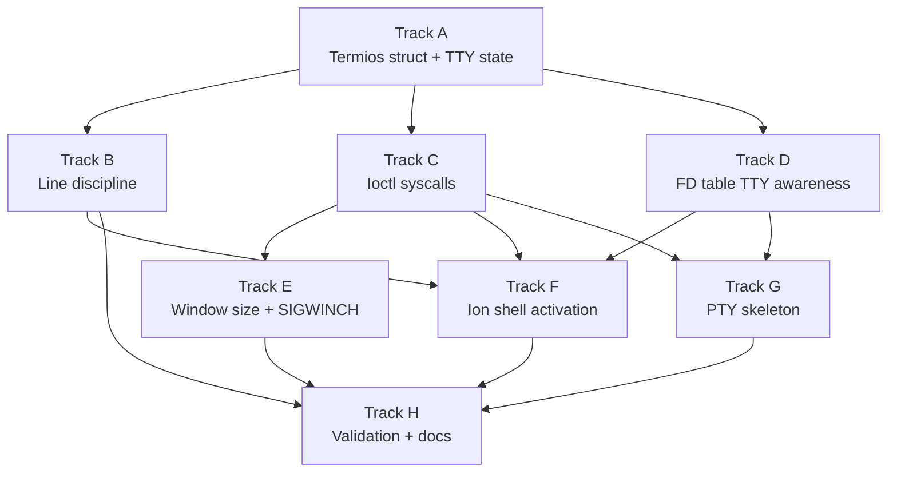

# Phase 22 — TTY and Terminal Control: Task List

**Depends on:** Phase 21 (Ion Shell Integration) ✅
**Goal:** Replace the raw `stdin_feeder_task` with a proper TTY layer that supports
cooked/raw/cbreak modes via `termios`, query/set window size, and distinguish TTY
fds from regular files via `isatty`. Ion shell gains raw-mode line editing. See
[Phase 22 roadmap doc](../22-tty-pty.md) for full details.

## Prerequisite Analysis

Current state (post-Phase 21):

- **`stdin_feeder_task()`** (`kernel/src/main.rs:774-866`): kernel task that reads
  from `kbd_server`, converts scancodes to characters, handles `Ctrl-C` → SIGINT
  and `Ctrl-Z` → SIGTSTP, pushes bytes into `stdin::STDIN` circular buffer
- **`stdin.rs`**: 4 KB circular byte buffer; `push_byte()` / `read()` — no line
  discipline, no echo control, no cooked/raw switching
- **`sys_linux_ioctl()`** (`syscall.rs:3303-3338`): TIOCGWINSZ returns hardcoded
  24×80; TCGETS/TCSETS/TIOCGPGRP/TIOCSPGRP all return `-ENOTTY`
- **FD table** (`process/mod.rs:74-95`): `FdBackend` enum has Stdin, Stdout,
  Ramdisk, Tmpfs, PipeRead, PipeWrite, Dir, DevNull — no TTY variant
- **Signal constants** (`process/mod.rs:194-209`): SIGWINCH (28) not defined
- **Ion shell**: included in ramdisk but interactive raw-mode line editing blocked
  by missing termios support; currently uses sh0 as primary shell
- **Console output**: `console_server_task()` handles writes to serial + framebuffer

## Track Layout

| Track | Scope | Dependencies |
|---|---|---|
| A | Termios struct and TTY state | — |
| B | Line discipline in stdin_feeder | A |
| C | Ioctl syscall implementation | A |
| D | FD table TTY awareness and isatty | A |
| E | Window size and SIGWINCH | C |
| F | Ion shell activation | B, C, D |
| G | PTY skeleton stubs | C, D |
| H | Validation and documentation | All |

---

## Track A — Termios Struct and TTY State

Define the `Termios` struct matching the Linux x86_64 ABI layout so musl-compiled
programs can pass it directly through `ioctl`. Create a global TTY state that holds
the active termios configuration and window size.

| Task | Description | Status |
|---|---|---|
| P22-T001 | Define `Termios` struct in `kernel/src/tty.rs`: `c_iflag` (u32), `c_oflag` (u32), `c_cflag` (u32), `c_lflag` (u32), `c_line` (u8), `c_cc[NCCS]` (19 bytes) — matches Linux `struct termios` layout exactly (60 bytes) | |
| P22-T002 | Define termios flag constants: `ICANON`, `ECHO`, `ECHOE`, `ECHOK`, `ECHONL`, `ISIG`, `IEXTEN`, `ICRNL`, `INLCR`, `IGNCR`, `OPOST`, `ONLCR` | |
| P22-T003 | Define `c_cc` index constants: `VINTR` (0), `VQUIT` (1), `VERASE` (2), `VKILL` (3), `VEOF` (4), `VTIME` (5), `VMIN` (6), `VSTART` (8), `VSTOP` (9), `VSUSP` (10), `VEOL` (11), `VWERASE` (14), `VLNEXT` (15) | |
| P22-T004 | Define `TtyState` struct: `termios: Termios`, `winsize: Winsize`, `fg_pgid: u32`, `edit_buf: [u8; 4096]`, `edit_len: usize` — protected by `spin::Mutex` | |
| P22-T005 | Define `Winsize` struct: `ws_row` (u16), `ws_col` (u16), `ws_xpixel` (u16), `ws_ypixel` (u16) — matches Linux `struct winsize` (8 bytes) | |
| P22-T006 | Implement `TtyState::new()` with sensible defaults: cooked mode (`ICANON \| ECHO \| ECHOE \| ISIG \| ICRNL \| OPOST \| ONLCR`), VINTR=`^C`, VQUIT=`^\`, VEOF=`^D`, VERASE=0x7f, VKILL=`^U`, VSUSP=`^Z`, VWERASE=`^W`, winsize 24×80 | |
| P22-T007 | Create static `TTY0: Mutex<TtyState>` as the single console TTY instance | |
| P22-T008 | `cargo xtask check` passes with new module | |

## Track B — Line Discipline in stdin_feeder

Modify `stdin_feeder_task()` to apply line discipline processing based on the
current `TtyState`. In cooked mode, buffer until newline and process editing
characters. In raw mode, pass bytes through immediately.

| Task | Description | Status |
|---|---|---|
| P22-T009 | Refactor `stdin_feeder_task()` to read `TTY0.termios.c_lflag` before processing each character | |
| P22-T010 | **Cooked mode** (`ICANON` set): buffer characters in `TtyState.edit_buf`; deliver complete line to `stdin::STDIN` only on `\n` or `^D` (EOF) | |
| P22-T011 | **Erase** (`ECHOE` + `VERASE`): `Backspace`/`DEL` (0x7f) removes last char from edit buffer; if `ECHO` set, write `\b \b` to console to visually erase | |
| P22-T012 | **Kill** (`VKILL` = `^U`): clear entire edit buffer; if `ECHOK` set, erase the line on screen | |
| P22-T013 | **Word erase** (`VWERASE` = `^W`): erase back to previous whitespace boundary | |
| P22-T014 | **EOF** (`VEOF` = `^D`): if edit buffer is empty, push 0 bytes (signal EOF to reader); if non-empty, flush buffer without appending newline | |
| P22-T015 | **Echo**: when `ECHO` flag set in `c_lflag`, write each accepted character back to `console_server`; suppress echo when `ECHO` is clear | |
| P22-T016 | **Raw mode** (`ICANON` clear): bypass edit buffer entirely; push each byte to `stdin::STDIN` immediately; respect `VMIN`/`VTIME` from `c_cc` for minimum read count (VMIN=1, VTIME=0 as default for immediate single-byte delivery) | |
| P22-T017 | **Cbreak mode** (`ICANON` clear, `ISIG` set): no line buffering but `^C` (SIGINT), `^\` (SIGQUIT), `^Z` (SIGTSTP) still generate signals to foreground pgid | |
| P22-T018 | **Signal characters** (`ISIG` set): `VINTR` → SIGINT, `VQUIT` → SIGQUIT, `VSUSP` → SIGTSTP — use `c_cc` values (not hardcoded) to determine which character triggers each signal; discard the signal character from input | |
| P22-T019 | **ICRNL** flag: when set, translate CR (0x0D) to NL (0x0A) on input | |
| P22-T020 | **ONLCR** flag: when set in `c_oflag`, translate NL to CR+NL on echo output | |
| P22-T021 | Remove hardcoded `Ctrl-C`/`Ctrl-Z` handling from old `stdin_feeder_task()` — signal generation now driven by termios `c_cc` values | |
| P22-T022 | `cargo xtask check` passes; sh0 shell still works in cooked mode | |

## Track C — Ioctl Syscall Implementation

Replace the stubbed ioctl handlers with real implementations that read/write the
`TtyState` through shared memory or direct kernel access.

| Task | Description | Status |
|---|---|---|
| P22-T023 | Implement `TCGETS` (0x5401): copy `TTY0.termios` (60 bytes) to userspace buffer; validate user pointer is mapped and writable | |
| P22-T024 | Implement `TCSETS` / `TCSANOW` (0x5402): copy 60-byte `Termios` from userspace into `TTY0.termios`; take effect immediately | |
| P22-T025 | Implement `TCSETSW` / `TCSADRAIN` (0x5403): drain pending output before applying new termios (in our implementation, output is synchronous so this is equivalent to TCSANOW) | |
| P22-T026 | Implement `TCSETSF` / `TCSAFLUSH` (0x5404): flush pending input from `stdin::STDIN` buffer and `TtyState.edit_buf`, then apply new termios | |
| P22-T027 | Implement `TIOCGPGRP` (0x540F): return `TTY0.fg_pgid` | |
| P22-T028 | Implement `TIOCSPGRP` (0x5410): set `TTY0.fg_pgid` and update `FG_PGID` atomic | |
| P22-T029 | Validate that all ioctl handlers return `-EFAULT` if the user pointer is unmapped or in kernel space | |
| P22-T030 | `cargo xtask check` passes | |

## Track D — FD Table TTY Awareness and isatty

Add a `DeviceTTY` variant to `FdBackend` so the kernel can distinguish TTY file
descriptors from plain files. `isatty` works by calling `ioctl(fd, TCGETS, NULL)`
and checking for `ENOTTY`.

| Task | Description | Status |
|---|---|---|
| P22-T031 | Add `FdBackend::DeviceTTY { tty_id: u32 }` variant to the `FdBackend` enum | |
| P22-T032 | Change `new_fd_table()` to initialize fds 0, 1, 2 as `DeviceTTY { tty_id: 0 }` instead of `Stdin`/`Stdout` | |
| P22-T033 | Update `sys_linux_read()` to handle `DeviceTTY` reads the same as current `Stdin` (read from `stdin::STDIN` buffer) | |
| P22-T034 | Update `sys_linux_write()` to handle `DeviceTTY` writes the same as current `Stdout` (write to console_server + serial) | |
| P22-T035 | Update `sys_linux_ioctl()`: if fd backend is `DeviceTTY`, process TCGETS/TCSETS/etc. normally; if fd backend is anything else, return `-ENOTTY` | |
| P22-T036 | Update `sys_linux_fstat()`: `DeviceTTY` fds report `st_mode = S_IFCHR \| 0620`, `st_rdev` encodes tty major/minor | |
| P22-T037 | Update `sys_linux_fcntl()`, `sys_linux_dup2()`, `sys_linux_dup3()`, `sys_linux_close()` to handle `DeviceTTY` variant | |
| P22-T038 | Ensure `isatty(0)` returns 1 (TCGETS succeeds on TTY fd) and `isatty(fd)` on a plain file returns 0 (TCGETS returns ENOTTY) | |
| P22-T039 | `cargo xtask check` passes | |

## Track E — Window Size and SIGWINCH

Implement real window size storage and SIGWINCH delivery when the size changes.

| Task | Description | Status |
|---|---|---|
| P22-T040 | Add `SIGWINCH` (28) to signal constant definitions in `kernel/src/process/mod.rs`; default disposition is Ignore | |
| P22-T041 | Implement `TIOCGWINSZ` (0x5413): copy `TTY0.winsize` (8 bytes) to userspace; replace hardcoded 24×80 | |
| P22-T042 | Implement `TIOCSWINSZ` (0x5414): copy new `Winsize` from userspace into `TTY0.winsize` | |
| P22-T043 | After `TIOCSWINSZ` updates dimensions, send `SIGWINCH` to every process in the foreground process group (`TTY0.fg_pgid`) | |
| P22-T044 | `cargo xtask check` passes | |

## Track F — Ion Shell Activation

With termios support in place, switch the default interactive shell from sh0 to
ion. Ion's `liner`/`reedline` library calls `tcgetattr`/`tcsetattr` to enter raw
mode for line editing — this now works.

| Task | Description | Status |
|---|---|---|
| P22-T045 | Update `userspace/init/src/main.rs`: change primary shell to `/bin/ion`, fallback to `/bin/sh0` | |
| P22-T046 | Verify ion detects TTY via `isatty(0)` returning true and enters interactive mode with line editing | |
| P22-T047 | Verify ion's `tcgetattr` call succeeds and returns a valid `Termios` struct | |
| P22-T048 | Verify ion's `tcsetattr` to raw mode works: arrow keys, backspace, and history recall function | |
| P22-T049 | Verify ion restores cooked mode on exit (saved termios restored via `tcsetattr`) | |
| P22-T050 | Test deferred Phase 21 items now work: `ion -c 'echo hello'` exits 0 (no longer ENOTTY) | |
| P22-T051 | Test ion variables: `let x = world; echo $x` prints `world` | |
| P22-T052 | Test ion loops: `for i in a b c { echo $i }` prints three lines | |
| P22-T053 | Test ion pipelines: `ls \| cat` produces directory listing | |
| P22-T054 | Test `Ctrl-C` during `sleep 10` kills the child, returns to ion prompt | |
| P22-T055 | Test `Ctrl-Z` suspends a foreground job; `fg` resumes it | |
| P22-T056 | Test `Ctrl-D` on empty line exits ion cleanly; init re-spawns shell | |
| P22-T057 | `cargo xtask check` passes with ion as default shell | |

## Track G — PTY Skeleton Stubs

Allocate PTY pairs conceptually but defer full data routing. This unblocks future
terminal multiplexer and SSH work (Phase 23+).

| Task | Description | Status |
|---|---|---|
| P22-T058 | Add `/dev/ptmx` entry to ramdisk/devfs; opening it allocates a `PtyPair { id, master_fd, slave_path }` in kernel state | |
| P22-T059 | Implement `posix_openpt` stub: `open("/dev/ptmx", O_RDWR)` returns master fd with `FdBackend::PtyMaster { pty_id }` | |
| P22-T060 | Implement `grantpt` / `unlockpt` as no-ops (return 0) | |
| P22-T061 | Implement `ptsname` equivalent: `ioctl(master_fd, TIOCGPTN, &n)` returns the PTY number; slave path is `/dev/pts/N` | |
| P22-T062 | Opening `/dev/pts/N` returns a slave fd with `FdBackend::PtySlave { pty_id }` | |
| P22-T063 | Read/write on PTY master/slave fds returns `-ENOSYS` with a log message ("PTY data path not yet implemented") | |
| P22-T064 | `cargo xtask check` passes | |

## Track H — Validation and Documentation

| Task | Description | Status |
|---|---|---|
| P22-T065 | Acceptance: shell line editing (`^H`, `^U`, `^W`, `^C`, `^D`) works through new TTY layer | |
| P22-T066 | Acceptance: `tcgetattr` returns valid `termios`; `tcsetattr` to raw mode delivers individual bytes without echo | |
| P22-T067 | Acceptance: restoring saved `termios` returns terminal to cooked mode | |
| P22-T068 | Acceptance: `ioctl(1, TIOCGWINSZ, &ws)` returns correct `ws_col` and `ws_row` | |
| P22-T069 | Acceptance: `isatty(0)` returns 1; `isatty(fd)` on a plain file returns 0 | |
| P22-T070 | Acceptance: `SIGWINCH` delivered when `TIOCSWINSZ` called with new dimensions | |
| P22-T071 | Acceptance: all Phase 14/20 utilities pass without regression when run under sh0 | |
| P22-T072 | Acceptance: ion is the default interactive shell and supports line editing | |
| P22-T073 | Acceptance: `cargo xtask check` passes (clippy + fmt + host tests) | |
| P22-T074 | Acceptance: QEMU boot — no panics, no regressions | |
| P22-T075 | Add `kernel-core` unit tests for `Termios` struct layout (size = 60 bytes, field offsets match Linux) | |
| P22-T076 | Add `kernel-core` unit tests for line discipline logic: cooked-mode erase, kill, word-erase, EOF | |
| P22-T077 | Write `docs/20-tty-terminal.md` covering line discipline model, termios fields, cooked/raw/cbreak modes, ioctl dispatch, isatty behavior, and PTY concepts | |
| P22-T078 | Update `docs/08-roadmap.md`: move Phase 22 from "Usability Phases (planned)" to completed | |

---

## Phase 20/21 Deferred Items Resolved by This Phase

The following items were explicitly deferred to Phase 22 by earlier phases:

**From Phase 20 (Userspace Init and Shell):**
- PTY / TTY line discipline (`/dev/pts`, `termios`, raw mode, kernel-side echo) → Tracks A–D
- Tab completion and readline-style line editing → Track F (ion's reedline handles this once termios works)

**From Phase 21 (Ion Shell Integration) — specific deferred tasks:**

| P21 Task | Description | Resolved by |
|---|---|---|
| P21-T028 | Ion script mode `ion -c` exits 1 due to ENOTTY in startup | P22-T050 |
| P21-T031 | Variable testing — requires ion interactive mode | P22-T051 |
| P21-T032 | Loop testing — requires ion interactive mode | P22-T052 |
| P21-T034 | Signal handling — requires ion interactive mode | P22-T054, P22-T055 |
| P21-T038 | Booting in QEMU presents the ion prompt | P22-T046 |
| P21-T040 | `let x = world; echo $x` prints `world` | P22-T051 |
| P21-T042 | `for i in a b c { echo $i }` prints three lines | P22-T052 |
| P21-T044 | `Ctrl-C` during `sleep 10` kills the child | P22-T054 |

**From Phase 21 — deferred feature list:**

| Feature | Resolved by |
|---|---|
| Ion's interactive raw-mode line editor (arrow keys, history recall) | P22-T048 |
| `SIGWINCH` / window size change notifications | P22-T040–T043 |
| Proper `isatty()` that returns true for the console fd | P22-T038 |
| History persistence (`~/.local/share/ion/history`) | Deferred again (requires writable home dir) |
| Tab completion with reedline-style highlighting | Deferred again (depends on ion's reedline integration) |

---

## Deferred Until Later Phases

These items require infrastructure beyond Phase 22 scope:

- Full PTY data path between master and slave (Phase 23+ — terminal multiplexers, SSH)
- `/dev/pts` devpts filesystem (dynamic slave device nodes)
- VT100 / ANSI escape sequence processing in the line discipline
- `VSTART` / `VSTOP` (XON/XOFF) software flow control
- Modem control lines (DTR, RTS, CTS) and `TIOCMGET` / `TIOCMSET`
- Session leaders and controlling terminals (`TIOCSCTTY`, `setsid`)
- Packet mode (`TIOCPKT`) for terminal multiplexers
- Multiple simultaneous TTY instances beyond the single console TTY
- `openpty` libc helper (depends on full PTY data path)
- Ion history persistence (`~/.local/share/ion/history`)
- Tab completion with reedline-style highlighting

---

## Dependency Graph

## Parallelization Strategy

**Wave 1:** Track A alone — define the data structures that everything else depends on.

**Wave 2 (after A):** Tracks B, C, and D in parallel — line discipline, ioctl
handlers, and FD table changes are independent once the `TtyState` struct exists.

**Wave 3 (after B + C + D):** Tracks E, F, and G in parallel — window size needs
ioctl (C), ion activation needs line discipline + ioctl + isatty (B + C + D), PTY
stubs need ioctl + fd awareness (C + D).

**Wave 4:** Track H — validation once everything is wired up.

## Risk Assessment

| Risk | Likelihood | Impact | Mitigation |
|---|---|---|---|
| `Termios` struct layout mismatch with musl | Medium | High | Use `core::mem::size_of` assert in kernel-core tests; verify field offsets with readelf on musl's `termios.h` |
| Ion crashes when termios returns unexpected values | Medium | Medium | Start with sensible defaults matching Linux; test ion incrementally |
| Line discipline breaks sh0 shell behavior | Low | High | sh0 does its own line editing; verify cooked mode still delivers complete lines correctly |
| Echo path creates feedback loop with console_server | Low | Medium | Echo writes go directly to console, not back through TTY input |
| VMIN/VTIME interaction complex for raw mode | Medium | Low | Start with VMIN=1, VTIME=0 (immediate single-byte); extend later if needed |
| `stdin_feeder_task` refactor introduces keyboard input regression | Medium | High | Test sh0 first (simpler) before switching to ion |
| PTY stubs confuse programs that probe `/dev/ptmx` | Low | Low | Only allocate PTY pair on explicit open; read/write return ENOSYS |

---

## Related

- [Phase 22 Design Doc](../22-tty-pty.md)
- [Phase 21 Design Doc](../21-ion-shell.md)
- [Phase 21 Task List](21-ion-shell-tasks.md)
- [Phase 20 Task List](20-userspace-init-shell-tasks.md)
