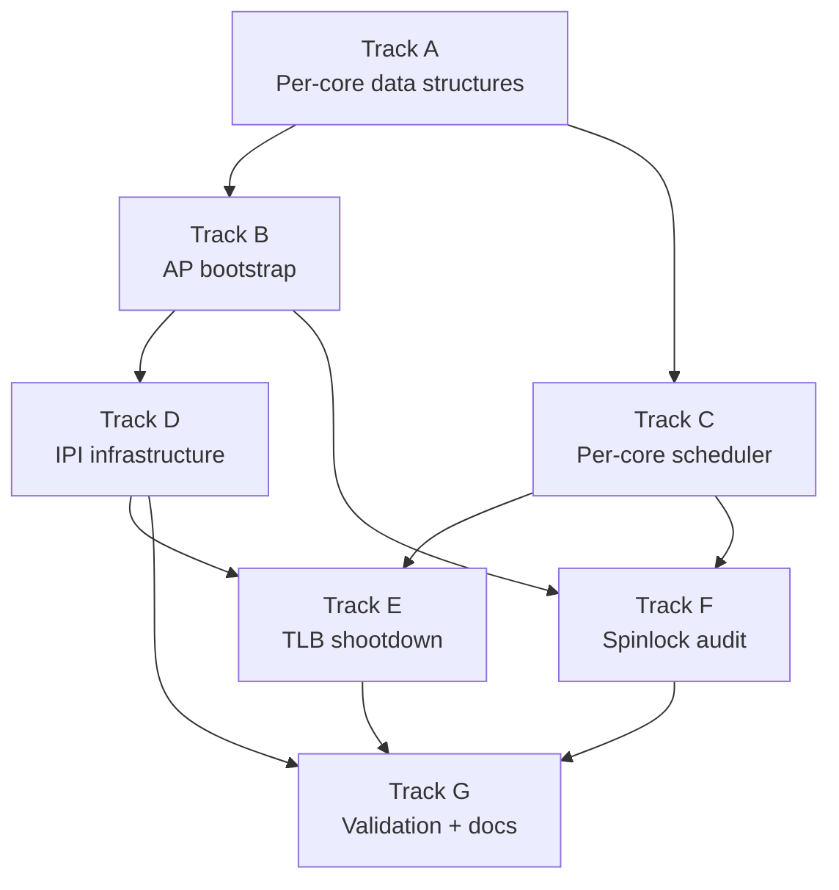

# Phase 25 — Symmetric Multiprocessing: Task List

**Depends on:** Phase 4 (Tasking) ✅, Phase 15 (Hardware Discovery) ✅, Phase 17 (Memory Reclamation) ✅
**Goal:** Boot all Application Processors, give each core its own GDT/TSS/kernel
stack and run queue, and run tasks truly in parallel across multiple cores.

## Prerequisite Analysis

Current state (post-Phase 24):
- MADT parsed at boot: `MadtInfo` stores up to 16 `LocalApicEntry` records with
  APIC IDs and enabled flags (`acpi::madt_info()`)
- Local APIC initialized on BSP: `lapic_init()` enables the LAPIC, sets spurious
  vector 0xFF, zeros TPR; `lapic_eoi()` signals end-of-interrupt
- LAPIC timer running in periodic mode at ~10 ms (100 Hz) on the BSP via
  `start_lapic_timer()`; calibrated against PIT channel 2; ticks-per-ms cached
  in `LAPIC_TICKS_PER_MS: Once<u32>` (reusable by APs)
- ICR register offsets declared (`LAPIC_ICR_LOW`, `LAPIC_ICR_HIGH`) but never
  written — marked `#[allow(dead_code)]`; no IPI support yet
- I/O APIC routes keyboard (IRQ 1 → vector 33) and virtio-net IRQ; legacy PIC
  fully masked
- Single global `SCHEDULER: Mutex<Scheduler>` with one `Vec<Task>` run queue and
  round-robin `pick_next()`; `SCHEDULER_RSP` is `static mut` documented as
  single-CPU only
- Single GDT/TSS: one `DOUBLE_FAULT_STACK` (20 KiB), one `SYSCALL_STACK`
  (16 KiB), loaded once at boot via `gdt::init()` using `Lazy` statics
- Context switch saves callee-saved registers + RFLAGS, swaps RSP, uses `cli`
  during the swap and `popf` to restore interrupt state atomically
- Frame allocator behind `Mutex<FreeListAllocator>` — intrusive free-list with
  refcount table; SMP-safe for correctness but single global lock is a contention
  point
- Identity-mapped physical memory via `physical_memory_offset` — MMIO pages
  (LAPIC at 0xFEE0_0000, I/O APIC at 0xFEC0_0000) accessible from any core
- `lapic_read()` / `lapic_write()` helpers are private — will need to be exposed
  or wrapped for AP init and IPI sending
- No per-core data structures, no `gs_base` usage, no AP startup code, no TLB
  shootdown mechanism

Already implemented (no new work needed):
- MADT parsing with APIC ID collection (Phase 15)
- LAPIC register read/write helpers (Phase 15)
- LAPIC timer calibration and periodic mode (Phase 15)
- I/O APIC redirection table programming (Phase 15)
- Per-task kernel stacks allocated on the heap (Phase 4)
- `switch_context()` asm stub (Phase 4)
- Frame allocator with refcount table and free-list (Phase 2 + Phase 17)
- Page table infrastructure with CoW fork support (Phase 2 + Phase 17)
- Process model: ELF loader, fork, exec, wait (Phase 11)
- POSIX-compatible syscall ABI (Phase 12)
- Writable tmpfs and FAT32 on-disk filesystem (Phase 13 + Phase 24)
- Signal handlers with user-space trampolines (Phase 19)
- TTY subsystem with termios, cooked/raw mode (Phase 22)
- Socket API with TCP/UDP (Phase 23)
- virtio-blk driver and persistent storage (Phase 24)

## Track Layout

| Track | Scope | Dependencies |
|---|---|---|
| A | Per-core data structures | — |
| B | AP bootstrap (trampoline + startup) | A |
| C | Per-core scheduler | A |
| D | IPI infrastructure | B |
| E | TLB shootdown | C, D |
| F | Spinlock audit and SMP hardening | B, C |
| G | Validation and documentation | D, E, F |

---

## Track A — Per-Core Data Structures

Set up the GDT, TSS, kernel stack, and per-core state block that each core needs
before it can run tasks.

| Task | Description |
|---|---|
| P25-T001 | Define `PerCoreData` struct: `core_id: u8`, `apic_id: u8`, `gdt: GlobalDescriptorTable`, `tss: TaskStateSegment`, `kernel_stack: [u8; 16384]`, `double_fault_stack: [u8; 20480]`, `is_online: AtomicBool` |
| P25-T002 | Allocate a static array `[Option<PerCoreData>; MAX_CORES]` (MAX_CORES = 16) and a core count; initialize the BSP entry (core 0) from the existing single GDT/TSS |
| P25-T003 | Implement `current_core_id() -> u8`: read the LAPIC ID register and look it up in the per-core array (used everywhere per-core dispatch is needed) |
| P25-T004 | Set up `gs_base` (MSR `IA32_GS_BASE`, 0xC000_0101) on the BSP to point to its `PerCoreData`; provide `per_core() -> &PerCoreData` helper via `gs:[0]` |
| P25-T005 | For each AP entry in `MadtInfo.local_apics[]` (where `flags` indicates enabled and APIC ID ≠ BSP), populate a `PerCoreData` with a fresh GDT, TSS, kernel stack, and double-fault stack |
| P25-T006 | Implement `per_core_gdt_init(core: &mut PerCoreData)`: configure the GDT with kernel code/data, user code/data, and the core's own TSS; load it via `lgdt` |

## Track B — AP Bootstrap

Write a 16-bit real-mode trampoline, send INIT+SIPI to each AP, and bring them
into long mode and Rust code.

| Task | Description |
|---|---|
| P25-T007 | Allocate a physical page below 1 MiB for the AP trampoline (the SIPI vector is a physical page number, so the trampoline must live in the first megabyte) |
| P25-T008 | Write the 16-bit real-mode trampoline stub: disable interrupts, load a temporary GDT with 32-bit code/data segments, enable protected mode (set `CR0.PE`), far-jump to 32-bit code |
| P25-T009 | Write the 32-bit trampoline continuation: enable PAE (`CR4.PAE`), load the kernel PML4 physical address into `CR3`, set `IA32_EFER.LME`, enable paging (`CR0.PG`), far-jump to 64-bit code |
| P25-T010 | Write the 64-bit trampoline tail: load the AP's pre-assigned kernel stack pointer, call the Rust `ap_entry(apic_id)` function |
| P25-T011 | Embed data the trampoline needs into the trampoline page: kernel PML4 physical address, per-AP stack pointer, entry point address (filled in before each SIPI) |
| P25-T012 | Make `lapic_write()` accessible from the SMP module (pub(crate) or wrapper). Implement `send_init_ipi(apic_id)`: write to LAPIC ICR (destination = APIC ID, delivery mode = INIT, level assert) and wait 10 ms |
| P25-T013 | Implement `send_sipi(apic_id, trampoline_page)`: write to LAPIC ICR (delivery mode = Startup, vector = trampoline physical page number); send twice with 200 µs gap per Intel specification |
| P25-T014 | Implement `boot_aps()`: for each AP in the MADT, fill in the trampoline data, send INIT + two SIPIs, wait for the AP to set its `is_online` flag (spin with timeout) |
| P25-T015 | Implement `ap_entry(apic_id)`: load this AP's GDT/TSS, set `gs_base` to this AP's `PerCoreData`, call `lapic_init()` and `start_lapic_timer()`, signal online, enter the scheduler idle loop |
| P25-T016 | Add `boot_aps()` call to `kernel_main` after APIC and scheduler initialization; log each AP as it comes online |

## Track C — Per-Core Scheduler

Split the single global run queue into per-core queues and add simple work
stealing so idle cores pull tasks from busy ones.

| Task | Description |
|---|---|
| P25-T017 | Define `PerCoreRunQueue` struct: `tasks: Vec<TaskId>`, `current: Option<TaskId>`, protected by its own `Mutex` |
| P25-T018 | Allocate one `PerCoreRunQueue` per core in the per-core data; keep a global `TASK_TABLE: Mutex<Vec<Task>>` for task metadata (state, saved RSP, etc.) |
| P25-T019 | Modify `task::spawn()` to assign new tasks to the least-loaded core's run queue (or round-robin across cores for simplicity) |
| P25-T020 | Modify `pick_next()` to operate on the calling core's run queue only: `per_core().run_queue.lock().pick_next()` |
| P25-T021 | Implement work stealing: when `pick_next()` returns `None` (local queue empty), scan other cores' queues and steal one `Ready` task; use try_lock to avoid deadlock |
| P25-T022 | Update `signal_reschedule()` to set a per-core reschedule flag (one `AtomicBool` per core in `PerCoreData`) instead of the single global `RESCHEDULE` |
| P25-T023 | Update the scheduler main loop (`task::run()`) so each core runs its own instance: BSP enters after `boot_aps()`, APs enter from `ap_entry()`. Replace `static mut SCHEDULER_RSP` with per-core storage |
| P25-T024 | Implement `idle_task` per core: each core spawns its own idle task that executes `hlt` in a loop |

## Track D — IPI Infrastructure

Enable inter-processor interrupts for waking idle cores and requesting TLB
shootdowns.

| Task | Description |
|---|---|
| P25-T025 | Implement `send_ipi(target_apic_id, vector)`: write destination APIC ID to ICR high, write vector + delivery mode (fixed) to ICR low, wait for delivery status bit to clear |
| P25-T026 | Implement `send_ipi_all_excluding_self(vector)`: use ICR shorthand (destination = all-excluding-self) for broadcast IPIs |
| P25-T027 | Reserve IPI vector 0xFE for reschedule IPI; add IDT handler that sets the target core's reschedule flag and sends `lapic_eoi()` |
| P25-T028 | Reserve IPI vector 0xFD for TLB shootdown IPI; add IDT handler (implementation in Track E) |
| P25-T029 | When a new task is spawned or unblocked onto a remote core's queue, send a reschedule IPI to wake that core from `hlt` |

## Track E — TLB Shootdown

When a page mapping is removed, invalidate it on every core that might have it
cached.

| Task | Description |
|---|---|
| P25-T030 | Define `TlbShootdownRequest`: `target_address: VirtAddr`, `pending_acks: AtomicU8` (count of cores that still need to flush) |
| P25-T031 | Implement `tlb_shootdown(addr)`: set `pending_acks` to (online cores − 1), send TLB shootdown IPI to all other cores, execute `invlpg` locally, spin-wait until `pending_acks` reaches 0 |
| P25-T032 | Implement the TLB shootdown IPI handler (vector 0xFD): read the target address from the shared request, execute `invlpg`, decrement `pending_acks`, send `lapic_eoi()` |
| P25-T033 | Hook `tlb_shootdown()` into `munmap` / page-table unmap paths: any page removal that affects a shared address space must trigger a shootdown |
| P25-T034 | Optimize: skip the IPI if only one core is online (single-core fast path using `invlpg` alone) |

## Track F — Spinlock Audit and SMP Hardening

Audit every global `Mutex` and `static mut` for correctness under concurrent
access from multiple cores.

| Task | Description |
|---|---|
| P25-T035 | Audit `SCHEDULER` / `TASK_TABLE` lock: verify no path holds the lock across a context switch or timer interrupt; the lock must be released before `switch_context()` |
| P25-T036 | Audit `FRAME_ALLOCATOR` lock: verify the free-list allocator's `head` field and refcount table are only modified under the lock or via atomics; no double-allocation possible |
| P25-T037 | Audit `ENDPOINTS` (IPC) lock: verify send/recv paths do not deadlock when tasks on different cores communicate; consider splitting into per-endpoint locks if contention is observed |
| P25-T038 | Audit `PROCESS_TABLE` lock: ensure process creation/destruction is safe when running on different cores simultaneously |
| P25-T039 | Audit `STDIN_BUFFER` and `FRAMEBUFFER` locks: these are low-contention but verify the keyboard IRQ handler (which runs on the BSP) does not deadlock with a core that holds the lock |
| P25-T040 | Audit all `static mut` usage (notably `SCHEDULER_RSP`): replace with `AtomicXxx`, per-core storage, or `Mutex` where needed; `static mut` is unsound under SMP unless access is truly single-core |
| P25-T041 | Verify `switch_context()` correctness: the `cli` / `popf` pair handles the local core's interrupts, but ensure the saved RSP is not visible to another core's steal operation until fully written |
| P25-T042 | Add `#[cfg(debug_assertions)]` lock-order assertions if any path acquires two locks: document the global lock ordering (e.g., TASK_TABLE before SCHEDULER before ENDPOINTS) |

## Track G — Validation and Documentation

| Task | Description |
|---|---|
| P25-T043 | Acceptance: all cores reported in the MADT appear in the boot log as online |
| P25-T044 | Acceptance: two CPU-bound tasks (e.g., infinite counter loops) run simultaneously with no corruption of shared kernel state |
| P25-T045 | Acceptance: a TLB shootdown triggered by `munmap` does not leave stale mappings on another core |
| P25-T046 | Acceptance: the system remains stable under rapid context switching across multiple cores (spawn 10+ tasks that yield in a loop) |
| P25-T047 | Acceptance: IPC between tasks on different cores works correctly (send from core 0, receive on core 1) |
| P25-T048 | Acceptance: existing shell, pipes, utilities, and networking work without regression |
| P25-T049 | `cargo xtask check` passes (clippy + fmt) |
| P25-T050 | QEMU boot validation — no panics, no regressions (test with `-smp 4`) |
| P25-T051 | Write `docs/25-smp.md`: AP startup sequence (INIT → SIPI → real → protected → long mode), per-core data layout and `gs_base`, TLB shootdowns (why needed, what happens without them), spinlock audit methodology, work-stealing overview |

---

## Deferred Until Later

These items are explicitly out of scope for Phase 25:

- NUMA-aware memory allocation
- CPU affinity (`sched_setaffinity`)
- Real-time scheduling classes
- CPU frequency scaling (P-states)
- CPU hotplug
- Per-core page allocator (SLUB/slab style)
- Lock-free run queues
- Ticket/MCS spinlocks (spin::Mutex is sufficient for now)
- x2APIC mode (MSR-based LAPIC access)
- AP-local LAPIC timer calibration (reuse BSP-calibrated ticks/ms)

---

## Dependency Graph

## Parallelization Strategy

**Wave 1:** Track A — per-core data structures are the foundation; every other
track depends on having per-core GDT/TSS/stacks defined.
**Wave 2 (after A):** Tracks B and C can proceed in parallel — AP bootstrap and
per-core scheduler are independent until APs need to enter the scheduler loop.
**Wave 3 (after B):** Track D — IPI support requires APs to be online and have
IDT handlers installed.
**Wave 4 (after C + D):** Track E — TLB shootdown needs both the per-core
scheduler (to know which cores are running which address spaces) and IPI delivery.
Track F can also start after B + C — the audit needs multi-core execution to test.
**Wave 5:** Track G — validation after all SMP infrastructure is in place. Test
with QEMU `-smp 4`.
