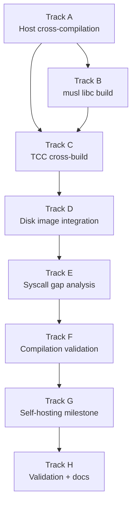

# Phase 26 — Compiler Bootstrap: Task List

**Depends on:** Phase 20 (Userspace Init and Shell) ✅, Phase 24 (Persistent Storage) ✅
**Goal:** Cross-compile TCC and musl libc on the host, bundle them into the disk image,
and run TCC natively inside the OS — culminating in TCC compiling itself (self-hosting).

## Prerequisite Analysis

Current state (post-Phase 25):
- ELF loader supports static x86-64 ELF binaries via `execve` (Phase 11)
- POSIX-compatible syscalls: `open`, `read`, `write`, `close`, `lseek`, `brk`,
  `mmap`, `munmap`, `stat`, `fstat` (Phase 12)
- Writable tmpfs at `/tmp` for intermediate files (Phase 13)
- Persistent FAT32 filesystem on virtio-blk at `/data` (Phase 24)
- Interactive shell with pipes, redirection, `PATH` lookup, job control (Phase 14)
- `fork`, `exec`, `wait` process lifecycle (Phase 11)
- Userspace PID 1 init and ring-3 shell running (Phase 20)

Already implemented (no new work needed):
- ELF loading and process execution (Phase 11)
- POSIX syscall compatibility layer (Phase 12)
- Writable filesystem for `/tmp` (Phase 13)
- Shell with pipes, redirection, environment variables (Phase 14)
- Persistent storage for bundled files (Phase 24)

Syscalls TCC requires (verify during Track B):
- File I/O: `open`, `read`, `write`, `close`, `lseek`, `stat`, `fstat`, `unlink`
- Memory: `brk` or `mmap`/`munmap` for heap
- Process: `execve` (for running compiled binaries), `fork`, `wait4`, `exit`
- Directory: `opendir`/`getdents64` (for include path search)
- Misc: `getcwd`, `access`, `ioctl` (may stub to ENOTTY)

## Track Layout

| Track | Scope | Dependencies |
|---|---|---|
| A | Host cross-compilation toolchain | — |
| B | musl libc cross-build | A |
| C | TCC cross-build | A, B |
| D | Disk image integration | C |
| E | Syscall gap analysis and fixes | D |
| F | Compilation validation | E |
| G | Self-hosting milestone | F |
| H | Validation and documentation | G |

---

## Track A — Host Cross-Compilation Toolchain

Set up the host-side musl cross-compiler needed to build TCC and musl
targeting x86-64 static ELF.

| Task | Description |
|---|---|
| P26-T001 | Add a `toolchain/` directory at the repo root for cross-compilation scripts and artifacts (gitignored except for scripts) |
| P26-T002 | Write `toolchain/setup-musl-cross.sh`: download or build `x86_64-linux-musl-gcc` cross-compiler; verify it produces static x86-64 ELF binaries |
| P26-T003 | Add a `cargo xtask bootstrap` subcommand that orchestrates the full cross-build pipeline (Tracks A–C) and places artifacts in `image/usr/` |
| P26-T004 | Document the host prerequisites (Linux host, `make`, `gcc`, internet access for downloads) in `toolchain/README.md` |

## Track B — musl libc Cross-Build

Build musl libc as a static library with headers, targeting x86-64.

| Task | Description |
|---|---|
| P26-T005 | Write `toolchain/build-musl.sh`: download musl source tarball, configure with `--target=x86_64-linux-musl --prefix=/usr --disable-shared`, build `libc.a` |
| P26-T006 | Collect build artifacts: `libc.a` → `image/usr/lib/libc.a`, musl headers → `image/usr/include/` |
| P26-T007 | Verify `libc.a` contains the expected symbols (`_start`, `printf`, `malloc`, `open`, `read`, `write`, `brk`, `mmap`) using `nm` or `objdump` |
| P26-T008 | Add CRT files to `image/usr/lib/`: `crt1.o`, `crti.o`, `crtn.o` (produced by the musl build; required by TCC for linking) |

## Track C — TCC Cross-Build

Cross-compile TCC itself as a static x86-64 ELF binary linked against musl.

| Task | Description |
|---|---|
| P26-T009 | Write `toolchain/build-tcc.sh`: download TCC source, configure with `./configure --prefix=/usr --cc=x86_64-linux-musl-gcc --extra-cflags="-static" --cpu=x86_64` |
| P26-T010 | Build TCC: `make` produces the `tcc` binary; verify it is a static x86-64 ELF (`file tcc` and `readelf -h tcc`) |
| P26-T011 | Collect TCC artifacts: `tcc` binary → `image/usr/bin/tcc`, TCC's internal headers (`include/`) → `image/usr/lib/tcc/include/` |
| P26-T012 | Bundle TCC source into the disk image at `/usr/src/tcc/` for the self-hosting milestone |
| P26-T013 | Verify on the host that the cross-compiled TCC can compile a hello.c when given the musl `libc.a` and CRT files: `./tcc -nostdlib -I image/usr/include -L image/usr/lib hello.c -lc -o hello` |

## Track D — Disk Image Integration

Wire the cross-compiled artifacts into the xtask image builder so they appear
in the OS filesystem at boot.

| Task | Description |
|---|---|
| P26-T014 | Update `xtask/src/image.rs` (or equivalent) to copy `image/usr/bin/tcc`, `image/usr/lib/`, `image/usr/include/`, and `image/usr/src/tcc/` into the disk image |
| P26-T015 | Ensure the filesystem layout places files at the correct paths: `/usr/bin/tcc`, `/usr/lib/libc.a`, `/usr/lib/crt1.o`, `/usr/include/stdio.h`, etc. |
| P26-T016 | Verify `PATH` includes `/usr/bin` so the shell can find `tcc` without a full path |
| P26-T017 | Boot the OS in QEMU and verify `tcc --version` prints the expected version string |

## Track E — Syscall Gap Analysis and Fixes

Run TCC inside the OS, capture failures, and implement any missing or
broken syscalls.

| Task | Description |
|---|---|
| P26-T018 | Attempt `tcc --version` inside the OS; capture any syscall failures via the kernel's unimplemented-syscall log |
| P26-T019 | Attempt `tcc -c hello.c -o hello.o` and analyze failures; common gaps: `access()`, `readlink()`, `ioctl()` on stdout |
| P26-T020 | Implement or stub missing syscalls identified in T018–T019: `access` → check file existence, `readlink` → return EINVAL for non-symlinks, `ioctl` on non-TTY → return ENOTTY |
| P26-T021 | Verify `stat`/`fstat` returns correct `st_mode` bits (regular file vs directory) — TCC uses this to distinguish files from directories when searching include paths |
| P26-T022 | Verify `mmap` with `MAP_ANONYMOUS` works for TCC's internal memory allocator; ensure `brk` can grow the heap to at least 16 MiB |
| P26-T023 | Verify `getdents64` works correctly for TCC's include-path directory traversal |

## Track F — Compilation Validation

Compile and run progressively larger C programs inside the OS.

| Task | Description |
|---|---|
| P26-T024 | Write `/tmp/hello.c` via the shell (`cat > /tmp/hello.c`); compile with `tcc /tmp/hello.c -o /tmp/hello`; run `/tmp/hello` and verify it prints `hello, world` |
| P26-T025 | Compile a program that uses `malloc`/`free` and prints results (verifies heap via `brk`/`mmap` works for compiled programs) |
| P26-T026 | Compile a program that reads and writes files (verifies file I/O syscalls work for TCC-compiled binaries) |
| P26-T027 | Compile a Fibonacci calculator that takes input from `argv` and prints the result (verifies argument passing and `atoi`) |
| P26-T028 | Compile a multi-file program: `tcc -c foo.c -o foo.o && tcc -c main.c -o main.o && tcc foo.o main.o -o prog` (verifies separate compilation and linking) |

## Track G — Self-Hosting Milestone

TCC compiles itself inside the OS.

| Task | Description |
|---|---|
| P26-T029 | Attempt `tcc /usr/src/tcc/tcc.c -o /tmp/tcc2` inside the OS; capture and fix any failures |
| P26-T030 | If the single-file compile fails due to memory, increase the userspace heap limit or add swap-like page reclamation for anonymous mappings |
| P26-T031 | Verify `/tmp/tcc2 --version` prints the same version as `/usr/bin/tcc` |
| P26-T032 | Verify `/tmp/tcc2 /tmp/hello.c -o /tmp/hello2` produces a working binary |
| P26-T033 | Compare outputs: both `hello` (from tcc) and `hello2` (from tcc2) produce identical output; ideally the binaries are byte-identical |

## Track H — Validation and Documentation

| Task | Description |
|---|---|
| P26-T034 | Acceptance: `tcc --version` runs inside the OS |
| P26-T035 | Acceptance: `hello.c` compiled by TCC inside the OS runs and prints `hello, world` |
| P26-T036 | Acceptance: TCC compiles itself inside the OS (`tcc tcc.c -o tcc2`) |
| P26-T037 | Acceptance: the self-compiled `tcc2` passes the `hello.c` test |
| P26-T038 | Acceptance: no host tools are required after the disk image is built |
| P26-T039 | `cargo xtask check` passes (clippy + fmt) |
| P26-T040 | QEMU boot validation — no panics, no regressions |
| P26-T041 | Write `docs/18-compiler-bootstrap.md`: what bootstrapping means and why it matters, what TCC needs from the OS (syscall map), musl build process and image layout, Path B alternatives and when to use them, short essay on the history of compiler bootstrapping (Thompson's "Trusting Trust") |

---

## Deferred Until Later

These items are explicitly out of scope for Phase 26:

- GCC or Clang as the native compiler
- Dynamic linking and shared libraries (`ld-musl-x86_64.so.1`)
- A package manager or ports tree
- `make`, `cmake`, or other build tools
- Debugger support (`gdb`, `lldb`)
- Multi-stage bootstrap (eliminating host-compiled binaries entirely)
- Optimizing compiler output (TCC produces unoptimized code by design)
- C++ support
- Linking against anything other than musl `libc.a`

---

## Dependency Graph

## Parallelization Strategy

**Wave 1:** Track A — set up the musl cross-compiler on the host. This is
a one-time setup step that every other track depends on.
**Wave 2 (after A):** Track B — build musl libc. Track C depends on
`libc.a` being available for static linking.
**Wave 3 (after B):** Track C — cross-build TCC against the musl artifacts.
**Wave 4 (after C):** Track D — integrate into the disk image. This is
mostly xtask plumbing.
**Wave 5 (after D):** Track E — boot and fix syscall gaps. This is the
most unpredictable track; expect iteration.
**Wave 6 (after E):** Track F — validate progressively larger programs.
**Wave 7 (after F):** Track G — the self-hosting attempt. May require
backtracking to Track E for additional syscall fixes.
**Wave 8:** Track H — final validation and documentation.

Tracks A–D are largely sequential host-side work. The interesting kernel
work begins at Track E when TCC exercises syscall paths that simpler
userspace programs may not have stressed.
