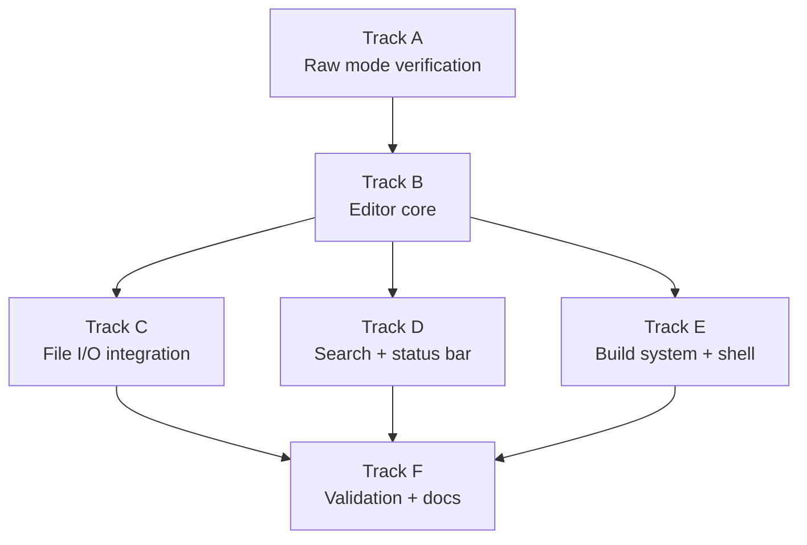

# Phase 26 — Text Editor: Task List

**Depends on:** Phase 22 (TTY) ✅, Phase 22b (ANSI Escape Sequences) ✅, Phase 24 (Persistent Storage) ✅
**Goal:** A usable full-screen text editor (`edit`) runs inside the OS, enabling
users to create, edit, search, and save files from the shell.

## Prerequisite Analysis

Current state (post-Phase 25):
- TTY subsystem with full termios support: canonical mode, raw mode, echo,
  signal characters (`ISIG`), CR/LF translation
- IOCTL operations: `TCGETS`, `TCSETS`, `TCSETSW`, `TCSETSF` for termios;
  `TIOCGWINSZ` / `TIOCSWINSZ` for terminal window size (default 24×80)
- ANSI escape sequence parser in the framebuffer console: cursor movement
  (`CUU`, `CUD`, `CUF`, `CUB`), cursor positioning (`CUP`), erase line/screen
  (`EL`, `ED`), SGR color attributes — all VT100 sequences kilo requires
- File I/O syscalls: `open`, `read`, `write`, `close`, `lseek`, `fstat`
- Persistent FAT32 filesystem on virtio-blk (Phase 24) — files survive reboot
- tmpfs mounted at `/tmp` for scratch files
- Signal handling with user-space trampolines (Phase 19) — `SIGWINCH` support
  needed for terminal resize (verify or add)
- C programs compiled with `musl-gcc -static`, embedded in initrd as `.elf`
  files, loaded by the kernel at boot
- 15 coreutils already built and working (cat, ls, grep, etc.)
- SMP-aware kernel with up to 16 cores (Phase 25)

Already implemented (no new work needed):
- Raw terminal mode via termios `TCSETS` ioctl (clear `ICANON`, `ECHO`)
- ANSI escape sequences: cursor positioning, screen erase, colors
- File I/O syscalls for open/read/write/close/lseek
- Persistent storage (FAT32 on virtio-blk)
- musl-gcc static compilation pipeline in xtask
- Process lifecycle: fork, exec, wait, exit
- Signal infrastructure (rt_sigaction, signal delivery)

Potentially needed (verify during implementation):
- `SIGWINCH` delivery on terminal resize — may need kernel-side hook when
  `TIOCSWINSZ` is called to signal the foreground process group
- `write()` to fd 1 in raw mode should pass bytes through without line
  discipline processing (verify `OPOST` off works correctly)
- `read()` in raw mode returning one byte at a time (verify `VMIN=1`, `VTIME=0`
  behavior)
- Enough heap/stack for the editor process (kilo is small, should be fine)

## Track Layout

| Track | Scope | Dependencies | Status |
|---|---|---|---|
| A | Terminal raw mode verification | — | Not started |
| B | Write the editor (kilo-inspired C) | A | Not started |
| C | File I/O integration | B | Not started |
| D | Search and status bar | B | Not started |
| E | Build system and shell integration | B | Not started |
| F | Validation and documentation | C, D, E | Not started |

### Implementation Notes

- **Approach**: Write a kilo-inspired editor in C rather than porting kilo
  directly. This avoids license entanglement and lets us tailor syscall usage to
  what m3OS actually implements. The reference implementation is antirez/kilo
  (~1000 lines of C).
- **Binary name**: `/bin/edit` — short, easy to type, no conflict with existing
  utilities.
- **Terminal model**: Hardcode VT100 escape sequences. No terminfo/termcap
  needed — QEMU serial console and the framebuffer console both support VT100.
- **Text buffer**: Use a simple line array (`char **rows`) — adequate for the
  file sizes we expect. Gap buffer is deferred.

---

## Track A — Terminal Raw Mode Verification

Verify that the kernel's TTY layer supports the terminal operations a
full-screen editor needs before writing editor code.

| Task | Description |
|---|---|
| P26-T001 | Write a small C test program (`raw-test.c`) that: switches to raw mode (`tcgetattr` + clear `ICANON`, `ECHO`, `IEXTEN`, `ISIG`, `IXON`, `ICRNL`, `OPOST`, `BRKINT`, `INPCK`, `ISTRIP`; set `CS8`, `VMIN=1`, `VTIME=0`), reads one byte at a time, prints the byte value in hex, quits on `q`. Verify each keypress is returned immediately without echo. |
| P26-T002 | Verify `TIOCGWINSZ` ioctl returns correct terminal dimensions (rows, cols). Test that the editor can detect screen size at startup. |
| P26-T003 | Verify ANSI escape sequences work in raw mode: write `\x1b[2J` (clear screen), `\x1b[H` (cursor home), `\x1b[6n` (cursor position report). Check if the kernel echoes back a cursor position response `\x1b[<row>;<col>R` to stdin. If not, implement a fallback using `TIOCGWINSZ`. |
| P26-T004 | Verify arrow keys are received correctly: Up=`\x1b[A`, Down=`\x1b[B`, Right=`\x1b[C`, Left=`\x1b[D`, Home=`\x1b[1~` or `\x1b[H`, End=`\x1b[4~` or `\x1b[F`, Page Up=`\x1b[5~`, Page Down=`\x1b[6~`, Delete=`\x1b[3~`. Fix any missing key translations in the keyboard/TTY layer. |
| P26-T005 | If `SIGWINCH` is not delivered when terminal size changes, add support: when `TIOCSWINSZ` ioctl updates the window size, send `SIGWINCH` to the foreground process group of that TTY. |

## Track B — Editor Core

Write the kilo-inspired editor in C. This is the main implementation track.

| Task | Description |
|---|---|
| P26-T006 | Create `userspace/edit/` directory with `edit.c`. Implement `enableRawMode()` / `disableRawMode()` using `tcgetattr` / `tcsetattr` with `atexit()` to restore terminal on exit. |
| P26-T007 | Implement `editorReadKey()`: blocking `read(STDIN_FILENO, &c, 1)` that translates escape sequences into named key constants (`ARROW_UP`, `ARROW_DOWN`, `PAGE_UP`, `HOME_KEY`, `DEL_KEY`, etc.). Handle the `\x1b[` prefix and multi-byte sequences. |
| P26-T008 | Implement screen dimensions detection: `getWindowSize()` using `ioctl(TIOCGWINSZ)`. Fallback: move cursor to bottom-right with `\x1b[999C\x1b[999B` and query position with `\x1b[6n` if ioctl fails. |
| P26-T009 | Implement the append buffer (`struct abuf`): a dynamic string buffer that batches all terminal writes into a single `write()` call per screen refresh, avoiding flicker. |
| P26-T010 | Implement `editorRefreshScreen()`: write `\x1b[?25l` (hide cursor), `\x1b[H` (cursor home), draw each row with `\x1b[K` (clear line), draw status bar and message bar, position cursor with `\x1b[<row>;<col>H`, write `\x1b[?25h` (show cursor). Flush via single `write()` from the append buffer. |
| P26-T011 | Implement the row data model: `typedef struct erow { int size; char *chars; int rsize; char *render; }` where `render` expands tabs to spaces. Maintain a dynamic array of `erow` structs. |
| P26-T012 | Implement cursor movement: arrow keys move `cx`/`cy`, snap cursor to end of line when moving vertically past shorter lines, handle beginning/end of line wrapping to previous/next line. |
| P26-T013 | Implement vertical scrolling: maintain `rowoff` (row offset) and `coloff` (column offset). Scroll when cursor moves above/below the visible window. Adjust rendering to only draw rows `rowoff..rowoff+screenrows`. |
| P26-T014 | Implement horizontal scrolling: track `coloff`, scroll when cursor moves past right edge, render only `coloff..coloff+screencols` of each row. |
| P26-T015 | Implement text insertion: `editorInsertChar()` inserts a character at `cx,cy`, updating the row's `chars` and `render` arrays. Handle inserting into the middle of a line (memmove). |
| P26-T016 | Implement newline insertion: `editorInsertNewline()` splits the current row at `cx`, creating a new row below with the right half. Handle insertion at beginning of line (new empty row above) and end of line (new empty row below). |
| P26-T017 | Implement character deletion: `editorDelChar()` removes the character to the left of the cursor. At the beginning of a line, append the current line to the previous line and remove the current row. |
| P26-T018 | Implement `editorProcessKeypress()`: main input dispatch — printable characters → insert, `Ctrl+Q` → quit, `Ctrl+S` → save, `Ctrl+F` → search, arrow/page/home/end → movement, Backspace/Delete → delete. |

## Track C — File I/O Integration

Load and save files using the OS's file system.

| Task | Description |
|---|---|
| P26-T019 | Implement `editorOpen(char *filename)`: open the file with `open()`, read line by line (handle `\n` and `\r\n` line endings), populate the `erow` array. Handle nonexistent files gracefully (start with empty buffer, save creates the file). |
| P26-T020 | Implement `editorRowsToString()`: concatenate all rows into a single `\n`-delimited string for writing. Return the string and its total length. |
| P26-T021 | Implement `editorSave()`: if no filename, prompt for one (see T025). Write the full buffer to disk using `open(O_WRONLY | O_CREAT | O_TRUNC)` + `write()` + `close()`. Display bytes written in the status message. Handle write errors gracefully. |
| P26-T022 | Track the "dirty" flag: set on any text modification, clear on save. Warn on `Ctrl+Q` if unsaved changes ("Press Ctrl+Q 3 more times to quit without saving"). |

## Track D — Search and Status Bar

| Task | Description |
|---|---|
| P26-T023 | Implement the status bar (inverted colors via `\x1b[7m`): show filename (or `[No Name]`), number of lines, current line number, and `(modified)` indicator. Draw at `screenrows - 2`. |
| P26-T024 | Implement the message bar: one line below the status bar for transient messages (e.g., "HELP: Ctrl+S = save | Ctrl+Q = quit | Ctrl+F = find"). Messages disappear after 5 seconds. |
| P26-T025 | Implement `editorPrompt(char *prompt)`: a mini input line that reads user input character by character in the message bar. Used for search queries and save-as filename. Support Escape to cancel, Enter to confirm, Backspace to delete. |
| P26-T026 | Implement `editorFind()`: prompt for a search string, scan all rows for a match (using `strstr`), move cursor to the first match. Support incremental search: update the match as each character is typed. Support forward/backward search with arrow keys. |
| P26-T027 | Implement search highlighting: temporarily highlight the matched text using `\x1b[7m` (reverse video) during search, restore normal colors when search ends. |

## Track E — Build System and Shell Integration

| Task | Description |
|---|---|
| P26-T028 | Add `edit.c` to the xtask build: compile with `musl-gcc -static -O2 userspace/edit/edit.c -o edit.elf`, copy to `kernel/initrd/edit.elf`. |
| P26-T029 | Register the `edit` binary in the kernel's initrd loader so it is available at `/bin/edit` at boot. |
| P26-T030 | Add the `edit` command to the shell's command lookup path (same as other external binaries — exec from `/bin/edit`). |
| P26-T031 | Set the `EDITOR` environment variable to `/bin/edit` in the init process environment, so future phases can use `$EDITOR` generically. |

## Track F — Validation and Documentation

| Task | Description |
|---|---|
| P26-T032 | Acceptance: `edit` launches from the shell and displays a full-screen TUI with welcome message. |
| P26-T033 | Acceptance: arrow keys, Page Up/Down, Home/End move the cursor correctly. |
| P26-T034 | Acceptance: typing characters inserts text; Backspace and Delete remove characters. |
| P26-T035 | Acceptance: `Ctrl+S` saves the file to persistent storage (FAT32). Reopen the file and verify contents survived. |
| P26-T036 | Acceptance: `Ctrl+Q` quits the editor; dirty-file warning works (requires multiple presses to force quit). |
| P26-T037 | Acceptance: `Ctrl+F` searches for text; incremental search updates live; arrow keys navigate between matches. |
| P26-T038 | Acceptance: opening a nonexistent filename creates an empty buffer; saving creates the file. |
| P26-T039 | Acceptance: scrolling works for files larger than the terminal height (test with a 100+ line file). |
| P26-T040 | Acceptance: horizontal scrolling works for lines wider than the terminal width. |
| P26-T041 | Acceptance: status bar shows filename, line count, cursor position, and modified state. |
| P26-T042 | Acceptance: the editor restores the terminal to cooked mode on exit (no garbled shell prompt). |
| P26-T043 | `cargo xtask check` passes (clippy + fmt). |
| P26-T044 | QEMU boot validation — editor launches, edits, saves, and quits without panics or regressions. Test with both serial console and framebuffer GUI (`cargo xtask run` and `cargo xtask run-gui`). |
| P26-T045 | Write `docs/26-text-editor.md`: editor architecture (raw mode setup, append buffer, row model, screen refresh loop), key mapping, file I/O flow, and how to extend with syntax highlighting. |

---

## Deferred Until Later

These items are explicitly out of scope for Phase 26:

- Syntax highlighting (stretch goal for Phase 26b or later; kilo supports it
  in ~200 extra lines)
- Multiple file editing (split views, tabs)
- Undo/redo beyond single-character level
- Copy/paste (requires clipboard abstraction)
- Mouse support
- ncurses or TUI library
- terminfo/termcap database
- Line wrapping mode (soft wrap)
- Unicode / multi-byte character support
- Plugin or macro system
- Configuration file (`.editrc` or similar)

---

## Dependency Graph

## Parallelization Strategy

**Wave 1:** Track A — verify terminal raw mode, escape sequences, and key
input work correctly. Small test programs, fast turnaround.
**Wave 2 (after A):** Track B — the bulk of the work. Write the editor core:
raw mode, key reading, screen refresh, cursor movement, scrolling, text editing.
**Wave 3 (after B):** Tracks C, D, and E can proceed in parallel — file I/O,
search/status bar, and build integration are independent of each other.
**Wave 4:** Track F — validation after all features are integrated. Test both
serial and framebuffer modes.
