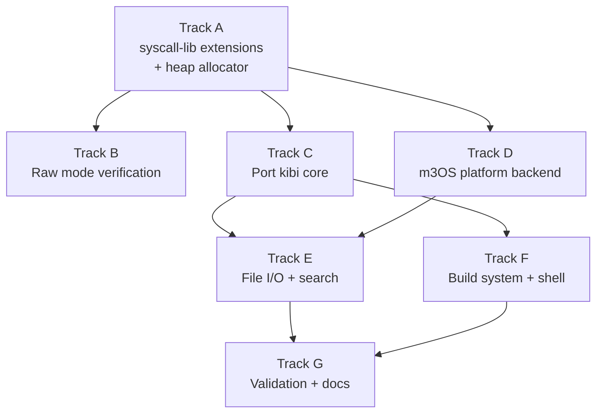

# Phase 26 — Text Editor: Task List

**Depends on:** Phase 22 (TTY) ✅, Phase 22b (ANSI Escape Sequences) ✅, Phase 24 (Persistent Storage) ✅
**Goal:** A usable full-screen text editor (`edit`) runs inside the OS, enabling
users to create, edit, search, and save files from the shell.

## Prerequisite Analysis

Current state (post-Phase 25):
- TTY subsystem with full termios support: canonical mode, raw mode, echo,
  signal characters (`ISIG`), CR/LF translation
- IOCTL operations: `TCGETS`, `TCSETS`, `TCSETSW`, `TCSETSF` for termios;
  `TIOCGWINSZ` / `TIOCSWINSZ` for terminal window size (default 24x80)
- ANSI escape sequence parser in the framebuffer console: cursor movement
  (`CUU`, `CUD`, `CUF`, `CUB`), cursor positioning (`CUP`), erase line/screen
  (`EL`, `ED`), SGR color attributes — all VT100 sequences kibi requires
- File I/O syscalls: `open`, `read`, `write`, `close`, `lseek`, `fstat`
- Persistent FAT32 filesystem on virtio-blk (Phase 24) — files survive reboot
- tmpfs mounted at `/tmp` for scratch files
- Signal handling with user-space trampolines (Phase 19) — `SIGWINCH` support
  needed for terminal resize (verify or add)
- Rust no_std userspace binaries (init, sh0, ping) built with `cargo` targeting
  `x86_64-unknown-none`, using `syscall-lib` for OS interaction
- `syscall-lib` provides: `read`, `write`, `open`, `close`, `fork`, `execve`,
  `exit`, `waitpid`, `pipe`, `dup2`, `chdir`, `getcwd`, plus raw `syscall0`–
  `syscall6` for anything not yet wrapped
- `SYS_IOCTL` (16) constant exists in `syscall-lib` but has no high-level
  wrapper — needed for termios and window size
- `SYS_LSEEK` (8) constant exists but has no wrapper — needed for file ops
- SMP-aware kernel with up to 16 cores (Phase 25)

Already implemented (no new work needed):
- Raw terminal mode via termios `TCSETS` ioctl (clear `ICANON`, `ECHO`)
- ANSI escape sequences: cursor positioning, screen erase, colors
- File I/O syscalls in the kernel for open/read/write/close/lseek
- Persistent storage (FAT32 on virtio-blk)
- Rust no_std userspace build pipeline in xtask (`x86_64-unknown-none`,
  `-Zbuild-std=core,compiler_builtins`)
- Process lifecycle: fork, exec, wait, exit
- Signal infrastructure (rt_sigaction, signal delivery)

Needs to be added or extended:
- `syscall-lib`: `ioctl()` wrapper (raw syscall3 for `SYS_IOCTL`)
- `syscall-lib`: `lseek()` wrapper (raw syscall3 for `SYS_LSEEK`)
- `syscall-lib`: termios struct definitions and `tcgetattr`/`tcsetattr` helpers
- `syscall-lib`: `winsize` struct and `get_window_size` helper
- Heap allocator for the editor process (kibi uses `Vec`, `String`) — either
  a simple bump/linked-list allocator in `syscall-lib` or a shared userspace
  allocator crate using `brk`/`mmap`
- `SIGWINCH` delivery when terminal size changes (verify or add kernel-side)

## Approach: Port Kibi

[Kibi](https://github.com/ilai-deutel/kibi) is a text editor in <=1024 lines
of Rust, a direct clone of antirez's kilo. MIT/Apache-2.0 dual license.

Why kibi:
- Same ~1000-line philosophy as kilo, but in Rust with memory safety
- Only two runtime dependencies: `unicode-width` (no_std-compatible) and `libc`
  (replaced by our platform backend)
- Clean platform abstraction: separate `unix.rs`, `windows.rs`, `wasi.rs`
  backends — we write an `m3os.rs` backend (~60-80 lines)
- Hardcodes VT100 escape sequences (no terminfo/ncurses needed)
- Features: cursor movement, scrolling, search, syntax highlighting, status bar,
  dirty-file tracking, configurable keybindings

Porting strategy:
1. Create `userspace/edit/` as a no_std Rust crate with `syscall-lib` dependency
2. Add a userspace heap allocator (needed for `Vec`/`String` in kibi)
3. Extend `syscall-lib` with ioctl/termios/lseek wrappers
4. Port kibi's core modules, replacing `std::fs`/`std::io` with syscall-lib calls
5. Write an `m3os.rs` platform backend implementing kibi's terminal interface
6. Build via xtask alongside init, sh0, ping

## Track Layout

| Track | Scope | Dependencies | Status |
|---|---|---|---|
| A | syscall-lib extensions + heap allocator | — | Done |
| B | Terminal raw mode verification | A | Done |
| C | Port kibi core (editor logic) | A | Done |
| D | m3OS platform backend | A | Done |
| E | File I/O and search | C, D | Done |
| F | Build system and shell integration | C | Done |
| G | Validation and documentation | E, F | In progress |

### Implementation Notes

- **Binary name**: `/bin/edit` — short, easy to type, no conflict with existing
  utilities.
- **Crate name**: `edit` (package) / `edit` (binary), following the init/shell
  pattern.
- **Terminal model**: Hardcode VT100 escape sequences. No terminfo/termcap
  needed — QEMU serial console and the framebuffer console both support VT100.
- **Text buffer**: Kibi uses a `Vec<Row>` line array — adequate for the file
  sizes we expect. Gap buffer / rope is deferred.
- **Heap**: The editor needs dynamic allocation (`Vec`, `String`). Add a
  simple global allocator to userspace that uses `brk` or `mmap` under the hood.
  This allocator will be reusable by future Rust userspace programs.
- **no_std + alloc**: The editor crate uses `#![no_std]` with `extern crate alloc`
  for `Vec`, `String`, `format!`. The allocator is set up before entering the
  editor main loop.

---

## Track A — syscall-lib Extensions and Heap Allocator

Extend `syscall-lib` with the system call wrappers kibi needs, and provide a
global allocator for userspace Rust binaries that need heap allocation.

| Task | Description |
|---|---|
| P26-T001 | Add `ioctl(fd: usize, request: usize, arg: usize) -> isize` wrapper to `syscall-lib` using `syscall3(SYS_IOCTL, fd, request, arg)`. |
| P26-T002 | Add `lseek(fd: usize, offset: i64, whence: usize) -> isize` wrapper to `syscall-lib` using `syscall3(SYS_LSEEK, ...)`. Define `SEEK_SET`, `SEEK_CUR`, `SEEK_END` constants. |
| P26-T003 | Add termios type definitions to `syscall-lib`: `struct Termios` (matching the kernel's 36-byte layout: `c_iflag`, `c_oflag`, `c_cflag`, `c_lflag`, `c_cc[19]`), plus flag constants (`ICANON`, `ECHO`, `ISIG`, `ICRNL`, `OPOST`, `BRKINT`, `CS8`, etc.) and `TCGETS`/`TCSETS`/`TCSETSF` ioctl numbers. |
| P26-T004 | Add `tcgetattr(fd: usize) -> Result<Termios, isize>` and `tcsetattr(fd: usize, termios: &Termios) -> Result<(), isize>` convenience functions to `syscall-lib`, built on the `ioctl` wrapper. |
| P26-T005 | Add `struct Winsize` (matching kernel layout: `ws_row`, `ws_col`, `ws_xpixel`, `ws_ypixel`) and `get_window_size(fd: usize) -> Result<(u16, u16), isize>` using `ioctl(fd, TIOCGWINSZ, &winsize)`. |
| P26-T006 | Create a userspace heap allocator crate or module: implement `GlobalAlloc` using `brk` (syscall 12) or `mmap` (syscall 9) to grow the heap. A simple bump allocator with a free list is sufficient. Provide it as either a module in `syscall-lib` (behind a feature flag) or a separate `userspace/alloc/` crate. |
| P26-T007 | Verify the allocator works: write a minimal test in the edit crate's `_start` that allocates a `Vec<u8>`, pushes bytes, and prints the length. Confirm no panic or OOM on a small allocation. |
| P26-T008 | Add `rt_sigaction(signum: usize, act: *const SigAction, oldact: *mut SigAction) -> isize` wrapper to `syscall-lib` if not already present. Define `SIGWINCH` (28) constant. |

## Track B — Terminal Raw Mode Verification

Verify that the kernel's TTY layer supports the terminal operations a
full-screen editor needs before porting kibi.

| Task | Description |
|---|---|
| P26-T009 | Write a small Rust test binary (`userspace/raw-test/`) that: switches to raw mode using the new `tcgetattr`/`tcsetattr` wrappers (clear `ICANON`, `ECHO`, `IEXTEN`, `ISIG`, `ICRNL`, `OPOST`; set `CS8`), reads one byte at a time, prints the byte value in hex, quits on `q`. Verify each keypress is returned immediately without echo. |
| P26-T010 | Verify `TIOCGWINSZ` ioctl returns correct terminal dimensions (rows, cols) using the new `get_window_size` wrapper. |
| P26-T011 | Verify ANSI escape sequences work in raw mode: write `\x1b[2J` (clear screen), `\x1b[H` (cursor home), `\x1b[6n` (cursor position report). Check if the kernel echoes back a cursor position response `\x1b[<row>;<col>R` to stdin. If not, ensure the `TIOCGWINSZ` fallback path works. |
| P26-T012 | Verify arrow keys are received correctly in raw mode: Up=`\x1b[A`, Down=`\x1b[B`, Right=`\x1b[C`, Left=`\x1b[D`, Home=`\x1b[1~` or `\x1b[H`, End=`\x1b[4~` or `\x1b[F`, Page Up=`\x1b[5~`, Page Down=`\x1b[6~`, Delete=`\x1b[3~`. Fix any missing key translations in the keyboard/TTY layer. |
| P26-T013 | If `SIGWINCH` is not delivered when terminal size changes, add support: when `TIOCSWINSZ` ioctl updates the window size, send `SIGWINCH` to the foreground process group of that TTY. |

## Track C — Port Kibi Core

Port kibi's editor logic into a no_std Rust crate. Replace `std` types with
`alloc` equivalents and syscall-lib calls.

| Task | Description |
|---|---|
| P26-T014 | Create `userspace/edit/` crate: `Cargo.toml` (depends on `syscall-lib`, `unicode-width`), `src/main.rs` with `#![no_std]`, `#![no_main]`, `extern crate alloc`, global allocator setup, `_start` entry point. Verify it compiles and runs (empty screen, immediate exit). |
| P26-T015 | Port kibi's `Row` struct: `chars: Vec<u8>`, `render: Vec<u8>` (tabs expanded to spaces). Implement `update_render()` to regenerate the render string when chars change. Port `cx_to_rx()` (cursor x to render x, accounting for tab width). |
| P26-T016 | Port kibi's key reading: `read_key()` function that reads one byte from stdin via `syscall_lib::read(0, ...)`, then handles multi-byte escape sequences (`\x1b[A`, `\x1b[5~`, etc.) by reading additional bytes with a short timeout or non-blocking read. Return a `Key` enum (`ArrowUp`, `ArrowDown`, `PageUp`, `Home`, `Del`, `Char(u8)`, `Ctrl(u8)`, etc.). |
| P26-T017 | Port the append buffer: `struct ABuf { buf: Vec<u8> }` with `push_str(&mut self, s: &[u8])` and `flush(&self)` (single `write(1, ...)` call). Used to batch all screen output per refresh cycle. |
| P26-T018 | Port `refresh_screen()`: hide cursor (`\x1b[?25l`), cursor home (`\x1b[H`), draw each visible row with `\x1b[K` (clear to EOL), draw status bar and message bar, reposition cursor (`\x1b[<r>;<c>H`), show cursor (`\x1b[?25h`). Flush the append buffer. |
| P26-T019 | Port cursor movement: arrow keys move `cx`/`cy`, snap to end of line on vertical movement past shorter lines, wrap at line boundaries. Implement Page Up/Down (move by screen height), Home/End (move to start/end of line). |
| P26-T020 | Port vertical scrolling: maintain `row_offset`. Scroll when cursor moves above or below the visible window. Only render rows `row_offset..row_offset+screen_rows`. |
| P26-T021 | Port horizontal scrolling: maintain `col_offset`. Scroll when cursor moves past the right edge. Render only `col_offset..col_offset+screen_cols` of each row. |
| P26-T022 | Port text insertion: `insert_char(c: u8)` at cursor position, updating the row's `chars` and `render`. Handle inserting at end of file (append new row). |
| P26-T023 | Port newline insertion: `insert_newline()` splits the current row at `cx`, creating a new row below. Handle beginning-of-line (empty row above) and end-of-line (empty row below) cases. |
| P26-T024 | Port character deletion: `delete_char()` removes the character left of cursor. At beginning of a line, merge with the previous line and remove the current row. |
| P26-T025 | Port `process_keypress()`: main input dispatch — printable chars → insert, `Ctrl+Q` → quit, `Ctrl+S` → save, `Ctrl+F` → find, arrows/page/home/end → movement, Backspace/Delete → delete, `Ctrl+H` → backspace alias. |

## Track D — m3OS Platform Backend

Write the platform-specific glue that connects kibi's terminal interface to
m3OS syscalls.

| Task | Description |
|---|---|
| P26-T026 | Implement `enable_raw_mode() -> Termios`: call `tcgetattr(0)` to save original termios, then `tcsetattr(0, &raw_termios)` with `ICANON`, `ECHO`, `IEXTEN`, `ISIG`, `ICRNL`, `IXON`, `OPOST`, `BRKINT`, `INPCK`, `ISTRIP` cleared and `CS8` set. Return the original termios for later restoration. |
| P26-T027 | Implement `disable_raw_mode(original: &Termios)`: restore the saved termios via `tcsetattr`. Call this on normal exit and on panic (set a panic hook or use a static to store the original state). |
| P26-T028 | Implement `get_window_size() -> (usize, usize)`: call `syscall_lib::get_window_size(0)` and return `(rows, cols)`. Fallback: write `\x1b[999C\x1b[999B\x1b[6n` and parse the `\x1b[<r>;<c>R` response from stdin. |
| P26-T029 | Implement stdin reading: a `read_byte() -> Option<u8>` function that calls `read(0, &mut buf, 1)`. Return `None` on timeout/EOF. Kibi's key reader calls this in a loop to assemble escape sequences. |
| P26-T030 | Implement `register_sigwinch_handler()`: use `rt_sigaction` to register a handler for `SIGWINCH` that sets a global `AtomicBool` flag. The main loop checks this flag and calls `get_window_size()` to update dimensions. |

## Track E — File I/O and Search

Port kibi's file loading, saving, and search functionality.

| Task | Description |
|---|---|
| P26-T031 | Port `open_file(filename: &str)`: open with `syscall_lib::open(path, O_RDONLY, 0)`, read the entire file into a buffer, split on `\n` (handle `\r\n`), populate `Vec<Row>`. Handle nonexistent files (start with empty buffer). |
| P26-T032 | Port `save_file()`: serialize all rows to a `\n`-joined byte buffer, open with `O_WRONLY | O_CREAT | O_TRUNC`, `write` the buffer, `close`. Show bytes written in the status message. If no filename, prompt for one (see T034). |
| P26-T033 | Port dirty-file tracking: set a `modified: bool` flag on any text edit, clear on save. On `Ctrl+Q` with unsaved changes, require 3 consecutive `Ctrl+Q` presses to force quit (show warning in message bar). |
| P26-T034 | Port `prompt(msg: &str) -> Option<String>`: mini input line in the message bar. Read keystrokes, build input string, Enter confirms, Escape cancels, Backspace deletes. Used for search query and save-as filename. Accept an optional per-keystroke callback for incremental search. |
| P26-T035 | Port `find()`: prompt for search text, scan rows for substring match, move cursor to first match. Implement incremental search (update match on each keystroke). Arrow keys navigate forward/backward through matches. Highlight current match with reverse video (`\x1b[7m`). Restore cursor position on cancel. |

## Track F — Build System and Shell Integration

| Task | Description |
|---|---|
| P26-T036 | Add `edit` to the xtask build: extend `build_userspace_bins()` to include `("edit", "edit")` in the Rust binary list. The binary is built with `cargo build --release --package edit --target x86_64-unknown-none -Zbuild-std=core,compiler_builtins,alloc -Zbuild-std-features=compiler-builtins-mem`. Note: add `alloc` to `-Zbuild-std` since the editor uses `extern crate alloc`. |
| P26-T037 | Register the `edit` binary in the kernel's initrd loader so it is available at `/bin/edit` at boot. Add an `include_bytes!("../initrd/edit.elf")` entry and an initrd file table entry, following the pattern of existing binaries. |
| P26-T038 | Verify the shell can exec `/bin/edit <filename>` — the editor receives the filename as an argument via the process's argv. Parse argv in `_start` and pass the filename to the editor init. |
| P26-T039 | Set the `EDITOR` environment variable to `/bin/edit` in the init process environment, so future phases can use `$EDITOR` generically. |

## Track G — Validation and Documentation

| Task | Description |
|---|---|
| P26-T040 | Acceptance: `edit` launches from the shell and displays a full-screen TUI with a welcome message or tilde-prefixed empty lines. |
| P26-T041 | Acceptance: arrow keys, Page Up/Down, Home/End move the cursor correctly. |
| P26-T042 | Acceptance: typing characters inserts text; Backspace and Delete remove characters. |
| P26-T043 | Acceptance: `Ctrl+S` saves the file to persistent storage (FAT32). Reopen the file with `cat` and verify contents. |
| P26-T044 | Acceptance: `Ctrl+Q` quits the editor; dirty-file warning works (requires 3 presses to force quit). |
| P26-T045 | Acceptance: `Ctrl+F` searches for text; incremental search updates live; arrow keys navigate between matches. |
| P26-T046 | Acceptance: opening a nonexistent filename creates an empty buffer; saving creates the file on disk. |
| P26-T047 | Acceptance: scrolling works for files larger than the terminal height (test with a 100+ line file). |
| P26-T048 | Acceptance: horizontal scrolling works for lines wider than the terminal width. |
| P26-T049 | Acceptance: status bar shows filename, line count, cursor position, and modified indicator. |
| P26-T050 | Acceptance: the editor restores the terminal to cooked mode on exit (no garbled shell prompt after quitting). |
| P26-T051 | Acceptance: the editor works correctly under SMP (no corruption when other processes run concurrently). |
| P26-T052 | `cargo xtask check` passes (clippy + fmt). |
| P26-T053 | QEMU boot validation — editor launches, edits, saves, and quits without panics or regressions. Test with both serial console and framebuffer GUI (`cargo xtask run` and `cargo xtask run-gui`). |
| P26-T054 | Write `docs/26-text-editor.md`: editor architecture (kibi port rationale, raw mode setup, append buffer, row model, screen refresh loop), m3OS platform backend design, key mapping, file I/O flow, heap allocator design, and how to extend with syntax highlighting. |

---

## Deferred Until Later

These items are explicitly out of scope for Phase 26:

- Syntax highlighting (kibi supports it; defer to Phase 26b to keep the initial
  port focused — enable once the core editor is stable)
- Multiple file editing (split views, tabs)
- Undo/redo beyond single-character level
- Copy/paste (requires clipboard abstraction)
- Mouse support
- ncurses or TUI library
- terminfo/termcap database
- Line wrapping mode (soft wrap)
- Full Unicode / multi-byte character editing (kibi uses `unicode-width` for
  display width but full grapheme cluster editing is complex)
- Plugin or macro system
- Configuration file (kibi supports `.kibirc`; defer until needed)
- Colorscheme / theme support

---

## Dependency Graph

## Parallelization Strategy

**Wave 1:** Track A — extend `syscall-lib` with ioctl/termios/lseek wrappers
and build the userspace heap allocator. This is the foundation everything else
depends on.
**Wave 2 (after A):** Tracks B, C, and D can proceed in parallel:
- B: terminal raw mode verification (small test binary, quick validation)
- C: port kibi's editor core logic (largest track, pure editor code)
- D: write the m3OS platform backend (terminal glue, ~60-80 lines)
**Wave 3 (after C + D):** Tracks E and F can proceed in parallel:
- E: file I/O and search (connects editor core to the filesystem and search)
- F: build system integration (add to xtask, initrd, shell)
**Wave 4:** Track G — validation after all features are integrated. Test both
serial and framebuffer modes.
