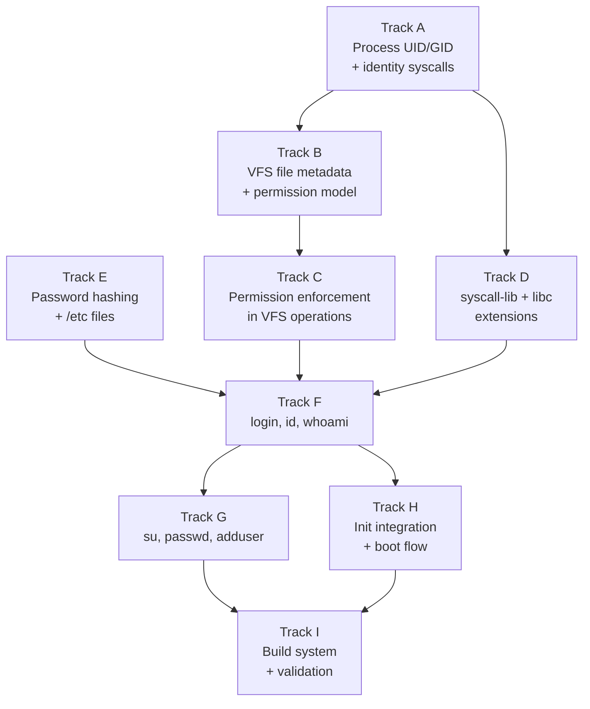

# Phase 27 — User Accounts and Login: Task List

**Depends on:** Phase 12 (POSIX Compat) ✅, Phase 13 (Writable FS) ✅, Phase 14 (Shell and Tools) ✅, Phase 24 (Persistent Storage) ✅
**Goal:** The OS supports multiple user accounts with login authentication, file
ownership, and permission enforcement. A `login` program prompts for username and
password before granting shell access.

## Prerequisite Analysis

Current state (post-Phase 26):
- Process struct (`kernel/src/process/mod.rs`) has pid, ppid, state, pgid, cwd,
  fd_table, signal handling, memory management — but NO uid/gid fields
- `getuid` (102), `getgid` (104), `geteuid` (107), `getegid` (108) syscalls
  exist as stubs returning hardcoded 0 (root)
- `setuid` (105), `setgid` (106) syscalls are NOT implemented
- `chown` (92), `chmod` (15), `fchown` (94), `fchmod` (91) syscalls are NOT
  implemented
- VFS inodes have NO per-file ownership (uid/gid) or permission mode storage
- `sys_linux_fstat` returns hardcoded modes: dirs=0o755, files=0o644, chardevs=0o620
- `sys_linux_open` ignores the mode argument entirely
- No permission checking anywhere in VFS operations (open, read, write, exec,
  unlink, mkdir, rmdir, rename)
- All processes run as root (uid=0) — single-user system
- Init spawns shell directly via fork+execve (`/bin/ion` or `/bin/sh0`)
- Persistent FAT32 filesystem on virtio-blk (Phase 24)
- Tmpfs mounted at `/tmp`
- Ramdisk for initrd-loaded binaries
- syscall-lib has file I/O, process, directory, signal, and socket wrappers
  but no uid/gid/permission wrappers
- C userspace programs (coreutils) use a minimal libc with syscall stubs

Already implemented (no new work needed):
- Process lifecycle: fork, exec, wait, exit with proper fd/signal inheritance
- File I/O syscalls: open, read, write, close, lseek, fstat
- Writable FAT32 filesystem with persistent storage
- Shell (ion/sh0) with argument parsing and environment variables
- Signal handling infrastructure
- C and Rust userspace build pipelines
- TTY subsystem with termios support
- Password input can use raw mode (Phase 26 termios support)

Needs to be added or extended:
- Process struct: `uid`, `gid`, `euid`, `egid` fields
- Kernel: `setuid`, `setgid` syscalls (real implementation)
- Kernel: `getuid`/`getgid`/`geteuid`/`getegid` — read from process struct
  instead of returning hardcoded 0
- Kernel: `chown`, `fchown`, `chmod`, `fchmod` syscalls
- VFS: per-file metadata (owner uid, owner gid, permission mode) in all
  filesystem backends (ramdisk, tmpfs, FAT32)
- VFS: permission enforcement in open, exec, unlink, mkdir, rmdir, rename
- `sys_linux_fstat`: return real uid/gid/mode from file metadata
- `sys_linux_open`: respect mode argument for file creation
- syscall-lib: wrappers for all new syscalls
- C libc: stubs for new syscalls
- Userspace programs: login, su, passwd, id, whoami, adduser
- Configuration files: /etc/passwd, /etc/shadow, /etc/group
- SHA-256 password hashing (minimal C or Rust implementation)

## Track Layout

| Track | Scope | Dependencies | Status |
|---|---|---|---|
| A | Process UID/GID and identity syscalls | — | Done |
| B | VFS file metadata and permission model | A | Done |
| C | Permission enforcement in VFS operations | B | Done |
| D | syscall-lib and libc extensions | A | Done |
| E | Password hashing and /etc files | — | Done |
| F | Userspace programs (login, id, whoami) | C, D, E | Done |
| G | Userspace programs (su, passwd, adduser) | F | Done |
| H | Init integration and boot flow | F | Done |
| I | Build system and validation | G, H | Done |

### Implementation Notes

- **UID/GID model**: Classic Unix — real and effective IDs per process. UID 0
  is root and bypasses all permission checks (superuser).
- **Permission model**: Standard Unix rwxrwxrwx (9-bit mode) with user/group/other
  classes. No ACLs or capabilities in this phase.
- **Password storage**: `/etc/shadow` with SHA-256 hashed passwords. Never store
  plaintext. A minimal SHA-256 implementation (standalone C or Rust) avoids
  external dependencies.
- **VFS metadata trait (ext2-ready)**: The `FileMetadata` abstraction in Track B
  must be a filesystem-agnostic trait so that Phase 28 (ext2) can return native
  inode metadata directly. The trait should cover uid, gid, mode, size, and
  timestamps. Each filesystem backend implements this trait — ext2 will store
  metadata natively in inodes, while FAT32 uses a permissions index file.
- **FAT32 permissions index file**: FAT32 has no native support for Unix
  permissions or ownership. Store a `.m3os_permissions` index file on the FAT32
  partition that maps `path → uid:gid:mode`. Read it into a `BTreeMap` on mount,
  write it back on chmod/chown/file creation. Files default to uid=0, gid=0,
  mode=0o644 (files) or 0o755 (dirs) if not in the index. This gives persistent
  permissions across reboots until Phase 28 (ext2) replaces FAT32 entirely.
- **Tmpfs and ramdisk**: These already exist in memory — add uid/gid/mode fields
  directly to their node structures.
- **ext2 forward-compatibility**: All permission checks in Track C must go through
  the VFS metadata trait, never directly access FAT32/tmpfs/ramdisk internals.
  This ensures ext2 (Phase 28) can be added as a new backend without touching
  permission enforcement code.
- **Login flow**: init spawns `/bin/login` instead of shell. `login` reads
  `/etc/passwd`, prompts for username/password, verifies against `/etc/shadow`,
  then calls `setuid`/`setgid` and `execve` to spawn the user's shell.

---

## Track A — Process UID/GID and Identity Syscalls

Add user/group identity to the process model and implement the POSIX identity
syscalls.

| Task | Description |
|---|---|
| P27-T001 | Add `uid: u32`, `gid: u32`, `euid: u32`, `egid: u32` fields to the `Process` struct in `kernel/src/process/mod.rs`. Initialize all to 0 (root) in `Process::new()` and `Process::new_kernel()`. Copy all four fields from parent to child in `sys_fork()`. |
| P27-T002 | Update `sys_linux_getuid` (syscall 102) to return the current process's `uid` field instead of hardcoded 0. Similarly update `sys_linux_getgid` (104), `sys_linux_geteuid` (107), `sys_linux_getegid` (108) to return the real fields. |
| P27-T003 | Implement `sys_linux_setuid` (syscall 105): if caller's euid is 0, set both uid and euid to the argument; if caller's euid is non-zero, only allow setting euid to the caller's real uid. Return 0 on success, -EPERM on failure. |
| P27-T004 | Implement `sys_linux_setgid` (syscall 106): same logic as setuid but for gid/egid fields. |
| P27-T005 | Implement `sys_linux_setreuid` (syscall 113) and `sys_linux_setregid` (syscall 114) for fine-grained real/effective ID control. `setreuid(ruid, euid)`: if ruid != -1, set real uid (only if euid==0 or ruid matches current real/effective uid); if euid != -1, set effective uid (only if euid==0 or value matches current real/saved uid). Similar for setregid. |
| P27-T006 | Verify UID/GID inheritance: after fork, child process must have the same uid/gid/euid/egid as the parent. After execve, uid/gid are preserved (no setuid-bit support yet). Write a kernel-core unit test for the process creation logic if feasible, otherwise validate via acceptance tests in Track I. |

## Track B — VFS File Metadata and Permission Model

Add ownership and permission metadata to VFS file entries across all filesystem
backends.

| Task | Description |
|---|---|
| P27-T007 | Define a `FileMetadata` struct and a `VfsMetadata` trait in the VFS layer: `uid: u32`, `gid: u32`, `mode: u16` (Unix permission bits including file type), `size: u64`, `mtime: u64`. The trait provides `fn metadata(&self, path) -> FileMetadata` and `fn set_metadata(&mut self, path, meta)`. Each filesystem backend (ramdisk, tmpfs, FAT32, and future ext2) implements this trait. Permission enforcement in Track C calls only the trait methods, never backend-specific code. |
| P27-T008 | Extend **ramdisk** nodes (`kernel/src/fs/ramdisk.rs`): add `uid`, `gid`, `mode` fields to `RamdiskNode::File` and `RamdiskNode::Dir` variants. Default to uid=0, gid=0, mode=0o644 (files) or 0o755 (dirs). Populate these when creating new nodes. |
| P27-T009 | Extend **tmpfs** nodes (`kernel/src/fs/tmpfs.rs`): add `uid`, `gid`, `mode` fields to tmpfs file/directory entries. Default to uid=0, gid=0, mode=0o644/0o755. |
| P27-T010 | Handle **FAT32** metadata (`kernel/src/fs/fat32.rs`): since FAT32 has no native Unix permission support, implement a permissions index file. On mount, read `.m3os_permissions` from the FAT32 root into a `BTreeMap<String, FileMetadata>` keyed by path. Default all FAT32 files to uid=0, gid=0, mode=0o644 (files) or 0o755 (dirs) if not in the index. Chown/chmod updates modify the in-memory map AND write the updated index back to `.m3os_permissions` on disk. Format: one line per file, `path:uid:gid:mode` (text, easy to debug). |
| P27-T011 | Update `sys_linux_fstat` to return real `st_uid`, `st_gid`, and `st_mode` from the file's metadata instead of hardcoded values. The stat struct layout must match Linux x86_64: `st_mode` at offset 24, `st_uid` at offset 28, `st_gid` at offset 32. |
| P27-T012 | Update `sys_linux_open` to store the mode argument (arg2) when creating new files (`O_CREAT`). The mode should be applied to the newly created file's metadata. If no mode is specified, default to 0o644. |
| P27-T013 | Implement `sys_linux_chmod` (syscall 90): resolve the path, verify the caller is the file owner or root (euid==0), then update the file's permission mode. Return 0 on success, -EPERM if not authorized, -ENOENT if not found. |
| P27-T014 | Implement `sys_linux_fchmod` (syscall 91): same as chmod but operates on an open file descriptor instead of a path. |
| P27-T015 | Implement `sys_linux_chown` (syscall 92): resolve the path, verify the caller is root (only root can chown in our model), then update the file's uid and gid. Return 0 on success, -EPERM if not root. |
| P27-T016 | Implement `sys_linux_fchown` (syscall 93): same as chown but operates on an open file descriptor. |

## Track C — Permission Enforcement in VFS Operations

Add permission checks to all VFS operations that access or modify files.

| Task | Description |
|---|---|
| P27-T017 | Implement a `check_permission(metadata: &FileMetadata, caller_uid: u32, caller_gid: u32, required: u8) -> bool` helper in the VFS layer. `required` is a bitmask: 4=read, 2=write, 1=execute. If caller_uid==0, always return true (root bypass). Otherwise check user/group/other permission bits against the caller's uid/gid. |
| P27-T018 | Add read permission check to `sys_linux_open`: when opening a file for reading (`O_RDONLY` or `O_RDWR`), call `check_permission` with required=4. Return -EACCES if denied. |
| P27-T019 | Add write permission check to `sys_linux_open`: when opening for writing (`O_WRONLY` or `O_RDWR` or `O_APPEND`), check required=2. Return -EACCES if denied. |
| P27-T020 | Add execute permission check to `sys_linux_execve`: before loading the ELF binary, verify the file has execute permission (required=1) for the caller. Return -EACCES if denied. |
| P27-T021 | Add write permission check to directory-modifying operations: `sys_linux_unlink`, `sys_linux_mkdir`, `sys_linux_rmdir`, `sys_linux_rename` — verify write permission on the parent directory. Return -EACCES if denied. |
| P27-T022 | Add permission check to `sys_linux_chdir`: verify execute (search) permission on the target directory (required=1). |
| P27-T023 | Ensure root (euid==0) bypasses ALL permission checks. Verify with a test: root can read/write/exec any file regardless of mode bits. |

## Track D — syscall-lib and libc Extensions

Add userspace wrappers for the new syscalls so C and Rust programs can use them.

| Task | Description |
|---|---|
| P27-T024 | Add syscall number constants to `userspace/syscall-lib/src/lib.rs`: `SYS_CHMOD` (90), `SYS_FCHMOD` (91), `SYS_CHOWN` (92), `SYS_FCHOWN` (93), `SYS_SETUID` (105), `SYS_SETGID` (106), `SYS_SETREUID` (113), `SYS_SETREGID` (114). |
| P27-T025 | Add Rust wrapper functions to `syscall-lib`: `chmod(path, mode)`, `chown(path, uid, gid)`, `setuid(uid)`, `setgid(gid)`, `getuid()`, `getgid()`, `geteuid()`, `getegid()`. Each wraps the appropriate `syscallN` call. |
| P27-T026 | Add C libc stubs for the new syscalls in the coreutils libc (`userspace/coreutils/libc/`): `getuid()`, `getgid()`, `geteuid()`, `getegid()`, `setuid()`, `setgid()`, `chmod()`, `chown()`. Each uses inline assembly for the `syscall` instruction with the correct register ABI. |
| P27-T027 | Add `struct stat` fields for `st_uid` and `st_gid` to the C libc stat definition if not already present, ensuring the layout matches the kernel's stat output. |

## Track E — Password Hashing and Configuration Files

Implement SHA-256 hashing and create the initial user account configuration.

| Task | Description |
|---|---|
| P27-T028 | Implement a minimal SHA-256 function usable from both C and Rust userspace. Options: (a) a standalone `sha256.c` in coreutils libc, (b) a Rust module in syscall-lib behind a feature flag, or (c) a shared `userspace/crypto/` crate/library. The function takes a byte slice and returns a 32-byte hash. No external crate dependencies. |
| P27-T029 | Implement password hashing: `hash_password(password: &[u8], salt: &[u8]) -> [u8; 32]` that concatenates salt + password and runs SHA-256. Output format for `/etc/shadow`: `$sha256$<hex_salt>$<hex_hash>`. |
| P27-T030 | Implement `verify_password(password: &[u8], shadow_entry: &str) -> bool` that parses the `$sha256$salt$hash` format, recomputes the hash, and compares. Use constant-time comparison to prevent timing attacks. |
| P27-T031 | Create the initial `/etc/passwd` file content for the disk image: `root:x:0:0:root:/root:/bin/ion` and `user:x:1000:1000:user:/home/user:/bin/ion`. Format: `username:x:uid:gid:gecos:home:shell`. |
| P27-T032 | Create the initial `/etc/shadow` file content: `root:$sha256$<salt>$<hash>:::::` and `user:$sha256$<salt>$<hash>:::::`. Default passwords: `root` for root, `user` for user. This file must only be readable by root (mode 0o600). |
| P27-T033 | Create the initial `/etc/group` file content: `root:x:0:root` and `user:x:1000:user`. |
| P27-T034 | Add these configuration files to the disk image build in xtask. They should be written to the FAT32 filesystem image during `cargo xtask image`. Create an `/etc/` directory on the image if it does not exist. |

## Track F — Core Userspace Programs (login, id, whoami)

Build the essential user-facing programs for authentication and identity.

| Task | Description |
|---|---|
| P27-T035 | Create `userspace/login/` — a Rust no_std binary. Behavior: (1) print `login: ` prompt, (2) read username from stdin (canonical mode), (3) print `password: ` prompt with echo disabled (switch to raw mode or use a no-echo termios flag), (4) read password, (5) parse `/etc/passwd` to find the user entry, (6) read `/etc/shadow` and verify password hash, (7) on success: call `setgid(gid)`, `setuid(uid)`, set `HOME` and `USER` env vars, `execve(shell)`, (8) on failure: print "Login incorrect", loop back to step 1. |
| P27-T036 | Implement `/etc/passwd` parsing in the login program: open the file, read line by line, split on `:`, match username, extract uid, gid, home, and shell fields. Handle malformed lines gracefully (skip them). |
| P27-T037 | Implement password verification in login: open `/etc/shadow`, find the matching username entry, extract the hash field, call `verify_password()`. If `/etc/shadow` is unreadable (permission denied for non-root), login must run as root (uid 0) to read it. |
| P27-T038 | Create `userspace/id/` — a C program (add to coreutils or standalone). Print `uid=<uid>(<username>) gid=<gid>(<groupname>)`. Calls `getuid()` and `getgid()`, then looks up names from `/etc/passwd` and `/etc/group`. If no name found, just print the numeric IDs. |
| P27-T039 | Create `userspace/whoami/` — a C program (add to coreutils or standalone). Print the username of the current effective user. Calls `geteuid()`, looks up the name in `/etc/passwd`. If not found, print the numeric UID. |

## Track G — Additional Userspace Programs (su, passwd, adduser)

Build programs for switching users and managing accounts.

| Task | Description |
|---|---|
| P27-T040 | Create `userspace/su/` — a Rust no_std binary. Behavior: `su <username>` (default: root). Prompt for the target user's password, verify against `/etc/shadow`. On success: `setgid(target_gid)`, `setuid(target_uid)`, `execve(target_shell)`. On failure: print "su: Authentication failure". `su` must run as root or be invoked by root to call `setuid` to a different user. |
| P27-T041 | Create `userspace/passwd/` — a Rust no_std binary. Behavior: (1) if non-root, prompt for current password and verify, (2) prompt for new password twice (confirm), (3) hash the new password with a fresh random salt, (4) update the user's entry in `/etc/shadow`. Root can change any user's password: `passwd <username>`. Non-root can only change their own. |
| P27-T042 | Implement `/etc/shadow` update in passwd: read the file, find the line for the target user, replace the hash field, write the file back. File locking is not needed in Phase 27 (single-user at a time). |
| P27-T043 | Create `userspace/adduser/` — a Rust no_std binary (root only). Behavior: `adduser <username>`. Prompts for password, assigns next available UID (scan `/etc/passwd` for max UID + 1), creates entries in `/etc/passwd`, `/etc/shadow`, `/etc/group`. Creates home directory at `/home/<username>` owned by the new user. |
| P27-T044 | For the random salt in passwd/adduser: since m3OS likely has no `/dev/urandom` yet, use a simple PRNG seeded from the TSC (timestamp counter via `rdtsc`) or a fixed development salt. A proper entropy source is deferred. |

## Track H — Init Integration and Boot Flow

Modify the boot sequence so users must log in before accessing the shell.

| Task | Description |
|---|---|
| P27-T045 | Modify `userspace/init/src/main.rs`: instead of spawning `/bin/ion` directly, fork and exec `/bin/login`. The login program handles authentication and then exec's the user's shell. |
| P27-T046 | Ensure init respawns login when the shell exits: when the child (login → shell) process terminates, init should fork and exec `/bin/login` again to present a new login prompt. This gives the same behavior as a traditional Unix getty/login cycle. |
| P27-T047 | Set initial file permissions on boot: the kernel or init should ensure `/etc/shadow` is mode 0o600 (root-only readable). Other `/etc/` files should be 0o644 (world-readable). `/bin/*` should be 0o755 (world-executable). This can be done by init calling `chmod` on known paths at startup, or by the kernel setting defaults when mounting the filesystem. |
| P27-T048 | Ensure the root home directory `/root` exists and the user home directory `/home/user` exists on the filesystem. Init or the disk image build should create these. Set ownership appropriately (root:root for /root, 1000:1000 for /home/user). |

## Track I — Build System, Validation, and Documentation

| Task | Description |
|---|---|
| P27-T049 | Add `login` to the xtask build: extend `build_userspace_bins()` to compile and include `login` in the initrd as `/bin/login`. Follow the same pattern as init, sh0, edit. |
| P27-T050 | Add `su`, `passwd`, `adduser` to the xtask build. If `id` and `whoami` are added to coreutils, ensure they are included in the coreutils build. Otherwise add them as standalone binaries in the initrd. |
| P27-T051 | Add the SHA-256 implementation to the build. If it's a shared library, ensure both C and Rust userspace programs can link against it. |
| P27-T052 | Acceptance: boot reaches a `login:` prompt instead of an immediate shell. |
| P27-T053 | Acceptance: entering `root` / `root` credentials drops into a root shell. `id` shows `uid=0(root) gid=0(root)`. |
| P27-T054 | Acceptance: entering wrong credentials prints "Login incorrect" and re-prompts. |
| P27-T055 | Acceptance: entering `user` / `user` credentials drops into a user shell. `id` shows `uid=1000(user) gid=1000(user)`. |
| P27-T056 | Acceptance: files created by `user` are owned by UID 1000 (verify with `ls -l` if available, or fstat from a test program). |
| P27-T057 | Acceptance: `user` cannot read `/etc/shadow` (gets "Permission denied"). |
| P27-T058 | Acceptance: `user` cannot delete files owned by root in `/bin/` (gets "Permission denied"). |
| P27-T059 | Acceptance: `su root` from user account prompts for root's password and grants a root shell on correct entry. |
| P27-T060 | Acceptance: `passwd` changes the current user's password; the new password works on next login. |
| P27-T061 | Acceptance: `whoami` prints the correct username for the logged-in user. |
| P27-T062 | Acceptance: `adduser testuser` (as root) creates a new account; logging out and logging in as `testuser` works. |
| P27-T063 | Acceptance: `cargo xtask check` passes (clippy + fmt) with all new code. |
| P27-T064 | Acceptance: QEMU boot validation — full login cycle works without panics or regressions. Test with both `cargo xtask run` and `cargo xtask run-gui`. |
| P27-T065 | Write `docs/27-user-accounts.md` (design doc): kernel UID/GID model, VFS permission enforcement architecture, password hashing scheme, login flow diagram, FAT32 metadata overlay design, and how this foundation enables Phase 30 (Telnet) and Phase 42 (SSH). |

---

## Follow-Up: Phase 28 — ext2 Filesystem

Phase 27's FAT32 permissions index file is a functional workaround, but FAT32
was never designed for Unix metadata. **Phase 28** adds an ext2 filesystem
implementation that stores uid/gid/mode/timestamps natively in inodes, replacing
FAT32 as the primary persistent filesystem.

See [Phase 28 — ext2 Filesystem](../28-ext2-filesystem.md) for full scope.

Phase 27's `VfsMetadata` trait is specifically designed so that ext2 can implement
it natively without any changes to the permission enforcement code in Track C.

---

## Deferred Until Later

These items are explicitly out of scope for Phase 27:

- **ext2 filesystem** — deferred to Phase 28 (see above)
- PAM (Pluggable Authentication Modules)
- NSS (Name Service Switch) for external user databases
- Supplementary groups (user in multiple groups)
- Setuid/setgid binaries (the setuid bit on executables)
- Linux capabilities (fine-grained privilege splitting)
- SELinux / AppArmor / mandatory access control
- Home directory auto-creation on first login (adduser creates it explicitly)
- User quotas (disk space limits per user)
- Account lockout after failed login attempts
- `/dev/urandom` or proper entropy source (use TSC-based PRNG for salt)
- ACLs (Access Control Lists) beyond rwxrwxrwx
- Persistent FAT32 permission metadata beyond the index file (ext2 in Phase 28
  provides the real solution)
- Password aging and expiration fields in /etc/shadow
- `umask` syscall and per-process file creation mask
- `sudo` (deferred — su is sufficient for Phase 27)
- `/etc/securetty` or login restrictions
- utmp/wtmp login accounting

---

## Dependency Graph

## Parallelization Strategy

**Wave 1:** Tracks A and E in parallel:
- A: Add UID/GID fields to process struct and implement identity syscalls.
  This is the kernel foundation everything else depends on.
- E: Implement SHA-256 and create /etc config files. This is independent of
  kernel changes and can proceed concurrently.

**Wave 2 (after A):** Tracks B and D in parallel:
- B: Add file metadata to VFS backends (ramdisk, tmpfs, FAT32 overlay).
- D: Add syscall wrappers to syscall-lib and C libc.

**Wave 3 (after B):** Track C — permission enforcement in VFS operations.
Must come after B because it reads metadata that B adds.

**Wave 4 (after C + D + E):** Tracks F and H can begin in parallel:
- F: Build login, id, whoami programs (needs syscall wrappers + permission
  enforcement + password hashing).
- H: Modify init to spawn login (can start once login binary exists).

**Wave 5 (after F):** Track G — su, passwd, adduser. These depend on a
working login flow to test against.

**Wave 6:** Track I — validation and documentation after all features
are integrated.
