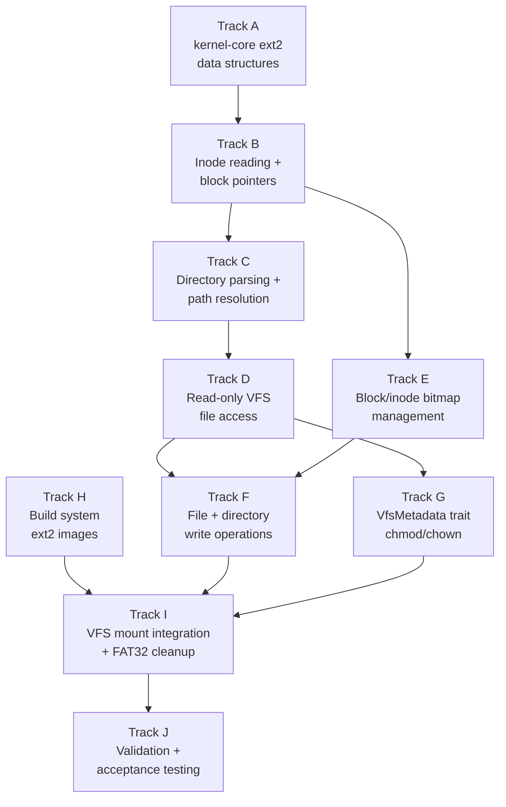

# Phase 28 — ext2 Filesystem: Task List

**Depends on:** Phase 24 (Persistent Storage) ✅, Phase 27 (User Accounts) ✅
**Goal:** Replace FAT32 as the primary persistent filesystem with ext2, providing
native Unix ownership (uid/gid), permission modes, and timestamps in every inode.
File permissions survive reboots without the FAT32 `.m3os_permissions` workaround.

## Prerequisite Analysis

Current state (post-Phase 27):
- FAT32 volume driver in `kernel/src/fs/fat32.rs` with full read/write support
- `.m3os_permissions` index file overlay for Unix metadata on FAT32
- `VfsMetadata` trait defined in VFS layer — designed for ext2 forward-compatibility
- `check_permission()` helper in VFS uses only the trait, not backend internals
- Block device abstraction: `crate::blk::read_sectors()` / `write_sectors()`
  via virtio-blk driver
- MBR partition parsing in `kernel-core/src/fs/mbr.rs` — currently only finds
  FAT32 partitions (type 0x0B / 0x0C)
- xtask builds a 64 MB FAT32 disk image with MBR partition table
- Filesystem IPC protocol (`kernel/src/fs/protocol.rs`): FILE_OPEN, FILE_READ,
  FILE_WRITE, FILE_CLOSE, FILE_LIST — filesystem-agnostic
- VFS routing in `kernel/src/fs/vfs.rs` — skeletal, forwards to FAT32 backend
- Tmpfs at `/tmp`, ramdisk for initrd binaries, FAT32 at `/data`
- `/etc/passwd`, `/etc/shadow`, `/etc/group` on FAT32 with permissions overlay

Already implemented (no new work needed):
- VfsMetadata trait and permission enforcement (Phase 27 Track B/C)
- Block device I/O (virtio-blk driver, sector read/write)
- MBR partition table layout (just needs ext2 type recognition)
- IPC protocol for filesystem operations
- All userspace programs (login, su, passwd, adduser, coreutils)
- Process UID/GID model and identity syscalls

Needs to be added or extended:
- `kernel-core/src/fs/ext2.rs`: on-disk structure definitions (superblock,
  block group descriptor, inode, directory entry) with host-testable parsing
- `kernel/src/fs/ext2.rs`: ext2 volume driver (mount, read, write, directory ops)
- MBR partition discovery: recognize type 0x83 (Linux/ext2)
- VFS routing: mount ext2 at `/data` instead of FAT32
- Implement `VfsMetadata` for ext2 — return native inode metadata directly
- xtask: create ext2 disk images with `mkfs.ext2` instead of `mkfs.fat`
- Remove FAT32 permissions overlay code (`.m3os_permissions`)

## Track Layout

| Track | Scope | Dependencies | Status |
|---|---|---|---|
| A | kernel-core ext2 data structures and parsing | — | ✅ Done |
| B | Inode reading and block pointer traversal | A | ✅ Done |
| C | Directory entry parsing and path resolution | B | ✅ Done |
| D | Read-only file access through VFS | C | ✅ Done |
| E | Block/inode bitmap management and allocation | B | ✅ Done |
| F | File and directory write operations | D, E | ✅ Done |
| G | VfsMetadata trait implementation (chmod/chown) | D | ✅ Done |
| H | Build system: ext2 image creation | — | ✅ Done |
| I | VFS mount integration and FAT32 removal | F, G, H | ✅ Done (FAT32 overlay kept as fallback) |
| J | Validation and acceptance testing | I | ✅ Done |

### Implementation Notes

- **ext2 revision 0**: We implement the original ext2 specification. No journal
  (ext3), no extents (ext4), no extended attributes. This is sufficient for a
  toy OS and keeps the implementation tractable.
- **Block size**: 4096 bytes (4K). This is the most common ext2 block size and
  simplifies alignment with page size. Configurable at format time via `mkfs.ext2 -b 4096`.
- **Block pointers**: Support direct blocks (0–11), single-indirect (12), and
  double-indirect (13). This handles files up to ~64 MB with 4K blocks. Triple-
  indirect is deferred.
- **Directory format**: Linked-list directory entries (original ext2 format).
  No htree indexing — linear scan is fine for our directory sizes.
- **Bitmap management**: Keep block and inode bitmaps in memory for the active
  block group(s). Write back on allocation/deallocation and on sync/unmount.
- **Superblock writeback**: Update free block/inode counts in the superblock
  on every allocation/deallocation. Flush to disk on sync or unmount.
- **No crash recovery**: ext2 has no journal. An unclean shutdown may leave the
  filesystem inconsistent. This is acceptable for a toy OS — real systems use
  ext3/ext4 with journaling.
- **Single block group initially**: For a 64 MB partition with 4K blocks, there
  are ~16K blocks. With the default 8192 blocks per group, this yields 2 block
  groups. The implementation must handle multiple block groups but can optimize
  for the common case.

---

## Track A — kernel-core ext2 Data Structures and Parsing

Define ext2 on-disk structures in `kernel-core` so they are host-testable.

| Task | Description |
|---|---|
| P28-T001 | Create `kernel-core/src/fs/ext2.rs` and add it to `kernel-core/src/fs/mod.rs`. Define the `Ext2Superblock` struct matching the on-disk layout: `inodes_count`, `blocks_count`, `free_blocks_count`, `free_inodes_count`, `first_data_block`, `log_block_size` (block size = 1024 << log_block_size), `blocks_per_group`, `inodes_per_group`, `magic` (0xEF53), `state`, `rev_level`, `first_ino`, `inode_size`, etc. Total size: 1024 bytes at byte offset 1024 on disk. |
| P28-T002 | Define `Ext2BlockGroupDescriptor` struct (32 bytes): `block_bitmap`, `inode_bitmap`, `inode_table`, `free_blocks_count`, `free_inodes_count`, `used_dirs_count`, plus reserved padding. The block group descriptor table starts at the block immediately after the superblock (block 1 for 1K blocks, or byte offset 2048 for 4K blocks since superblock is at offset 1024 within block 0). |
| P28-T003 | Define `Ext2Inode` struct matching the on-disk layout (default 128 bytes for rev 0): `mode` (u16 — file type + permissions), `uid` (u16), `size` (u32, low 32 bits), `atime`, `ctime`, `mtime`, `dtime` (u32 timestamps), `gid` (u16), `links_count` (u16), `blocks` (u32 — count of 512-byte blocks), `flags` (u32), `block` ([u32; 15] — 12 direct + 1 indirect + 1 double-indirect + 1 triple-indirect). |
| P28-T004 | Define `Ext2DirEntry` struct: `inode` (u32), `rec_len` (u16 — total size of this entry including padding), `name_len` (u8), `file_type` (u8 — 1=regular, 2=directory, etc.), `name` (variable-length, up to 255 bytes). Implement parsing from a byte slice with proper alignment handling. |
| P28-T005 | Implement `Ext2Superblock::parse(bytes: &[u8]) -> Result<Ext2Superblock, Ext2Error>`: validate magic number (0xEF53), extract fields, compute derived values (block_size, block_group_count). Define `Ext2Error` enum with variants: `BadMagic`, `UnsupportedRevision`, `InvalidBlockSize`, `IoError`, `OutOfSpace`, `NotFound`, `NotDirectory`, `IsDirectory`, `CorruptedEntry`. |
| P28-T006 | Implement `Ext2BlockGroupDescriptor::parse(bytes: &[u8]) -> Result<Ext2BlockGroupDescriptor, Ext2Error>` and `parse_table(bytes: &[u8], count: u32) -> Result<Vec<Ext2BlockGroupDescriptor>, Ext2Error>` (use `alloc::vec::Vec` behind feature gate). |
| P28-T007 | Implement `Ext2Inode::parse(bytes: &[u8]) -> Result<Ext2Inode, Ext2Error>` and helper methods: `is_dir()`, `is_regular()`, `is_symlink()`, `permission_mode() -> u16` (lower 12 bits of mode), `file_type() -> u16` (upper 4 bits). |
| P28-T008 | Write host-side unit tests in `kernel-core` for all parsing functions: construct known-good byte arrays for superblock, block group descriptor, inode, and directory entry; verify parsing extracts correct field values. Test error cases: bad magic, truncated input, zero-length entries. Run with `cargo test -p kernel-core`. |

## Track B — Inode Reading and Block Pointer Traversal

Implement the core logic for reading inodes and following block pointers to
locate file data.

| Task | Description |
|---|---|
| P28-T009 | Implement `inode_block_group(inode_num: u32, inodes_per_group: u32) -> u32` and `inode_index_in_group(inode_num: u32, inodes_per_group: u32) -> u32` helper functions in kernel-core. Inode numbers are 1-based: inode N is in block group `(N - 1) / inodes_per_group`, at index `(N - 1) % inodes_per_group` within that group's inode table. Add unit tests. |
| P28-T010 | In the kernel ext2 driver (`kernel/src/fs/ext2.rs`), implement `read_inode(inode_num: u32) -> Result<Ext2Inode, Ext2Error>`: use the block group descriptor to find the inode table block, compute the byte offset within the table, read the appropriate sector(s) from disk via `crate::blk::read_sectors()`, parse the inode. |
| P28-T011 | Implement block pointer resolution for direct blocks: `read_data_block(inode: &Ext2Inode, logical_block: u32) -> Result<u32, Ext2Error>` — for logical blocks 0–11, return `inode.block[logical_block]`. A block number of 0 means a sparse (hole) block — return zeros. |
| P28-T012 | Implement single-indirect block pointer resolution: for logical block 12–(block_size/4 + 11), read the indirect block (inode.block[12]) from disk, index into it to find the data block number. Cache the indirect block in memory to avoid re-reading for sequential access. |
| P28-T013 | Implement double-indirect block pointer resolution: for logical blocks beyond single-indirect range, read the double-indirect block (inode.block[13]), then the appropriate indirect block, then the data block number. This handles files up to ~64 MB with 4K blocks. |
| P28-T014 | Implement `read_file_data(inode: &Ext2Inode, offset: u64, buf: &mut [u8]) -> Result<usize, Ext2Error>`: compute which logical blocks to read, resolve each through the block pointer hierarchy, read data blocks from disk, copy the relevant bytes into `buf`. Handle partial first/last blocks and EOF correctly. |

## Track C — Directory Entry Parsing and Path Resolution

Build directory traversal on top of inode reading.

| Task | Description |
|---|---|
| P28-T015 | Implement `read_directory_entries(inode: &Ext2Inode) -> Result<Vec<(String, u32, u8)>, Ext2Error>`: read all data blocks of a directory inode, parse the linked-list of `Ext2DirEntry` records. Each entry has variable size (`rec_len` includes padding to 4-byte alignment). Skip entries with `inode == 0` (deleted). Return list of (name, inode_number, file_type) tuples. |
| P28-T016 | Implement `lookup_in_directory(dir_inode: &Ext2Inode, name: &str) -> Result<u32, Ext2Error>`: scan directory entries for a matching name, return the inode number. Return `Ext2Error::NotFound` if not found. |
| P28-T017 | Implement `resolve_path(path: &str) -> Result<u32, Ext2Error>`: starting from the root inode (inode 2), split the path on `/`, and resolve each component by looking it up in the current directory. Handle absolute paths (leading `/`), `.` (current dir), and `..` (parent dir). Return the final inode number. |
| P28-T018 | Implement `stat_inode(inode_num: u32) -> Result<FileMetadata, Ext2Error>`: read the inode and return a `FileMetadata` struct populated from native ext2 fields — uid, gid, mode (permission bits), size, mtime. This is the ext2 implementation of the `VfsMetadata` trait. |

## Track D — Read-Only File Access Through VFS

Wire ext2 reading into the VFS layer so userspace can open and read ext2 files.

| Task | Description |
|---|---|
| P28-T019 | Define `Ext2Volume` struct in `kernel/src/fs/ext2.rs`: holds `base_lba` (partition start), parsed superblock, block group descriptor table, block size, and any cached state. Implement `Ext2Volume::mount(base_lba: u64) -> Result<Ext2Volume, Ext2Error>`: read superblock, validate, parse block group descriptors. |
| P28-T020 | Register ext2 as a VFS backend: add a global `EXT2_VOLUME: Mutex<Option<Ext2Volume>>` (same pattern as `FAT32_VOLUME`). On mount, initialize the volume and register it for path prefix routing (e.g., `/data`). |
| P28-T021 | Implement ext2 `open` operation: resolve the path via `resolve_path()`, read the inode, create a file descriptor entry with the inode number and current offset (0). Return the fd to userspace. |
| P28-T022 | Implement ext2 `read` operation: given an fd (with inode number + offset), call `read_file_data()` to read bytes from the file. Advance the offset. Return bytes read. |
| P28-T023 | Implement ext2 `close` operation: release the fd entry. |
| P28-T024 | Implement ext2 `list` (readdir) operation: read directory entries for a directory inode, return the list of names. Wire into the FILE_LIST IPC message handler. |
| P28-T025 | Implement ext2 `fstat` operation: call `stat_inode()` to populate the stat struct with real ext2 metadata (uid, gid, mode, size, mtime). Wire into the fstat syscall. |

## Track E — Block and Inode Bitmap Management

Implement allocation and freeing of blocks and inodes for write support.

| Task | Description |
|---|---|
| P28-T026 | Implement `read_block_bitmap(group: u32) -> Result<Vec<u8>, Ext2Error>`: read the block bitmap for a block group from disk. Each bit represents one block — 1 = used, 0 = free. For 4K blocks, the bitmap itself is one block (4096 bytes = 32768 bits = 32768 blocks per group, but typically 8192 blocks per group so only the first portion is meaningful). |
| P28-T027 | Implement `allocate_block(group: u32) -> Result<u32, Ext2Error>`: scan the block bitmap for a free bit, set it to 1, write the bitmap back to disk. Update the block group descriptor's `free_blocks_count` and the superblock's `free_blocks_count`. Return the absolute block number. Return `Ext2Error::OutOfSpace` if no free blocks. |
| P28-T028 | Implement `free_block(block_num: u32)`: compute the block group and bit index, clear the bit in the bitmap, write back, update free counts in descriptor and superblock. |
| P28-T029 | Implement `read_inode_bitmap(group: u32) -> Result<Vec<u8>, Ext2Error>`: read the inode bitmap for a block group. Similar to block bitmap but for inodes. |
| P28-T030 | Implement `allocate_inode(group: u32) -> Result<u32, Ext2Error>`: scan the inode bitmap for a free bit, set it, write back, update free inode counts. Return the absolute inode number (1-based). Try the specified group first, then scan other groups. |
| P28-T031 | Implement `free_inode(inode_num: u32)`: clear the inode bitmap bit, update free counts, write back. |
| P28-T032 | Implement `write_superblock()`: flush the in-memory superblock (with updated free counts) to disk at offset 1024. Also flush the block group descriptor table. Call this after every allocation/deallocation and on unmount. |

## Track F — File and Directory Write Operations

Implement creating, writing, and deleting files and directories on ext2.

| Task | Description |
|---|---|
| P28-T033 | Implement `write_inode(inode_num: u32, inode: &Ext2Inode)`: compute the location in the inode table, serialize the inode to bytes, write the sector(s) to disk. |
| P28-T034 | Implement `allocate_data_block(inode: &mut Ext2Inode, logical_block: u32) -> Result<u32, Ext2Error>`: allocate a new block and assign it to the appropriate slot — direct block, indirect block, or double-indirect block. If the indirect or double-indirect block itself hasn't been allocated yet, allocate it first. |
| P28-T035 | Implement `write_file_data(inode: &mut Ext2Inode, offset: u64, data: &[u8]) -> Result<usize, Ext2Error>`: compute which logical blocks to write, allocate new blocks as needed via `allocate_data_block`, write data to the blocks. Update `inode.size` if writing past the current end. Write the updated inode to disk. |
| P28-T036 | Implement `add_directory_entry(dir_inode: &mut Ext2Inode, name: &str, child_inode: u32, file_type: u8) -> Result<(), Ext2Error>`: find space in the directory's data blocks for a new entry (reuse padding space in existing entries if possible, or allocate a new block). Write the entry. Update the directory inode size and write it back. |
| P28-T037 | Implement `create_file(parent_inode: u32, name: &str, mode: u16, uid: u32, gid: u32) -> Result<u32, Ext2Error>`: allocate a new inode, initialize its fields (mode with regular file type bits, uid, gid, timestamps, zero size, zero blocks), write the inode, add a directory entry in the parent. Return the new inode number. |
| P28-T038 | Implement `create_directory(parent_inode: u32, name: &str, mode: u16, uid: u32, gid: u32) -> Result<u32, Ext2Error>`: allocate a new inode with directory type, allocate one data block, create `.` and `..` entries in it. Add a directory entry in the parent. Update the parent's link count. Update `used_dirs_count` in the block group descriptor. |
| P28-T039 | Implement `truncate_file(inode: &mut Ext2Inode)`: free all data blocks (direct, indirect, double-indirect) allocated to the file. Free the indirect/double-indirect blocks themselves. Set size to 0 and blocks count to 0. Write the updated inode. |
| P28-T040 | Implement `remove_directory_entry(dir_inode: &mut Ext2Inode, name: &str) -> Result<(), Ext2Error>`: find the entry in the directory, set its `inode` field to 0, and merge its `rec_len` with the previous entry (standard ext2 deletion). Write the modified block back to disk. |
| P28-T041 | Implement `delete_file(parent_inode: u32, name: &str) -> Result<(), Ext2Error>`: look up the file inode, truncate it, free the inode, remove the directory entry. Decrement link count — only free the inode if link count reaches 0. |
| P28-T042 | Implement `delete_directory(parent_inode: u32, name: &str) -> Result<(), Ext2Error>`: verify the directory is empty (only `.` and `..`), then delete it. Decrement the parent's link count. Update `used_dirs_count`. |
| P28-T043 | Wire ext2 write operations into the VFS layer: implement the FILE_WRITE, FILE_CREATE, FILE_DELETE, FILE_MKDIR, FILE_RMDIR IPC message handlers for the ext2 backend. |

## Track G — VfsMetadata Trait Implementation (chmod/chown)

Implement native ext2 metadata operations — no overlay file needed.

| Task | Description |
|---|---|
| P28-T044 | Implement `VfsMetadata` trait for `Ext2Volume`: `metadata(path) -> FileMetadata` reads the inode and returns native uid, gid, mode, size, mtime. No `.m3os_permissions` file — ext2 stores this natively. |
| P28-T045 | Implement `set_metadata(path, meta)` for ext2: resolve the path to an inode, update the uid, gid, and mode fields in the inode, write the inode back to disk. This is used by `chmod` and `chown` syscalls. |
| P28-T046 | Implement `set_timestamps(path, mtime)` for ext2: update the mtime field in the inode when files are modified. Set mtime on write operations automatically. |
| P28-T047 | Verify that `sys_linux_fstat` returns correct ext2 metadata: uid, gid, mode, size, mtime should all come from the ext2 inode through the VfsMetadata trait, matching the Linux x86_64 stat struct layout. |

## Track H — Build System: ext2 Image Creation

Update xtask to create ext2 disk images instead of FAT32.

| Task | Description |
|---|---|
| P28-T048 | Modify xtask disk image creation: replace `mkfs.fat` with `mkfs.ext2` for the data partition. Use `mkfs.ext2 -b 4096 -L m3data` to create a 64 MB ext2 filesystem with 4K blocks. The host must have `e2fsprogs` installed (`mkfs.ext2`, `debugfs`). |
| P28-T049 | Update MBR partition type: change the partition type byte from 0x0B (FAT32) to 0x83 (Linux/ext2) in the MBR partition table written by xtask. |
| P28-T050 | Populate the ext2 image with initial files: `/etc/passwd`, `/etc/shadow`, `/etc/group` with correct content (same as Phase 27). Create `/root` (mode 0o700, uid=0), `/home/user` (mode 0o755, uid=1000, gid=1000). Use `debugfs -w` or mount the image via loopback to write files with correct ownership and permissions natively. |
| P28-T051 | Verify the ext2 image is valid: after creation, run `e2fsck -n` on the image as a build-time sanity check. The image should be mountable on the host with `mount -o loop` and inspectable with `ls -la` showing correct ownership/permissions. |

## Track I — VFS Mount Integration and FAT32 Cleanup

Switch the running kernel to mount ext2 instead of FAT32 and remove the
permissions overlay workaround.

| Task | Description |
|---|---|
| P28-T052 | Update `kernel-core/src/fs/mbr.rs`: add `find_ext2_partition()` or generalize `find_partition()` to accept a type byte parameter. Recognize partition type 0x83 as ext2. |
| P28-T053 | Update kernel boot sequence: during filesystem init, scan MBR for an ext2 partition (type 0x83), mount it as an `Ext2Volume`, and register it at `/data`. If no ext2 partition is found, fall back to FAT32 for backwards compatibility during development. |
| P28-T054 | Update VFS routing: ensure path-based routing sends `/data/*` requests to the ext2 backend instead of FAT32. The IPC protocol is unchanged — only the backend changes. |
| P28-T055 | Remove FAT32 permissions overlay code: delete the `.m3os_permissions` file handling from `kernel/src/fs/fat32.rs` — the `FAT32_PERMISSIONS` BTreeMap, `load_permissions_index()`, `save_permissions_index()`, and all related code. ext2 stores permissions natively. |
| P28-T056 | Update init (`userspace/init/src/main.rs`): remove any init-time chmod calls that were setting permissions on FAT32 files via the overlay. ext2 files have correct permissions from image creation. Retain any chmod calls that set permissions on tmpfs or ramdisk paths. |
| P28-T057 | Ensure all filesystem paths that were on FAT32 (`/data/etc/passwd`, etc.) work correctly with the ext2 backend. Verify path resolution, file creation, reading, writing, and deletion. |

## Track J — Validation and Acceptance Testing

| Task | Description |
|---|---|
| P28-T058 | Acceptance: boot mounts an ext2 partition at `/data`. Kernel log shows ext2 superblock parsed successfully with correct magic (0xEF53), block size, and inode count. |
| P28-T059 | Acceptance: `cat /etc/passwd` shows the user database. `cat /etc/shadow` as root shows password hashes. `cat /etc/shadow` as non-root returns "Permission denied". |
| P28-T060 | Acceptance: `ls -l` (or fstat) shows correct uid, gid, and permission mode from ext2 inodes — not from an overlay file. |
| P28-T061 | Acceptance: files created with `edit` or shell redirection are stored on ext2 and survive reboot. Verify by creating a file, rebooting (stop and restart QEMU), and reading the file back. |
| P28-T062 | Acceptance: `chmod 600 /etc/shadow` modifies the ext2 inode mode directly. The change persists across reboot. |
| P28-T063 | Acceptance: `chown user:user /home/user/testfile` modifies the ext2 inode uid/gid directly. The change persists across reboot. |
| P28-T064 | Acceptance: permission enforcement from Phase 27 works identically — non-root users cannot access files without appropriate permissions. All Phase 27 acceptance tests still pass. |
| P28-T065 | Acceptance: the ext2 disk image can be mounted and inspected on the host: `sudo mount -o loop,offset=<partition_offset> disk.img /mnt && ls -la /mnt/etc/` shows correct files with correct ownership and permissions. |
| P28-T066 | Acceptance: `cargo xtask check` passes (clippy + fmt) with all new code. |
| P28-T067 | Acceptance: `cargo test -p kernel-core` passes — all ext2 parsing unit tests pass on the host. |
| P28-T068 | Acceptance: QEMU boot validation — full login cycle, file operations, and permission enforcement work without panics or regressions. Test with both `cargo xtask run` and `cargo xtask run-gui`. |
| P28-T069 | Write `docs/28-ext2-filesystem.md` (design doc): ext2 on-disk layout, superblock/inode/directory entry formats, block pointer hierarchy, bitmap management, VFS integration, and how this replaces the FAT32 permissions overlay. |

---

## Deferred Until Later

These items are explicitly out of scope for Phase 28:

- **ext3/ext4 journaling** — crash recovery via write-ahead log
- **Triple-indirect block pointers** — only needed for files > 64 MB
- **Extended attributes (xattr)** — ACLs, SELinux labels, etc.
- **Directory hash tree indexing** (htree) — for large directories
- **Sparse superblock backups** — backup superblocks in select block groups
- **Block group locality heuristics** — allocate near parent directory
- **Online filesystem resize**
- **`e2fsck` / filesystem repair tool** — would require a userspace utility
- **Symbolic links** — stored in inode (short) or data blocks (long)
- **Hard link support beyond basic `links_count`** tracking
- **File timestamps beyond mtime** — atime/ctime update policies
- **Large file support** (>2 GB via `size_high` in rev 1 inodes)
- **File holes / sparse file optimization** — zero blocks returned as zeros
  but we don't optimize storage

---

## Dependency Graph

## Parallelization Strategy

**Wave 1:** Tracks A and H in parallel:
- A: Define ext2 on-disk structures and parsing in kernel-core. This is the
  data foundation everything else depends on.
- H: Update xtask to create ext2 disk images. This is independent of kernel
  code and can proceed concurrently.

**Wave 2 (after A):** Track B — inode reading and block pointer traversal.
This depends on the data structures from Track A.

**Wave 3 (after B):** Tracks C and E in parallel:
- C: Directory entry parsing and path resolution (read path).
- E: Block/inode bitmap management (allocation path).

**Wave 4 (after C):** Tracks D and G can begin:
- D: Read-only file access through VFS (needs path resolution).
- G: VfsMetadata trait implementation (needs inode reading + path resolution).

**Wave 5 (after D + E):** Track F — file and directory write operations.
Needs both the read path (D) and allocation (E).

**Wave 6 (after F + G + H):** Track I — VFS mount integration and FAT32
cleanup. All components must be ready before switching the live system.

**Wave 7:** Track J — validation and acceptance testing after full
integration.
