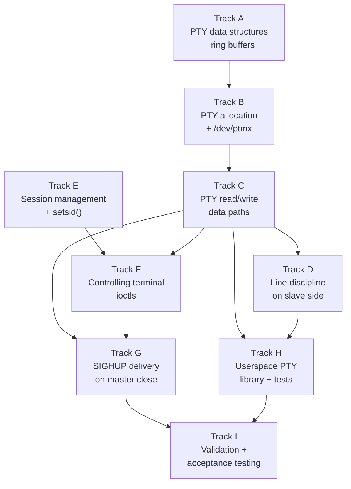

# Phase 29 — PTY Subsystem: Task List

**Depends on:** Phase 22 (TTY) ✅, Phase 19 (Signals) ✅, Phase 27 (User Accounts) ✅
**Goal:** Implement pseudo-terminal (PTY) pairs so that multiple independent terminal
sessions can run simultaneously. A PTY master/slave pair connects a terminal emulator
(or network server) to a shell process, enabling remote access (telnet, SSH) and local
terminal multiplexing.

## Prerequisite Analysis

Current state (post-Phase 28):
- Single console TTY (`TTY0`) as a global singleton in `kernel/src/tty.rs`
- Termios (60-byte Linux-compatible struct) with cooked/raw mode, echo, ISIG, ICANON
- EditBuffer (4 KiB) for canonical-mode line editing — push, erase, kill, word_erase
- Winsize (8 bytes) with default 24x80
- Foreground process group tracking (`fg_pgid` in TtyState, `FG_PGID` atomic)
- Signal delivery framework: SIGHUP, SIGINT, SIGTSTP, SIGWINCH all defined and working
- Process groups: `setpgid`, `getpgid`, `getpgrp` syscalls implemented
- File descriptor table (32 FDs per process) with `FdBackend` enum including
  `PtyMaster { pty_id }` and `PtySlave { pty_id }` variants (skeleton only)
- Pipe ring buffer (4 KiB, proven design in `kernel-core/src/pipe.rs`) — reusable
- ioctl framework: TCGETS/TCSETS, TIOCGPGRP/TIOCSPGRP, TIOCGWINSZ/TIOCSWINSZ,
  TIOCGPTN (stub), TIOCSPTLCK (stub), TIOCGRANTPT (stub)
- `alloc_pty()` function in `kernel/src/tty.rs` returns monotonic PTY IDs (skeleton)
- Stdin circular buffer in `kernel/src/stdin.rs` (4 KiB, console-only)

Already implemented (no new work needed):
- Termios data structures and flag definitions (kernel-core)
- EditBuffer operations with unit tests (kernel-core)
- Signal delivery (rt_sigframe, send_signal_to_group)
- Process group syscalls (setpgid, getpgid, getpgrp)
- ioctl dispatch framework and TIOC constants
- FdBackend::PtyMaster / PtySlave enum variants
- Pipe ring buffer implementation (kernel-core)
- dup2 syscall for FD redirection
- fork/exec/exit/wait process lifecycle

Needs to be added or extended:
- `kernel/src/pty.rs`: PTY pair table with bidirectional ring buffers,
  per-PTY termios, per-PTY edit buffers, per-PTY winsize
- `/dev/ptmx` device: open allocates a new PTY pair, returns master FD
- `/dev/pts/N` device: open returns slave FD for PTY number N
- PTY read/write data paths: master write → slave input, slave write → master output
- Line discipline processing on slave side (cooked mode, echo, signals)
- Session and process group: `setsid()` syscall, session_id field in Process,
  controlling terminal association
- TIOCSCTTY / TIOCNOTTY ioctls for controlling terminal management
- SIGHUP delivery to foreground process group when master FD closes
- Userspace `openpty()` wrapper in syscall-lib
- Test program demonstrating PTY pair functionality

## Track Layout

| Track | Scope | Dependencies | Status |
|---|---|---|---|
| A | PTY pair data structures and ring buffers | — | ✅ Done |
| B | PTY allocation and `/dev/ptmx` device | A | ✅ Done |
| C | PTY read/write data paths | B | ✅ Done |
| D | Line discipline integration on slave side | C | ✅ Done |
| E | Session management and setsid() | — | ✅ Done |
| F | Controlling terminal ioctls | C, E | ✅ Done |
| G | Signal delivery through PTY (SIGHUP) | C, F | ✅ Done |
| H | Userspace PTY library and test programs | C, D | ✅ Done |
| I | Validation and acceptance testing | All | ✅ Done |

### Implementation Notes

- **Fixed pool of 16 PTY pairs**: Sufficient for a toy OS. Array-based allocation
  avoids dynamic memory pressure. The acceptance criteria require at least 8
  simultaneous pairs.
- **Two ring buffers per PTY**: master-to-slave (m2s) and slave-to-master (s2m),
  each 4 KiB, reusing the proven `Pipe` ring buffer design from kernel-core.
- **Per-PTY termios and EditBuffer**: Each PTY slave has its own terminal settings
  and line-editing buffer, independent of the console TTY0. Defaults match TTY0
  (cooked mode, echo enabled).
- **Line discipline on slave side only**: The master side is raw — bytes pass through
  unprocessed. The slave side applies termios processing (canonical mode, echo,
  signal generation) just like the console.
- **Session model (minimal)**: Add `session_id` to Process struct. `setsid()` creates
  a new session (session_id = pid), detaches from controlling terminal.
  `TIOCSCTTY` on a PTY slave assigns it as the controlling terminal for the session.
  Full POSIX session semantics (orphaned process groups, etc.) are deferred.
- **SIGHUP on master close**: When the last master FD for a PTY is closed, deliver
  SIGHUP to the slave's foreground process group, then mark the PTY as disconnected.
  Subsequent reads on the slave return EOF.
- **No `/dev/tty` device**: The controlling terminal device node is deferred. Processes
  access their terminal through the inherited stdin/stdout/stderr FDs.

---

## Track A — PTY Pair Data Structures and Ring Buffers

Define the PTY pair table and per-pair state in kernel-core and kernel.

| Task | Description |
|---|---|
| P29-T001 | Create `kernel-core/src/pty.rs` and add it to `kernel-core/src/lib.rs`. Define `PtyRingBuffer` struct: `buf: [u8; 4096]`, `read_pos: usize`, `count: usize`. Implement `new()`, `read(dst: &mut [u8]) -> usize`, `write(src: &[u8]) -> usize`, `is_empty()`, `is_full()`, `available()` (bytes readable), `space()` (bytes writable). This mirrors the proven `Pipe` design but without reader/writer refcounts (PTY lifecycle is managed separately). |
| P29-T002 | Write host-side unit tests for `PtyRingBuffer` in kernel-core: verify read/write, wraparound, empty/full conditions, partial reads, partial writes, zero-length operations. Run with `cargo test -p kernel-core`. |
| P29-T003 | Define `PtyPairState` struct in `kernel-core/src/pty.rs`: `m2s: PtyRingBuffer` (master-to-slave buffer), `s2m: PtyRingBuffer` (slave-to-master buffer), `termios: Termios` (slave-side terminal settings, default cooked mode), `winsize: Winsize` (default 24x80), `edit_buf: EditBuffer` (slave-side line discipline buffer), `slave_fg_pgid: u32` (foreground process group on slave), `master_open: bool`, `slave_open: bool`, `locked: bool` (PTY lock, starts locked until `unlockpt`). |
| P29-T004 | Implement `PtyPairState::new(id: u32) -> PtyPairState`: initialize both ring buffers empty, termios to default cooked mode (matching TTY0 defaults), winsize to 24x80, edit_buf cleared, `master_open = true`, `slave_open = false`, `locked = true`. |
| P29-T005 | Create `kernel/src/pty.rs` and add `pub mod pty;` to `kernel/src/main.rs`. Define `pub const MAX_PTYS: usize = 16;` and `pub static PTY_TABLE: Mutex<[Option<PtyPairState>; MAX_PTYS]>`. Initialize all slots to `None`. |
| P29-T006 | Implement `pub fn alloc_pty() -> Result<u32, ()>` in `kernel/src/pty.rs`: scan `PTY_TABLE` for the first `None` slot, initialize it with `PtyPairState::new(index)`, return the index as the PTY ID. Return `Err(())` if all slots are occupied. Replace the existing skeleton `alloc_pty()` in `kernel/src/tty.rs` with a call to this implementation. |
| P29-T007 | Implement `pub fn free_pty(id: u32)` in `kernel/src/pty.rs`: set `PTY_TABLE[id]` to `None`. Only call this when both master and slave are closed and no processes hold references. |

## Track B — PTY Allocation and `/dev/ptmx` Device

Wire PTY allocation into the file descriptor and VFS layer.

| Task | Description |
|---|---|
| P29-T008 | Implement `/dev/ptmx` open handling: in the `sys_open` syscall handler (`kernel/src/arch/x86_64/syscall.rs`), detect when the path is `/dev/ptmx`. Call `alloc_pty()` to allocate a new PTY pair. Create an FD entry with `FdBackend::PtyMaster { pty_id }`, readable and writable. Return the master FD number. Return -ENOSPC if no PTY slots available. |
| P29-T009 | Implement `/dev/pts/N` open handling: in `sys_open`, detect paths matching `/dev/pts/<number>`. Parse the number as the PTY ID. Verify the PTY exists and is not locked (`locked == false`). Create an FD entry with `FdBackend::PtySlave { pty_id }`, readable and writable. Set `slave_open = true` in the PTY pair. Return the slave FD number. Return -ENOENT if PTY doesn't exist, -EIO if still locked. |
| P29-T010 | Implement `TIOCSPTLCK` ioctl for PtyMaster FDs: when called with arg=0, set `locked = false` (unlock the slave). When called with arg=1, set `locked = true` (lock the slave). This corresponds to the `unlockpt()` C library function. |
| P29-T011 | Implement `TIOCGPTN` ioctl for PtyMaster FDs: return the PTY number (index) associated with the master FD. This replaces the existing stub. Used by `ptsname()` to construct `/dev/pts/N`. |
| P29-T012 | Implement `TIOCGRANTPT` ioctl for PtyMaster FDs: set the slave device ownership to the current process's UID/GID. For now this is a no-op that returns success (permissions are not enforced on `/dev/pts/N` yet). This corresponds to the `grantpt()` C library function. |

## Track C — PTY Read/Write Data Paths

Implement the core I/O logic connecting master and slave through ring buffers.

| Task | Description |
|---|---|
| P29-T013 | Implement `sys_write` for `FdBackend::PtyMaster`: write bytes into the PTY's `m2s` (master-to-slave) ring buffer. If the slave side has a process blocked on read, wake it. Return the number of bytes written. If the slave is closed, return -EIO. |
| P29-T014 | Implement `sys_read` for `FdBackend::PtySlave`: read bytes from the PTY's `m2s` ring buffer. If the buffer is empty and the master is still open, block the process (set state to `Blocked` and reschedule). If the buffer is empty and the master is closed, return 0 (EOF). Return the number of bytes read. |
| P29-T015 | Implement `sys_write` for `FdBackend::PtySlave`: write bytes into the PTY's `s2m` (slave-to-master) ring buffer. If the master side has a process blocked on read, wake it. Return the number of bytes written. If the master is closed, return -EIO. |
| P29-T016 | Implement `sys_read` for `FdBackend::PtyMaster`: read bytes from the PTY's `s2m` ring buffer. If the buffer is empty and the slave is still open, block the process. If the buffer is empty and the slave is closed, return 0 (EOF). Return bytes read. |
| P29-T017 | Implement `sys_close` for `FdBackend::PtyMaster`: set `master_open = false` in the PTY pair. Wake any processes blocked on the slave side (they will see EOF). If the slave is also closed, call `free_pty(id)` to release the slot. |
| P29-T018 | Implement `sys_close` for `FdBackend::PtySlave`: set `slave_open = false` in the PTY pair. Wake any processes blocked on the master side (they will see EOF). If the master is also closed, call `free_pty(id)`. |
| P29-T019 | Handle FD inheritance across fork: when a process forks, copied FD entries referencing `PtyMaster` or `PtySlave` should not re-allocate the PTY — they share the same PTY pair. Ensure the reference model is correct: multiple FDs can point to the same PTY pair. Track this via open counts or by checking the PTY table directly. |
| P29-T020 | Handle FD inheritance across exec (cloexec): FDs with `cloexec = true` are closed during exec. When closing a PTY master/slave FD during exec, apply the same close logic as `sys_close` (update open state, wake blocked processes if needed). |

## Track D — Line Discipline Integration on Slave Side

Apply termios processing to data flowing through the PTY slave.

| Task | Description |
|---|---|
| P29-T021 | Implement input processing on the slave side: when bytes arrive in the `m2s` buffer (master writes to slave), apply the slave's termios `c_iflag` transformations: ICRNL (CR→NL), INLCR (NL→CR), IGNCR (ignore CR). This runs before data is delivered to a slave reader. |
| P29-T022 | Implement canonical mode (ICANON) for slave input: when `c_lflag & ICANON` is set, buffer incoming bytes in the PTY's `edit_buf` (line editing). Only make a complete line available for read when a line terminator is received (newline, VEOF, VEOL). Support backspace (VERASE), line kill (VKILL), and word erase (VWERASE) using the existing EditBuffer methods. |
| P29-T023 | Implement echo for slave input: when `c_lflag & ECHO` is set, echo input characters back through the `s2m` buffer (so they appear on the master side as output). Handle ECHOE (echo erase as backspace-space-backspace), ECHOK (echo kill as newline), ECHONL (echo newline even without ECHO). |
| P29-T024 | Implement signal generation (ISIG) for slave input: when `c_lflag & ISIG` is set and input matches a control character — VINTR (^C → SIGINT), VQUIT (^\ → SIGQUIT), VSUSP (^Z → SIGTSTP) — send the corresponding signal to the slave's foreground process group via `send_signal_to_group()`. Do not deliver the character to the reader. |
| P29-T025 | Implement output processing on the slave side: when the slave writes to `s2m`, apply `c_oflag` transformations: OPOST (enable output processing), ONLCR (NL→CR-NL). This ensures terminal output formatting works through PTYs. |
| P29-T026 | Implement raw mode for PTY: when ICANON is cleared, pass bytes through without line buffering. When ECHO is cleared, do not echo. When ISIG is cleared, do not generate signals. Verify that the text editor (`edit`) works through a PTY in raw mode with these settings. |

## Track E — Session Management and setsid()

Add minimal session tracking to the process model.

| Task | Description |
|---|---|
| P29-T027 | Add `session_id: u32` field to the `Process` struct in `kernel/src/process/mod.rs`. Initialize to the process's own PID for init (PID 1) and inherit from parent on fork. A session ID of 0 means "no session" (not used in practice since PID 1 sets it). |
| P29-T028 | Add `controlling_tty: Option<ControllingTty>` field to the `Process` struct. Define `pub enum ControllingTty { Console, Pty(u32) }`. Initialize to `Some(ControllingTty::Console)` for processes started from the console, `None` after `setsid()`. Inherit from parent on fork. |
| P29-T029 | Implement `sys_setsid()` syscall (Linux number 112): create a new session. The calling process becomes the session leader. Set `session_id = pid`, `controlling_tty = None`, `pgid = pid` (new process group). Return the new session ID. Fail with -EPERM if the caller is already a session leader (session_id == pid) or if any other process shares the caller's process group ID. |
| P29-T030 | Implement `sys_getsid(pid)` syscall (Linux number 124): return the session ID of the specified process. If `pid == 0`, return the session ID of the calling process. Return -ESRCH if the process doesn't exist. |
| P29-T031 | Add `openpty()` wrapper to `userspace/syscall-lib`: calls `open("/dev/ptmx")` to get the master FD, then `ioctl(master_fd, TIOCSPTLCK, 0)` to unlock, `ioctl(master_fd, TIOCGPTN, &pty_num)` to get the PTY number, constructs `/dev/pts/<N>` path, and `open()` the slave. Returns `(master_fd, slave_fd)`. |

## Track F — Controlling Terminal Ioctls

Implement ioctl commands for controlling terminal management.

| Task | Description |
|---|---|
| P29-T032 | Implement `TIOCSCTTY` ioctl (0x540E): set the controlling terminal. Only valid on a PTY slave FD. The calling process must be a session leader with no controlling terminal. Set `controlling_tty = Some(Pty(pty_id))` for the calling process and all processes in the same session. Return -EPERM if the caller is not a session leader or already has a controlling terminal. |
| P29-T033 | Implement `TIOCNOTTY` ioctl (0x5422): release the controlling terminal. Clear `controlling_tty` for the calling process. If the caller is the session leader, send SIGHUP + SIGCONT to the foreground process group of the terminal, then clear the controlling terminal for all processes in the session. |
| P29-T034 | Update `TIOCGPGRP` / `TIOCSPGRP` ioctls for PTY FDs: when called on a PtySlave FD, get/set the slave's foreground process group (`slave_fg_pgid` in PtyPairState) instead of the console TTY0's foreground group. When called on a PtyMaster FD, operate on the same PTY pair's `slave_fg_pgid`. |
| P29-T035 | Update `TIOCGWINSZ` / `TIOCSWINSZ` ioctls for PTY FDs: when called on a PtyMaster or PtySlave FD, get/set the PTY pair's `winsize` instead of TTY0's winsize. When the size changes via `TIOCSWINSZ` on the master, deliver SIGWINCH to the slave's foreground process group. |
| P29-T036 | Update `TCGETS` / `TCSETS` / `TCSETSW` / `TCSETSF` ioctls for PTY FDs: when called on a PtySlave FD, get/set the PTY pair's `termios` instead of TTY0's termios. When called on a PtyMaster FD, operate on the same PTY pair's termios. |

## Track G — Signal Delivery Through PTY (SIGHUP)

Implement terminal hangup signaling when a PTY master is closed.

| Task | Description |
|---|---|
| P29-T037 | On master close (Track C, P29-T017 enhancement): when the last FD referencing a PTY master is closed, deliver SIGHUP followed by SIGCONT to the slave's foreground process group (`slave_fg_pgid`). This notifies processes that their terminal has disconnected. Use `send_signal_to_group()`. |
| P29-T038 | On master close: mark the PTY as disconnected. Subsequent `sys_read` on the slave should return 0 (EOF) immediately without blocking. Subsequent `sys_write` on the slave should return -EIO. |
| P29-T039 | Handle SIGHUP propagation for session leader exit: when a session leader process exits, if it has a controlling PTY, deliver SIGHUP to the foreground process group of that PTY. This ensures all processes in the session are notified. |
| P29-T040 | Implement `TIOCNOTTY` hangup behavior (P29-T033 enhancement): when the session leader releases the controlling terminal via `TIOCNOTTY`, send SIGHUP + SIGCONT to the foreground process group before clearing the association. |

## Track H — Userspace PTY Library and Test Programs

Build userspace support and test programs to exercise PTY functionality.

| Task | Description |
|---|---|
| P29-T041 | Create `userspace/pty-test/` crate: a Rust `#![no_std]` binary (same pattern as `exit0`, `fork-test`). The program opens `/dev/ptmx`, unlocks the slave, opens `/dev/pts/N`, forks. The child calls `setsid()`, opens the slave as stdin/stdout/stderr via `dup2`, and execs `sh0`. The parent reads from the master and prints what the shell outputs. Verify that the shell prompt appears on the master side. |
| P29-T042 | Extend `pty-test` to send a command through the PTY: the parent writes `"echo hello\n"` to the master FD. Verify that `"hello\n"` appears on the master's read side (the shell's output). Then write `"exit\n"` and verify the child exits cleanly. |
| P29-T043 | Extend `pty-test` to verify signal delivery: the parent writes `\x03` (Ctrl-C) to the master FD. Verify that SIGINT is delivered to the shell (the shell does not exit but shows a new prompt). Then close the master FD and verify that SIGHUP is delivered (child exits). |
| P29-T044 | Extend `pty-test` to verify raw mode: the parent sets raw mode on the slave via `ioctl(slave_fd, TCSETS, &raw_termios)` before forking. Verify that characters are passed through without line buffering or echo processing. |
| P29-T045 | Add the `pty-test` binary to `kernel/initrd/` and update the build system to compile and include it. Add a Cargo workspace member entry for `userspace/pty-test`. |
| P29-T046 | Add `openpty()` convenience function to `userspace/syscall-lib/src/lib.rs`: wraps the open/ioctl/unlock sequence from P29-T031 into a single function call. Returns `Result<(i32, i32), i32>` with (master_fd, slave_fd) or errno. |

## Track I — Validation and Acceptance Testing

| Task | Description |
|---|---|
| P29-T047 | Acceptance: opening `/dev/ptmx` returns a valid master FD (non-negative). `ioctl(master_fd, TIOCGPTN, &num)` returns a PTY number in range 0..15. Closing the master FD and reopening `/dev/ptmx` reuses the freed slot. |
| P29-T048 | Acceptance: unlocking the slave with `ioctl(master_fd, TIOCSPTLCK, 0)` allows opening `/dev/pts/N`. Opening `/dev/pts/N` while locked returns -EIO. Opening a non-existent `/dev/pts/99` returns -ENOENT. |
| P29-T049 | Acceptance: writing `"hello"` to the master FD, then reading from the slave FD returns `"hello"` (with appropriate line discipline processing). Writing `"world"` to the slave FD, then reading from the master FD returns `"world"`. |
| P29-T050 | Acceptance: termios settings work on the slave side. Setting raw mode (clearing ICANON, ECHO, ISIG) causes bytes to pass through without buffering or echo. Restoring cooked mode re-enables line editing and echo. |
| P29-T051 | Acceptance: a shell (`sh0`) spawned on a PTY slave behaves identically to the console shell. The prompt appears on the master side. Commands typed on the master side execute and produce output readable from the master. |
| P29-T052 | Acceptance: `setsid()` creates a new session (returns new session ID == caller's PID). `getsid(0)` returns the session ID. `TIOCSCTTY` on a PTY slave assigns it as the controlling terminal for the session. |
| P29-T053 | Acceptance: `SIGHUP` is delivered to the foreground process group when the master FD is closed. A shell running on the PTY slave receives SIGHUP and exits. |
| P29-T054 | Acceptance: at least 8 simultaneous PTY pairs can be allocated. Open 8 `/dev/ptmx` FDs, verify each gets a unique PTY number, open all 8 slave devices, write/read through all 8 pairs, then close all. No panics, no resource leaks. |
| P29-T055 | Acceptance: signal generation through PTY works. Writing `\x03` (^C) to the master delivers SIGINT to the slave's foreground process group. Writing `\x1a` (^Z) delivers SIGTSTP. Writing `\x1c` (^\) delivers SIGQUIT. |
| P29-T056 | Acceptance: `TIOCGWINSZ` / `TIOCSWINSZ` work on PTY FDs. Setting window size on the master delivers SIGWINCH to the slave's foreground process group. `TIOCGWINSZ` on the slave returns the size set on the master. |
| P29-T057 | Acceptance: `cargo xtask check` passes (clippy + fmt) with all new code. |
| P29-T058 | Acceptance: `cargo test -p kernel-core` passes — all PTY ring buffer unit tests pass on the host. |
| P29-T059 | Acceptance: QEMU boot validation — full boot cycle with PTY test program, no panics, no regressions in existing functionality (login, shell, coreutils, file operations). Test with both `cargo xtask run` and `cargo xtask run-gui`. |

---

## Deferred Until Later

These items are explicitly out of scope for Phase 29:

- **`/dev/tty` device** — generic controlling terminal device node
- **Packet mode** (`TIOCPKT`) — for flow control signaling between master and slave
- **Window size change propagation via `SIGWINCH` from kernel resize events** — only manual `TIOCSWINSZ` is implemented
- **Terminal multiplexer** (screen/tmux-style) — would build on PTY pairs
- **Dynamic PTY allocation beyond the fixed 16-slot pool**
- **PTY ownership and permission enforcement** — `grantpt()` is a no-op for now
- **Orphaned process group handling** — full POSIX job control semantics
- **Background process group stop on terminal read** (`SIGTTIN` / `SIGTTOU`)
- **Multiple line disciplines** — only N_TTY (default) is supported
- **PTY slave `/dev/pts` filesystem** — slaves are opened by path convention, not a real devpts filesystem

---

## Dependency Graph

## Parallelization Strategy

**Wave 1:** Tracks A and E in parallel:
- A: Define PTY pair data structures and ring buffers in kernel-core. This is the
  data foundation for all PTY I/O.
- E: Add session management (session_id, setsid, getsid) to the process model.
  This is independent of PTY data structures and can proceed concurrently.

**Wave 2 (after A):** Track B — PTY allocation and `/dev/ptmx` device.
Requires the PTY table and pair structures from Track A.

**Wave 3 (after B):** Tracks C and F can partially begin:
- C: PTY read/write data paths — the core I/O plumbing.
- F: Controlling terminal ioctls (TIOCSCTTY, TIOCNOTTY) can begin once
  both C and E are done. Start design work during this wave.

**Wave 4 (after C):** Tracks D, F (completion), G, and H can proceed:
- D: Line discipline integration on the slave side (needs data paths).
- F: Complete controlling terminal ioctls (needs both C and E).
- G: SIGHUP delivery on master close (needs data paths + controlling terminal).
- H: Userspace PTY library and test programs (needs data paths + line discipline).

**Wave 5 (after D + G + H):** Track I — validation and acceptance testing
after all components are integrated.
