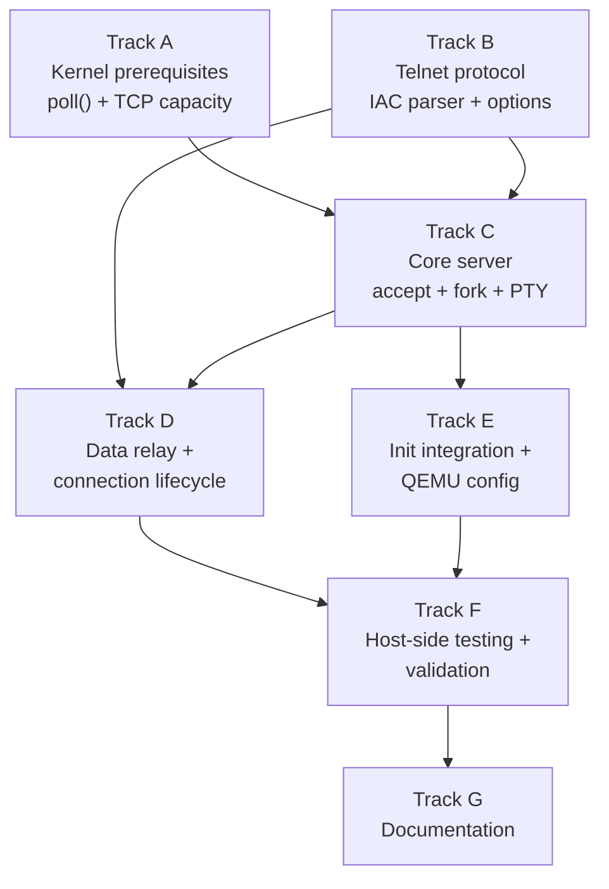

# Phase 30 — Telnet Server: Task List

**Status:** Complete
**Source Ref:** phase-30
**Depends on:** Phase 23 (Socket API) ✅, Phase 27 (User Accounts) ✅, Phase 29 (PTY Subsystem) ✅
**Goal:** Implement a telnet server (`telnetd`) that listens on TCP port 23, accepts
remote connections, allocates a PTY pair per session, and relays data between the TCP
socket and the terminal. This is the first demonstration of the OS as a networked,
multi-user system — a machine you can connect to from another computer and do real work.

## Prerequisite Analysis

Current state (post-Phase 29):
- TCP socket API fully implemented: `socket`, `bind`, `listen`, `accept`, `sendto`,
  `recvfrom`, `shutdown`, `getsockname`, `getpeername`, `setsockopt`, `getsockopt`
- TCP state machine with 3-way handshake, FIN handling, up to 4 simultaneous connections
- `poll()` syscall supports socket FD readiness (POLLIN, POLLOUT, POLLHUP)
- PTY subsystem: 16-slot pool, `/dev/ptmx` allocation, `/dev/pts/N` slave devices,
  line discipline on slave side, session management, SIGHUP on master close
- `setsid()`, `TIOCSCTTY`, controlling terminal association all working
- `openpty()` wrapper in syscall-lib
- Login/authentication from Phase 27 (`/bin/login`)
- C cross-compilation via `musl-gcc -static` (proven with coreutils, hello-c, etc.)
- Init daemon (PID 1) manages service spawning via fork+exec
- QEMU user-mode networking: virtio-net at 10.0.2.15/24, gateway 10.0.2.2

Already implemented (no new work needed):
- TCP socket creation, binding, listening, accepting
- PTY pair allocation and lifecycle management
- Session and controlling terminal setup (setsid, TIOCSCTTY)
- Login program for authentication
- C compilation infrastructure (musl-gcc static linking)
- fork/exec/exit/wait process lifecycle
- Signal delivery (SIGHUP, SIGINT, SIGCHLD)
- poll() syscall for I/O multiplexing

Needs to be added:
- `userspace/telnetd/` — C program implementing the telnet server
- IAC (Interpret As Command) parser to strip telnet protocol from data stream
- Telnet option negotiation (ECHO, SGA, NAWS)
- Per-connection fork with PTY allocation and login exec
- Data relay loop between TCP socket and PTY master using poll()
- Connection cleanup: SIGHUP delivery, PTY release, child reaping
- QEMU port forwarding configuration (`hostfwd=tcp::2323-:23`)
- Init startup entry for telnetd
- Possible kernel enhancements: poll() for PTY master FDs, TCP connection limit increase

## Track Layout

| Track | Scope | Dependencies | Status |
|---|---|---|---|
| A | Kernel prerequisites: poll() for PTY, TCP capacity | — | ✅ Complete |
| B | Telnet protocol library (IAC parser, option negotiation) | — | ✅ Complete |
| C | Core telnetd server (accept loop, fork, PTY setup) | A, B | ✅ Complete |
| D | Data relay and connection lifecycle | B, C | ✅ Complete |
| E | Init integration and QEMU configuration | C | ✅ Complete |
| F | Host-side testing and validation | All | Manual testing required |
| G | Documentation | All | ✅ Complete |

### Implementation Notes

- **C implementation with musl-gcc**: Consistent with coreutils and other C userspace
  programs. The telnet protocol is byte-oriented and well-suited to C. Statically linked
  with musl for a standalone ELF binary.
- **Max 3 simultaneous telnet sessions**: The kernel supports 4 TCP connections total.
  One slot is used by the listening socket, leaving 3 for client connections. This is
  sufficient for a toy OS. The acceptance criteria in the design doc request 4 sessions,
  so Track A includes a task to increase the TCP connection limit to at least 8.
- **Poll-based multiplexing**: Each connection handler (parent after fork) uses `poll()`
  to multiplex between the TCP socket FD and the PTY master FD. This avoids busy-waiting
  and is the standard Unix approach.
- **No threads**: Each connection is handled by a forked process. The main telnetd
  process only accepts connections and forks handlers. Child reaping via SIGCHLD or
  explicit `waitpid()` in the accept loop.
- **IAC parsing is stateful**: Telnet commands (IAC sequences) can be split across TCP
  segments. The parser must maintain state between reads.

---

## Track A — Kernel Prerequisites

Ensure poll() works for PTY master FDs and increase TCP connection capacity.

### A.1 — poll() support for PTY master FDs

**File:** `kernel/src/arch/x86_64/syscall.rs`
**Symbol:** `sys_poll`
**Why it matters:** telnetd's relay loop multiplexes both the TCP socket and PTY master FD using `poll()`; without PTY master support the relay would require busy-waiting.

**Acceptance:**
- [x] `FdBackend::PtyMaster` FDs return POLLIN when the PTY's `s2m` ring buffer has data or the slave is closed
- [x] `FdBackend::PtyMaster` FDs return POLLOUT when the `m2s` buffer has space

### A.2 — Increase MAX_TCP_CONNECTIONS

**File:** `kernel/src/net/tcp.rs`
**Symbol:** `MAX_TCP_CONNECTIONS`
**Why it matters:** 1 listening slot plus ≥4 client slots are needed for the multi-session acceptance criteria; the previous limit of 4 was insufficient.

**Acceptance:**
- [x] `MAX_TCP_CONNECTIONS` raised to ≥ 8
- [x] No remaining hard-coded assumptions about the old limit of 4

### A.3 — poll() POLLIN on TCP listening socket

**File:** `kernel/src/arch/x86_64/syscall.rs`
**Symbol:** `sys_poll`
**Why it matters:** the main accept loop uses `poll()` on the listening socket to avoid blocking so telnetd can reap children between connections.

**Acceptance:**
- [x] POLLIN is reported on a TCP listening socket when a connection is ready for `accept()`

### A.4 — Socket FD isolation across fork

**File:** `kernel/src/arch/x86_64/syscall.rs`
**Symbol:** `sys_fork`
**Why it matters:** the listening socket is inherited by every forked handler child; closing it in the child must not disturb the parent's accept loop.

**Acceptance:**
- [x] `sys_linux_close` on a socket FD in a child process does not tear down the parent's TCP listening state

---

## Track B — Telnet Protocol Library

Implement IAC parsing and option negotiation as helper functions within telnetd.

### B.1 — Create telnetd/ and xtask build step

**Files:**
- `userspace/telnetd/telnetd.c`
- `xtask/src/main.rs`

**Symbol:** `build_musl_bins`
**Why it matters:** integrating telnetd into the existing musl build pipeline ensures it is automatically compiled and placed in the initrd alongside other C userspace binaries.

**Acceptance:**
- [x] `telnetd.c` compiled with `musl-gcc -static -O2`
- [x] Output ELF placed in `kernel/initrd/`

### B.2 — telnetd.c server skeleton

**File:** `userspace/telnetd/telnetd.c`
**Symbol:** `main`
**Why it matters:** establishes the minimal TCP server skeleton — socket, bind, listen, accept loop — before protocol logic is layered on top.

**Acceptance:**
- [x] Accepts optional port argument (default 23)
- [x] Prints `"telnetd: listening on port 23"` to stdout after successful bind
- [x] Accept loop runs without crashing

### B.3 — Telnet protocol constants and state init

**File:** `userspace/telnetd/telnetd.c`
**Symbol:** `telnet_state_init`
**Why it matters:** centralizing IAC, DO/DONT/WILL/WONT, and option codes prevents magic numbers scattered through the relay logic.

**Acceptance:**
- [x] `IAC` (255), `DONT` (254), `DO` (253), `WONT` (252), `WILL` (251), `SB` (250), `SE` (240) defined
- [x] Option codes `ECHO` (1), `SUPPRESS_GO_AHEAD` (3), `NAWS` (31), `LINEMODE` (34) defined
- [x] Per-connection telnet state initialized via `telnet_state_init`

### B.4 — telnet_send_option

**File:** `userspace/telnetd/telnetd.c`
**Symbol:** `telnet_send_option`
**Why it matters:** every option negotiation exchange is a 3-byte IAC sequence; encapsulating this prevents off-by-one errors in option framing.

**Acceptance:**
- [x] Sends `IAC cmd opt` as 3 bytes over the TCP socket FD
- [x] Used by the initial negotiation sequence

### B.5 — Initial option negotiation

**File:** `userspace/telnetd/telnetd.c`
**Symbol:** `telnet_negotiate`
**Why it matters:** sending WILL ECHO, WILL SGA, DO SGA, DO NAWS immediately after `accept()` switches the client to character-at-a-time mode required for interactive terminal use.

**Acceptance:**
- [x] `IAC WILL ECHO` sent
- [x] `IAC WILL SUPPRESS_GO_AHEAD` sent
- [x] `IAC DO SUPPRESS_GO_AHEAD` sent
- [x] `IAC DO NAWS` sent
- [x] Negotiation sent before fork

### B.6 — Stateful IAC parser

**File:** `userspace/telnetd/telnetd.c`
**Symbol:** `telnet_parse`
**Why it matters:** IAC sequences can be split across TCP reads so the parser must maintain state between calls, stripping protocol bytes while passing clean data to the PTY master.

**Acceptance:**
- [x] State machine: `NORMAL` → `IAC_SEEN` → `OPTION` → `NORMAL`
- [x] `SB` → `SUBNEG` → consume until `IAC SE`
- [x] Returns count of clean data bytes written to `out_buf`
- [x] Correctly handles sequences split across TCP reads

### B.7 — NAWS subnegotiation handling

**File:** `userspace/telnetd/telnetd.c`
**Symbol:** `telnet_parse`
**Why it matters:** propagating window-size updates from the client to the PTY ensures terminal-aware programs (like the text editor) display correctly over telnet.

**Acceptance:**
- [x] `IAC SB NAWS width-hi width-lo height-hi height-lo IAC SE` parsed correctly
- [x] Window size stored in per-connection structure
- [x] `ioctl(pty_master_fd, TIOCSWINSZ, &winsize)` called on NAWS update

---

## Track C — Core Server: Accept Loop, Fork, PTY Setup

Implement the main server logic: accept connections, fork handlers, set up PTY+login.

### C.1 — Accept loop with forked handlers

**File:** `userspace/telnetd/telnetd.c`
**Symbol:** `main`
**Why it matters:** the accept loop is the core of telnetd; each accepted connection spawns an independent handler child so the listening socket is never blocked on a single session.

**Acceptance:**
- [x] Parent closes client FD and continues accepting
- [x] Child closes listening FD and calls `handle_connection`
- [x] `waitpid(-1, WNOHANG)` reaps finished children each accept iteration

### C.2 — PTY pair allocation per connection

**File:** `userspace/telnetd/telnetd.c`
**Symbol:** `pts_path`
**Why it matters:** each connection needs its own PTY pair; the slave path is used by the login grandchild to establish its controlling terminal.

**Acceptance:**
- [x] `/dev/ptmx` opened; `TIOCSPTLCK` and `TIOCGPTN` called
- [x] Slave path constructed as `/dev/pts/N` via `pts_path`
- [x] Initial telnet option negotiation sent on client socket before fork

### C.3 — Grandchild login session setup

**File:** `userspace/telnetd/telnetd.c`
**Symbol:** `handle_connection`
**Why it matters:** the double-fork creates an independent login session with its own controlling terminal, matching how getty/login operate on a real Unix system.

**Acceptance:**
- [x] Grandchild calls `setsid()`
- [x] PTY slave opened; `TIOCSCTTY` called
- [x] stdin/stdout/stderr redirected to slave via `dup2`
- [x] `/bin/login` exec'd

### C.4 — Relay parent setup after double-fork

**File:** `userspace/telnetd/telnetd.c`
**Symbol:** `handle_connection`
**Why it matters:** the relay parent holds both TCP socket FD and PTY master FD; it must close the slave before entering the poll loop to avoid preventing the slave from reaching EOF.

**Acceptance:**
- [x] Slave FD closed in the relay parent
- [x] Poll loop entered between TCP socket and PTY master

### C.5 — SIGCHLD / zombie reaping

**File:** `userspace/telnetd/telnetd.c`
**Symbol:** `main`
**Why it matters:** without reaping, every closed connection leaves a zombie process consuming kernel process table slots.

**Acceptance:**
- [x] `waitpid(-1, WNOHANG)` called in accept loop to reap finished handler children

---

## Track D — Data Relay and Connection Lifecycle

Implement the bidirectional data relay between TCP socket and PTY master.

### D.1 — Bidirectional poll-based relay loop

**File:** `userspace/telnetd/telnetd.c`
**Symbol:** `handle_connection`
**Why it matters:** `poll()`-based relay is the only way to multiplex socket and PTY data without busy-waiting or threads.

**Acceptance:**
- [x] `poll()` called with POLLIN on both client socket and PTY master
- [x] Socket → IAC parser → PTY master path implemented
- [x] PTY master → TCP socket path implemented

### D.2 — CR/LF translation

**Files:**
- `userspace/telnetd/telnetd.c`

**Symbol:** `crlf_to_unix`
**Why it matters:** telnet NVT uses CR-LF and CR-NUL; the PTY line discipline expects Unix LF; without translation both ends see garbled line endings.

**Acceptance:**
- [x] CR-NUL → CR and CR-LF → LF on socket→PTY path (`crlf_to_unix`)
- [x] LF → CR-LF on PTY→socket path (`unix_to_crlf`)

### D.3 — Client-side connection close

**File:** `userspace/telnetd/telnetd.c`
**Symbol:** `handle_connection`
**Why it matters:** closing the PTY master when the TCP client disconnects is what delivers SIGHUP to the login/shell process via the Phase 29 mechanism.

**Acceptance:**
- [x] `recv()` returning 0 or POLLHUP on socket triggers PTY master close
- [x] `waitpid()` reaps grandchild; handler exits

### D.4 — PTY-side connection close

**File:** `userspace/telnetd/telnetd.c`
**Symbol:** `handle_connection`
**Why it matters:** when the shell exits the PTY slave is closed; the relay must detect this and tear down the TCP connection to notify the telnet client.

**Acceptance:**
- [x] `read()` returning 0 or POLLHUP on PTY master triggers socket `shutdown()` + `close()`
- [x] Handler process exits cleanly

### D.5 — Partial write handling

**File:** `userspace/telnetd/telnetd.c`
**Symbol:** `write_all`
**Why it matters:** the TCP socket may accept fewer bytes than requested; `write_all` retries until all bytes are sent so no data is silently dropped.

**Acceptance:**
- [x] `write_all` loops on short writes until all bytes are flushed
- [x] Used in both relay directions

### D.6 — IAC IAC byte escaping

**File:** `userspace/telnetd/telnetd.c`
**Symbol:** `unix_to_crlf`
**Why it matters:** any 0xFF byte in PTY output must be doubled before transmission so the client's IAC parser does not misinterpret terminal data as a telnet command.

**Acceptance:**
- [x] 0xFF bytes in PTY→socket output are doubled to `IAC IAC`

---

## Track E — Init Integration and QEMU Configuration

Wire telnetd into the boot process and configure QEMU networking for host access.

### E.1 — QEMU port forwarding

**File:** `xtask/src/main.rs`
**Symbol:** `qemu_args`
**Why it matters:** without `hostfwd` the host cannot reach port 23 in the guest; this single change makes `telnet localhost 2323` work from the host.

**Acceptance:**
- [x] `-netdev user,id=net0,hostfwd=tcp::2323-:23` present in QEMU args

### E.2 — Init spawn of telnetd

**File:** `userspace/init/src/main.rs`
**Symbol:** `spawn_telnetd`
**Why it matters:** telnetd must start at boot as a background daemon; init is the correct place to fork+exec it after the filesystem is ready.

**Acceptance:**
- [x] `fork+exec` of `TELNETD_PATH` after filesystem mount
- [x] telnetd runs as background daemon (init does not wait for it)

### E.3 — TELNETD_PATH constant

**File:** `userspace/init/src/main.rs`
**Symbol:** `TELNETD_PATH`
**Why it matters:** a named constant prevents mismatches between the exec call in init and the actual initrd path where the binary is placed.

**Acceptance:**
- [x] `TELNETD_PATH` matches the initrd path of the telnetd ELF
- [x] VFS can resolve the path and exec it

### E.4 — Startup banner

**File:** `userspace/telnetd/telnetd.c`
**Symbol:** `main`
**Why it matters:** the serial-visible banner is the only confirmation during boot that telnetd successfully bound to port 23 and is ready to accept connections.

**Acceptance:**
- [x] `"telnetd: listening on port 23\n"` printed after successful `bind` + `listen`

---

## Track F — Host-Side Testing and Validation

### F.1 — Boot without regressions

**File:** `xtask/src/main.rs`
**Symbol:** `qemu_args`
**Why it matters:** telnetd must not break existing functionality — login, shell, coreutils, and filesystem must all continue to work.

**Acceptance:**
- [ ] `cargo xtask run` boots with telnetd running _(manual QEMU test)_
- [ ] Serial output shows telnetd startup message _(manual QEMU test)_
- [ ] No panics or regressions in existing functionality _(manual QEMU test)_

### F.2 — Remote login prompt

**File:** `userspace/telnetd/telnetd.c`
**Symbol:** `handle_connection`
**Why it matters:** verifies the full accept → fork → PTY → login chain produces a usable login prompt over the network.

**Acceptance:**
- [ ] `telnet localhost 2323` shows `login:` prompt _(manual QEMU test)_
- [ ] Valid credentials authenticate and drop into a shell _(manual QEMU test)_

### F.3 — Remote shell basic commands

**File:** `userspace/telnetd/telnetd.c`
**Symbol:** `handle_connection`
**Why it matters:** confirms data relay is bidirectional and correct for normal shell use.

**Acceptance:**
- [ ] `echo hello`, `ls /`, `cat /etc/passwd`, `pwd`, `mkdir`/`rmdir` all produce correct output _(manual QEMU test)_

### F.4 — Pipes over telnet

**File:** `userspace/telnetd/telnetd.c`
**Symbol:** `handle_connection`
**Why it matters:** pipeline output travels through the PTY relay; any buffering issue would corrupt the output.

**Acceptance:**
- [ ] `echo hello | cat` and `ls / | grep bin` produce correct output _(manual QEMU test)_

### F.5 — Text editor over telnet

**File:** `userspace/telnetd/telnetd.c`
**Symbol:** `handle_connection`
**Why it matters:** the text editor uses raw PTY mode and full-screen escape sequences, providing a comprehensive stress test of the relay.

**Acceptance:**
- [ ] `edit` opens, accepts edits, saves, and exits over the telnet connection _(manual QEMU test)_

### F.6 — Multiple simultaneous sessions

**File:** `kernel/src/net/tcp.rs`
**Symbol:** `MAX_TCP_CONNECTIONS`
**Why it matters:** validates that the raised connection limit and per-connection PTY allocation both work under concurrent load.

**Acceptance:**
- [ ] ≥ 4 concurrent `telnet localhost 2323` sessions, each independent _(manual QEMU test)_
- [ ] Closing one session does not affect the others _(manual QEMU test)_

### F.7 — Clean session teardown

**File:** `userspace/telnetd/telnetd.c`
**Symbol:** `handle_connection`
**Why it matters:** validates the SIGHUP delivery path from PTY master close through Phase 29 to the shell process.

**Acceptance:**
- [ ] Disconnecting the telnet client terminates the remote login/shell via SIGHUP _(manual QEMU test)_
- [ ] PTY pair is freed; reconnecting works _(manual QEMU test)_

### F.8 — Window size negotiation

**File:** `userspace/telnetd/telnetd.c`
**Symbol:** `telnet_parse`
**Why it matters:** validates the NAWS → TIOCSWINSZ → SIGWINCH path so full-screen programs lay out correctly.

**Acceptance:**
- [ ] NAWS from host client updates PTY window size _(manual QEMU test)_
- [ ] Text editor layout reflects the updated dimensions _(manual QEMU test)_

### F.9 — cargo xtask check

**File:** `xtask/src/main.rs`
**Symbol:** `cmd_check`
**Why it matters:** enforces that no clippy warnings or formatting issues were introduced.

**Acceptance:**
- [x] `cargo xtask check` passes (clippy + rustfmt)

### F.10 — kernel-core unit tests

**File:** `xtask/src/main.rs`
**Symbol:** `cmd_check`
**Why it matters:** ensures no regressions in host-testable pure logic from earlier phases.

**Acceptance:**
- [x] `cargo test -p kernel-core` passes — no regressions

### F.11 — GUI + headless boot

**File:** `xtask/src/main.rs`
**Symbol:** `qemu_args`
**Why it matters:** telnetd and the console login must coexist in both QEMU modes.

**Acceptance:**
- [ ] `cargo xtask run` and `cargo xtask run-gui` both boot with telnetd running _(manual QEMU test)_

---

## Track G — Documentation

### G.1 — docs/30-telnet-server.md

**File:** `docs/30-telnet-server.md`
**Symbol:** `# Phase 30 -- Telnet Server`
**Why it matters:** documents the accept→fork→PTY→login architecture so future contributors understand the full connection lifecycle.

**Acceptance:**
- [x] Architecture section with data-flow diagram (host telnet → QEMU forward → socket → telnetd → PTY → login)
- [x] IAC parsing, option negotiation, CR/LF translation, and connection lifecycle covered

### G.2 — Scope limitations

**File:** `docs/30-telnet-server.md`
**Symbol:** `## Differences from Production Telnet Servers`
**Why it matters:** explicitly bounding what this implementation does not do prevents future confusion about missing features like encryption or LINEMODE.

**Acceptance:**
- [x] Documents: no encryption, no inetd, no LINEMODE, no idle timeout, no Kerberos
- [x] References Phase 43 (SSH) as the secure replacement

### G.3 — Roadmap update

**File:** `docs/08-roadmap.md`
**Symbol:** `## Phase Overview`
**Why it matters:** keeps the roadmap index consistent with phase completion status.

**Acceptance:**
- [ ] Phase 30 marked complete in `docs/08-roadmap.md` _(deferred until manual tests pass)_

---

## Deferred Until Later

These items are explicitly out of scope for Phase 30:

- **Encryption** — that's SSH, Phase 43
- **inetd/xinetd super-server** — single-purpose daemon is simpler
- **TCP wrappers or IP-based access control** — no firewall needed for QEMU
- **Telnet LINEMODE option** — character-at-a-time with server echo is sufficient
- **Environment variable passing** (ENVIRON option) — not needed
- **Keep-alive / idle timeout** — connections persist until explicitly closed
- **Kerberos authentication** — basic password auth via login is sufficient
- **send()/recv() syscall wrappers** — use sendto()/recvfrom() with NULL addr

---

## Dependency Graph

## Parallelization Strategy

**Wave 1:** Tracks A and B in parallel:
- A: Kernel prerequisites — verify/add poll() support for PTY master FDs, increase
  TCP connection limit, verify socket FD fork semantics.
- B: Telnet protocol — define constants, implement IAC parser, option negotiation.
  This is pure C code with no kernel dependencies and can be developed and tested
  in isolation (even on the host with a test harness if desired).

**Wave 2 (after A + B):** Tracks C and E (partially) in parallel:
- C: Core server — accept loop, fork, PTY setup, login exec. Requires kernel
  prerequisites (poll for PTY, TCP capacity) and protocol library.
- E: QEMU configuration (P30-T023) can be done immediately. Init integration
  (P30-T024/T025) can be drafted but needs the telnetd binary path.

**Wave 3 (after C):** Track D — data relay loop. Requires the server skeleton
from Track C and the IAC parser from Track B.

**Wave 4 (after D + E):** Track F — end-to-end testing from the host. Requires
the complete telnetd binary, init integration, and QEMU port forwarding.

**Wave 5 (after F):** Track G — documentation after all features are validated.
