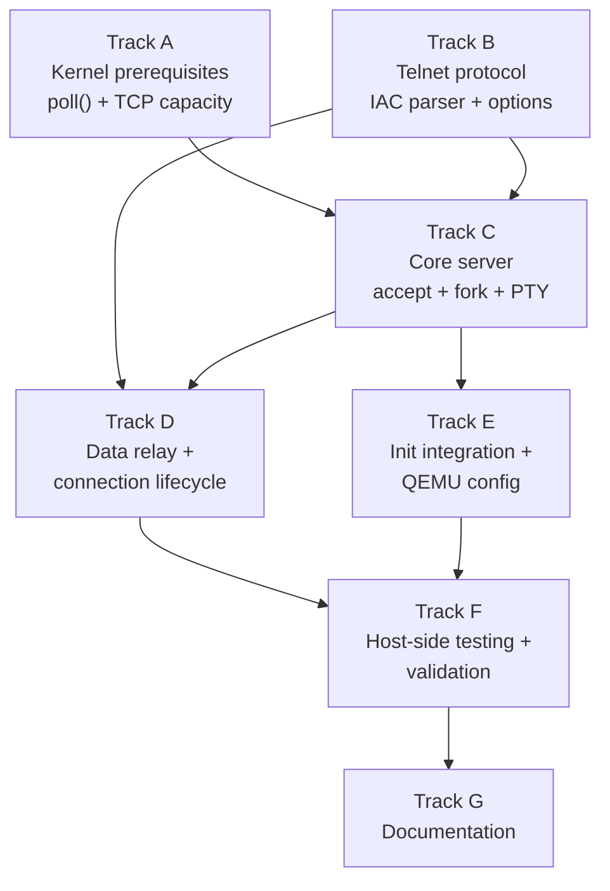

# Phase 30 — Telnet Server: Task List

**Depends on:** Phase 23 (Socket API) ✅, Phase 27 (User Accounts) ✅, Phase 29 (PTY Subsystem) ✅
**Goal:** Implement a telnet server (`telnetd`) that listens on TCP port 23, accepts
remote connections, allocates a PTY pair per session, and relays data between the TCP
socket and the terminal. This is the first demonstration of the OS as a networked,
multi-user system — a machine you can connect to from another computer and do real work.

## Prerequisite Analysis

Current state (post-Phase 29):
- TCP socket API fully implemented: `socket`, `bind`, `listen`, `accept`, `sendto`,
  `recvfrom`, `shutdown`, `getsockname`, `getpeername`, `setsockopt`, `getsockopt`
- TCP state machine with 3-way handshake, FIN handling, up to 4 simultaneous connections
- `poll()` syscall supports socket FD readiness (POLLIN, POLLOUT, POLLHUP)
- PTY subsystem: 16-slot pool, `/dev/ptmx` allocation, `/dev/pts/N` slave devices,
  line discipline on slave side, session management, SIGHUP on master close
- `setsid()`, `TIOCSCTTY`, controlling terminal association all working
- `openpty()` wrapper in syscall-lib
- Login/authentication from Phase 27 (`/bin/login`)
- C cross-compilation via `musl-gcc -static` (proven with coreutils, hello-c, etc.)
- Init daemon (PID 1) manages service spawning via fork+exec
- QEMU user-mode networking: virtio-net at 10.0.2.15/24, gateway 10.0.2.2

Already implemented (no new work needed):
- TCP socket creation, binding, listening, accepting
- PTY pair allocation and lifecycle management
- Session and controlling terminal setup (setsid, TIOCSCTTY)
- Login program for authentication
- C compilation infrastructure (musl-gcc static linking)
- fork/exec/exit/wait process lifecycle
- Signal delivery (SIGHUP, SIGINT, SIGCHLD)
- poll() syscall for I/O multiplexing

Needs to be added:
- `userspace/telnetd/` — C program implementing the telnet server
- IAC (Interpret As Command) parser to strip telnet protocol from data stream
- Telnet option negotiation (ECHO, SGA, NAWS)
- Per-connection fork with PTY allocation and login exec
- Data relay loop between TCP socket and PTY master using poll()
- Connection cleanup: SIGHUP delivery, PTY release, child reaping
- QEMU port forwarding configuration (`hostfwd=tcp::2323-:23`)
- Init startup entry for telnetd
- Possible kernel enhancements: poll() for PTY master FDs, TCP connection limit increase

## Track Layout

| Track | Scope | Dependencies | Status |
|---|---|---|---|
| A | Kernel prerequisites: poll() for PTY, TCP capacity | — | Not started |
| B | Telnet protocol library (IAC parser, option negotiation) | — | Not started |
| C | Core telnetd server (accept loop, fork, PTY setup) | A, B | Not started |
| D | Data relay and connection lifecycle | B, C | Not started |
| E | Init integration and QEMU configuration | C | Not started |
| F | Host-side testing and validation | All | Not started |
| G | Documentation | All | Not started |

### Implementation Notes

- **C implementation with musl-gcc**: Consistent with coreutils and other C userspace
  programs. The telnet protocol is byte-oriented and well-suited to C. Statically linked
  with musl for a standalone ELF binary.
- **Max 3 simultaneous telnet sessions**: The kernel supports 4 TCP connections total.
  One slot is used by the listening socket, leaving 3 for client connections. This is
  sufficient for a toy OS. The acceptance criteria in the design doc request 4 sessions,
  so Track A includes a task to increase the TCP connection limit to at least 8.
- **Poll-based multiplexing**: Each connection handler (parent after fork) uses `poll()`
  to multiplex between the TCP socket FD and the PTY master FD. This avoids busy-waiting
  and is the standard Unix approach.
- **No threads**: Each connection is handled by a forked process. The main telnetd
  process only accepts connections and forks handlers. Child reaping via SIGCHLD or
  explicit `waitpid()` in the accept loop.
- **IAC parsing is stateful**: Telnet commands (IAC sequences) can be split across TCP
  segments. The parser must maintain state between reads.

---

## Track A — Kernel Prerequisites

Ensure poll() works for PTY master FDs and increase TCP connection capacity.

| Task | Description |
|---|---|
| P30-T001 | Verify that `poll()` supports `FdBackend::PtyMaster` FDs: check `kernel/src/arch/x86_64/syscall.rs` in the poll implementation. If PTY master FDs are not handled, add POLLIN detection (return POLLIN when the PTY's `s2m` ring buffer has data or the slave is closed) and POLLOUT detection (return POLLOUT when the `m2s` buffer has space). This is critical — telnetd's relay loop depends on polling both the socket and the PTY master. |
| P30-T002 | Increase `MAX_TCP_CONNECTIONS` in `kernel/src/net/tcp.rs` from 4 to at least 8. The telnet server needs 1 slot for the listening socket plus at least 4 for client connections (acceptance criteria). Update any related array sizes or constants. Verify no hard-coded assumptions about the limit of 4 exist elsewhere. |
| P30-T003 | Verify that `poll()` correctly reports POLLIN on a TCP listening socket when a pending connection is ready to accept. Check the poll implementation for `SocketKind::Stream` in listening state. If not handled, add detection: return POLLIN when the TCP slot has transitioned to `Established` (a connection is ready for `accept()`). |
| P30-T004 | Verify that closing a TCP socket FD in a forked child does not affect the parent's copy (and vice versa). The listening socket FD is inherited by the child on fork but only the parent should continue accepting. Ensure `sys_close` on a socket FD in the child does not tear down the TCP connection or listening state used by the parent. If socket FDs share underlying kernel state, add reference counting or a clone-on-fork mechanism. |

## Track B — Telnet Protocol Library

Implement IAC parsing and option negotiation as helper functions within telnetd.

| Task | Description |
|---|---|
| P30-T005 | Create `userspace/telnetd/` directory. Add a `Makefile` entry or equivalent in the xtask build system to compile `telnetd.c` with `musl-gcc -static -O2` and place the output ELF in `kernel/initrd/telnetd.elf`. Add the build step alongside the existing C userspace builds in `xtask/src/main.rs`. |
| P30-T006 | Create `userspace/telnetd/telnetd.c` with the initial skeleton: `#include` headers, `main()` function that parses an optional port argument (default 23), creates a TCP socket, binds, listens, and enters the accept loop. For now, just print "telnetd: listening on port 23" to stdout and accept+close connections in a loop. |
| P30-T007 | Define telnet protocol constants in `telnetd.c` (or a `telnet.h` header): `IAC` (255), `DONT` (254), `DO` (253), `WONT` (252), `WILL` (251), `SB` (250), `SE` (240), `NOP` (241), `GA` (249). Option codes: `ECHO` (1), `SUPPRESS_GO_AHEAD` (3), `NAWS` (31), `LINEMODE` (34). |
| P30-T008 | Implement `telnet_send_option(int fd, unsigned char cmd, unsigned char opt)`: sends a 3-byte IAC sequence (`IAC cmd opt`) over the TCP socket. Used for WILL/WONT/DO/DONT negotiation. |
| P30-T009 | Implement the initial option negotiation sequence sent to new clients: `IAC WILL ECHO` (server will handle echo), `IAC WILL SUPPRESS_GO_AHEAD` (character-at-a-time mode), `IAC DO SUPPRESS_GO_AHEAD` (request client to suppress GA), `IAC DO NAWS` (request client to send window size). Send this immediately after accepting a connection, before forking. |
| P30-T010 | Implement `telnet_parse(buf, len, out_buf, out_len, state)`: a stateful IAC parser that processes a raw TCP buffer and strips telnet commands. Takes input bytes, outputs cleaned data bytes (with IAC sequences removed). Maintains parser state across calls to handle IAC sequences split across TCP reads. State machine: `NORMAL` → on IAC byte → `IAC_SEEN` → on WILL/WONT/DO/DONT → `OPTION` → consume option byte → `NORMAL`. On `SB` → `SUBNEG` → consume until `IAC SE`. Return the number of clean data bytes written to `out_buf`. |
| P30-T011 | Handle NAWS subnegotiation in the IAC parser: when `IAC SB NAWS <width-hi> <width-lo> <height-hi> <height-lo> IAC SE` is received, extract the window size (width = hi<<8|lo, height = hi<<8|lo). Store it in a per-connection structure. After parsing, if a NAWS update was received, call `ioctl(pty_master_fd, TIOCSWINSZ, &winsize)` to update the PTY's window size (which will deliver SIGWINCH to the shell). |

## Track C — Core Server: Accept Loop, Fork, PTY Setup

Implement the main server logic: accept connections, fork handlers, set up PTY+login.

| Task | Description |
|---|---|
| P30-T012 | Implement the accept loop in `main()`: after `listen()`, loop calling `accept()` on the listening socket. On each accepted connection, fork a child process. The parent closes the client socket FD and continues accepting (or calls `waitpid(-1, WNOHANG)` to reap finished children). The child closes the listening socket FD and proceeds to handle the connection. |
| P30-T013 | In the child process after fork: allocate a PTY pair by opening `/dev/ptmx`, calling `ioctl(master_fd, TIOCSPTLCK, 0)` to unlock, and `ioctl(master_fd, TIOCGPTN, &pty_num)` to get the PTY number. Construct the slave path `/dev/pts/<N>`. Send the initial telnet option negotiation (P30-T009) on the client socket. |
| P30-T014 | In the child process: fork again to create a grandchild. The grandchild will become the login session. In the grandchild: call `setsid()` to create a new session. Open the PTY slave device as the controlling terminal: `open("/dev/pts/N")`, then `ioctl(slave_fd, TIOCSCTTY, 0)`. Redirect stdin/stdout/stderr to the slave FD via `dup2(slave_fd, 0)`, `dup2(slave_fd, 1)`, `dup2(slave_fd, 2)`. Close the original slave FD and the master FD. Exec `/bin/login`. |
| P30-T015 | In the child process (the relay/parent of the grandchild): close the slave FD (only the grandchild needs it). Enter the data relay loop between the client TCP socket FD and the PTY master FD using `poll()`. This is the core of the connection handler — implemented in Track D. |
| P30-T016 | Handle `SIGCHLD` in the main telnetd process: when a connection handler child exits, reap it with `waitpid()` to prevent zombies. Use non-blocking `waitpid(-1, WNOHANG)` in the accept loop, or install a SIGCHLD handler. Given the simplicity of the OS, polling with WNOHANG before each accept iteration is sufficient. |

## Track D — Data Relay and Connection Lifecycle

Implement the bidirectional data relay between TCP socket and PTY master.

| Task | Description |
|---|---|
| P30-T017 | Implement the relay loop in the connection handler process: use `poll()` with two FDs — the client TCP socket and the PTY master. Set POLLIN on both. When `poll()` returns: if the socket has POLLIN, read from socket, parse through the IAC parser (P30-T010), write clean data to the PTY master. If the PTY master has POLLIN, read from PTY master, write to the TCP socket. |
| P30-T018 | Handle CR/LF translation in the relay: telnet protocol uses CR-NUL for carriage return and CR-LF for newline. When receiving from the TCP socket (after IAC stripping), convert CR-NUL → CR and CR-LF → LF before writing to the PTY master (the PTY's line discipline expects Unix-style LF). When sending from PTY master to socket, convert bare LF → CR-LF (telnet NVT convention). |
| P30-T019 | Handle connection close from the client side: when `recv()` on the TCP socket returns 0 (client disconnected) or `poll()` returns POLLHUP on the socket, close the PTY master FD (this delivers SIGHUP to the login/shell session via Phase 29 mechanism). Then `waitpid()` for the grandchild login process and `exit()` the handler. |
| P30-T020 | Handle connection close from the PTY side: when `read()` on the PTY master returns 0 (login/shell exited, slave closed) or `poll()` returns POLLHUP on the PTY master, send any remaining buffered data to the TCP socket, then `shutdown()` and `close()` the socket. Exit the handler process. |
| P30-T021 | Handle partial writes: if `write()` to the socket or PTY master returns fewer bytes than requested (short write), buffer the remainder and retry on the next poll iteration. Use a small write buffer (e.g., 512 bytes) per direction. Given terminal traffic volumes, a simple retry loop is acceptable. |
| P30-T022 | Handle `IAC IAC` escaping: a literal 0xFF byte in data from the PTY master must be sent as `IAC IAC` (two 0xFF bytes) to the client, per the telnet protocol. In the PTY-to-socket direction, scan output for 0xFF and double it. This is rare in terminal data but required for correctness. |

## Track E — Init Integration and QEMU Configuration

Wire telnetd into the boot process and configure QEMU networking for host access.

| Task | Description |
|---|---|
| P30-T023 | Update QEMU network flags in `xtask/src/main.rs`: change the `-netdev user,id=net0` line to `-netdev user,id=net0,hostfwd=tcp::2323-:23`. This forwards host port 2323 to guest port 23, allowing `telnet localhost 2323` from the host. |
| P30-T024 | Update init (`userspace/init/src/main.rs`) to spawn telnetd at boot: after mounting the filesystem and before (or alongside) spawning login, fork+exec `/sbin/telnetd` (or `/bin/telnetd`, depending on the initrd path). Telnetd should run as a background daemon — init forks it and does not wait for it. |
| P30-T025 | Ensure telnetd's path is accessible: the binary should be embedded in the initrd as `telnetd.elf` and accessible at a known path (e.g., `/bin/telnetd` or `/sbin/telnetd`). Update the VFS or initrd path mapping to include the telnetd binary. Verify the exec path matches what init uses to spawn it. |
| P30-T026 | Add a startup banner: when telnetd starts and successfully binds to port 23, print `"telnetd: listening on port 23\n"` to the kernel serial console (or stdout if redirected). This confirms the daemon started during boot. |

## Track F — Host-Side Testing and Validation

| Task | Description |
|---|---|
| P30-T027 | Acceptance: `cargo xtask run` boots successfully with telnetd running. Serial output shows telnetd startup message. No panics or regressions in existing functionality (login, shell, coreutils, filesystem). |
| P30-T028 | Acceptance: from the host, `telnet localhost 2323` connects to the OS and shows a `login:` prompt. Typing a valid username and password authenticates and drops into a shell. |
| P30-T029 | Acceptance: the remote shell is fully functional. Test basic commands: `echo hello`, `ls /`, `cat /etc/passwd`, `pwd`, `mkdir /tmp/test && rmdir /tmp/test`. All produce correct output over the telnet connection. |
| P30-T030 | Acceptance: pipes work over telnet. Test `echo hello | cat` and `ls / | grep bin`. Output is correct. |
| P30-T031 | Acceptance: the text editor (`edit`) works over the telnet connection. Open a file, make edits, save, and exit. Raw mode terminal handling works correctly through the PTY and telnet relay. |
| P30-T032 | Acceptance: multiple simultaneous telnet sessions work. Open at least 4 concurrent `telnet localhost 2323` connections from the host. Each gets an independent login prompt. Log into each and run commands independently. Closing one session does not affect the others. |
| P30-T033 | Acceptance: closing the telnet client cleanly terminates the remote session. After disconnecting, the login/shell process on the OS side receives SIGHUP and exits. The PTY pair is freed. Reconnecting works and gets a fresh login prompt. |
| P30-T034 | Acceptance: window size negotiation works. If the host telnet client sends NAWS, the PTY's window size is updated. Verify with a command that depends on terminal size (e.g., the text editor layout). |
| P30-T035 | Acceptance: `cargo xtask check` passes (clippy + fmt) with all new code. |
| P30-T036 | Acceptance: `cargo test -p kernel-core` passes — no regressions in existing unit tests. |
| P30-T037 | Acceptance: QEMU boot validation with both `cargo xtask run` and `cargo xtask run-gui`. Both modes work with telnetd running. The console login and telnet login can be used simultaneously. |

## Track G — Documentation

| Task | Description |
|---|---|
| P30-T038 | Create `docs/30-telnet-server.md`: document the telnet server implementation. Cover: architecture (accept → fork → PTY → login), IAC parsing, option negotiation, data relay, connection lifecycle, CR/LF translation, and QEMU port forwarding setup. Include a diagram of the data flow: host telnet client → QEMU port forward → guest TCP socket → telnetd relay → PTY master → PTY slave → login/shell. |
| P30-T039 | Document how the implementation differs from production telnet servers: no inetd super-server, no TCP wrappers, no Kerberos, no LINEMODE, no environment passing, no idle timeout, no encryption (plaintext only). Reference Phase 35 (SSH) as the secure replacement. |
| P30-T040 | Update `docs/08-roadmap.md` to mark Phase 30 as complete (when done). Update `docs/roadmap/README.md` to reflect Phase 30 task list status. |

---

## Deferred Until Later

These items are explicitly out of scope for Phase 30:

- **Encryption** — that's SSH, Phase 35
- **inetd/xinetd super-server** — single-purpose daemon is simpler
- **TCP wrappers or IP-based access control** — no firewall needed for QEMU
- **Telnet LINEMODE option** — character-at-a-time with server echo is sufficient
- **Environment variable passing** (ENVIRON option) — not needed
- **Keep-alive / idle timeout** — connections persist until explicitly closed
- **Kerberos authentication** — basic password auth via login is sufficient
- **send()/recv() syscall wrappers** — use sendto()/recvfrom() with NULL addr

---

## Dependency Graph

## Parallelization Strategy

**Wave 1:** Tracks A and B in parallel:
- A: Kernel prerequisites — verify/add poll() support for PTY master FDs, increase
  TCP connection limit, verify socket FD fork semantics.
- B: Telnet protocol — define constants, implement IAC parser, option negotiation.
  This is pure C code with no kernel dependencies and can be developed and tested
  in isolation (even on the host with a test harness if desired).

**Wave 2 (after A + B):** Tracks C and E (partially) in parallel:
- C: Core server — accept loop, fork, PTY setup, login exec. Requires kernel
  prerequisites (poll for PTY, TCP capacity) and protocol library.
- E: QEMU configuration (P30-T023) can be done immediately. Init integration
  (P30-T024/T025) can be drafted but needs the telnetd binary path.

**Wave 3 (after C):** Track D — data relay loop. Requires the server skeleton
from Track C and the IAC parser from Track B.

**Wave 4 (after D + E):** Track F — end-to-end testing from the host. Requires
the complete telnetd binary, init integration, and QEMU port forwarding.

**Wave 5 (after F):** Track G — documentation after all features are validated.
