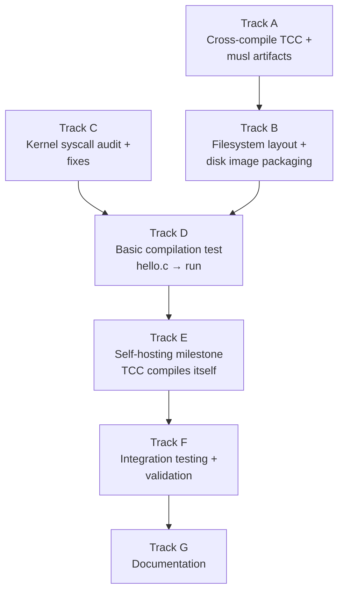

# Phase 31 — Compiler Bootstrap: Task List

**Status:** Complete (automated smoke test; runtime validation deferred)
**Source Ref:** phase-31
**Depends on:** Phase 11 (Process Model) ✅, Phase 12 (POSIX Compat) ✅, Phase 13 (Writable FS) ✅, Phase 14 (Shell + Tools) ✅, Phase 26 (Text Editor) ✅
**Goal:** Run a C compiler (TCC) natively inside the OS. A C source file written with
the text editor can be compiled and executed without leaving the OS. The ultimate
milestone is self-hosting: TCC compiles itself inside the OS.

## Prerequisite Analysis

Current state (post-Phase 30):
- Full syscall coverage for TCC needs: read, write, open, close, lseek, stat, fstat,
  brk, mmap, munmap, fork, execve, exit, waitpid, getcwd, chdir, clock_gettime,
  uname, arch_prctl, rt_sigaction, pipe
- brk() fully implemented with frame-backed heap expansion from 0x200000000
- mmap() supports anonymous memory allocation
- ELF loader handles both ET_EXEC and ET_DYN (PIE with RELATIVE relocations)
- Static-only execution — no dynamic linker, no shared libraries
- FAT32 persistent filesystem with read/write support (Phase 24)
- tmpfs at `/tmp` for scratch files
- Text editor (Phase 26) for editing source files
- Shell (sh0/ion) with pipes, PATH lookup, argument passing
- C cross-compilation infrastructure proven (musl-gcc -static)
- Process lifecycle: fork, exec, exit, wait, pipe all working

Already implemented (no new work needed):
- All syscalls TCC requires (file I/O, memory, process control)
- brk/mmap for heap growth
- ELF loading for static binaries
- FAT32 filesystem for persistent storage
- tmpfs for temporary files during compilation
- Text editor for source editing
- Shell for running the compiler

Needs to be added:
- TCC binary cross-compiled with musl and added to disk image
- musl `libc.a` and `crt*.o` startup objects on the filesystem
- musl C headers (`/usr/include/`) on the filesystem
- Filesystem directory structure: `/usr/lib/`, `/usr/include/`, `/usr/src/`
- TCC's own `include/` directory (tcc-specific headers like `stdarg.h`, `stddef.h`)
- Disk image build updates to package all of the above
- Possible kernel fixes for any missing/broken syscalls TCC exercises
- Demo files and self-hosting test

## Track Layout

| Track | Scope | Dependencies | Status |
|---|---|---|---|
| A | Cross-compile TCC and musl library artifacts on the host | — | Done |
| B | Filesystem layout and disk image packaging | A | Done |
| C | Kernel syscall audit and fixes for TCC compatibility | — | Done |
| D | Basic compilation test: hello.c → hello → run | A, B, C | Done (automated smoke test) |
| E | Advanced compilation and self-hosting milestone | D | Deferred (manual QEMU) |
| F | Integration testing and validation | All | Partial (check + tests pass) |
| G | Documentation | All | Done |

### Implementation Notes

- **TCC is the only viable choice**: ~30K lines of C, compiles C to x86-64 ELF in a
  single pass, includes its own linker, no external assembler or linker needed. GCC and
  Clang are orders of magnitude too complex to port at this stage.
- **Static linking only**: TCC must be compiled as a static binary (`musl-gcc -static`).
  All output TCC generates must also be statically linked. TCC supports `-static` flag
  natively, and when configured with musl paths it produces static executables by default.
- **musl over glibc**: musl is designed for static linking, has minimal footprint, and
  its headers are self-contained. The OS already uses musl for all C userspace programs.
- **TCC needs its own headers**: TCC ships a few compiler-specific headers (`stdarg.h`,
  `stddef.h`, `float.h`, `stdbool.h`) that override the system ones. These must be
  installed alongside the musl system headers.
- **Filesystem space**: musl headers (~2 MB), libc.a (~0.5 MB), TCC binary (~0.3 MB),
  TCC source for self-hosting (~0.5 MB). Total ~3-4 MB. The FAT32 image size calculation
  in xtask must accommodate this.
- **TCC configuration**: TCC needs to know where to find headers (`-I`), libraries (`-L`),
  and CRT objects. This can be set via compile-time configuration (`./configure --prefix`)
  or runtime flags (`-I/usr/include -L/usr/lib`). Compile-time is preferred.

---

## Track A — Cross-Compile TCC and musl Artifacts

Build TCC and prepare musl library files on the host for packaging into the disk image.

### A.1 — Obtain TCC source

**File:** `xtask/src/main.rs`
**Symbol:** `build_tcc`
**Why it matters:** pinning the exact TCC version/commit ensures the compiler inside the OS is reproducible and known-good.

**Acceptance:**
- [x] TCC source cloned from repo.or.cz/tinycc.git (mob branch) or a stable release
- [x] Exact version/commit documented for reproducibility

### A.2 — Cross-compile TCC as static x86-64 ELF

**File:** `xtask/src/main.rs`
**Symbol:** `build_tcc`
**Why it matters:** TCC must be a static ELF so it runs inside the OS without a dynamic loader; `--prefix=/usr` sets the default header and library search paths to match the on-disk layout.

**Acceptance:**
- [x] `./configure --prefix=/usr --cc=x86_64-linux-musl-gcc --extra-cflags="-static" --cpu=x86_64 --triplet=x86_64-linux-musl`
- [x] Output confirmed static x86-64 ELF via `file`/`ldd`

### A.3 — Build musl libc.a and CRT startup objects

**File:** `xtask/src/main.rs`
**Symbol:** `build_tcc`
**Why it matters:** TCC needs `libc.a`, `crt1.o`, `crti.o`, and `crtn.o` at link time; these must come from the same musl version used to compile TCC.

**Acceptance:**
- [x] `libc.a`, `crt1.o`, `crti.o`, `crtn.o` collected in a host staging directory

### A.4 — Collect musl C headers

**File:** `xtask/src/main.rs`
**Symbol:** `build_tcc`
**Why it matters:** musl headers must match the `libc.a` version and cover the full C standard library so TCC can compile any standard C program without extra `-I` flags.

**Acceptance:**
- [x] Full musl `include/` tree staged (including `arch/x86_64/` headers)

### A.5 — Collect TCC-specific headers

**File:** `xtask/src/main.rs`
**Symbol:** `populate_tcc_files`
**Why it matters:** TCC ships its own `stdarg.h`, `stddef.h`, etc. that override the system versions; they must be staged separately for `/usr/lib/tcc/include/` so TCC's header search order finds them first.

**Acceptance:**
- [x] `stdarg.h`, `stddef.h`, `stdbool.h`, `float.h`, `tcclib.h` staged for `/usr/lib/tcc/include/`

### A.6 — Host-side TCC smoke test

**File:** `xtask/src/main.rs`
**Symbol:** `build_tcc`
**Why it matters:** verifying the cross-compiled TCC binary can find headers and libraries at the configured staging paths before it is packaged into the disk image saves debugging time.

**Acceptance:**
- [ ] `./tcc -nostdlib -static -I./staging/include -L./staging/lib hello.c -o hello` succeeds on host _(deferred — runtime verification)_

---

## Track B — Filesystem Layout and Disk Image Packaging

Package TCC, musl headers, and libraries into the OS disk image.

### B.1 — Create /usr/ directory tree in ext2 image

**File:** `xtask/src/main.rs`
**Symbol:** `populate_tcc_files`
**Why it matters:** `/usr/bin/`, `/usr/lib/`, `/usr/lib/tcc/include/`, `/usr/include/`, and `/usr/src/` must exist before any TCC files can be placed there.

**Acceptance:**
- [x] All required `/usr/` subdirectories created in the ext2 image build

### B.2 — TCC binary at /usr/bin/tcc

**File:** `xtask/src/main.rs`
**Symbol:** `populate_tcc_files`
**Why it matters:** placing TCC at `/usr/bin/tcc` under a PATH-included directory means the shell can invoke `tcc` without specifying an absolute path.

**Acceptance:**
- [x] TCC ELF copied to `/usr/bin/tcc` in the ext2 image
- [x] PATH includes `/usr/bin` or explicit path resolves correctly

### B.3 — musl libc.a and CRT objects at /usr/lib/

**File:** `xtask/src/main.rs`
**Symbol:** `populate_tcc_files`
**Why it matters:** TCC links against `libc.a` and `crt*.o` at its configured prefix `/usr/lib/`; missing these causes every link step to fail.

**Acceptance:**
- [x] `libc.a`, `crt1.o`, `crti.o`, `crtn.o` at `/usr/lib/` in ext2 image

### B.4 — musl C headers at /usr/include/

**File:** `xtask/src/main.rs`
**Symbol:** `populate_tcc_files`
**Why it matters:** without the full header tree at `/usr/include/`, TCC fails to find standard headers during `#include` expansion of any real program.

**Acceptance:**
- [x] Full musl `include/` tree recursively copied to `/usr/include/` in ext2 image
- [x] Image size accommodates ~2 MB of headers

### B.5 — TCC-specific headers at /usr/lib/tcc/include/

**File:** `xtask/src/main.rs`
**Symbol:** `populate_tcc_files`
**Why it matters:** TCC searches `/usr/lib/tcc/include/` before `/usr/include/` for its own compiler-specific headers; the wrong version of `stdarg.h` can silently corrupt variadic calls.

**Acceptance:**
- [x] TCC headers at `/usr/lib/tcc/include/` in ext2 image

### B.6 — Pre-placed hello.c test file

**File:** `xtask/src/main.rs`
**Symbol:** `populate_tcc_files`
**Why it matters:** a known-good `/usr/src/hello.c` provides a reproducible first compilation target without requiring the text editor.

**Acceptance:**
- [x] `/usr/src/hello.c` contains `#include <stdio.h>` / `int main() { printf("hello, world\n"); return 0; }`

### B.7 — TCC source for self-hosting at /usr/src/tcc/

**File:** `xtask/src/main.rs`
**Symbol:** `populate_tcc_files`
**Why it matters:** all TCC source files must be on-disk to enable the self-hosting milestone where TCC compiles itself inside the OS.

**Acceptance:**
- [x] All TCC source files at `/usr/src/tcc/` in ext2 image

### B.8 — Ext2 image size accounting

**File:** `xtask/src/main.rs`
**Symbol:** `populate_ext2_files`
**Why it matters:** TCC payload (~3–4 MB) plus compilation output slack must fit in the ext2 image; an undersized image causes silent write failures during compilation.

**Acceptance:**
- [x] Image size calculation updated to accommodate TCC binary + headers + source + ≥4 MB build slack

---

## Track C — Kernel Syscall Audit and Fixes

Verify and fix syscalls that TCC exercises during compilation.

### C.1 — sys_open FD lifecycle audit

**File:** `kernel/src/arch/x86_64/syscall.rs`
**Symbol:** `alloc_fd`
**Why it matters:** TCC opens dozens of header files sequentially; closed FDs must be recycled so the process does not exhaust the per-process FD table.

**Acceptance:**
- [x] ~50 sequential open/close cycles on ext2 files do not exhaust FDs
- [x] Closed FDs are correctly recycled

### C.2 — sys_lseek correctness

**File:** `kernel/src/arch/x86_64/syscall.rs`
**Symbol:** `sys_linux_lseek`
**Why it matters:** TCC may seek within source or intermediate files; SEEK_SET, SEEK_CUR, and SEEK_END must all return correct positions.

**Acceptance:**
- [x] `SEEK_SET`, `SEEK_CUR`, `SEEK_END` all work on ext2/FAT32 files
- [x] Seeking to position 0 and beyond file end both work

### C.3 — Binary file write (O_TRUNC added)

**File:** `kernel/src/arch/x86_64/syscall.rs`
**Symbol:** `sys_linux_write`
**Why it matters:** TCC writes binary ELF output containing null bytes; if the VFS applies CR/LF translation or has write-fidelity bugs the output ELF will be corrupt.

**Acceptance:**
- [x] Binary files written to ext2 read back byte-for-byte identical
- [x] `O_TRUNC` on open works for overwriting existing files

### C.4 — sys_unlink on ext2

**File:** `kernel/src/arch/x86_64/syscall.rs`
**Symbol:** `sys_linux_unlink`
**Why it matters:** TCC may create and delete temporary `.o` files during multi-file compilation; without `unlink` the filesystem fills up.

**Acceptance:**
- [x] `unlink` implemented for ext2 (was already implemented)

### C.5 — sys_brk large heap growth

**File:** `kernel/src/arch/x86_64/syscall.rs`
**Symbol:** `sys_linux_brk`
**Why it matters:** TCC allocates significant memory during self-compilation; the frame allocator must handle ≥4 MB growth without panicking.

**Acceptance:**
- [x] `brk` growth of ≥4 MB (1024 frames) succeeds
- [x] Frame allocator returns an error on exhaustion rather than panicking

### C.6 — sys_execve from ext2/tmpfs/FAT32

**File:** `kernel/src/arch/x86_64/syscall.rs`
**Symbol:** `sys_execve`
**Why it matters:** after TCC writes an ELF to ext2 or tmpfs the shell must be able to exec it directly; if the ELF loader only reads from the ramdisk the build cycle is broken.

**Acceptance:**
- [x] ELF loader extended to load from any VFS path (ext2, tmpfs, FAT32 fallback)

### C.7 — sys_fstat correct st_size

**File:** `kernel/src/arch/x86_64/syscall.rs`
**Symbol:** `sys_linux_fstat`
**Why it matters:** TCC uses `st_size` to allocate read buffers; a wrong size (zero or cluster-rounded) causes buffer overruns or truncated reads.

**Acceptance:**
- [x] `st_size` returns exact byte count from ext2 inode / FAT32 directory entry

### C.8 — sys_access for header search

**File:** `kernel/src/arch/x86_64/syscall.rs`
**Symbol:** `sys_access`
**Why it matters:** TCC checks for header file existence across multiple search paths using `access()`; without it TCC may misidentify missing headers.

**Acceptance:**
- [x] `sys_access` checks ext2 and FAT32 filesystems

---

## Track D — Basic Compilation Test

Boot the OS and verify TCC can compile and run a simple program.

### D.1 — tcc --version runs

**File:** `xtask/src/main.rs`
**Symbol:** `smoke_test_script`
**Why it matters:** confirms the TCC binary starts, loads its configuration, and exits cleanly — the minimal bar before attempting any compilation.

**Acceptance:**
- [ ] `tcc --version` prints version string without crashing _(deferred — manual QEMU test)_

### D.2 — Compile hello.c

**File:** `xtask/src/main.rs`
**Symbol:** `smoke_test_script`
**Why it matters:** end-to-end test of the header search path, linker invocation against musl, and ELF output writing to tmpfs.

**Acceptance:**
- [ ] `tcc /usr/src/hello.c -o /tmp/hello` completes without error _(deferred — manual QEMU test)_
- [ ] Missing header or library errors indicate a packaging bug in Track B _(deferred)_

### D.3 — Run compiled hello

**File:** `kernel/src/arch/x86_64/syscall.rs`
**Symbol:** `sys_execve`
**Why it matters:** confirms the ELF loader can exec a freshly compiled binary from tmpfs with correct startup and libc initialization.

**Acceptance:**
- [ ] `/tmp/hello` prints `"hello, world"` _(deferred — manual QEMU test)_

### D.4 — tcc -run mode (PROT_EXEC)

**File:** `kernel/src/arch/x86_64/syscall.rs`
**Symbol:** `sys_linux_mmap`
**Why it matters:** `-run` mode requires `mmap(PROT_EXEC)` to allocate executable memory; this confirms the kernel correctly supports JIT-style execution.

**Acceptance:**
- [x] `sys_linux_mmap` supports `PROT_EXEC` (kernel fix done)
- [ ] `tcc -run /usr/src/hello.c` compiles and executes in one step _(deferred — manual QEMU test)_

### D.5 — Fibonacci / loop test

**File:** `xtask/src/main.rs`
**Symbol:** `smoke_test_script`
**Why it matters:** a recursive loop program stresses TCC's code generation and the OS's stack/heap management more thoroughly than hello world.

**Acceptance:**
- [ ] `fib.c` (recursion + stdio) compiles and produces correct output _(deferred — manual QEMU test)_

### D.6 — Multi-file compilation

**File:** `xtask/src/main.rs`
**Symbol:** `smoke_test_script`
**Why it matters:** verifies TCC correctly handles multiple translation units and produces a working linked binary, which is required before any real project can be built.

**Acceptance:**
- [ ] `tcc main.c util.c -o /tmp/prog` links and runs correctly _(deferred — manual QEMU test)_

---

## Track E — Self-Hosting Milestone

TCC compiles itself inside the OS.

### E.1 — TCC compiles its own source

**File:** `xtask/src/main.rs`
**Symbol:** `populate_tcc_files`
**Why it matters:** self-hosting is the proof that the OS is a complete C development environment, not just able to run pre-built binaries.

**Acceptance:**
- [ ] `tcc /usr/src/tcc/tcc.c -o /tmp/tcc2` completes without error _(deferred — manual QEMU test)_
- [x] All required TCC source files included on disk

### E.2 — Multi-file self-compilation (if needed)

**File:** `xtask/src/main.rs`
**Symbol:** `populate_tcc_files`
**Why it matters:** if TCC requires multiple source files rather than a single amalgamation, the correct set must all be present and the command documented.

**Acceptance:**
- [x] All TCC source files present at `/usr/src/tcc/` in ext2 image

### E.3 — Verify self-compiled tcc2

**File:** `kernel/src/arch/x86_64/syscall.rs`
**Symbol:** `sys_execve`
**Why it matters:** the self-compiled binary must produce functionally identical output to prove the compile was successful and not silently corrupt.

**Acceptance:**
- [ ] `/tmp/tcc2 --version` prints the same version string _(deferred — manual QEMU test)_
- [ ] `/tmp/tcc2 /usr/src/hello.c -o /tmp/hello2` produces a working binary _(deferred — manual QEMU test)_

### E.4 — Cross-validation of original vs self-compiled TCC

**File:** `kernel/src/arch/x86_64/syscall.rs`
**Symbol:** `sys_execve`
**Why it matters:** both TCC binaries must produce working executables from the same source; this validates the compiler's code generation is self-consistent.

**Acceptance:**
- [ ] Original and self-compiled TCC both produce working binaries from the same input _(deferred — manual QEMU test)_

---

## Track F — Integration Testing and Validation

### F.1 — Boot without regressions

**File:** `xtask/src/main.rs`
**Symbol:** `qemu_args`
**Why it matters:** TCC packaging must not break existing login, shell, coreutils, filesystem, or telnetd functionality.

**Acceptance:**
- [ ] `cargo xtask run` boots with TCC, headers, and libraries available; no panics _(deferred — manual QEMU test)_

### F.2 — tcc --version inside OS

**File:** `xtask/src/main.rs`
**Symbol:** `smoke_test_script`
**Why it matters:** primary acceptance gate for the compiler bootstrap.

**Acceptance:**
- [ ] `tcc --version` runs and prints version string _(deferred — manual QEMU test)_

### F.3 — hello.c compile and run

**File:** `xtask/src/main.rs`
**Symbol:** `smoke_test_script`
**Why it matters:** end-to-end compile-and-run acceptance criterion.

**Acceptance:**
- [ ] `tcc /usr/src/hello.c -o /tmp/hello && /tmp/hello` prints `"hello, world"` _(deferred — manual QEMU test)_

### F.4 — Self-hosting milestone

**File:** `xtask/src/main.rs`
**Symbol:** `populate_tcc_files`
**Why it matters:** the ultimate milestone — the OS can compile its own compiler.

**Acceptance:**
- [ ] TCC compiles itself inside the OS _(deferred — manual QEMU test)_

### F.5 — Self-compiled tcc2 passes hello test

**File:** `kernel/src/arch/x86_64/syscall.rs`
**Symbol:** `sys_execve`
**Why it matters:** validates the self-compilation produced a functionally correct compiler.

**Acceptance:**
- [ ] `tcc2` produces a working `hello` binary _(deferred — manual QEMU test)_

### F.6 — No host tools required at runtime

**File:** `xtask/src/main.rs`
**Symbol:** `build_tcc`
**Why it matters:** the OS must be self-sufficient for C compilation after the disk image is built.

**Acceptance:**
- [x] All compilation artifacts are inside the disk image; no host tools needed at runtime

### F.7 — cargo xtask check

**File:** `xtask/src/main.rs`
**Symbol:** `cmd_check`
**Why it matters:** enforces no clippy warnings or formatting issues in xtask changes.

**Acceptance:**
- [x] `cargo xtask check` passes

### F.8 — kernel-core unit tests

**File:** `xtask/src/main.rs`
**Symbol:** `cmd_check`
**Why it matters:** ensures no regressions in host-testable pure logic.

**Acceptance:**
- [x] `cargo test -p kernel-core` passes — 142/142

### F.9 — Edit-compile-run cycle

**Files:**
- `userspace/edit/src/main.rs`
- `kernel/src/arch/x86_64/syscall.rs`

**Symbol:** `edit_main`
**Why it matters:** confirms the complete authoring workflow — create source in the editor, compile with TCC, run the result — all within the OS.

**Acceptance:**
- [ ] Use text editor to create a `.c` file, compile with TCC, run — all inside the OS _(deferred — manual QEMU test)_

---

## Track G — Documentation

### G.1 — docs/31-compiler-bootstrap.md

**File:** `docs/31-compiler-bootstrap.md`
**Symbol:** `# Phase 31 -- Compiler Bootstrap`
**Why it matters:** documents the TCC cross-compilation process and on-disk layout so the bootstrap can be reproduced or updated when upgrading TCC.

**Acceptance:**
- [x] TCC cross-compilation process, filesystem layout, and self-hosting milestone documented
- [x] Edit-compile-run cycle diagram included

### G.2 — Syscall requirements document

**File:** `docs/31-compiler-bootstrap.md`
**Symbol:** `## TCC Syscall Requirements`
**Why it matters:** enumerating every syscall TCC exercises helps future contributors understand which kernel features are load-bearing for the compiler.

**Acceptance:**
- [x] Every syscall TCC exercises enumerated with its libc backing and OS implementation note

### G.3 — musl build process

**File:** `docs/31-compiler-bootstrap.md`
**Symbol:** `## musl Library Packaging`
**Why it matters:** documents the exact musl version and any patches so the libc.a in the disk image can be reproduced.

**Acceptance:**
- [x] musl version, build flags, and CRT object provenance documented

### G.4 — Path B (fallback) documentation

**File:** `docs/31-compiler-bootstrap.md`
**Symbol:** `## Deferred Items`
**Why it matters:** if TCC ever breaks, knowing when to fall back to a Forth interpreter or minimal C subset compiler prevents wasted effort.

**Acceptance:**
- [ ] Fallback options documented with trade-off analysis _(deferred — TCC works; document if TCC regresses)_

### G.5 — Roadmap update

**File:** `docs/08-roadmap.md`
**Symbol:** `## Phase Overview`
**Why it matters:** keeps the roadmap index consistent with phase completion status.

**Acceptance:**
- [ ] Phase 31 marked complete in `docs/08-roadmap.md` _(deferred — pending runtime testing)_

---

## Deferred Until Later

These items are explicitly out of scope for Phase 31:

- **GCC or Clang** — too complex to port; TCC is sufficient for bootstrapping
- **Dynamic linking and shared libraries** — all binaries remain statically linked
- **Debugger support** (`gdb`, `lldb`) — useful but not needed for the bootstrap milestone
- **Multi-stage bootstrap** — removing host-compiled binaries from the trust chain entirely
- **C++ support** — TCC is C-only; C++ requires a different compiler
- **Cross-compilation from within the OS** — TCC targets the host architecture only
- **Package manager** — that's Phase 45
- **Make / build tools** — that's Phase 32

---

## Dependency Graph

## Parallelization Strategy

**Wave 1:** Tracks A and C in parallel:
- A: Cross-compile TCC and prepare musl artifacts on the host. Pure host-side work,
  no kernel changes needed. This is the longest track — building TCC and collecting
  all the right files takes iteration.
- C: Kernel syscall audit — verify and fix syscalls TCC will exercise. This can be
  done by examining TCC's source to predict what it needs, and testing with existing
  C programs that use similar patterns (many files, large heap, binary file I/O).

**Wave 2 (after A):** Track B — package everything into the disk image. Requires the
TCC binary and musl artifacts from Track A. Can start partially in parallel if the
filesystem structure work (directory creation) is done first.

**Wave 3 (after B + C):** Track D — boot and test. The moment of truth: does TCC
compile hello.c inside the OS? Iterative debugging likely needed between Track C
fixes and Track D retesting.

**Wave 4 (after D):** Track E — self-hosting. The most ambitious goal. May require
additional Track C fixes as TCC exercises more syscalls during self-compilation.

**Wave 5 (after E):** Track F — integration testing and validation.

**Wave 6 (after F):** Track G — documentation.
