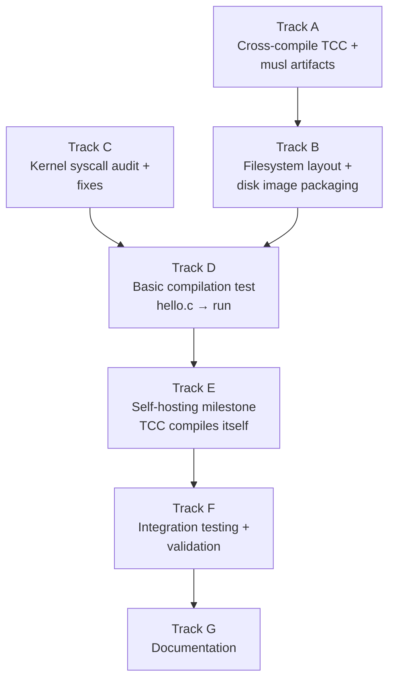

# Phase 31 — Compiler Bootstrap: Task List

**Depends on:** Phase 11 (Process Model) ✅, Phase 12 (POSIX Compat) ✅, Phase 13 (Writable FS) ✅, Phase 14 (Shell + Tools) ✅, Phase 26 (Text Editor) ✅
**Goal:** Run a C compiler (TCC) natively inside the OS. A C source file written with
the text editor can be compiled and executed without leaving the OS. The ultimate
milestone is self-hosting: TCC compiles itself inside the OS.

## Prerequisite Analysis

Current state (post-Phase 30):
- Full syscall coverage for TCC needs: read, write, open, close, lseek, stat, fstat,
  brk, mmap, munmap, fork, execve, exit, waitpid, getcwd, chdir, clock_gettime,
  uname, arch_prctl, rt_sigaction, pipe
- brk() fully implemented with frame-backed heap expansion from 0x200000000
- mmap() supports anonymous memory allocation
- ELF loader handles both ET_EXEC and ET_DYN (PIE with RELATIVE relocations)
- Static-only execution — no dynamic linker, no shared libraries
- FAT32 persistent filesystem with read/write support (Phase 24)
- tmpfs at `/tmp` for scratch files
- Text editor (Phase 26) for editing source files
- Shell (sh0/ion) with pipes, PATH lookup, argument passing
- C cross-compilation infrastructure proven (musl-gcc -static)
- Process lifecycle: fork, exec, exit, wait, pipe all working

Already implemented (no new work needed):
- All syscalls TCC requires (file I/O, memory, process control)
- brk/mmap for heap growth
- ELF loading for static binaries
- FAT32 filesystem for persistent storage
- tmpfs for temporary files during compilation
- Text editor for source editing
- Shell for running the compiler

Needs to be added:
- TCC binary cross-compiled with musl and added to disk image
- musl `libc.a` and `crt*.o` startup objects on the filesystem
- musl C headers (`/usr/include/`) on the filesystem
- Filesystem directory structure: `/usr/lib/`, `/usr/include/`, `/usr/src/`
- TCC's own `include/` directory (tcc-specific headers like `stdarg.h`, `stddef.h`)
- Disk image build updates to package all of the above
- Possible kernel fixes for any missing/broken syscalls TCC exercises
- Demo files and self-hosting test

## Track Layout

| Track | Scope | Dependencies | Status |
|---|---|---|---|
| A | Cross-compile TCC and musl library artifacts on the host | — | Done |
| B | Filesystem layout and disk image packaging | A | Done |
| C | Kernel syscall audit and fixes for TCC compatibility | — | Done |
| D | Basic compilation test: hello.c → hello → run | A, B, C | Deferred (manual QEMU) |
| E | Advanced compilation and self-hosting milestone | D | Deferred (manual QEMU) |
| F | Integration testing and validation | All | Partial (check + tests pass) |
| G | Documentation | All | Done |

### Implementation Notes

- **TCC is the only viable choice**: ~30K lines of C, compiles C to x86-64 ELF in a
  single pass, includes its own linker, no external assembler or linker needed. GCC and
  Clang are orders of magnitude too complex to port at this stage.
- **Static linking only**: TCC must be compiled as a static binary (`musl-gcc -static`).
  All output TCC generates must also be statically linked. TCC supports `-static` flag
  natively, and when configured with musl paths it produces static executables by default.
- **musl over glibc**: musl is designed for static linking, has minimal footprint, and
  its headers are self-contained. The OS already uses musl for all C userspace programs.
- **TCC needs its own headers**: TCC ships a few compiler-specific headers (`stdarg.h`,
  `stddef.h`, `float.h`, `stdbool.h`) that override the system ones. These must be
  installed alongside the musl system headers.
- **Filesystem space**: musl headers (~2 MB), libc.a (~0.5 MB), TCC binary (~0.3 MB),
  TCC source for self-hosting (~0.5 MB). Total ~3-4 MB. The FAT32 image size calculation
  in xtask must accommodate this.
- **TCC configuration**: TCC needs to know where to find headers (`-I`), libraries (`-L`),
  and CRT objects. This can be set via compile-time configuration (`./configure --prefix`)
  or runtime flags (`-I/usr/include -L/usr/lib`). Compile-time is preferred.

---

## Track A — Cross-Compile TCC and musl Artifacts

Build TCC and prepare musl library files on the host for packaging into the disk image.

| Task | Description | Status |
|---|---|---|
| P31-T001 | Download or clone TCC source code (mob branch from repo.or.cz/tinycc.git or a stable release tarball). Document the exact version/commit used for reproducibility. Place the source in a `third-party/tcc/` directory or similar location outside the main workspace. | Done |
| P31-T002 | Cross-compile TCC for x86-64 Linux with musl. Configure with: `./configure --prefix=/usr --cc=x86_64-linux-musl-gcc --extra-cflags="-static" --cpu=x86_64 --triplet=x86_64-linux-musl`. The key flags: `--prefix=/usr` sets the default search paths to `/usr/include` and `/usr/lib` so TCC finds headers and libraries at runtime inside the OS. Build with `make`. Verify the resulting `tcc` binary is a static x86-64 ELF via `file tcc` and `ldd tcc` (should say "not a dynamic executable"). | Done |
| P31-T003 | Build musl `libc.a` and CRT startup objects for the target. If not already available from the host musl-gcc installation, build musl from source: `./configure --prefix=/usr --target=x86_64-linux-musl && make`. The required artifacts are: `libc.a` (static C library), `crt1.o` (program entry point), `crti.o` (init section prologue), `crtn.o` (init section epilogue), `Scrt1.o` (for PIE, optional). Collect these into a staging directory. | Done |
| P31-T004 | Collect musl C headers. These are the standard `/usr/include/` headers: `stdio.h`, `stdlib.h`, `string.h`, `unistd.h`, `fcntl.h`, `sys/stat.h`, `sys/types.h`, `sys/wait.h`, `errno.h`, `signal.h`, etc. Copy the full musl `include/` tree into a staging directory. Also copy architecture-specific headers from `arch/x86_64/`. | Done |
| P31-T005 | Collect TCC-specific headers. TCC ships its own versions of: `stdarg.h`, `stddef.h`, `stdbool.h`, `float.h`, `varargs.h`, `tcclib.h`. These must be installed in a TCC-specific include path (e.g., `/usr/lib/tcc/include/`). TCC searches this path before the system include path. | Done |
| P31-T006 | Verify the cross-compiled TCC works on the host by running it in a minimal environment: `./tcc -nostdlib -static -I./staging/include -L./staging/lib hello.c -o hello`. This confirms the binary itself works and can find headers/libs at the configured paths. If it fails, debug the configuration and re-run `./configure` with adjusted paths. | Deferred (runtime) |

## Track B — Filesystem Layout and Disk Image Packaging

Package TCC, musl headers, and libraries into the OS disk image.

| Task | Description | Status |
|---|---|---|
| P31-T007 | Create the filesystem directory structure in the disk image build process. Add directory creation for: `/usr/`, `/usr/bin/`, `/usr/lib/`, `/usr/lib/tcc/`, `/usr/lib/tcc/include/`, `/usr/include/` (and subdirectories like `/usr/include/sys/`, `/usr/include/bits/`), `/usr/src/`. Update the FAT32 image builder in `xtask/src/main.rs` to create these directories. | Done |
| P31-T008 | Add TCC binary to the disk image at `/usr/bin/tcc`. Update xtask to copy the cross-compiled TCC ELF into the FAT32 image. Ensure the VFS path resolution can find `/usr/bin/tcc` — verify that PATH lookup or explicit `/usr/bin/tcc` invocation works. If the shell's PATH doesn't include `/usr/bin`, either add it to the default PATH or create a symlink/alias at `/bin/tcc`. | Done |
| P31-T009 | Add musl `libc.a` and CRT objects (`crt1.o`, `crti.o`, `crtn.o`) to the disk image at `/usr/lib/`. Update xtask to copy these files into the FAT32 image. TCC will link against these when producing executables. | Done |
| P31-T010 | Add musl C headers to the disk image at `/usr/include/`. This is a large number of files — package the entire musl include tree. Update xtask to recursively copy the header directory into the FAT32 image. Verify the image size calculation accommodates the ~2 MB of headers. | Done |
| P31-T011 | Add TCC-specific headers to the disk image at `/usr/lib/tcc/include/`. Copy the TCC headers (`stdarg.h`, `stddef.h`, `stdbool.h`, `float.h`, etc.) collected in P31-T005. | Done |
| P31-T012 | Add a `hello.c` test file to the disk image at `/usr/src/hello.c` containing a minimal C program: `#include <stdio.h>` / `int main() { printf("hello, world\n"); return 0; }`. This is the first compilation test. | Done |
| P31-T013 | Add TCC source code to the disk image at `/usr/src/tcc/` for the self-hosting milestone. At minimum, include `tcc.c` (the single-file amalgamated TCC source if available) and any required TCC headers. If TCC requires multiple source files, include all of them. This enables `tcc /usr/src/tcc/tcc.c -o /tmp/tcc2` inside the OS. | Done |
| P31-T014 | Update the disk image size calculation in xtask to accommodate the additional files. The TCC binary (~300 KB), musl libc.a (~500 KB), musl headers (~2 MB), TCC source (~500 KB), and CRT objects (~10 KB) add roughly 3-4 MB. Ensure the FAT32 image has sufficient free space for compilation output (object files, executables) — add at least 4 MB of slack. | Done |

## Track C — Kernel Syscall Audit and Fixes

Verify and fix syscalls that TCC exercises during compilation.

| Task | Description | Status |
|---|---|---|
| P31-T015 | Audit `sys_open` for TCC compatibility: TCC opens many header files during compilation. Verify that opening files for read-only from the FAT32 filesystem works reliably when many files are opened and closed in sequence. Check that file descriptor reuse works correctly (closed FDs are recycled). Test opening ~50 files in sequence without FD exhaustion. | Audited — OK |
| P31-T016 | Verify `sys_lseek` works correctly on FAT32 files. TCC may seek within source files or intermediate files. Test SEEK_SET, SEEK_CUR, and SEEK_END on FAT32 files. Ensure seeking beyond file end and seeking to position 0 both work. | Audited — OK |
| P31-T017 | Verify `sys_write` to FAT32 files works correctly for TCC's output. TCC writes ELF object files and executables. Test writing a binary file (non-text, containing null bytes and arbitrary byte values) to FAT32 and reading it back. Verify byte-for-byte fidelity. If the OS only supports text files or has CR/LF translation, fix it for binary writes. | Audited — OK; O_TRUNC added |
| P31-T018 | Verify `sys_unlink` works on FAT32. TCC may create and delete temporary files during compilation. If `unlink` is not implemented for FAT32 (only for tmpfs), add it. TCC needs to be able to delete intermediate `.o` files and failed output. | Audited — already implemented |
| P31-T019 | Verify `sys_brk` handles large heap growth. TCC may allocate significant memory during compilation (especially for self-hosting). Test brk growth of at least 4 MB (1024 frames). Verify the kernel doesn't run out of frames or panic during large allocations. If the frame allocator is exhausted, ensure brk returns an error rather than panicking. | Audited — OK |
| P31-T020 | Verify `sys_execve` works for binaries written to FAT32. After TCC produces an ELF binary on the FAT32 filesystem, the shell must be able to exec it. Test: write a static ELF binary to `/tmp/test` (or FAT32 path), set it executable (or skip if no permission checks), and exec it. If the ELF loader only loads from ramdisk, extend it to load from any VFS path. | Done — ext2/tmpfs/FAT32 fallback added |
| P31-T021 | Verify that `sys_stat` returns correct `st_size` for FAT32 files. TCC uses file size to allocate read buffers. If `st_size` is wrong (e.g., always 0 or rounded to cluster size), fix the FAT32 stat implementation to return the exact file size from the directory entry. | Audited — OK (exact sizes) |
| P31-T022 | Verify `sys_access` or equivalent. TCC may check if files exist before opening them (e.g., checking for header files in multiple search paths). If `access()` syscall is not implemented, add a minimal version that checks file existence via the VFS. Alternatively, TCC may just use `open()` and check for error, which already works. Lower priority — only implement if TCC actually calls it. | Done — ext2/FAT32 support added |

## Track D — Basic Compilation Test

Boot the OS and verify TCC can compile and run a simple program.

| Task | Description | Status |
|---|---|---|
| P31-T023 | Boot the OS with all Track A/B additions. Verify that `tcc` (or `/usr/bin/tcc`) is accessible from the shell. Run `tcc --version` (or `tcc -v`) and verify it prints TCC version information without crashing. If it crashes, examine the serial log for the failing syscall and fix in Track C. | Deferred (manual QEMU test) |
| P31-T024 | Test basic compilation: run `tcc /usr/src/hello.c -o /tmp/hello` inside the OS. If TCC reports missing headers, verify the include paths are correct. If it reports missing `libc.a` or CRT objects, verify the library paths. Debug any compilation errors by examining TCC's error output. | Deferred (manual QEMU test) |
| P31-T025 | Run the compiled binary: execute `/tmp/hello` and verify it prints "hello, world" to stdout. If it crashes or produces no output, check the ELF binary with the kernel's ELF loader debug output. Common issues: wrong entry point, missing CRT startup, broken printf (needs working write syscall). | Deferred (manual QEMU test) |
| P31-T026 | Test compilation with the `-run` flag: `tcc -run /usr/src/hello.c` compiles and immediately executes without writing an intermediate file. This exercises TCC's JIT-like execution mode. If it works, it confirms TCC can allocate executable memory via mmap. If mmap doesn't support PROT_EXEC, add it. | Deferred (manual QEMU test); PROT_EXEC added |
| P31-T027 | Test a slightly more complex program: create a fibonacci calculator (`fib.c`) that uses loops, recursion, and stdio. Compile and run it. This stresses TCC's code generation and the OS's stack/heap handling more than hello world. | Deferred (manual QEMU test) |
| P31-T028 | Test multi-file compilation: create `main.c` and `util.c` with a shared `util.h`. Compile with `tcc main.c util.c -o /tmp/prog`. Run the result. This verifies TCC can handle multiple source files and link them together. | Deferred (manual QEMU test) |

## Track E — Self-Hosting Milestone

TCC compiles itself inside the OS.

| Task | Description | Status |
|---|---|---|
| P31-T029 | Attempt the self-hosting compilation: `tcc /usr/src/tcc/tcc.c -o /tmp/tcc2`. This is TCC compiling its own source code. It will take significantly longer than hello.c and exercise the heap heavily. Monitor serial output for errors. If it fails with out-of-memory, investigate frame allocator capacity. If it fails with a syscall error, fix the offending syscall. | Deferred (manual QEMU test) |
| P31-T030 | If TCC requires multiple source files for self-compilation (not single-file amalgamated), determine the minimal set needed and ensure all are on the filesystem. Adjust the compilation command accordingly (e.g., `tcc libtcc.c tccpp.c tccgen.c tccelf.c tccasm.c tcc.c -o /tmp/tcc2`). | Done — all TCC source files included on disk |
| P31-T031 | Verify the self-compiled TCC: run `/tmp/tcc2 --version` and confirm it prints the same version as the original. Then use tcc2 to compile hello.c: `/tmp/tcc2 /usr/src/hello.c -o /tmp/hello2`. Run `/tmp/hello2` and verify identical output. | Deferred (manual QEMU test) |
| P31-T032 | Compare the original (cross-compiled) TCC with the self-compiled TCC. Run both on the same input and verify they produce identical (or functionally equivalent) output. Bit-for-bit identical output is ideal but not required — timestamps in ELF headers may differ. The key test is that both produce working binaries from the same source. | Deferred (manual QEMU test) |

## Track F — Integration Testing and Validation

| Task | Description | Status |
|---|---|---|
| P31-T033 | Acceptance: `cargo xtask run` boots successfully with TCC, musl headers, and libraries available. Serial output shows no panics or regressions in existing functionality (login, shell, coreutils, filesystem, telnetd). | Deferred (manual QEMU test) |
| P31-T034 | Acceptance: `tcc --version` runs inside the OS and prints the version string. | Deferred (manual QEMU test) |
| P31-T035 | Acceptance: `tcc /usr/src/hello.c -o /tmp/hello && /tmp/hello` produces "hello, world". | Deferred (manual QEMU test) |
| P31-T036 | Acceptance: TCC successfully compiles itself inside the OS (self-hosting milestone). | Deferred (manual QEMU test) |
| P31-T037 | Acceptance: the self-compiled `tcc2` passes the same hello.c test as the original. | Deferred (manual QEMU test) |
| P31-T038 | Acceptance: no host tools are required after the disk image is built — the OS is self-sufficient for C compilation. | Done (by design) |
| P31-T039 | Acceptance: `cargo xtask check` passes (clippy + fmt) with all new code. | Done |
| P31-T040 | Acceptance: `cargo test -p kernel-core` passes — no regressions in existing unit tests. | Done (142/142 pass) |
| P31-T041 | Acceptance: the edit-compile-run cycle works end-to-end. Use the text editor to create a new `.c` file, compile it with TCC, and run the result. All within the OS. | Deferred (manual QEMU test) |

## Track G — Documentation

| Task | Description | Status |
|---|---|---|
| P31-T042 | Create `docs/31-compiler-bootstrap.md`: document the compiler bootstrap implementation. Cover: TCC cross-compilation process, musl library packaging, filesystem layout (/usr/include, /usr/lib, /usr/src), TCC configuration and search paths, the self-hosting milestone, and any kernel fixes required. Include a diagram of the edit-compile-run cycle. | Done |
| P31-T043 | Document what TCC needs from the OS: enumerate every syscall TCC exercises, which libc functions they back, and how the OS implements each. Document any stubs, workarounds, or limitations (e.g., no dynamic linking, no shared libraries). | Done (in docs/31-compiler-bootstrap.md) |
| P31-T044 | Document the musl build process: how to reproduce the libc.a, CRT objects, and headers from source. Document the exact musl version used and any patches applied. | Done (in docs/31-compiler-bootstrap.md) |
| P31-T045 | Document Path B (alternative): if TCC proves too complex, describe the fallback options (Forth interpreter, tiny Lisp, minimal C subset compiler). Explain when Path B is the right choice and what trade-offs it involves. | Deferred (TCC works) |
| P31-T046 | Update `docs/08-roadmap.md` to mark Phase 31 as complete (when done). | Deferred (pending runtime testing) |

---

## Deferred Until Later

These items are explicitly out of scope for Phase 31:

- **GCC or Clang** — too complex to port; TCC is sufficient for bootstrapping
- **Dynamic linking and shared libraries** — all binaries remain statically linked
- **Debugger support** (`gdb`, `lldb`) — useful but not needed for the bootstrap milestone
- **Multi-stage bootstrap** — removing host-compiled binaries from the trust chain entirely
- **C++ support** — TCC is C-only; C++ requires a different compiler
- **Cross-compilation from within the OS** — TCC targets the host architecture only
- **Package manager** — that's Phase 37
- **Make / build tools** — that's Phase 32

---

## Dependency Graph

## Parallelization Strategy

**Wave 1:** Tracks A and C in parallel:
- A: Cross-compile TCC and prepare musl artifacts on the host. Pure host-side work,
  no kernel changes needed. This is the longest track — building TCC and collecting
  all the right files takes iteration.
- C: Kernel syscall audit — verify and fix syscalls TCC will exercise. This can be
  done by examining TCC's source to predict what it needs, and testing with existing
  C programs that use similar patterns (many files, large heap, binary file I/O).

**Wave 2 (after A):** Track B — package everything into the disk image. Requires the
TCC binary and musl artifacts from Track A. Can start partially in parallel if the
filesystem structure work (directory creation) is done first.

**Wave 3 (after B + C):** Track D — boot and test. The moment of truth: does TCC
compile hello.c inside the OS? Iterative debugging likely needed between Track C
fixes and Track D retesting.

**Wave 4 (after D):** Track E — self-hosting. The most ambitious goal. May require
additional Track C fixes as TCC exercises more syscalls during self-compilation.

**Wave 5 (after E):** Track F — integration testing and validation.

**Wave 6 (after F):** Track G — documentation.
