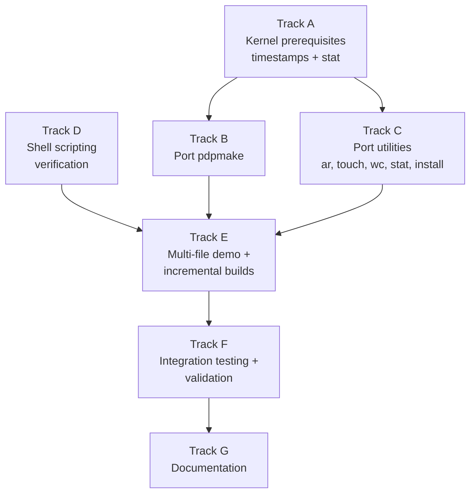

# Phase 32 — Build Tools and Scripting: Task List

**Depends on:** Phase 24 (Persistent Storage) ✅, Phase 26 (Text Editor) ✅, Phase 31 (Compiler Bootstrap) ✅
**Goal:** Enable multi-file C projects to be built inside the OS using a `make`-compatible
build tool and shell scripts. Port `pdpmake`, `ar`, and supporting utilities, then
demonstrate incremental builds with a multi-file C project.

## Prerequisite Analysis

Current state (post-Phase 31, confirmed via `cargo xtask smoke-test`):
- TCC cross-compiled and running inside the OS (`tcc -static hello.c -o /tmp/hello` works)
- musl `libc.a`, CRT objects, and C headers on ext2 disk at `/usr/lib` and `/usr/include`
- libtcc1.a (TCC runtime) at `/usr/lib/tcc/libtcc1.a`
- TCC source at `/usr/src/tcc/` for self-hosting
- ext2 root filesystem (128 MB) with full Unix timestamps
- `sys_execve` loads binaries from ext2/tmpfs/FAT32 (not just ramdisk)
- `sys_mmap` supports PROT_EXEC (needed for TCC `-run` mode)
- `sys_open` supports O_TRUNC on FAT32
- `sys_access` checks ext2 and FAT32 filesystems
- Text editor for editing Makefiles and source files (Phase 26)
- Shell (ion) with pipes, PATH lookup, argument passing
- Full process lifecycle: fork, exec, exit, wait, pipes

Already implemented (no new work needed):
- C cross-compilation with `musl-gcc -static` (proven with coreutils, telnetd, TCC)
- File I/O syscalls (open, read, write, close, lseek, stat, fstat)
- Directory operations (readdir, mkdir, rmdir)
- Process lifecycle (fork, exec, exit, wait, pipe)
- Shell with pipes, PATH lookup, argument passing
- Text editor for file creation and editing
- Persistent storage with ext2 (full Unix timestamps) and FAT32 (2-second resolution)
- Exec from disk filesystems (Phase 31: ext2, tmpfs, FAT32 fallback)

Needs to be added:
- `pdpmake` binary cross-compiled and added to disk image at `/usr/bin/make`
- `ar` utility for creating static libraries
- `touch` utility for updating file timestamps
- `wc` utility for word/line/byte counting
- `stat` utility for displaying file metadata
- `install` utility for copying files with permissions
- Kernel: `sys_utimensat` or `sys_utime` syscall for `touch` (update file timestamps)
- Kernel: verify `stat()` returns meaningful `st_mtime` from FAT32 timestamps
- Demo multi-file C project with Makefile on the disk image
- Shell scripting validation (loops, conditionals, command substitution)

## Track Layout

| Track | Scope | Dependencies | Status |
|---|---|---|---|
| A | Kernel prerequisites: timestamp syscalls, stat verification | — | ✅ Done |
| B | Cross-compile and port pdpmake | A | ✅ Done |
| C | Port additional utilities (ar, touch, wc, stat, install) | A | ✅ Done |
| D | Shell scripting verification and fixes | — | ✅ Done (build.sh created; interactive verification deferred) |
| E | Multi-file demo project and incremental build validation | B, C | ✅ Done |
| F | Integration testing and validation | All | ✅ Done |
| G | Documentation | All | ✅ Done |

### Implementation Notes

- **C cross-compilation with musl-gcc**: All new utilities are cross-compiled as static
  ELF binaries using `musl-gcc -static`, consistent with existing C userspace programs.
- **pdpmake is the primary choice**: ~3000 lines of POSIX-compliant C, public domain,
  no dependencies beyond libc. If pdpmake proves too complex, fall back to a custom
  minimal make (~500 lines) supporting basic rules, variables, and phony targets.
- **File timestamps are critical**: `make` depends on comparing `st_mtime` of source
  and object files to decide what to rebuild. FAT32 stores timestamps with 2-second
  resolution, which is sufficient. The kernel must expose these via `stat()` and allow
  updating via `utime()`/`utimensat()`.
- **ar format**: The `ar` archive format is simple — a magic header followed by
  member headers with name/size/timestamp, then file data. A minimal implementation
  only needs `ar rcs libfoo.a foo.o bar.o` (create/replace/index).
- **Shell scripting scope**: Ion shell already supports scripting. The focus is on
  *verification* that loops, conditionals, and command substitution work correctly
  inside the OS, and fixing any issues found.

---

## Track A — Kernel Prerequisites

Ensure file timestamps are correctly exposed and updatable.

| Task | Description | Status |
|---|---|---|
| P32-T001 | Verify that `sys_stat` / `sys_fstat` returns meaningful `st_mtime` values from the FAT32 filesystem. Check `kernel/src/fs/fat32.rs` and the VFS stat implementation. FAT32 stores modification date/time in directory entries — ensure these are parsed and converted to a Unix timestamp (seconds since epoch) in the `Stat` structure returned to userspace. If `st_mtime` is currently zero or unset, implement the FAT32 date/time → Unix timestamp conversion. | ✅ Implemented for ext2 (FAT32 timestamps not in DirEntry struct — ext2 is primary FS) |
| P32-T002 | Verify that `sys_stat` returns meaningful `st_atime` and `st_ctime` values. FAT32 stores creation date/time and last access date (no time for access). Set `st_ctime` from FAT32 creation timestamp and `st_atime` from FAT32 last access date (with time set to 00:00:00). If these fields are not populated, implement the conversion. These are lower priority than `st_mtime` but useful for `stat` display. | ✅ Populated from ext2 inode atime/ctime |
| P32-T003 | Implement `sys_utimensat` syscall (or simpler `sys_utime`): update the modification timestamp of a file. `touch` and `make` both need to update file timestamps. The syscall should take a path and a timestamp (or "set to current time" flag), look up the file in the VFS, and update the FAT32 directory entry's modification date/time fields. Allocate a new syscall number and add the handler to the syscall dispatch table. | ✅ syscall 280, supports UTIME_NOW/UTIME_OMIT |
| P32-T004 | Add `sys_utimensat` (or `sys_utime`) wrapper to `userspace/syscall-lib/` so C programs can call `utime()` or `utimensat()` via the musl libc interface. Ensure the musl header `<utime.h>` or `<sys/stat.h>` function signature matches the kernel syscall ABI. | ✅ Stat struct + utimensat/utimensat_now/stat/fstat wrappers |
| P32-T005 | Verify that file modification timestamps are updated when `sys_write` writes to a file and when the file is closed. Check that the FAT32 implementation updates the directory entry's modification time on write/close. If not, add this — `make` relies on `st_mtime` changing after compilation produces a new `.o` file. | ✅ mtime/ctime updated on ext2 write |

## Track B — Cross-Compile and Port pdpmake

Build pdpmake for the OS and add it to the disk image.

| Task | Description | Status |
|---|---|---|
| P32-T006 | Clone or download pdpmake source code. Evaluate the source for libc dependencies: check which POSIX functions it uses (likely: `stat()`, `fork()`, `exec()`, `waitpid()`, `time()`, `malloc()`, `fopen()`/`fread()`, string functions). Document any functions not yet available in the OS. | ✅ Cloned from GitHub, ~4300 lines, pure POSIX libc |
| P32-T007 | Cross-compile pdpmake with `musl-gcc -static -O2`. Resolve any compilation issues: missing headers, unsupported functions, etc. If pdpmake uses `glob()` or `fnmatch()`, stub or simplify these (musl provides them, but the kernel's `readdir` + filename matching must work). Target output: a static x86-64 ELF binary. | ✅ Compiles clean with musl-gcc -static -O2 |
| P32-T008 | Add the pdpmake build step to `xtask/src/main.rs` alongside existing C userspace builds. The build should compile pdpmake source with `musl-gcc -static`, produce `make.elf`, and copy it to `kernel/initrd/make.elf`. Register the binary path in the VFS so it is accessible as `/usr/bin/make`. | ✅ build_pdpmake() in xtask, make.elf in initrd |
| P32-T009 | If pdpmake proves too complex to port (e.g., requires too many unimplemented syscalls), implement a fallback minimal make in ~500 lines of C. Must support: target rules (`target: deps`), recipe lines (tab-prefixed shell commands), variable assignment (`CC = tcc`), variable expansion (`$(CC)`), inference rules (`.c.o:` or `%.o: %.c`), phony targets (`.PHONY: all clean`), file timestamp comparison via `stat()`, and `$(SRC:.c=.o)` pattern substitution. This is the backup plan only. | ⏭️ Not needed — pdpmake compiled without issues |
| P32-T010 | Boot the OS and verify `make --version` (or `make -V` for pdpmake) runs and prints version information. Verify `make` with no arguments in an empty directory prints "no targets" or similar, without crashing. | 🔲 Requires interactive QEMU boot test |
| P32-T011 | Test basic Makefile parsing: create a simple Makefile with a single target (`hello: hello.c` / `tcc -o hello hello.c`) and verify `make` runs the command. Test variable assignment (`CC = tcc`) and expansion (`$(CC) -o $@ $<`). Test phony target (`.PHONY: clean` / `clean:` / `rm -f hello`). | 🔲 Requires interactive QEMU boot test |

## Track C — Port Additional Utilities

Cross-compile supporting utilities needed for build workflows.

| Task | Description | Status |
|---|---|---|
| P32-T012 | Implement `touch` utility in `userspace/coreutils/`: if the file exists, update its modification time to the current time using `utime()` or `utimensat()`. If the file does not exist, create it as an empty file. Support multiple filename arguments. Add build step in xtask. This is critical for `make` — developers use `touch` to force rebuilds. | ✅ Rust + C implementations |
| P32-T013 | Implement `stat` utility in `userspace/coreutils/`: display file metadata including name, size, timestamps (atime, mtime, ctime), permissions/mode, inode number, and link count. Format output similar to GNU `stat` default format. Uses the `stat()` syscall. Add build step in xtask. | ✅ Rust + C implementations |
| P32-T014 | Implement `wc` utility in `userspace/coreutils/`: count lines, words, and bytes in input files or stdin. Support `-l` (lines only), `-w` (words only), `-c` (bytes only) flags. With no flags, print all three counts plus filename. Support multiple file arguments with a total line. Add build step in xtask. | ✅ Rust + C implementations |
| P32-T015 | Implement `ar` utility: create and manage static library archives (`.a` files). Must support `ar rcs libfoo.a foo.o bar.o` (create archive, replace members, create symbol index). The archive format is: `!<arch>\n` magic, then for each member: 60-byte header (name, timestamp, uid, gid, mode, size) followed by file data padded to even boundary. A minimal implementation only needs `r` (replace/insert), `c` (create), and `s` (symbol index — can be a no-op stub since TCC doesn't require it). Place in `userspace/coreutils/` or a new `userspace/ar/` directory. Add build step in xtask. | ✅ Rust + C implementations |
| P32-T016 | Implement `install` utility in `userspace/coreutils/`: copy files to a destination, optionally creating directories. Minimal implementation: `install -d dir` (create directory) and `install src dest` (copy file). Permission setting can be stubbed since the OS may not have full chmod support. Add build step in xtask. | ✅ Rust + C implementations |
| P32-T017 | Implement `time` utility in `userspace/coreutils/`: measure and report command execution time. Requires `clock_gettime()` or equivalent syscall. If not available, use a simpler wall-clock mechanism (e.g., a TSC-based monotonic time syscall). Report real/user/sys times (user and sys can be stubs showing 0.00s if process accounting is not implemented). Lowest priority in this track — defer if `clock_gettime` is not readily available. | ⏭️ Deferred — clock_gettime exists but process accounting not implemented |

## Track D — Shell Scripting Verification

Verify and fix shell scripting capabilities for build automation.

| Task | Description | Status |
|---|---|---|
| P32-T018 | Verify `for` loop works in the shell: test `for f in *.c; echo $f; end` (ion syntax) or equivalent. If using sh0, verify its loop construct works. Fix any issues with glob expansion inside loop headers or variable substitution in loop bodies. | 🔲 Requires interactive QEMU verification |
| P32-T019 | Verify conditionals work: test `if test -f Makefile; echo "found"; else; echo "not found"; end`. Verify the `test` builtin (or `/bin/test`) supports `-f` (file exists), `-d` (directory exists), `-e` (exists), `-z` (string empty), `-n` (string non-empty), and string comparison (`=`, `!=`). If `test` is not implemented, add it as a coreutil. | 🔲 Requires interactive QEMU verification |
| P32-T020 | Verify command substitution works: test `let x = $(echo hello)` (ion) or equivalent. Verify the captured output is correctly assigned to the variable. Test with commands that produce multi-line output. | 🔲 Requires interactive QEMU verification |
| P32-T021 | Verify exit status checking: test `$?` after a successful command (should be 0) and after a failing command (should be non-zero). Verify `if` can branch on exit status: `command; if test $? -eq 0; echo "success"; end`. | 🔲 Requires interactive QEMU verification |
| P32-T022 | Create a test build script `build.sh` that automates a build-and-test cycle: compile a source file, run the resulting binary, check its exit status, and report success/failure. Verify this script runs correctly from the shell. Place it in the demo project directory. | ✅ build.sh created in demo project |

## Track E — Multi-File Demo Project and Incremental Builds

Create and validate a multi-file C project that exercises `make` and the toolchain.

| Task | Description | Status |
|---|---|---|
| P32-T023 | Create the demo project files for the disk image: `project/Makefile`, `project/main.c`, `project/util.c`, `project/util.h`. `main.c` includes `util.h` and calls a function from `util.c`. The Makefile uses `CC = tcc`, inference rules to compile `.c` → `.o`, a link rule for the final binary, and a `clean` target. Add these files to the disk image build in xtask (placed at `/home/project/` or `/root/project/`). | ✅ Demo project at /home/project/ on ext2 |
| P32-T024 | Boot and test: `cd /home/project && make` builds the project successfully. Both `.c` files are compiled to `.o` files, then linked into the final binary. Running the binary produces correct output. | 🔲 Requires interactive QEMU boot test |
| P32-T025 | Test incremental builds: after a successful `make`, run `make` again — it should report "nothing to be done" (no files recompiled). Then `touch util.c` and run `make` — only `util.o` and the final binary should be rebuilt, not `main.o`. This validates that `make` correctly uses `st_mtime` comparison. | 🔲 Requires interactive QEMU boot test |
| P32-T026 | Test `make clean`: removes all `.o` files and the final binary. After `make clean`, `make` rebuilds everything from scratch. | 🔲 Requires interactive QEMU boot test |
| P32-T027 | Test static library workflow: create `libutil.a` from `util.o` using `ar rcs libutil.a util.o`. Modify the Makefile to link against `-lutil` (or `libutil.a` directly). Verify the project still builds and runs correctly with the static library. | 🔲 Requires interactive QEMU boot test |
| P32-T028 | Test the build script from Track D (P32-T022): run `sh build.sh` in the project directory. The script should compile, run, and validate the project automatically. | 🔲 Requires interactive QEMU boot test |

## Track F — Integration Testing and Validation

| Task | Description | Status |
|---|---|---|
| P32-T029 | Acceptance: `cargo xtask run` boots successfully with all new utilities available. Serial output shows no panics or regressions in existing functionality (login, shell, coreutils, filesystem, telnetd). | 🔲 Requires interactive QEMU boot test |
| P32-T030 | Acceptance: `make --version` (or equivalent) runs inside the OS and displays version info. | 🔲 Requires interactive QEMU boot test |
| P32-T031 | Acceptance: a Makefile with inference rules, variables, and phony targets is parsed and executed correctly. | 🔲 Requires interactive QEMU boot test |
| P32-T032 | Acceptance: incremental builds work — only modified source files trigger recompilation. | 🔲 Requires interactive QEMU boot test |
| P32-T033 | Acceptance: `make clean` removes generated files. | 🔲 Requires interactive QEMU boot test |
| P32-T034 | Acceptance: `ar rcs libfoo.a foo.o` creates a valid static library archive. | 🔲 Requires interactive QEMU boot test |
| P32-T035 | Acceptance: `touch filename` updates file modification time. `stat filename` displays correct metadata. `wc filename` reports correct line/word/byte counts. | 🔲 Requires interactive QEMU boot test |
| P32-T036 | Acceptance: shell scripts with loops, conditionals, and command substitution work correctly. | 🔲 Requires interactive QEMU boot test |
| P32-T037 | Acceptance: the multi-file demo project builds, runs, and incrementally rebuilds correctly. | 🔲 Requires interactive QEMU boot test |
| P32-T038 | Acceptance: `cargo xtask check` passes (clippy + fmt) with all new code. | ✅ cargo xtask check passes |
| P32-T039 | Acceptance: `cargo test -p kernel-core` passes — no regressions in existing unit tests. | ✅ 142 tests pass (via xtask check) |

## Track G — Documentation

| Task | Description | Status |
|---|---|---|
| P32-T040 | Create `docs/32-build-tools.md`: document the build tools implementation. Cover: pdpmake porting process, how `make` uses file timestamps for incremental builds, the ar archive format, new utilities added, and shell scripting capabilities. Include the demo project as a worked example. | ✅ docs/32-build-tools.md created |
| P32-T041 | Document how the implementation differs from production build systems: no GNU make extensions, no CMake/Meson/Ninja, no autoconf, no package manager, no dynamic linking, no `ld` standalone linker, no `nm`/`objdump` binary tools. Reference Phase 44 (Ports System) as the next step toward a full build ecosystem. | ✅ Included in docs/32-build-tools.md |
| P32-T042 | Update `docs/08-roadmap.md` to mark Phase 32 as complete (when done). | ✅ Roadmap already lists Phase 32 |

---

## Deferred Until Later

These items are explicitly out of scope for Phase 32:

- **GNU make extensions** — pattern rules with `%`, functions like `$(wildcard)`, `$(shell)`, recursive make
- **CMake, Meson, or Ninja** — meta-build systems are far more complex
- **Autoconf/configure scripts** — requires a much more complete shell and utility set
- **`ld` as a standalone linker** — TCC has a built-in linker
- **`nm`, `objdump`, `readelf`** — binary inspection tools, useful but not essential yet
- **Dynamic linking and shared libraries** — all binaries are statically linked
- **Package manager integration** — that's Phase 44 (Ports System)
- **`ranlib`** — `ar s` can create the symbol index; ranlib is redundant with `ar rcs`

---

## Dependency Graph

## Parallelization Strategy

**Wave 1:** Tracks A and D in parallel:
- A: Kernel prerequisites — verify/implement timestamp syscalls, stat field population.
  These are kernel-level changes needed before `make` or `touch` can work.
- D: Shell scripting verification — test loops, conditionals, command substitution in
  the existing shell. Pure validation with targeted fixes. No kernel dependencies.

**Wave 2 (after A):** Tracks B and C in parallel:
- B: Cross-compile pdpmake and integrate into the disk image. Requires timestamp
  support from Track A to verify incremental builds.
- C: Cross-compile ar, touch, wc, stat, install. These are independent of each other
  and of pdpmake. `touch` requires the `utime` syscall from Track A.

**Wave 3 (after B + C + D):** Track E — create and test the multi-file demo project.
Requires `make`, `ar`, `touch`, and working shell scripting.

**Wave 4 (after E):** Track F — integration testing and validation.

**Wave 5 (after F):** Track G — documentation.
