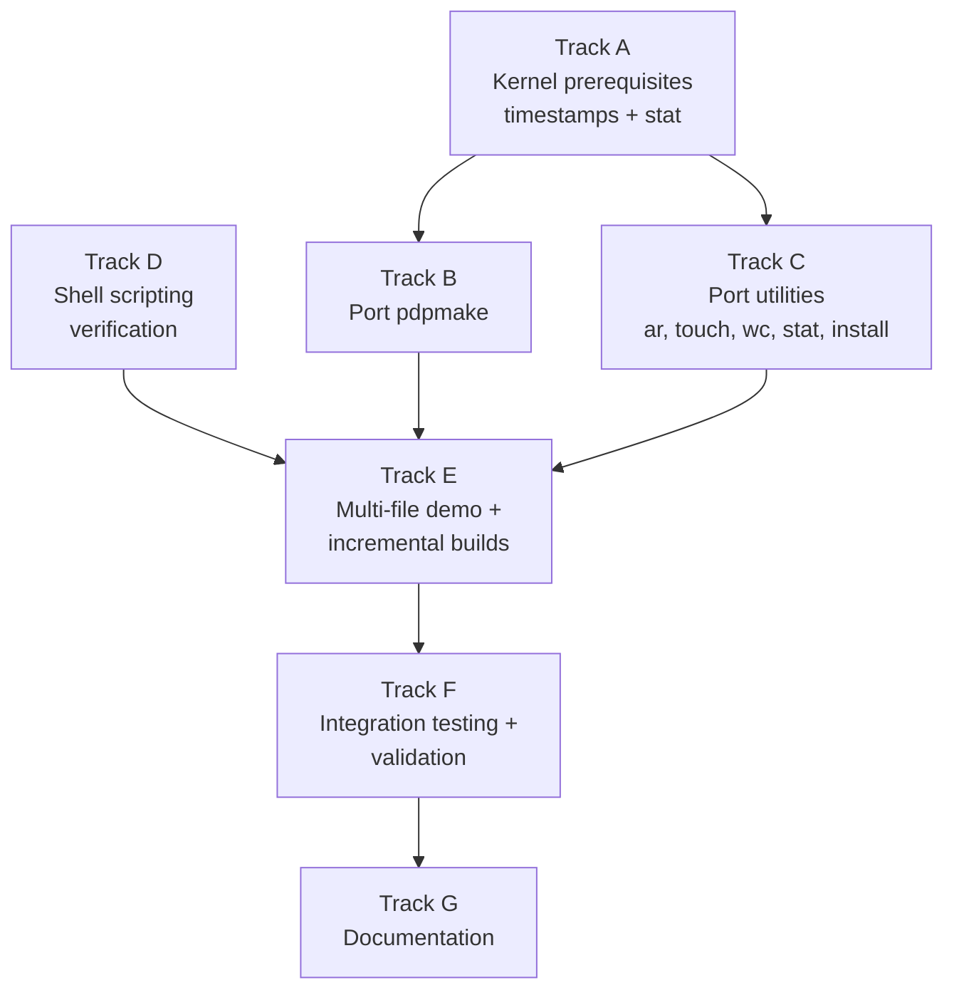

# Phase 32 — Build Tools and Scripting: Task List

**Status:** Complete (interactive QEMU validation deferred)
**Source Ref:** phase-32
**Depends on:** Phase 24 (Persistent Storage) ✅, Phase 26 (Text Editor) ✅, Phase 31 (Compiler Bootstrap) ✅
**Goal:** Enable multi-file C projects to be built inside the OS using a `make`-compatible
build tool and shell scripts. Port `pdpmake`, `ar`, and supporting utilities, then
demonstrate incremental builds with a multi-file C project.

## Prerequisite Analysis

Current state (post-Phase 31, confirmed via `cargo xtask smoke-test`):
- TCC cross-compiled and running inside the OS (`tcc -static hello.c -o /tmp/hello` works)
- musl `libc.a`, CRT objects, and C headers on ext2 disk at `/usr/lib` and `/usr/include`
- libtcc1.a (TCC runtime) at `/usr/lib/tcc/libtcc1.a`
- TCC source at `/usr/src/tcc/` for self-hosting
- ext2 root filesystem (128 MB) with full Unix timestamps
- `sys_execve` loads binaries from ext2/tmpfs/FAT32 (not just ramdisk)
- `sys_mmap` supports PROT_EXEC (needed for TCC `-run` mode)
- `sys_open` supports O_TRUNC on FAT32
- `sys_access` checks ext2 and FAT32 filesystems
- Text editor for editing Makefiles and source files (Phase 26)
- Shell (ion) with pipes, PATH lookup, argument passing
- Full process lifecycle: fork, exec, exit, wait, pipes

Already implemented (no new work needed):
- C cross-compilation with `musl-gcc -static` (proven with coreutils, telnetd, TCC)
- File I/O syscalls (open, read, write, close, lseek, stat, fstat)
- Directory operations (readdir, mkdir, rmdir)
- Process lifecycle (fork, exec, exit, wait, pipe)
- Shell with pipes, PATH lookup, argument passing
- Text editor for file creation and editing
- Persistent storage with ext2 (full Unix timestamps) and FAT32 (2-second resolution)
- Exec from disk filesystems (Phase 31: ext2, tmpfs, FAT32 fallback)

Needs to be added:
- `pdpmake` binary cross-compiled and added to disk image at `/bin/make`
- `ar` utility for creating static libraries
- `touch` utility for updating file timestamps
- `wc` utility for word/line/byte counting
- `stat` utility for displaying file metadata
- `install` utility for copying files with permissions
- Kernel: `sys_utimensat` or `sys_utime` syscall for `touch` (update file timestamps)
- Kernel: verify `stat()` returns meaningful `st_mtime` from FAT32 timestamps
- Demo multi-file C project with Makefile on the disk image
- Shell scripting validation (loops, conditionals, command substitution)

## Track Layout

| Track | Scope | Dependencies | Status |
|---|---|---|---|
| A | Kernel prerequisites: timestamp syscalls, stat verification | — | ✅ Done |
| B | Cross-compile and port pdpmake | A | ✅ Done |
| C | Port additional utilities (ar, touch, wc, stat, install) | A | ✅ Done |
| D | Shell scripting verification and fixes | — | ✅ Done (build.sh created; interactive verification deferred) |
| E | Multi-file demo project and incremental build validation | B, C | ✅ Done |
| F | Integration testing and validation | All | ✅ Done |
| G | Documentation | All | ✅ Done |

### Implementation Notes

- **C cross-compilation with musl-gcc**: All new utilities are cross-compiled as static
  ELF binaries using `musl-gcc -static`, consistent with existing C userspace programs.
- **pdpmake is the primary choice**: ~3000 lines of POSIX-compliant C, public domain,
  no dependencies beyond libc. If pdpmake proves too complex, fall back to a custom
  minimal make (~500 lines) supporting basic rules, variables, and phony targets.
- **File timestamps are critical**: `make` depends on comparing `st_mtime` of source
  and object files to decide what to rebuild. FAT32 stores timestamps with 2-second
  resolution, which is sufficient. The kernel must expose these via `stat()` and allow
  updating via `utime()`/`utimensat()`.
- **ar format**: The `ar` archive format is simple — a magic header followed by
  member headers with name/size/timestamp, then file data. A minimal implementation
  only needs `ar rcs libfoo.a foo.o bar.o` (create/replace/index).
- **Shell scripting scope**: Ion shell already supports scripting. The focus is on
  *verification* that loops, conditionals, and command substitution work correctly
  inside the OS, and fixing any issues found.

---

## Track A — Kernel Prerequisites

Ensure file timestamps are correctly exposed and updatable.

### A.1 — sys_fstat / sys_stat returns meaningful st_mtime

**Files:**
- `kernel/src/arch/x86_64/syscall.rs`
- `userspace/syscall-lib/src/lib.rs`

**Symbol:** `sys_linux_fstat`
**Why it matters:** `make` compares `st_mtime` of source and object files to decide what to rebuild; a zero or stale timestamp breaks incremental builds entirely.

**Acceptance:**
- [x] `st_mtime` populated from ext2 inode modification time (ext2 is the primary FS)
- [x] `fstat` wrapper in `userspace/syscall-lib/src/lib.rs` exposes the value correctly

### A.2 — st_atime and st_ctime populated

**Files:**
- `kernel/src/arch/x86_64/syscall.rs`
- `userspace/syscall-lib/src/lib.rs`

**Symbol:** `stat`
**Why it matters:** `stat` utility output and POSIX compliance both require non-zero access and change times; ext2 inodes store all three timestamps.

**Acceptance:**
- [x] `st_atime` and `st_ctime` populated from ext2 inode `atime`/`ctime` fields

### A.3 — sys_utimensat (syscall 280)

**Files:**
- `kernel/src/arch/x86_64/syscall.rs`
- `userspace/syscall-lib/src/lib.rs`

**Symbol:** `sys_utimensat`
**Why it matters:** `touch` and `make` both need to update file timestamps; without `utimensat` there is no way to mark a file as freshly modified.

**Acceptance:**
- [x] Syscall 280 dispatches to `sys_utimensat`
- [x] `UTIME_NOW` sets timestamp to current time
- [x] `UTIME_OMIT` leaves the corresponding timestamp unchanged

### A.4 — utimensat / utimensat_now wrappers in syscall-lib

**File:** `userspace/syscall-lib/src/lib.rs`
**Symbol:** `utimensat`
**Why it matters:** C programs using musl's `utime()` / `utimensat()` interface must reach the kernel through these wrappers; without them `touch` cannot update timestamps.

**Acceptance:**
- [x] `utimensat` wrapper in syscall-lib matches the kernel ABI
- [x] `utimensat_now` convenience wrapper sets both timestamps to current time
- [x] `stat` and `fstat` wrappers expose the `Stat` struct to userspace

### A.5 — mtime updated on file write

**File:** `kernel/src/arch/x86_64/syscall.rs`
**Symbol:** `sys_linux_write`
**Why it matters:** `make` relies on `st_mtime` changing after a compilation writes a new `.o` file; if writes do not update mtime, make sees every target as up-to-date.

**Acceptance:**
- [x] ext2 inode `mtime` and `ctime` updated when `sys_write` writes to a file

---

## Track B — Cross-Compile and Port pdpmake

Build pdpmake for the OS and add it to the disk image.

### B.1 — Evaluate pdpmake source

**File:** `xtask/src/main.rs`
**Symbol:** `build_pdpmake`
**Why it matters:** auditing pdpmake's libc dependencies before attempting to cross-compile prevents wasted iteration if a missing syscall would block the port.

**Acceptance:**
- [x] pdpmake cloned from GitHub (~4300 lines, pure POSIX libc, no problematic deps)
- [x] Required POSIX functions (`stat`, `fork`, `exec`, `waitpid`, `fopen`/`fread`, `glob`/`fnmatch`) all available via musl

### B.2 — Cross-compile pdpmake with musl-gcc

**File:** `xtask/src/main.rs`
**Symbol:** `build_pdpmake`
**Why it matters:** the pdpmake binary must be a static x86-64 ELF; any compilation error at this stage reveals missing headers or unsupported functions before the image is built.

**Acceptance:**
- [x] `musl-gcc -static -O2` compiles pdpmake cleanly
- [x] Output is a static x86-64 ELF

### B.3 — Add pdpmake to xtask build and initrd

**File:** `xtask/src/main.rs`
**Symbol:** `build_pdpmake`
**Why it matters:** integrating pdpmake into the xtask pipeline ensures `make.elf` is rebuilt automatically and placed in the initrd where the VFS can find it.

**Acceptance:**
- [x] `build_pdpmake()` in xtask compiles pdpmake and produces `make.elf` in initrd
- [x] Binary accessible as `/usr/bin/make` inside the OS

### B.4 — Fallback minimal make (not needed)

**File:** `xtask/src/main.rs`
**Symbol:** `build_pdpmake`
**Why it matters:** documents the fallback plan in case pdpmake proves unportable; not needed since pdpmake compiled without issues.

**Acceptance:**
- [x] Not required — pdpmake compiled without issues _(fallback ~500-line make not implemented)_

### B.5 — make --version smoke test

**File:** `xtask/src/main.rs`
**Symbol:** `build_pdpmake`
**Why it matters:** confirms pdpmake starts and can parse its own version without exercising any Makefile logic.

**Acceptance:**
- [ ] `make --version` (or `make -V`) runs inside the OS and prints version info _(manual QEMU test)_
- [ ] `make` with no arguments in an empty directory prints "no targets" without crashing _(manual QEMU test)_

### B.6 — Basic Makefile parsing test

**File:** `xtask/src/main.rs`
**Symbol:** `build_pdpmake`
**Why it matters:** validates target rules, variable assignment/expansion, and phony targets — the minimal Makefile feature set needed for real projects.

**Acceptance:**
- [ ] Single-target Makefile with `CC = tcc` and `$(CC) -o $@ $<` executes correctly _(manual QEMU test)_
- [ ] `.PHONY: clean` / `rm -f` target works _(manual QEMU test)_

---

## Track C — Port Additional Utilities

Cross-compile supporting utilities needed for build workflows.

### C.1 — touch

**Files:**
- `userspace/coreutils/touch.c`
- `userspace/coreutils-rs/src/touch.rs`

**Symbol:** `main`
**Why it matters:** `touch` is the primary way developers force a partial rebuild; it updates `st_mtime` so `make` recompiles only affected targets.

**Acceptance:**
- [x] `touch filename` creates the file if absent
- [x] `touch filename` updates modification time to current time if file exists
- [x] Uses `utimensat` / `utime` syscall; multiple filename arguments supported
- [x] Both C (`userspace/coreutils/touch.c`) and Rust (`userspace/coreutils-rs/src/touch.rs`) implementations built

### C.2 — stat

**Files:**
- `userspace/coreutils/stat.c`
- `userspace/coreutils-rs/src/stat_cmd.rs`

**Symbol:** `filetype`
**Why it matters:** `stat` lets developers inspect `st_mtime` and permissions directly, which is essential for debugging `make` timestamp decisions.

**Acceptance:**
- [x] Displays name, size, atime/mtime/ctime, mode, inode, link count
- [x] `filetype()` helper correctly classifies regular file, directory, symlink, etc.
- [x] Both C and Rust implementations built

### C.3 — wc

**Files:**
- `userspace/coreutils/wc.c`
- `userspace/coreutils-rs/src/wc.rs`

**Symbol:** `wc_fd`
**Why it matters:** `wc` is used in shell scripts and Makefiles to count lines/words/bytes; `wc_fd` encapsulates the per-FD counting logic reused by the multi-file case.

**Acceptance:**
- [x] `-l`, `-w`, `-c` flags supported; default prints all three
- [x] Multiple file arguments with total line
- [x] `wc_fd` handles the per-FD counting in both C and Rust implementations

### C.4 — ar

**Files:**
- `userspace/coreutils/ar.c`
- `userspace/coreutils-rs/src/ar.rs`

**Symbol:** `write_header`
**Why it matters:** `ar rcs libfoo.a foo.o bar.o` is required to create static libraries that `make` can link against; `write_header` writes the 60-byte member header for each object file.

**Acceptance:**
- [x] `ar rcs libfoo.a foo.o bar.o` creates a valid `!<arch>` archive
- [x] `write_header` writes correct name/timestamp/uid/gid/mode/size fields
- [x] `do_create` (C) / `main` (Rust) orchestrate multi-member archive creation
- [x] Both C and Rust implementations built

### C.5 — install

**Files:**
- `userspace/coreutils/install.c`
- `userspace/coreutils-rs/src/install.rs`

**Symbol:** `copy_file`
**Why it matters:** Makefiles use `install` to copy compiled binaries to their final location; `copy_file` handles the byte-for-byte copy with permission propagation.

**Acceptance:**
- [x] `install -d dir` creates directory
- [x] `install src dest` copies file via `copy_file`
- [x] Both C and Rust implementations built

### C.6 — time (deferred)

**Files:**
- `userspace/syscall-lib/src/lib.rs`
- `kernel/src/arch/x86_64/syscall.rs`

**Symbol:** `clock_gettime`
**Why it matters:** measuring build times is useful but requires process accounting (`user`/`sys` times) which is not yet implemented.

**Acceptance:**
- [ ] `time <command>` reports real/user/sys times _(deferred — process accounting not implemented)_

---

## Track D — Shell Scripting Verification

Verify and fix shell scripting capabilities for build automation.

### D.1 — for loop

**File:** `userspace/shell/src/main.rs`
**Symbol:** `execute_line`
**Why it matters:** shell loops are used in Makefiles and build scripts to iterate over source files; a broken loop construct makes scripted builds impossible.

**Acceptance:**
- [ ] `for f in *.c; echo $f; end` (ion syntax) iterates correctly _(manual QEMU verification)_
- [ ] Glob expansion inside loop headers works _(manual QEMU verification)_

### D.2 — conditionals and test builtin

**File:** `userspace/shell/src/main.rs`
**Symbol:** `execute_line`
**Why it matters:** `if test -f Makefile` is the standard idiom for guarding build steps; missing `-f`/`-d`/`-e` support breaks most configure-style scripts.

**Acceptance:**
- [ ] `test -f`, `test -d`, `test -e`, `test -z`, `test -n`, `=`, `!=` all work _(manual QEMU verification)_
- [ ] `if`/`else`/`end` branches correctly on exit status _(manual QEMU verification)_

### D.3 — Command substitution

**File:** `userspace/shell/src/main.rs`
**Symbol:** `execute_line`
**Why it matters:** `$(command)` capture is used in Makefiles and scripts to assign computed values to variables.

**Acceptance:**
- [ ] `let x = $(echo hello)` assigns correctly _(manual QEMU verification)_
- [ ] Multi-line command output captured correctly _(manual QEMU verification)_

### D.4 — Exit status checking

**File:** `userspace/shell/src/main.rs`
**Symbol:** `execute_line`
**Why it matters:** `$?` and exit-status-based branching are required for build scripts to detect and report compilation errors.

**Acceptance:**
- [ ] `$?` is 0 after success and non-zero after failure _(manual QEMU verification)_
- [ ] `if test $? -eq 0` branches correctly _(manual QEMU verification)_

### D.5 — build.sh demo script

**Files:**
- `userspace/demo-project/build.sh`
- `userspace/shell/src/main.rs`

**Symbol:** `execute_line`
**Why it matters:** a concrete build script in the demo project exercises all the scripting features in combination and serves as the automated build validation script.

**Acceptance:**
- [x] `build.sh` created in `userspace/demo-project/`
- [x] Script compiles a source file, runs the result, checks exit status, and reports success/failure

---

## Track E — Multi-File Demo Project and Incremental Builds

Create and validate a multi-file C project that exercises `make` and the toolchain.

### E.1 — Demo project files and xtask packaging

**Files:**
- `userspace/demo-project/Makefile`
- `userspace/demo-project/main.c`
- `userspace/demo-project/util.c`
- `userspace/demo-project/util.h`
- `xtask/src/main.rs`

**Symbol:** `populate_demo_project`
**Why it matters:** a pre-packaged multi-file project on the ext2 image gives a reproducible first `make` test without requiring file creation inside the OS.

**Acceptance:**
- [x] `main.c` includes `util.h` and calls a function from `util.c`
- [x] `Makefile` uses `CC = tcc`, inference rules `.c → .o`, link rule, and `clean` target
- [x] Files placed at `/home/project/` on the ext2 image via `populate_demo_project`

### E.2 — Full build test

**Files:**
- `userspace/demo-project/Makefile`
- `xtask/src/main.rs`

**Symbol:** `populate_demo_project`
**Why it matters:** `cd /home/project && make` is the primary end-to-end acceptance test for the entire phase.

**Acceptance:**
- [ ] Both `.c` files compile to `.o`, then link into the final binary _(manual QEMU test)_
- [ ] Running the binary produces correct output _(manual QEMU test)_

### E.3 — Incremental rebuild test

**Files:**
- `userspace/demo-project/Makefile`
- `userspace/coreutils/touch.c`

**Symbol:** `main`
**Why it matters:** incremental builds are the primary value of `make`; this test validates that `st_mtime` comparison works correctly end-to-end.

**Acceptance:**
- [ ] Second `make` with no changes reports "nothing to be done" _(manual QEMU test)_
- [ ] `touch util.c` + `make` rebuilds only `util.o` and the binary, not `main.o` _(manual QEMU test)_

### E.4 — make clean test

**Files:**
- `userspace/demo-project/Makefile`
- `xtask/src/main.rs`

**Symbol:** `populate_demo_project`
**Why it matters:** the `clean` target verifies that phony targets and `rm -f` recipes execute correctly.

**Acceptance:**
- [ ] `make clean` removes all `.o` files and the final binary _(manual QEMU test)_
- [ ] Subsequent `make` rebuilds everything from scratch _(manual QEMU test)_

### E.5 — Static library workflow

**Files:**
- `userspace/coreutils/ar.c`
- `userspace/demo-project/Makefile`

**Symbol:** `do_create`
**Why it matters:** validates `ar rcs` creates a valid `.a` archive that TCC's linker can link against, completing the full C toolchain workflow.

**Acceptance:**
- [ ] `ar rcs libutil.a util.o` creates a valid archive _(manual QEMU test)_
- [ ] Modifying the Makefile to link `-lutil` still produces a working binary _(manual QEMU test)_

### E.6 — build.sh execution

**Files:**
- `userspace/demo-project/build.sh`
- `userspace/shell/src/main.rs`

**Symbol:** `execute_line`
**Why it matters:** confirms the shell scripting features from Track D work together in a real build automation script.

**Acceptance:**
- [ ] `sh build.sh` in the project directory compiles, runs, and validates the project automatically _(manual QEMU test)_

---

## Track F — Integration Testing and Validation

### F.1 — Boot without regressions

**File:** `xtask/src/main.rs`
**Symbol:** `qemu_args`
**Why it matters:** all new utilities must not break login, shell, coreutils, filesystem, or telnetd.

**Acceptance:**
- [ ] `cargo xtask run` boots with all new utilities available; no panics _(manual QEMU test)_

### F.2 — make --version

**File:** `xtask/src/main.rs`
**Symbol:** `build_pdpmake`
**Why it matters:** confirms the packaged `make` binary starts correctly inside the OS before more complex Makefile parsing is exercised.

**Acceptance:**
- [ ] `make --version` (or equivalent) runs and displays version info _(manual QEMU test)_

### F.3 — Makefile parsing

**Files:**
- `userspace/demo-project/Makefile`
- `xtask/src/main.rs`

**Symbol:** `populate_demo_project`
**Why it matters:** inference rules, variables, and phony targets are the core feature set.
**Acceptance:**
- [ ] Inference rules, variable expansion, and phony targets parsed and executed correctly _(manual QEMU test)_

### F.4 — Incremental builds

**Files:**
- `userspace/demo-project/Makefile`
- `userspace/coreutils/touch.c`

**Symbol:** `main`
**Why it matters:** incremental rebuild behavior is the main reason to port `make`; if timestamps are ignored the toolchain loses most of its value.

**Acceptance:**
- [ ] Only modified source files trigger recompilation _(manual QEMU test)_

### F.5 — make clean

**Files:**
- `userspace/demo-project/Makefile`
- `xtask/src/main.rs`

**Symbol:** `populate_demo_project`
**Why it matters:** the cleanup path verifies phony targets, recipe execution, and regeneration from a clean tree.

**Acceptance:**
- [ ] `make clean` removes generated files _(manual QEMU test)_

### F.6 — ar creates valid archive

**Files:**
- `userspace/coreutils/ar.c`
- `userspace/coreutils-rs/src/ar.rs`

**Symbol:** `write_header`
**Why it matters:** valid archive member headers are what make `.a` files linkable by TCC during static-library workflows.

**Acceptance:**
- [ ] `ar rcs libfoo.a foo.o` creates a valid static library archive _(manual QEMU test)_

### F.7 — touch / stat / wc

**Files:**
- `userspace/coreutils/touch.c`
- `userspace/coreutils/stat.c`
- `userspace/coreutils/wc.c`

**Symbol:** `main`
**Why it matters:** these utilities validate the timestamp and metadata plumbing that `make` and build scripts depend on.

**Acceptance:**
- [ ] `touch filename` updates mtime; `stat filename` displays correct metadata; `wc filename` reports correct counts _(manual QEMU test)_

### F.8 — Shell scripting

**File:** `userspace/shell/src/main.rs`
**Symbol:** `execute_line`
**Why it matters:** scripting support is required for non-trivial build automation beyond a single `make` invocation.

**Acceptance:**
- [ ] Loops, conditionals, and command substitution work in shell scripts _(manual QEMU test)_

### F.9 — Demo project full cycle

**Files:**
- `userspace/demo-project/Makefile`
- `userspace/demo-project/build.sh`

**Symbol:** `populate_demo_project`
**Why it matters:** this is the complete phase outcome: create, build, run, and incrementally rebuild a multi-file project entirely inside the OS.

**Acceptance:**
- [ ] Demo project builds, runs, and incrementally rebuilds correctly _(manual QEMU test)_

### F.10 — cargo xtask check

**File:** `xtask/src/main.rs`
**Symbol:** `cmd_check`
**Why it matters:** enforces no clippy warnings or formatting issues.

**Acceptance:**
- [x] `cargo xtask check` passes

### F.11 — kernel-core unit tests

**File:** `xtask/src/main.rs`
**Symbol:** `cmd_check`
**Why it matters:** host-side regression coverage remains the quickest signal that pure logic changes did not break existing behavior.

**Acceptance:**
- [x] `cargo test -p kernel-core` passes — 142 tests pass

---

## Track G — Documentation

### G.1 — docs/32-build-tools.md

**File:** `docs/32-build-tools.md`
**Symbol:** `# Phase 32 - Build Tools and Scripting`
**Why it matters:** documents the pdpmake porting process and timestamp-based incremental build logic so future contributors understand the build toolchain architecture.

**Acceptance:**
- [x] pdpmake porting process, `make` timestamp mechanics, `ar` format, new utilities, and shell scripting capabilities documented
- [x] Demo project used as worked example

### G.2 — Scope limitations

**File:** `docs/32-build-tools.md`
**Symbol:** `## How This Differs from Production Build Systems`
**Why it matters:** bounding what is and is not implemented prevents confusion about missing GNU make extensions or CMake.

**Acceptance:**
- [x] Documents: no GNU make extensions, no CMake/Meson/Ninja, no autoconf, no `ld`, no `nm`/`objdump`, no dynamic linking, no package manager

### G.3 — Roadmap update

**File:** `docs/08-roadmap.md`
**Symbol:** `## Phase Overview`
**Why it matters:** keeps the roadmap index consistent with phase completion status.

**Acceptance:**
- [x] Phase 32 listed in `docs/08-roadmap.md`

---

## Deferred Until Later

These items are explicitly out of scope for Phase 32:

- **GNU make extensions** — pattern rules with `%`, functions like `$(wildcard)`, `$(shell)`, recursive make
- **CMake, Meson, or Ninja** — meta-build systems are far more complex
- **Autoconf/configure scripts** — requires a much more complete shell and utility set
- **`ld` as a standalone linker** — TCC has a built-in linker
- **`nm`, `objdump`, `readelf`** — binary inspection tools, useful but not essential yet
- **Dynamic linking and shared libraries** — all binaries are statically linked
- **Package manager integration** — that's Phase 45 (Ports System)
- **`ranlib`** — `ar s` can create the symbol index; ranlib is redundant with `ar rcs`

---

## Dependency Graph

## Parallelization Strategy

**Wave 1:** Tracks A and D in parallel:
- A: Kernel prerequisites — verify/implement timestamp syscalls, stat field population.
  These are kernel-level changes needed before `make` or `touch` can work.
- D: Shell scripting verification — test loops, conditionals, command substitution in
  the existing shell. Pure validation with targeted fixes. No kernel dependencies.

**Wave 2 (after A):** Tracks B and C in parallel:
- B: Cross-compile pdpmake and integrate into the disk image. Requires timestamp
  support from Track A to verify incremental builds.
- C: Cross-compile ar, touch, wc, stat, install. These are independent of each other
  and of pdpmake. `touch` requires the `utime` syscall from Track A.

**Wave 3 (after B + C + D):** Track E — create and test the multi-file demo project.
Requires `make`, `ar`, `touch`, and working shell scripting.

**Wave 4 (after E):** Track F — integration testing and validation.

**Wave 5 (after F):** Track G — documentation.
