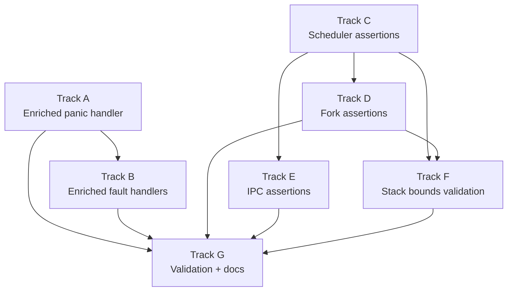

# Phase 43a — Crash Diagnostics & Assertions: Task List

**Status:** Complete
**Source Ref:** phase-43a
**Depends on:** Phase 35 (True SMP Multitasking) ✅, Phase 43 (SSH Server) ✅
**Goal:** Make every kernel crash self-diagnosing by enriching the panic handler and
fault handlers with full register dumps, task metadata, scheduler state, and per-core
context. Backfill `debug_assert!` invariants at every scheduler, fork, and IPC boundary
so that state corruption is caught at the point of origin rather than surfacing later
as an opaque `RIP=0x4` fault.

## Track Layout

| Track | Scope | Dependencies | Status |
|---|---|---|---|
| A | Enriched panic handler | — | ✅ Done |
| B | Enriched fault handlers (page fault, GPF, double fault) | A | ✅ Done |
| C | Scheduler boundary assertions | — | ✅ Done |
| D | Fork boundary assertions | C | ✅ Done |
| E | IPC boundary assertions | C | ✅ Done |
| F | Stack bounds validation | C, D | ✅ Done |
| G | Validation and documentation | A–F | ✅ Done |

---

## Track A — Enriched Panic Handler

Replace the minimal file:line panic handler with a full diagnostic dump that
prints registers, current task info, and per-core state on every kernel panic.

### A.1 — Dump CPU registers on panic

**File:** `kernel/src/panic_diag.rs`
**Symbol:** `capture_registers`
**Why it matters:** The previous panic handler printed only the file, line, and message; without register state, the developer cannot determine what value was in RSP or any GPR at the point of failure.

**Acceptance:**
- [x] Panic handler captures RAX, RBX, RCX, RDX, RSI, RDI, RBP, RSP, R8–R15, RFLAGS, CR2, CR3 via inline assembly
- [x] All registers printed via `_panic_print` (deadlock-safe serial path)
- [x] Output formatted as `REG=0x{:016x}` for grep-ability

### A.2 — Dump current task info on panic

**File:** `kernel/src/panic_diag.rs`
**Symbol:** `dump_current_task`
**Why it matters:** Without knowing which task was running, the developer cannot correlate the panic with a specific fork child, IPC server, or shell session.

**Acceptance:**
- [x] Reads `per_core().current_task_idx` and, if valid, prints task index, `TaskId`, `TaskState`, `saved_rsp`, `pid`, `assigned_core`, and `priority`
- [x] If `current_task_idx` is -1 (scheduler loop), prints "no active task (scheduler loop)"
- [x] Uses `try_lock_scheduler()` to avoid deadlock; prints "scheduler lock held -- skipping task dump" on contention

### A.3 — Dump per-core state on panic

**File:** `kernel/src/panic_diag.rs`
**Symbol:** `dump_per_core_state`
**Why it matters:** SMP race bugs depend on knowing the state of all cores, not just the faulting one; a stale `saved_rsp` or orphaned `current_task_idx` on another core is often the root cause.

**Acceptance:**
- [x] Iterates all online cores (up to `MAX_CORES`) and prints: `core_id`, `is_online`, `current_task_idx`, `reschedule` flag, run queue length
- [x] Uses `try_lock()` on each core's `run_queue`; prints "locked" if unavailable
- [x] Prints the faulting core's ID prominently with a `>>>` marker

### A.4 — Extract panic diagnostics into a helper module

**File:** `kernel/src/panic_diag.rs` (new)
**Symbol:** `dump_crash_context`
**Why it matters:** Fault handlers (Track B) and the future trace-ring dump (Phase 43b) also need the same diagnostic output; extracting it avoids code duplication and keeps the panic handler readable.

**Acceptance:**
- [x] `dump_crash_context()` function prints registers, task info, and per-core state using `_panic_print`
- [x] Called from the panic handler (A.1–A.3) and from fault handlers (Track B)
- [x] All serial output uses the deadlock-safe `_panic_print` path from `kernel/src/serial.rs`

---

## Track B — Enriched Fault Handlers

Upgrade page fault, GPF, and double fault handlers to print full diagnostic
context instead of a single-line message.

### B.1 — Enrich page fault handler (userspace)

**File:** `kernel/src/arch/x86_64/interrupts.rs`
**Symbol:** `page_fault_handler`
**Why it matters:** The userspace page fault handler prints PID, address, error code, and RIP, but not RSP, task state, scheduler state, or per-core context — exactly the information needed to diagnose the `RIP=0x4` crash.

**Acceptance:**
- [x] Prints RSP from interrupt stack frame alongside RIP
- [x] Prints current task index, `TaskState`, and `saved_rsp` from scheduler
- [x] Calls `dump_crash_context()` from `panic_diag` for full per-core dump
- [x] Existing `fault_kill_trampoline` redirect still works correctly after the enriched output

### B.2 — Enrich page fault handler (kernel)

**File:** `kernel/src/arch/x86_64/interrupts.rs`
**Symbol:** `page_fault_handler`
**Why it matters:** The ring-0 page fault path prints only address, error code, and the raw `InterruptStackFrame`; enriching it with the same diagnostic context makes kernel-mode crashes as diagnosable as userspace ones.

**Acceptance:**
- [x] Ring-0 page fault path calls `dump_crash_context()`
- [x] CR3 value printed (identifies which process's page table is active)
- [x] Output clearly labeled as "KERNEL page fault" to distinguish from userspace

### B.3 — Enrich GPF handler

**File:** `kernel/src/arch/x86_64/interrupts.rs`
**Symbol:** `general_protection_fault_handler`
**Why it matters:** The GPF handler prints only the stack frame debug output; a GPF during context switch or sysret needs the same rich diagnostic context as a page fault.

**Acceptance:**
- [x] Userspace GPF path prints PID, task index, `TaskState`, and calls `dump_crash_context()`
- [x] Ring-0 GPF path calls `dump_crash_context()`
- [x] Error code printed and decoded (segment selector index, table indicator, external flag)

### B.4 — Enrich double fault handler

**File:** `kernel/src/arch/x86_64/interrupts.rs`
**Symbol:** `double_fault_handler`
**Why it matters:** The double fault handler prints only the stack frame; a double fault usually means a stack overflow or corrupted IDT/GDT, and the per-core state is essential to understand which core and task caused it.

**Acceptance:**
- [x] Calls `dump_crash_context()` for full register and per-core state
- [x] Prints the IST stack pointer to help detect stack overflow

---

## Track C — Scheduler Boundary Assertions

Add `debug_assert!` checks at every scheduler state transition to catch
corruption at the point of origin.

### C.1 — Assertions in `pick_next`

**File:** `kernel/src/task/scheduler.rs`
**Symbol:** `pick_next`
**Why it matters:** `pick_next` selects and returns a task's `saved_rsp` for dispatch; a stale or zero `saved_rsp` causes the exact `RIP=0x4` crash pattern observed in production.

**Acceptance:**
- [x] `debug_assert!(saved_rsp != 0)` on idle task path before returning
- [x] `debug_assert!(task.state == TaskState::Ready)` before dispatch on local queue and global fallback paths
- [x] `debug_assert!(task.affinity_mask & core_bit != 0)` confirming affinity on local queue and global fallback paths

### C.2 — Assertions in `yield_now`

**File:** `kernel/src/task/scheduler.rs`
**Symbol:** `yield_now`
**Why it matters:** `yield_now` passes a raw `saved_rsp` pointer to `switch_context`; if the task index is out of bounds or the scheduler RSP is zero, the context switch corrupts the stack.

**Acceptance:**
- [x] `debug_assert!(idx < sched.tasks.len())` before accessing task fields
- [x] `debug_assert!(sched_rsp != 0, "yield_now: scheduler RSP is zero on core {}")` before `switch_context`

### C.3 — Assertions in `block_current`

**File:** `kernel/src/task/scheduler.rs`
**Symbol:** `block_current`
**Why it matters:** `block_current` transitions a running task to a blocked state and does a context switch; if the task was already blocked or dead, the state machine is corrupted.

**Acceptance:**
- [x] `debug_assert!(sched.tasks[idx].state == TaskState::Running)` before state change
- [x] `debug_assert!(sched_rsp != 0)` before `switch_context`

### C.4 — Assertions in `wake_task`

**File:** `kernel/src/task/scheduler.rs`
**Symbol:** `wake_task`
**Why it matters:** `wake_task` transitions a blocked task to Ready and enqueues it; if the task index is invalid, subsequent operations would corrupt the task list.

**Acceptance:**
- [x] `debug_assert!(idx < sched.tasks.len())` after `find(id)` returns `Some(idx)`

### C.5 — Assertions in `run` dispatch path

**File:** `kernel/src/task/scheduler.rs`
**Symbol:** `run`
**Why it matters:** The main dispatch loop reads `task_rsp` and calls `switch_context`; assertions here are the last guardrail before a bad context switch.

**Acceptance:**
- [x] `debug_assert!(task_rsp != 0, "dispatch: task {} has zero saved_rsp on core {}")` before `switch_context`
- [x] `debug_assert!(task.state == TaskState::Running)` after marking Running
- [x] `debug_assert!(sidx < sched.tasks.len())` on the `PENDING_SWITCH_OUT` path

### C.6 — Assertions in `enqueue_to_core`

**File:** `kernel/src/task/scheduler.rs`
**Symbol:** `enqueue_to_core`
**Why it matters:** `enqueue_to_core` pushes a task index into a per-core run queue; an out-of-bounds core_id would silently drop the enqueue.

**Acceptance:**
- [x] `debug_assert!((core_id as usize) < MAX_CORES)` at entry

---

## Track D — Fork Boundary Assertions

Add `debug_assert!` checks at the fork context creation, consumption, and
syscall boundaries to catch corrupted fork state before it causes a crash.

### D.1 — Assertions in `make_fork_ctx`

**File:** `kernel/src/process/mod.rs`
**Symbol:** `make_fork_ctx`
**Why it matters:** `make_fork_ctx` creates a `ForkChildCtx` that is stored in the child task's `fork_ctx` field; if `user_rip` or `user_rsp` is zero or non-canonical, the child will fault immediately on dispatch.

**Acceptance:**
- [x] `debug_assert!(user_rip != 0, "make_fork_ctx: user_rip is zero for pid {}")` at entry
- [x] `debug_assert!(user_rsp != 0, "make_fork_ctx: user_rsp is zero for pid {}")` at entry
- [x] `debug_assert!(user_rip < 0x0000_8000_0000_0000, "make_fork_ctx: non-canonical user_rip {:#x}")` to catch kernel addresses leaking

### D.2 — Assertions in `fork_child_trampoline`

**File:** `kernel/src/process/mod.rs`
**Symbol:** `fork_child_trampoline`
**Why it matters:** `fork_child_trampoline` takes the fork context from the current task and enters ring 3; if the context has a zero RIP or the process has no page table, the result is the `RIP=0x4` crash.

**Acceptance:**
- [x] `debug_assert!(ctx.user_rip != 0, "fork_child_trampoline: user_rip is zero for pid {}")` after context retrieval
- [x] `debug_assert!(ctx.user_rsp != 0, "fork_child_trampoline: user_rsp is zero for pid {}")` after context retrieval
- [x] `debug_assert!(cr3_phys.is_some(), "fork_child_trampoline: pid {} has no page table")` after process lookup

### D.3 — Assertions in `sys_fork`

**File:** `kernel/src/arch/x86_64/syscall.rs`
**Symbol:** `sys_fork`
**Why it matters:** `sys_fork` orchestrates page table cloning, process table insertion, and task spawning; assertions at each boundary verify the chain is consistent before the child is made schedulable.

**Acceptance:**
- [x] `debug_assert!(child_cr3.start_address().as_u64() != 0)` after `new_process_page_table`
- [x] Assert that the child PID exists in `PROCESS_TABLE` after insertion

### D.4 — Assertions in `spawn_fork_task`

**File:** `kernel/src/task/scheduler.rs`
**Symbol:** `spawn_fork_task`
**Why it matters:** `spawn_fork_task` stores the `ForkChildCtx` in the task's `fork_ctx` field; confirming it was stored successfully guards against a logic error that would leave the field as `None` and cause `fork_child_trampoline` to panic.

**Acceptance:**
- [x] `debug_assert!(task.fork_ctx.is_some(), "spawn_fork_task: fork_ctx missing after set")` after assignment

---

## Track E — IPC Boundary Assertions

Add `debug_assert!` checks at IPC block/wake boundaries to catch lost wakeups
and message delivery ordering bugs.

### E.1 — Assertions in `recv_msg`

**File:** `kernel/src/ipc/endpoint.rs`
**Symbol:** `recv_msg`
**Why it matters:** `recv_msg` blocks the current task if no sender is waiting, then expects a pending message after waking; a lost wakeup means the task wakes with no message.

**Acceptance:**
- [x] `debug_assert!((ep_id.0 as usize) < MAX_ENDPOINTS)` at entry

### E.2 — Assertions in `send`

**File:** `kernel/src/ipc/endpoint.rs`
**Symbol:** `send`
**Why it matters:** `send` either wakes a waiting receiver or blocks the sender; if `wake_task` fails, the receiver never processes the message.

**Acceptance:**
- [x] `debug_assert!(woke, "send: wake_task failed for receiver {:?} on ep {}")` after `wake_task(receiver)`

### E.3 — Assertions in `call_msg`

**File:** `kernel/src/ipc/endpoint.rs`
**Symbol:** `call_msg`
**Why it matters:** `call_msg` does a send-then-block-for-reply; a missing reply means the caller wakes with no message. The existing `debug_assert!` for missing reply message was already present before this phase.

**Acceptance:**
- [x] Existing `debug_assert!(false, "[ipc] call_msg: woke with no reply message")` covers the missing-reply case

### E.4 — Assertions in `reply`

**File:** `kernel/src/ipc/endpoint.rs`
**Symbol:** `reply`
**Why it matters:** `reply` delivers a message and wakes the caller; if the caller is not in a blocked state, the message is lost.

**Acceptance:**
- [x] `debug_assert!(woke, "reply: wake_task failed for caller {:?}")` after `wake_task(caller)`

---

## Track F — Stack Bounds Validation

Add runtime checks on `saved_rsp` values to catch stack corruption before it
causes a fault during context switch.

### F.1 — Validate `saved_rsp` on dispatch

**File:** `kernel/src/task/scheduler.rs`
**Symbol:** `run`
**Why it matters:** The `saved_rsp` value passed to `switch_context` must point within the task's allocated kernel stack; a value outside that range means the stack was corrupted or the wrong task's RSP was loaded.

**Acceptance:**
- [x] `debug_assert!` that `task_rsp` falls within the task's stack allocation range via `Task::stack_bounds()`
- [x] On violation, prints the expected range and actual value before panicking

### F.2 — Validate `saved_rsp` on yield/block save

**File:** `kernel/src/task/scheduler.rs`
**Symbol:** `run`
**Why it matters:** After `switch_context` writes the task's RSP, validating it immediately catches stack overflow or corruption at the point where it happens, not on the next dispatch.

**Acceptance:**
- [x] After `switch_context` returns in the scheduler loop, validate that the saved RSP is within the task's stack bounds
- [x] `debug_assert!` includes the task index, core ID, and RSP value in the message

### F.3 — Validate scheduler RSP on each core

**File:** `kernel/src/task/scheduler.rs`
**Symbol:** `run`
**Why it matters:** Each core's `scheduler_rsp` is written once during init and read on every context switch; if it becomes zero or corrupted, every dispatch on that core will crash.

**Acceptance:**
- [x] `debug_assert!(per_core_scheduler_rsp() != 0, "core {}: scheduler RSP is zero")` at the top of the dispatch loop
- [x] Checked once per loop iteration, before any `switch_context` call

---

## Track G — Validation and Documentation

### G.1 — `cargo xtask check` passes

**File:** `xtask/src/main.rs`
**Symbol:** `cmd_check`
**Why it matters:** All new code must pass clippy and rustfmt with no new warnings.

**Acceptance:**
- [x] `cargo xtask check` passes
- [x] No new `#[allow(...)]` attributes added

### G.2 — Existing tests pass

**File:** `xtask/src/main.rs`
**Symbols:** `cmd_test`, `cmd_smoke_test`
**Why it matters:** Diagnostic code must not break existing functionality.

**Acceptance:**
- [x] `cargo test -p kernel-core` passes (189 tests)
- [x] `cargo xtask test` passes (all 8 QEMU kernel tests)

### G.3 — Assertions do not fire on clean boot

**File:** `kernel/src/main.rs`
**Symbol:** `kernel_main`
**Why it matters:** If any of the new assertions fire during a normal boot + test, the assertion is either wrong or has uncovered a latent bug that must be fixed before merging.

**Acceptance:**
- [x] `cargo xtask test` completes with no `debug_assert` panics in serial output

### G.4 — Documentation

**File:** `docs/roadmap/43a-crash-diagnostics.md` (new)
**Symbol:** `# Phase 43a — Crash Diagnostics`
**Why it matters:** Documents the diagnostic output format so developers can interpret crash dumps without reading the handler source.

**Acceptance:**
- [x] Example crash dump output documented with field labels
- [x] Assertion inventory table listing every new assertion, its location, and what it guards
- [x] Troubleshooting section for common crash patterns (`RIP=0x4`, zero RSP, stale task state)

---

## Deferred Until Later

- Full lockdep-lite checker (mentioned in strategy doc — larger scope, Phase 43b or beyond)
- Allocator poisoning / redzones (KASAN-style — Phase 43b or beyond)
- Register dump via NMI (requires NMI handler work)
- Backtrace / stack unwinding (requires frame pointer chain or DWARF unwinder)

---

## Dependency Graph

## Parallelization Strategy

**Wave 1:** Tracks A and C in parallel — panic handler enrichment and scheduler
assertions are independent.
**Wave 2 (after A):** Track B — fault handlers call `dump_crash_context()` from
Track A.
**Wave 2 (after C):** Tracks D, E, and F in parallel — fork, IPC, and stack
validation assertions all depend on the scheduler assertion patterns from Track C.
**Wave 3:** Track G — validation and documentation after all code is in place.

---

## Documentation Notes

- Phase 43a is a debugging-infrastructure phase, not a feature phase. It adds no
  new functionality visible to the user — only diagnostic output visible to the
  developer on crash or panic.
- All new code uses `debug_assert!` (compiled out in release builds) except for
  the panic handler enrichment (Track A) and fault handler enrichment (Track B),
  which are always-on since they only execute on fatal paths.
- The `dump_crash_context()` helper introduced in A.4 will be extended by Phase 43b
  to also dump the kernel trace ring.
- The enriched fault handlers in Track B preserve existing behavior (fault-kill
  trampoline redirect for userspace faults, halt loop for kernel faults) — they
  only add diagnostic output before the existing action.
- The original task list referenced a `FORK_CHILD_QUEUE` global queue for fork
  contexts. The actual implementation stores fork contexts per-task in the
  `Task::fork_ctx` field via `spawn_fork_task`. Track D assertions were adapted
  accordingly: D.1 guards `make_fork_ctx`, D.4 guards `spawn_fork_task`.
