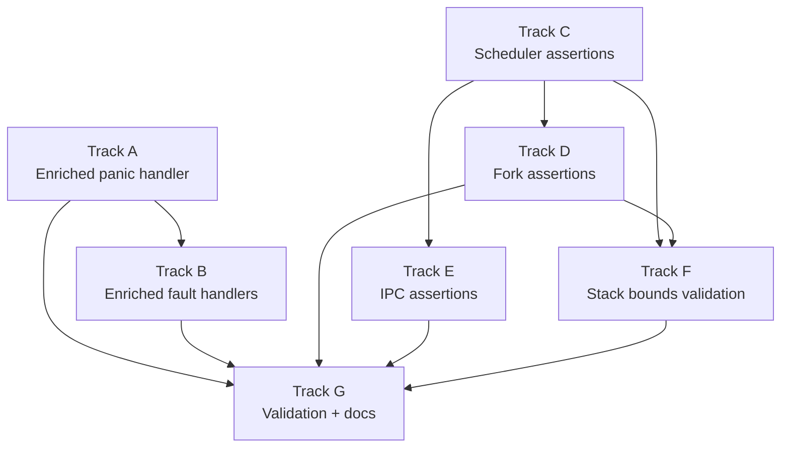

# Phase 43a — Crash Diagnostics & Assertions: Task List

**Status:** Complete
**Source Ref:** phase-43a
**Depends on:** Phase 35 (True SMP Multitasking) ✅, Phase 43 (SSH Server) ✅
**Goal:** Make every kernel crash self-diagnosing by enriching the panic handler and
fault handlers with full register dumps, task metadata, scheduler state, and per-core
context. Backfill `debug_assert!` invariants at every scheduler, fork, and IPC boundary
so that state corruption is caught at the point of origin rather than surfacing later
as an opaque `RIP=0x4` fault.

## Track Layout

| Track | Scope | Dependencies | Status |
|---|---|---|---|
| A | Enriched panic handler | — | Complete |
| B | Enriched fault handlers (page fault, GPF, double fault) | A | Complete |
| C | Scheduler boundary assertions | — | Complete |
| D | Fork boundary assertions | C | Complete |
| E | IPC boundary assertions | C | Complete |
| F | Stack bounds validation | C, D | Complete |
| G | Validation and documentation | A–F | Complete |

---

## Track A — Enriched Panic Handler

Replace the minimal file:line panic handler with a full diagnostic dump that
prints registers, current task info, and per-core state on every kernel panic.

### A.1 — Dump CPU registers on panic

**File:** `kernel/src/main.rs`
**Symbol:** `panic`
**Why it matters:** The current panic handler at line 1157 prints only the file, line, and message; without register state, the developer cannot determine what value was in RIP, RSP, or any GPR at the point of failure.

**Acceptance:**
- [ ] Panic handler captures RAX, RBX, RCX, RDX, RSI, RDI, RBP, RSP, R8–R15, RIP, RFLAGS, CR2, CR3 via inline assembly
- [ ] All registers printed via `_panic_print` (deadlock-safe serial path)
- [ ] Output formatted as `REG=0x{:016x}` one per line for grep-ability

### A.2 — Dump current task info on panic

**File:** `kernel/src/main.rs`
**Symbol:** `panic`
**Why it matters:** Without knowing which task was running, the developer cannot correlate the panic with a specific fork child, IPC server, or shell session.

**Acceptance:**
- [ ] Panic handler reads `per_core().current_task_idx` and, if valid, prints task index, `TaskId`, `TaskState`, `saved_rsp`, `pid`, `assigned_core`, and `priority`
- [ ] If `current_task_idx` is -1 (scheduler loop), prints "no active task (scheduler loop)"
- [ ] Uses `SCHEDULER.try_lock()` to avoid deadlock; prints "scheduler lock held — skipping task dump" on contention

### A.3 — Dump per-core state on panic

**File:** `kernel/src/main.rs`
**Symbol:** `panic`
**Why it matters:** SMP race bugs depend on knowing the state of all cores, not just the faulting one; a stale `saved_rsp` or orphaned `current_task_idx` on another core is often the root cause.

**Acceptance:**
- [ ] Iterates all online cores (up to `MAX_CORES`) and prints: `core_id`, `is_online`, `current_task_idx`, `reschedule` flag, run queue length
- [ ] Uses `try_lock()` on each core's `run_queue`; prints "locked" if unavailable
- [ ] Prints the faulting core's ID prominently with a `>>>` marker

### A.4 — Extract panic diagnostics into a helper module

**File:** `kernel/src/panic_diag.rs` (new)
**Symbol:** `dump_crash_context`
**Why it matters:** Fault handlers (Track B) and the future trace-ring dump (Phase 43b) also need the same diagnostic output; extracting it avoids code duplication and keeps the panic handler readable.

**Acceptance:**
- [ ] `dump_crash_context()` function prints registers, task info, and per-core state using `_panic_print`
- [ ] Called from the panic handler (A.1–A.3) and from fault handlers (Track B)
- [ ] All serial output uses the deadlock-safe `_panic_print` path from `kernel/src/serial.rs`

---

## Track B — Enriched Fault Handlers

Upgrade page fault, GPF, and double fault handlers to print full diagnostic
context instead of a single-line message.

### B.1 — Enrich page fault handler (userspace)

**File:** `kernel/src/arch/x86_64/interrupts.rs`
**Symbol:** `page_fault_handler`
**Why it matters:** The userspace page fault handler at line 425 prints PID, address, error code, and RIP, but not RSP, task state, scheduler state, or per-core context — exactly the information needed to diagnose the `RIP=0x4` crash.

**Acceptance:**
- [ ] Prints RSP from interrupt stack frame alongside RIP
- [ ] Prints current task index, `TaskState`, and `saved_rsp` from scheduler
- [ ] Calls `dump_crash_context()` from `panic_diag` for full per-core dump
- [ ] Existing `fault_kill_trampoline` redirect still works correctly after the enriched output

### B.2 — Enrich page fault handler (kernel)

**File:** `kernel/src/arch/x86_64/interrupts.rs`
**Symbol:** `page_fault_handler`
**Why it matters:** The ring-0 page fault path at line 459 prints only address, error code, and the raw `InterruptStackFrame`; enriching it with the same diagnostic context makes kernel-mode crashes as diagnosable as userspace ones.

**Acceptance:**
- [ ] Ring-0 page fault path calls `dump_crash_context()`
- [ ] CR3 value printed (identifies which process's page table is active)
- [ ] Output clearly labeled as "KERNEL page fault" to distinguish from userspace

### B.3 — Enrich GPF handler

**File:** `kernel/src/arch/x86_64/interrupts.rs`
**Symbol:** `general_protection_fault_handler`
**Why it matters:** The GPF handler at line 467 prints only the stack frame debug output; a GPF during context switch or sysret needs the same rich diagnostic context as a page fault.

**Acceptance:**
- [ ] Userspace GPF path (line 472) prints PID, task index, `TaskState`, and calls `dump_crash_context()`
- [ ] Ring-0 GPF path (line 497) calls `dump_crash_context()`
- [ ] Error code printed and decoded (segment selector index, table indicator, external flag)

### B.4 — Enrich double fault handler

**File:** `kernel/src/arch/x86_64/interrupts.rs`
**Symbol:** `double_fault_handler`
**Why it matters:** The double fault handler at line 501 prints only the stack frame; a double fault usually means a stack overflow or corrupted IDT/GDT, and the per-core state is essential to understand which core and task caused it.

**Acceptance:**
- [ ] Prints all registers from the IST-provided interrupt frame
- [ ] Calls `dump_crash_context()` for full per-core state
- [ ] Prints the IST stack pointer to help detect stack overflow

---

## Track C — Scheduler Boundary Assertions

Add `debug_assert!` checks at every scheduler state transition to catch
corruption at the point of origin.

### C.1 — Assertions in `pick_next`

**File:** `kernel/src/task/scheduler.rs`
**Symbol:** `pick_next`
**Why it matters:** `pick_next` at line 138 selects and returns a task's `saved_rsp` for dispatch; a stale or zero `saved_rsp` causes the exact `RIP=0x4` crash pattern observed in production.

**Acceptance:**
- [ ] `debug_assert!(rsp != 0, "pick_next: task {} has zero saved_rsp")` before returning
- [ ] `debug_assert!(task.state == TaskState::Ready, "pick_next: task {} state is {:?}, expected Ready")` before dispatch
- [ ] `debug_assert!(task.affinity_mask & (1 << core_id) != 0)` confirming affinity

### C.2 — Assertions in `yield_now`

**File:** `kernel/src/task/scheduler.rs`
**Symbol:** `yield_now`
**Why it matters:** `yield_now` at line 336 takes a raw pointer to `saved_rsp` and passes it to `switch_context`; if the task index is out of bounds or the scheduler RSP is zero, the context switch corrupts the stack.

**Acceptance:**
- [ ] `debug_assert!(idx < sched.tasks.len())` before accessing `saved_rsp`
- [ ] `debug_assert!(sched_rsp != 0, "yield_now: scheduler RSP is zero on core {}")` before `switch_context`
- [ ] `debug_assert!(sched.tasks[idx].state == TaskState::Running)` confirming the task was actually running

### C.3 — Assertions in `block_current`

**File:** `kernel/src/task/scheduler.rs`
**Symbol:** `block_current`
**Why it matters:** `block_current` at line 389 transitions a running task to a blocked state and does a context switch; if the task was already blocked or dead, the state machine is corrupted.

**Acceptance:**
- [ ] `debug_assert!(sched.tasks[idx].state == TaskState::Running, "block_current: task {} state is {:?}, expected Running")` before state change
- [ ] `debug_assert!(sched_rsp != 0)` before `switch_context`
- [ ] `debug_assert!(get_current_task_idx().is_some(), "block_current: no current task on core")` at entry

### C.4 — Assertions in `wake_task`

**File:** `kernel/src/task/scheduler.rs`
**Symbol:** `wake_task`
**Why it matters:** `wake_task` at line 511 transitions a blocked task to Ready and enqueues it; if the task is already Ready or Running, a duplicate enqueue corrupts the run queue.

**Acceptance:**
- [ ] `debug_assert!(matches!(state_before, TaskState::BlockedOnRecv | BlockedOnSend | BlockedOnReply | BlockedOnNotif | BlockedOnFutex))` before waking
- [ ] `debug_assert!(idx < sched.tasks.len())` after `find(id)`

### C.5 — Assertions in `run` dispatch path

**File:** `kernel/src/task/scheduler.rs`
**Symbol:** `run`
**Why it matters:** The main dispatch loop at line 596 reads `task_rsp` and calls `switch_context`; assertions here are the last guardrail before a bad context switch.

**Acceptance:**
- [ ] `debug_assert!(task_rsp != 0, "dispatch: task {} has zero saved_rsp on core {}")` before `switch_context` at line 683
- [ ] `debug_assert!(task.state == TaskState::Running)` after marking Running at line 630
- [ ] `debug_assert!(pending as usize < sched.tasks.len())` on the `PENDING_REENQUEUE` path at line 690

### C.6 — Assertions in `enqueue_to_core`

**File:** `kernel/src/task/scheduler.rs`
**Symbol:** `enqueue_to_core`
**Why it matters:** `enqueue_to_core` at line 257 pushes a task index into a per-core run queue; an out-of-bounds index or duplicate entry would cause a panic or double-dispatch later.

**Acceptance:**
- [ ] `debug_assert!((core_id as usize) < MAX_CORES)` at entry
- [ ] `debug_assert!(idx < SCHEDULER.lock().tasks.len(), "enqueue_to_core: idx {} out of bounds")` at entry

---

## Track D — Fork Boundary Assertions

Add `debug_assert!` checks at the fork context publish, pop, and trampoline
boundaries to catch the global-queue mismatch race.

### D.1 — Assertions in `push_fork_ctx`

**File:** `kernel/src/process/mod.rs`
**Symbol:** `push_fork_ctx`
**Why it matters:** `push_fork_ctx` at line 1249 publishes a `ForkChildCtx` to the global `FORK_CHILD_QUEUE`; if `user_rip` or `user_rsp` is zero or non-canonical, the child will fault immediately on dispatch.

**Acceptance:**
- [ ] `debug_assert!(user_rip != 0, "push_fork_ctx: user_rip is zero for pid {}")` at entry
- [ ] `debug_assert!(user_rsp != 0, "push_fork_ctx: user_rsp is zero for pid {}")` at entry
- [ ] `debug_assert!(user_rip < 0x0000_8000_0000_0000, "push_fork_ctx: non-canonical user_rip {:#x}")` to catch kernel addresses leaking

### D.2 — Assertions in `fork_child_trampoline`

**File:** `kernel/src/process/mod.rs`
**Symbol:** `fork_child_trampoline`
**Why it matters:** `fork_child_trampoline` at line 1350 pops a context and enters ring 3; if the wrong context is popped (mismatched PID) or if the process has no page table, the result is the `RIP=0x4` crash.

**Acceptance:**
- [ ] `debug_assert!(ctx.user_rip != 0, "fork_child_trampoline: user_rip is zero for pid {}")` after pop
- [ ] `debug_assert!(ctx.user_rsp != 0, "fork_child_trampoline: user_rsp is zero for pid {}")` after pop
- [ ] `debug_assert!(cr3_phys.is_some(), "fork_child_trampoline: pid {} has no page table")` after process lookup
- [ ] `debug_assert!(ctx.pid == current_pid, "fork_child_trampoline: popped ctx for pid {} but current is pid {}")` — compares popped PID against what `set_current_pid` just set

### D.3 — Assertions in `sys_fork`

**File:** `kernel/src/arch/x86_64/syscall.rs`
**Symbol:** `sys_fork`
**Why it matters:** `sys_fork` at line 2624 orchestrates page table cloning, fork context publishing, and task spawning; assertions at each boundary verify the chain is consistent before the child is made schedulable.

**Acceptance:**
- [ ] `debug_assert!(child_cr3.start_address().as_u64() != 0)` after `new_process_page_table`
- [ ] Assert that the child PID exists in `PROCESS_TABLE` after insertion
- [ ] Assert that `FORK_CHILD_QUEUE` length increased by exactly 1 after `push_fork_ctx`

### D.4 — Queue depth assertion for `FORK_CHILD_QUEUE`

**File:** `kernel/src/process/mod.rs`
**Symbol:** `FORK_CHILD_QUEUE`
**Why it matters:** The global FIFO queue is the suspected source of the wrong-child-gets-wrong-context race; an unexpectedly deep queue (more than the number of online cores) signals that consumers are not draining fast enough.

**Acceptance:**
- [ ] `debug_assert!(queue.len() <= MAX_CORES, "FORK_CHILD_QUEUE depth {} exceeds core count")` after every `push_back`
- [ ] `debug_assert!(!queue.is_empty(), "FORK_CHILD_QUEUE unexpectedly empty at pop")` at the start of `fork_child_trampoline`

---

## Track E — IPC Boundary Assertions

Add `debug_assert!` checks at IPC block/wake boundaries to catch lost wakeups
and message delivery ordering bugs.

### E.1 — Assertions in `recv_msg`

**File:** `kernel/src/ipc/endpoint.rs`
**Symbol:** `recv_msg`
**Why it matters:** `recv_msg` at line 142 blocks the current task if no sender is waiting, then expects a pending message after waking; a lost wakeup means the task wakes with no message.

**Acceptance:**
- [ ] After waking from `block_current_on_recv`, assert message is present: `debug_assert!(msg.is_some(), "recv_msg: task {:?} woke on ep {} with no pending message")` including endpoint queue lengths
- [ ] `debug_assert!(ep_id.0 < ENDPOINTS.lock().len())` at entry

### E.2 — Assertions in `send`

**File:** `kernel/src/ipc/endpoint.rs`
**Symbol:** `send`
**Why it matters:** `send` at line 217 either wakes a waiting receiver or blocks the sender; if the receiver's state is not blocked when `wake_task` is called, the wakeup is silently lost.

**Acceptance:**
- [ ] `debug_assert!(wake_result, "send: wake_task failed for receiver {:?} on ep {}")` after `wake_task(receiver)` at line 239

### E.3 — Assertions in `call_msg`

**File:** `kernel/src/ipc/endpoint.rs`
**Symbol:** `call_msg`
**Why it matters:** `call_msg` at line 254 does a send-then-block-for-reply; a missing reply means the caller wakes with no message.

**Acceptance:**
- [ ] After waking from `block_current_on_reply`, assert reply is present: `debug_assert!(msg.is_some(), "call_msg: task {:?} woke from reply-wait on ep {} with no reply message")` with endpoint ID
- [ ] After `insert_cap` succeeds, assert the receiver's state is `BlockedOnRecv` before waking it

### E.4 — Assertions in `reply`

**File:** `kernel/src/ipc/endpoint.rs`
**Symbol:** `reply`
**Why it matters:** `reply` at line 328 delivers a message and wakes the caller; if the caller is not in `BlockedOnReply` state, the message is lost.

**Acceptance:**
- [ ] `debug_assert!(wake_result, "reply: wake_task failed for caller {:?}")` after `wake_task(caller)` at line 330

---

## Track F — Stack Bounds Validation

Add runtime checks on `saved_rsp` values to catch stack corruption before it
causes a fault during context switch.

### F.1 — Validate `saved_rsp` on dispatch

**File:** `kernel/src/task/scheduler.rs`
**Symbol:** `run`
**Why it matters:** The `saved_rsp` value passed to `switch_context` at line 683 must point within the task's allocated kernel stack; a value outside that range means the stack was corrupted or the wrong task's RSP was loaded.

**Acceptance:**
- [ ] `debug_assert!` that `task_rsp` falls within the task's `_stack` allocation range (base..base+KERNEL_STACK_SIZE)
- [ ] On violation, prints the expected range and actual value before panicking

### F.2 — Validate `saved_rsp` on yield/block save

**File:** `kernel/src/task/scheduler.rs`
**Symbols:** `yield_now`, `block_current`
**Why it matters:** After `switch_context` writes the task's RSP, validating it immediately catches stack overflow or corruption at the point where it happens, not on the next dispatch.

**Acceptance:**
- [ ] After `switch_context` returns in the scheduler loop (line 686), validate that the saved RSP in `PENDING_REENQUEUE` task is within bounds
- [ ] `debug_assert!` includes the task index, core ID, and RSP value in the message

### F.3 — Validate scheduler RSP on each core

**File:** `kernel/src/task/scheduler.rs`
**Symbol:** `run`
**Why it matters:** Each core's `scheduler_rsp` is written once during init and read on every context switch; if it becomes zero or corrupted, every dispatch on that core will crash.

**Acceptance:**
- [ ] `debug_assert!(per_core_scheduler_rsp() != 0, "core {}: scheduler RSP is zero")` at the top of the dispatch loop
- [ ] Checked once per loop iteration, before any `switch_context` call

---

## Track G — Validation and Documentation

### G.1 — `cargo xtask check` passes

**File:** `xtask/src/main.rs`
**Symbol:** `cmd_check`
**Why it matters:** All new code must pass clippy and rustfmt with no new warnings.

**Acceptance:**
- [ ] `cargo xtask check` passes
- [ ] No new `#[allow(...)]` attributes added except where justified

### G.2 — Existing tests pass

**File:** `xtask/src/main.rs`
**Symbols:** `cmd_test`, `cmd_smoke_test`
**Why it matters:** Diagnostic code must not break existing functionality.

**Acceptance:**
- [ ] `cargo test -p kernel-core` passes
- [ ] `cargo xtask test` passes (all 8 QEMU kernel tests)
- [ ] `cargo xtask smoke-test` passes

### G.3 — Assertions do not fire on clean boot

**File:** `kernel/src/main.rs`
**Symbol:** `kernel_main`
**Why it matters:** If any of the new assertions fire during a normal boot + smoke test, the assertion is either wrong or has uncovered a latent bug that must be fixed before merging.

**Acceptance:**
- [ ] `cargo xtask smoke-test` completes with no `debug_assert` panics in serial output
- [ ] Boot with `-smp 4` and run dual-session SSH overlap without assertion failures

### G.4 — Documentation

**File:** `docs/roadmap/43a-crash-diagnostics.md` (new)
**Symbol:** `# Phase 43a — Crash Diagnostics`
**Why it matters:** Documents the diagnostic output format so developers can interpret crash dumps without reading the handler source.

**Acceptance:**
- [ ] Example crash dump output documented with field labels
- [ ] Assertion inventory table listing every new assertion, its location, and what it guards
- [ ] Troubleshooting section for common crash patterns (`RIP=0x4`, zero RSP, stale task state)

---

## Deferred Until Later

- Full lockdep-lite checker (mentioned in strategy doc — larger scope, Phase 43b or beyond)
- Allocator poisoning / redzones (KASAN-style — Phase 43b or beyond)
- Register dump via NMI (requires NMI handler work)
- Backtrace / stack unwinding (requires frame pointer chain or DWARF unwinder)

---

## Dependency Graph

## Parallelization Strategy

**Wave 1:** Tracks A and C in parallel — panic handler enrichment and scheduler
assertions are independent.
**Wave 2 (after A):** Track B — fault handlers call `dump_crash_context()` from
Track A.
**Wave 2 (after C):** Tracks D, E, and F in parallel — fork, IPC, and stack
validation assertions all depend on the scheduler assertion patterns from Track C.
**Wave 3:** Track G — validation and documentation after all code is in place.

---

## Documentation Notes

- Phase 43a is a debugging-infrastructure phase, not a feature phase. It adds no
  new functionality visible to the user — only diagnostic output visible to the
  developer on crash or panic.
- All new code uses `debug_assert!` (compiled out in release builds) except for
  the panic handler enrichment (Track A) and fault handler enrichment (Track B),
  which are always-on since they only execute on fatal paths.
- The `dump_crash_context()` helper introduced in A.4 will be extended by Phase 43b
  to also dump the kernel trace ring.
- The enriched fault handlers in Track B preserve existing behavior (fault-kill
  trampoline redirect for userspace faults, halt loop for kernel faults) — they
  only add diagnostic output before the existing action.
