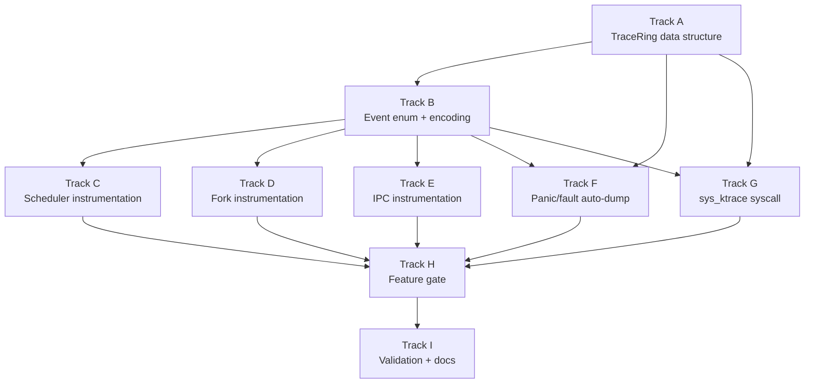

# Phase 43b — Kernel Trace Ring: Task List

**Status:** Complete
**Source Ref:** phase-43b
**Depends on:** Phase 43a (Crash Diagnostics) ✅
**Goal:** Add a per-core lockless trace ring that records fork, scheduler, and IPC
events with timestamps, providing a structured recent-history view of kernel
transitions leading into any crash. The ring is host-testable in kernel-core,
auto-dumped on panic/fault, accessible from userspace via a new syscall, and
feature-gated so it compiles out for release builds.

## Track Layout

| Track | Scope | Dependencies | Status |
|---|---|---|---|
| A | Trace ring data structure (kernel-core, host-testable) | — | ✅ Done |
| B | Trace event enum and encoding | A | ✅ Done |
| C | Scheduler path instrumentation | A, B | ✅ Done |
| D | Fork path instrumentation | A, B | ✅ Done |
| E | IPC path instrumentation | A, B | ✅ Done |
| F | Panic/fault auto-dump integration | A, B, Phase 43a | ✅ Done |
| G | `sys_ktrace` syscall | A, B | ✅ Done |
| H | Feature gate and compile-out | A–G | ✅ Done |
| I | Validation and documentation | All | ✅ Done |

---

## Track A — Trace Ring Data Structure

Implement a per-core lockless ring buffer in kernel-core that can be tested on
the host without kernel dependencies.

### A.1 — Define `TraceRing<const N: usize>` in kernel-core

**File:** `kernel-core/src/trace_ring.rs` (new)
**Symbol:** `TraceRing`
**Why it matters:** A lockless per-core ring avoids contention on the hot path; placing it in kernel-core makes it host-testable with standard `cargo test` just like the existing `LogRing`.

**Acceptance:**
- [ ] `TraceRing<N>` struct with fixed-size array of `TraceEntry`, atomic write index, no mutex
- [ ] `push(&mut self, entry: TraceEntry)` overwrites oldest entry on wrap (circular buffer)
- [ ] `snapshot(&self) -> Vec<TraceEntry>` returns entries in chronological order
- [ ] `const fn new()` constructor for static initialization
- [ ] No `std` dependency — works with `default-features = false`

### A.2 — Host-side unit tests for `TraceRing`

**File:** `kernel-core/src/trace_ring.rs`
**Symbol:** `mod tests`
**Why it matters:** The ring buffer is safety-critical infrastructure; exhaustive host-side tests catch off-by-one, wrap-around, and ordering bugs before they reach the kernel.

**Acceptance:**
- [ ] Test: empty ring snapshot returns empty vec
- [ ] Test: push N entries into size-N ring, snapshot returns all N in order
- [ ] Test: push N+1 entries into size-N ring, snapshot returns last N in order (oldest dropped)
- [ ] Test: push 3*N entries, verify only last N survive
- [ ] `cargo test -p kernel-core` passes with all new tests

### A.3 — Per-core trace ring allocation in kernel

**File:** `kernel/src/smp/mod.rs`
**Symbol:** `PerCoreData`
**Why it matters:** Each core needs its own ring to avoid lock contention; the ring must be sized to hold enough events to cover a typical fork+dispatch+fault sequence.

**Acceptance:**
- [ ] `trace_ring: TraceRing<256>` field added to `PerCoreData`
- [ ] Initialized to `TraceRing::new()` in BSP and AP init paths
- [ ] Accessible via `per_core().trace_ring` from any kernel code on that core

---

## Track B — Trace Event Enum and Encoding

Define the structured event types recommended by the strategy document.

### B.1 — Define `TraceEvent` enum

**File:** `kernel-core/src/trace_ring.rs`
**Symbol:** `TraceEvent`
**Why it matters:** A closed enum of known event types enables structured parsing in crash dumps and the `sys_ktrace` syscall, unlike free-form log strings.

**Acceptance:**
- [ ] Scheduler variants: `Dispatch { task_idx: u32, core: u8, rsp: u64 }`, `SwitchOut { task_idx: u32, core: u8, saved_rsp: u64 }`, `YieldNow { task_idx: u32, core: u8 }`, `BlockCurrent { task_idx: u32, core: u8, new_state: u8 }`, `WakeTask { task_idx: u32, state_before: u8, core: u8 }`, `RunQueueEnqueue { task_idx: u32, core: u8 }`
- [ ] Fork variants: `ForkCtxPublish { pid: u32, rip: u64, rsp: u64 }`, `ForkTaskSpawned { pid: u32, task_idx: u32, core: u8 }`, `ForkTrampolineEnter { pid: u32, task_idx: u32 }`, `ForkTrampolineExit { pid: u32, rip: u64, rsp: u64 }`
- [ ] IPC variants: `RecvBlock { task_idx: u32, ep: u32 }`, `RecvWake { task_idx: u32, ep: u32 }`, `SendBlock { task_idx: u32, ep: u32 }`, `SendWake { task_idx: u32, ep: u32 }`, `CallBlock { task_idx: u32, ep: u32 }`, `ReplyDeliver { caller_idx: u32, ep: u32 }`, `MessageDelivered { task_idx: u32, ep: u32 }`
- [ ] Enum derives `Clone`, `Copy`; repr is compact (fits in a fixed-size `TraceEntry`)

### B.2 — Define `TraceEntry` struct

**File:** `kernel-core/src/trace_ring.rs`
**Symbol:** `TraceEntry`
**Why it matters:** Each entry must carry a timestamp and core ID alongside the event so the dump can reconstruct a global timeline across cores.

**Acceptance:**
- [ ] `TraceEntry { tick: u64, core: u8, event: TraceEvent }`
- [ ] Total size no larger than 64 bytes to keep the ring cache-friendly
- [ ] `TraceEntry::EMPTY` constant for zero-initialization

### B.3 — Trace emit helper

**File:** `kernel/src/trace.rs` (new)
**Symbol:** `trace_event`
**Why it matters:** A single `trace_event(event)` call site keeps instrumentation minimal (one line per call site) and handles timestamping and core-ID tagging automatically.

**Acceptance:**
- [ ] `trace_event(event: TraceEvent)` reads `tick_count()`, current core ID, constructs `TraceEntry`, and pushes to `per_core().trace_ring`
- [ ] Compiles to nothing when the feature gate is off (Track H)
- [ ] No lock acquisition on the hot path

---

## Track C — Scheduler Path Instrumentation

Instrument every scheduler state transition with trace events.

### C.1 — Instrument `pick_next` / dispatch

**File:** `kernel/src/task/scheduler.rs`
**Symbol:** `run`
**Why it matters:** The dispatch path at line 626 is where the scheduler commits to running a task; tracing it records exactly which task was chosen and what `saved_rsp` was loaded.

**Acceptance:**
- [ ] `trace_event(Dispatch { task_idx, core, rsp: task_rsp })` emitted after `pick_next` returns and state is set to Running (line 630)

### C.2 — Instrument `yield_now`

**File:** `kernel/src/task/scheduler.rs`
**Symbol:** `yield_now`
**Why it matters:** `yield_now` at line 336 is the voluntary switch-out path; tracing it records which task yielded and on which core.

**Acceptance:**
- [ ] `trace_event(YieldNow { task_idx: idx, core })` emitted before `switch_context` at line 354

### C.3 — Instrument `block_current`

**File:** `kernel/src/task/scheduler.rs`
**Symbol:** `block_current`
**Why it matters:** `block_current` at line 389 is the involuntary switch-out path; tracing it records the blocking reason.

**Acceptance:**
- [ ] `trace_event(BlockCurrent { task_idx: idx, core, new_state: state as u8 })` emitted before `switch_context` at line 403

### C.4 — Instrument `wake_task`

**File:** `kernel/src/task/scheduler.rs`
**Symbol:** `wake_task`
**Why it matters:** `wake_task` at line 511 transitions blocked to ready; tracing it records what state the task was in before waking and which core it is enqueued to.

**Acceptance:**
- [ ] `trace_event(WakeTask { task_idx: idx, state_before: old_state as u8, core })` emitted after state change at line 521

### C.5 — Instrument `enqueue_to_core`

**File:** `kernel/src/task/scheduler.rs`
**Symbol:** `enqueue_to_core`
**Why it matters:** `enqueue_to_core` at line 257 is the run-queue insertion; tracing it shows exactly when a task becomes visible to a core's dispatcher.

**Acceptance:**
- [ ] `trace_event(RunQueueEnqueue { task_idx: idx, core: core_id })` emitted after `push_back` at line 259

### C.6 — Instrument switch-out completion in dispatch loop

**File:** `kernel/src/task/scheduler.rs`
**Symbol:** `run`
**Why it matters:** After `switch_context` returns at line 686, the scheduler processes `PENDING_REENQUEUE`; tracing the saved RSP at this point records the exact value that will be loaded on next dispatch.

**Acceptance:**
- [ ] `trace_event(SwitchOut { task_idx: pidx, core, saved_rsp: sched.tasks[pidx].saved_rsp })` emitted after re-enqueue at line 694

---

## Track D — Fork Path Instrumentation

Instrument fork context publish, spawn, and trampoline phases.

### D.1 — Instrument `push_fork_ctx`

**File:** `kernel/src/process/mod.rs`
**Symbol:** `push_fork_ctx`
**Why it matters:** `push_fork_ctx` at line 1249 is the publication of fork context to the global queue; tracing it records the exact RIP, RSP, and PID that the child will use.

**Acceptance:**
- [ ] `trace_event(ForkCtxPublish { pid, rip: user_rip, rsp: user_rsp })` emitted after `push_back` at line 1269

### D.2 — Instrument fork task spawn

**File:** `kernel/src/arch/x86_64/syscall.rs`
**Symbol:** `sys_fork`
**Why it matters:** The spawn call that makes the fork child schedulable is the boundary between setup and live execution; tracing it records which core the child is assigned to.

**Acceptance:**
- [ ] `trace_event(ForkTaskSpawned { pid: child_pid, task_idx, core })` emitted after `spawn_on_current_core` returns

### D.3 — Instrument `fork_child_trampoline` entry and exit

**File:** `kernel/src/process/mod.rs`
**Symbol:** `fork_child_trampoline`
**Why it matters:** The trampoline at line 1350 pops the context and enters ring 3; tracing both entry and exit reveals whether the correct context was popped and what RIP/RSP the child will actually use.

**Acceptance:**
- [ ] `trace_event(ForkTrampolineEnter { pid: ctx.pid, task_idx })` emitted after popping context
- [ ] `trace_event(ForkTrampolineExit { pid: ctx.pid, rip: ctx.user_rip, rsp: ctx.user_rsp })` emitted immediately before `enter_userspace_fork` at line 1403

---

## Track E — IPC Path Instrumentation

Instrument IPC block/wake/deliver paths for recv, send, call, and reply.

### E.1 — Instrument `recv_msg`

**File:** `kernel/src/ipc/endpoint.rs`
**Symbol:** `recv_msg`
**Why it matters:** `recv_msg` at line 142 either delivers immediately or blocks; tracing both paths reveals the exact sequence of sender/receiver matching.

**Acceptance:**
- [ ] `trace_event(RecvBlock { task_idx, ep })` emitted before `block_current_on_recv` at line 181
- [ ] `trace_event(RecvWake { task_idx, ep })` emitted after `take_message` returns successfully
- [ ] `trace_event(MessageDelivered { task_idx, ep })` when a pending sender is matched (line 161)

### E.2 — Instrument `send`

**File:** `kernel/src/ipc/endpoint.rs`
**Symbol:** `send`
**Why it matters:** `send` at line 217 either wakes a waiting receiver or blocks; tracing it reveals whether the matched receiver was actually blocked.

**Acceptance:**
- [ ] `trace_event(SendWake { task_idx: receiver_idx, ep })` emitted before `wake_task(receiver)` at line 239
- [ ] `trace_event(SendBlock { task_idx: sender_idx, ep })` emitted before `block_current_on_send` at line 243

### E.3 — Instrument `call_msg`

**File:** `kernel/src/ipc/endpoint.rs`
**Symbol:** `call_msg`
**Why it matters:** `call_msg` at line 254 combines send + reply-wait; tracing it shows the full round-trip sequence.

**Acceptance:**
- [ ] `trace_event(CallBlock { task_idx: caller_idx, ep })` emitted before `block_current_on_reply` at line 302

### E.4 — Instrument `reply`

**File:** `kernel/src/ipc/endpoint.rs`
**Symbol:** `reply`
**Why it matters:** `reply` at line 328 is the final message delivery; tracing it confirms the reply reached the blocked caller.

**Acceptance:**
- [ ] `trace_event(ReplyDeliver { caller_idx, ep: 0 })` emitted before `wake_task(caller)` at line 330

---

## Track F — Panic/Fault Auto-Dump Integration

Wire the trace ring dump into the enriched handlers from Phase 43a.

### F.1 — Implement `dump_trace_rings`

**File:** `kernel/src/trace.rs`
**Symbol:** `dump_trace_rings`
**Why it matters:** On panic or fault, automatically printing the last N trace events from all cores gives the developer an immediate timeline of what happened, without requiring reproduction or manual inspection.

**Acceptance:**
- [ ] Iterates all online cores, calls `trace_ring.snapshot()` on each
- [ ] Merges all entries into a single timeline sorted by `tick`
- [ ] Prints each entry via `_panic_print` in format: `[tick] core=N event_name { fields }`
- [ ] Uses direct memory access (trace ring is lockless) to avoid deadlock in panic context

### F.2 — Wire into panic handler

**File:** `kernel/src/main.rs`
**Symbol:** `panic`
**Why it matters:** The panic handler is the primary crash entry point; calling `dump_trace_rings()` after the register/task dump (Phase 43a Track A) completes the crash diagnostic output.

**Acceptance:**
- [ ] `dump_trace_rings()` called after `dump_crash_context()` in the panic handler
- [ ] Output appears in serial after the register dump, labeled `=== TRACE RING DUMP ===`

### F.3 — Wire into fault handlers

**File:** `kernel/src/arch/x86_64/interrupts.rs`
**Symbols:** `page_fault_handler`, `general_protection_fault_handler`, `double_fault_handler`
**Why it matters:** Faults that kill a process (via `fault_kill_trampoline`) should dump the trace ring before redirecting, since the trampoline will alter scheduler state.

**Acceptance:**
- [ ] `dump_trace_rings()` called in the ring-0 fault paths (page fault line 459, GPF line 497, double fault line 501)
- [ ] For ring-3 faults that redirect to `fault_kill_trampoline`, trace dump printed before the IRET redirect
- [ ] No deadlock risk (trace ring is lockless; serial uses `_panic_print`)

---

## Track G — `sys_ktrace` Syscall

Expose trace ring data to userspace for live debugging and external tooling.

### G.1 — Implement `sys_ktrace` syscall

**File:** `kernel/src/arch/x86_64/syscall.rs`
**Symbol:** `sys_ktrace`
**Why it matters:** A syscall for reading the trace ring enables userspace tools to capture kernel event history without requiring a crash, supporting live debugging and performance analysis.

**Acceptance:**
- [ ] New syscall number allocated in the syscall dispatch table
- [ ] `sys_ktrace(core_id: u64, buf_ptr: u64, buf_len: u64) -> u64` copies trace entries to a userspace buffer
- [ ] Returns the number of entries written, or `u64::MAX` on invalid core ID or bad pointer
- [ ] Validates the userspace buffer pointer and length before writing

### G.2 — Add `ktrace` to syscall-lib

**File:** `userspace/syscall-lib/src/lib.rs`
**Symbol:** `ktrace`
**Why it matters:** A typed wrapper in syscall-lib makes the syscall accessible to userspace programs without raw assembly.

**Acceptance:**
- [ ] `pub fn ktrace(core_id: u32, buf: &mut [TraceEntry]) -> Result<usize, ()>` wrapper
- [ ] `TraceEntry` type re-exported or mirrored in syscall-lib for userspace use

---

## Track H — Feature Gate and Compile-Out

Gate all trace ring code behind a cargo feature so release builds pay zero cost.

### H.1 — Add `trace` feature to kernel-core

**File:** `kernel-core/Cargo.toml`
**Symbol:** `[features]`
**Why it matters:** The trace ring types and ring buffer code should only compile when requested; release kernels should not carry the memory or code-size overhead.

**Acceptance:**
- [ ] `trace` feature added to `kernel-core/Cargo.toml`
- [ ] `trace_ring.rs` module gated behind `#[cfg(feature = "trace")]`
- [ ] `cargo test -p kernel-core` still passes (tests enable the feature)
- [ ] `cargo test -p kernel-core --no-default-features` compiles without trace code

### H.2 — Add `trace` feature to kernel

**File:** `kernel/Cargo.toml`
**Symbol:** `[features]`
**Why it matters:** The kernel crate needs its own feature to forward to kernel-core and to gate the instrumentation call sites.

**Acceptance:**
- [ ] `trace` feature added to `kernel/Cargo.toml` that enables `kernel-core/trace`
- [ ] `trace.rs` module gated behind `#[cfg(feature = "trace")]`
- [ ] `trace_event()` compiles to a no-op when feature is off
- [ ] `PerCoreData::trace_ring` field gated behind `#[cfg(feature = "trace")]`

### H.3 — Enable trace feature by default in debug builds

**File:** `kernel/Cargo.toml`
**Symbol:** `[features]`
**Why it matters:** Debug builds should have tracing on by default so that every development run captures events; release builds should opt in explicitly.

**Acceptance:**
- [ ] `xtask` build command passes `--features trace` in debug/dev profile
- [ ] `cargo xtask run` builds with trace enabled
- [ ] Explicit `--release` or `--no-trace` flag builds without trace code

---

## Track I — Validation and Documentation

### I.1 — `cargo xtask check` passes

**File:** `xtask/src/main.rs`
**Symbol:** `cmd_check`
**Why it matters:** All new code must pass linting.

**Acceptance:**
- [ ] `cargo xtask check` passes with trace feature both on and off

### I.2 — Existing tests pass

**File:** `xtask/src/main.rs`
**Symbols:** `cmd_test`, `cmd_smoke_test`
**Why it matters:** Trace instrumentation must not break existing functionality.

**Acceptance:**
- [ ] `cargo test -p kernel-core` passes (including new trace ring tests)
- [ ] `cargo xtask test` passes
- [ ] `cargo xtask smoke-test` passes with trace enabled

### I.3 — Trace output visible on crash

**File:** `kernel/src/main.rs`
**Symbol:** `panic`
**Why it matters:** The primary value of the trace ring is its crash dump; this must be validated end-to-end.

**Acceptance:**
- [ ] Force a deliberate panic in a QEMU test; verify trace ring dump appears in serial output
- [ ] At least 5 trace events visible in the dump (scheduler dispatch + yield cycle)

### I.4 — Documentation

**File:** `docs/roadmap/43b-kernel-trace-ring.md` (new)
**Symbol:** `# Phase 43b — Kernel Trace Ring`
**Why it matters:** Documents the event format, ring sizing, and how to read trace dumps.

**Acceptance:**
- [ ] Event enum documented with field meanings
- [ ] Example trace dump output with annotations
- [ ] Feature gate usage documented (how to enable/disable)
- [ ] Performance characteristics documented (lockless, per-core, overhead estimate)

---

## Deferred Until Later

- Binary trace format for off-target analysis tooling
- Userspace `ktrace` command-line tool (can be added as a coreutils extension)
- Network-accessible trace export (e.g., via SSH)
- Trace filtering (per-subsystem enable/disable)
- Trace event for timer ISR / reschedule signal

---

## Dependency Graph

## Parallelization Strategy

**Wave 1:** Track A — the ring data structure is the foundation.
**Wave 2 (after A):** Track B — event enum depends on the ring entry type.
**Wave 3 (after B):** Tracks C, D, E, F, and G in parallel — all instrumentation
tracks and the syscall are independent once the event types and emit helper exist.
**Wave 4 (after C–G):** Track H — feature gating wraps all the instrumentation.
**Wave 5:** Track I — validation after everything is gated and compiling.

---

## Documentation Notes

- Phase 43b depends on Phase 43a because Track F wires the trace dump into the
  enriched panic/fault handlers from 43a.
- The `TraceRing` in kernel-core follows the same pattern as the existing `LogRing`
  in `kernel-core/src/log_ring.rs` — host-testable, `no_std`-compatible, ring buffer.
- Per-core rings avoid the lock contention that a single global ring would introduce,
  which is critical because the very SMP races being debugged are timing-sensitive.
- The 256-entry ring size is chosen to cover ~4 full fork+dispatch+fault cycles
  per core; this can be tuned later without API changes.
- The `sys_ktrace` syscall follows the same pattern as the existing `sys_dmesg`
  syscall that exposes the `LogRing` to userspace.
