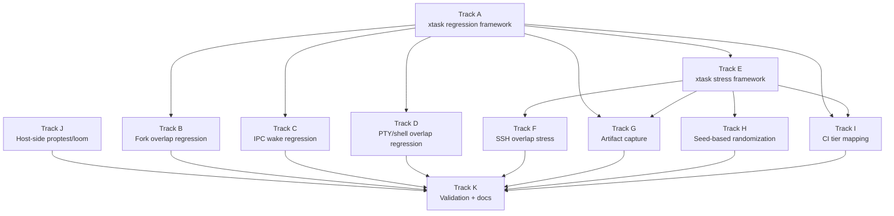

# Phase 43c — Regression, Stress, and CI Harness: Task List

**Status:** Planned
**Source Ref:** phase-43c
**Depends on:** Phase 43a (Crash Diagnostics) ✅, Phase 43b (Kernel Trace Ring) ✅
**Goal:** Build a layered test infrastructure that catches SMP race conditions
through focused QEMU regression tests, looped stress tests with automatic artifact
capture, seed-based timing randomization for reproducibility, host-side property
and concurrency testing for extracted scheduler/fork/IPC models, and CI tier
mapping that runs regressions on every PR and stress tests nightly.

## Track Layout

| Track | Scope | Dependencies | Status |
|---|---|---|---|
| A | `cargo xtask regression` command and framework | — | Planned |
| B | Fork overlap regression test | A | Planned |
| C | IPC wake regression test | A | Planned |
| D | PTY/shell overlap regression test | A | Planned |
| E | `cargo xtask stress` command and framework | A | Planned |
| F | Dual-session SSH overlap stress | E | Planned |
| G | Automatic artifact capture | A, E | Planned |
| H | Seed-based timing randomization | E | Planned |
| I | CI tier mapping | A, E | Planned |
| J | Host-side proptest/loom integration | — | Planned |
| K | Validation and documentation | All | Planned |

---

## Track A — `cargo xtask regression` Command

Add a new xtask subcommand that runs focused QEMU-based regression tests with
structured pass/fail reporting.

### A.1 — Add `regression` subcommand to xtask

**File:** `xtask/src/main.rs`
**Symbol:** `cmd_regression`
**Why it matters:** The existing `test` command runs kernel unit tests and the `smoke-test` runs a single-pass boot validation; neither is designed for targeted race-condition regression tests that need specific QEMU configurations and timeout handling.

**Acceptance:**
- [ ] `cargo xtask regression` accepted as a new subcommand
- [ ] `--test <name>` flag to run a specific regression (e.g., `--test fork-overlap`)
- [ ] Without `--test`, runs all regressions sequentially
- [ ] Each regression launches QEMU with `-smp 4`, monitors serial output for pass/fail markers, and reports results
- [ ] Exit code 0 on all-pass, non-zero on any failure

### A.2 — Regression test framework in xtask

**File:** `xtask/src/main.rs`
**Symbol:** `RegressionTest`
**Why it matters:** Each regression test needs a common structure: QEMU launch with specific args, serial output capture, timeout, pattern matching for pass/fail, and artifact collection on failure.

**Acceptance:**
- [ ] `RegressionTest` struct with fields: `name`, `qemu_extra_args`, `timeout_secs`, `pass_pattern` (regex), `fail_pattern` (regex)
- [ ] `run_regression(test: &RegressionTest) -> Result<(), String>` function that launches QEMU, captures serial, applies timeout, and returns pass/fail
- [ ] Serial output saved to `target/regression/<name>/serial.log` on every run

### A.3 — Regression test guest-side binary framework

**File:** `userspace/regression/` (new directory)
**Symbol:** `regression_harness`
**Why it matters:** Regression tests need a guest-side component that exercises the specific code path and prints structured pass/fail markers to serial output.

**Acceptance:**
- [ ] Guest-side tests can be triggered via a userspace binary in initrd
- [ ] Pass marker: `REGRESSION_PASS: <test_name>`
- [ ] Fail marker: `REGRESSION_FAIL: <test_name>: <reason>`
- [ ] Panic handler output also treated as failure by xtask

---

## Track B — Fork Overlap Regression Test

A focused test that exercises rapid concurrent `fork()` calls to trigger the
fork-child queue race.

### B.1 — Fork overlap guest test

**File:** `userspace/regression/fork-overlap.c` (new)
**Symbol:** `fork_overlap_test`
**Why it matters:** The `RIP=0x4` crash occurs during overlapping `fork()` calls from different processes; this test reproduces the exact pattern by forking rapidly from multiple parents.

**Acceptance:**
- [ ] Spawns 2+ parent processes that each call `fork()` in a tight loop (10+ iterations each)
- [ ] Child processes perform a minimal operation (write to stdout, call `_exit`)
- [ ] Parents call `waitpid()` to reap children
- [ ] Runs with `-smp 4` to exercise cross-core scheduling
- [ ] Prints `REGRESSION_PASS: fork-overlap` if all forks complete without kernel fault
- [ ] Detects kernel page fault / panic in serial output as failure

### B.2 — Register `fork-overlap` in xtask regression list

**File:** `xtask/src/main.rs`
**Symbol:** `REGRESSIONS`
**Why it matters:** The test must be discoverable by `cargo xtask regression --test fork-overlap`.

**Acceptance:**
- [ ] `fork-overlap` entry in regression test registry with 30-second timeout
- [ ] Pass pattern matches `REGRESSION_PASS: fork-overlap`
- [ ] Fail pattern matches `page fault|PANIC|REGRESSION_FAIL`

---

## Track C — IPC Wake Regression Test

A focused test that exercises overlapping send/recv/reply cycles to detect lost
wakeups.

### C.1 — IPC wake guest test

**File:** `userspace/regression/ipc-wake.c` (new)
**Symbol:** `ipc_wake_test`
**Why it matters:** IPC lost-wakeup bugs cause hangs rather than crashes; this test detects them by requiring all messages to complete within a timeout.

**Acceptance:**
- [ ] Creates 2+ endpoint pairs with server and client tasks
- [ ] Clients send rapid `call()` sequences (50+ iterations) while servers `recv()`+`reply()` in loops
- [ ] Multiple client/server pairs run concurrently on different cores
- [ ] Prints `REGRESSION_PASS: ipc-wake` if all messages complete
- [ ] Prints `REGRESSION_FAIL: ipc-wake: timeout` if any message hangs beyond 5 seconds

### C.2 — Register `ipc-wake` in xtask regression list

**File:** `xtask/src/main.rs`
**Symbol:** `REGRESSIONS`
**Why it matters:** The test must be discoverable by `cargo xtask regression --test ipc-wake`.

**Acceptance:**
- [ ] `ipc-wake` entry in regression test registry with 30-second timeout
- [ ] Pass/fail patterns configured

---

## Track D — PTY/Shell Overlap Regression Test

A focused test that exercises overlapping PTY allocation and shell spawning.

### D.1 — PTY overlap guest test

**File:** `userspace/regression/pty-overlap.c` (new)
**Symbol:** `pty_overlap_test`
**Why it matters:** The SSH dual-session crash involves overlapping PTY allocation, fork, and shell exec; this test isolates the PTY+fork path without requiring the full SSH stack.

**Acceptance:**
- [ ] Opens `/dev/ptmx` twice in parallel (two PTY pairs)
- [ ] Forks a child for each PTY that calls `setsid()`, opens the slave, redirects stdio, and execs `/bin/sh`
- [ ] Parent writes a command to each PTY master (`echo hello && exit`) and reads output
- [ ] Waits for both children to exit
- [ ] Repeats 5+ times to exercise timing variations
- [ ] Prints `REGRESSION_PASS: pty-overlap` on success

### D.2 — Register `pty-overlap` in xtask regression list

**File:** `xtask/src/main.rs`
**Symbol:** `REGRESSIONS`
**Why it matters:** The test must be discoverable by `cargo xtask regression --test pty-overlap`.

**Acceptance:**
- [ ] `pty-overlap` entry in regression test registry with 60-second timeout
- [ ] Pass/fail patterns configured

---

## Track E — `cargo xtask stress` Command

Add a looped stress test command that repeats regression tests or custom stress
scenarios with configurable iteration counts.

### E.1 — Add `stress` subcommand to xtask

**File:** `xtask/src/main.rs`
**Symbol:** `cmd_stress`
**Why it matters:** Race conditions may reproduce only under specific timing; running the same test hundreds of times with varied timing is the standard approach to finding them.

**Acceptance:**
- [ ] `cargo xtask stress` accepted as a new subcommand
- [ ] `--test <name>` selects the stress scenario
- [ ] `--iterations <N>` controls repetition count (default: 100)
- [ ] `--timeout <secs>` per-iteration timeout (default: 60)
- [ ] Prints iteration progress: `[42/100] PASS` or `[42/100] FAIL: <reason>`
- [ ] Stops on first failure by default; `--continue-on-failure` runs all iterations
- [ ] Summary at end: `N passed, M failed`

### E.2 — Stress test iteration loop with QEMU lifecycle

**File:** `xtask/src/main.rs`
**Symbol:** `run_stress_iteration`
**Why it matters:** Each iteration must launch a fresh QEMU instance to ensure clean state; reusing a QEMU instance could mask bugs that depend on boot-time initialization.

**Acceptance:**
- [ ] Each iteration: build (cached), launch QEMU, monitor serial, collect result, kill QEMU
- [ ] QEMU process reliably killed even on test timeout (`kill -9` fallback)
- [ ] Serial log for each iteration saved to `target/stress/<name>/<iteration>/serial.log`

---

## Track F — Dual-Session SSH Overlap Stress

The specific stress scenario that reproduces the original bug: overlapping SSH
connections with shell spawning.

### F.1 — SSH overlap stress scenario

**File:** `xtask/src/main.rs`
**Symbol:** `stress_ssh_overlap`
**Why it matters:** The `RIP=0x4` crash was originally observed during overlapping SSH session establishment; this stress test directly targets the original failure mode with configurable iteration count.

**Acceptance:**
- [ ] Boots QEMU with SSH port forwarding (`-netdev user,id=net0,hostfwd=tcp::2222-:22`)
- [ ] Waits for sshd to be listening (polls with SSH connection attempt)
- [ ] Opens 2 SSH sessions in rapid succession (< 500ms apart)
- [ ] Each session runs `echo hello && exit`
- [ ] Verifies both sessions produce `hello` output
- [ ] Monitors QEMU serial for kernel faults as a secondary failure indicator
- [ ] Single iteration passes if both sessions succeed without kernel fault

### F.2 — Register `ssh-overlap` in stress test list

**File:** `xtask/src/main.rs`
**Symbol:** `STRESS_TESTS`
**Why it matters:** The test must be discoverable by `cargo xtask stress --test ssh-overlap`.

**Acceptance:**
- [ ] `ssh-overlap` entry in stress test registry
- [ ] Default 100 iterations, 90-second per-iteration timeout
- [ ] `cargo xtask stress --test ssh-overlap --iterations 50` runs correctly

---

## Track G — Automatic Artifact Capture

Automatically save serial logs and trace ring dumps on any test failure.

### G.1 — Serial log capture on failure

**File:** `xtask/src/main.rs`
**Symbol:** `capture_artifacts`
**Why it matters:** Without automatic capture, developers must manually re-run and watch serial output to triage failures; saved artifacts enable post-mortem analysis.

**Acceptance:**
- [ ] On regression or stress test failure, serial log saved to `target/<test-type>/<name>/serial.log`
- [ ] If QEMU is still running, sends a "dump dmesg" command before killing (via monitor or guest command)
- [ ] Failure summary prints path to saved artifacts

### G.2 — Trace ring dump extraction

**File:** `xtask/src/main.rs`
**Symbol:** `capture_artifacts`
**Why it matters:** The trace ring dump from Phase 43b is printed to serial on panic; extracting it into a separate file makes post-mortem analysis easier.

**Acceptance:**
- [ ] Parses serial output for `=== TRACE RING DUMP ===` markers
- [ ] Extracts trace ring section into `target/<test-type>/<name>/trace.log`
- [ ] If no trace dump found (clean exit), notes "no trace dump captured"

### G.3 — QEMU monitor integration for crash state

**File:** `xtask/src/main.rs`
**Symbol:** `capture_artifacts`
**Why it matters:** The QEMU monitor can dump CPU registers and memory at the point of crash, complementing the kernel's own diagnostic output.

**Acceptance:**
- [ ] On failure, sends `info registers` and `info cpus` to QEMU monitor via QMP or human monitor
- [ ] Output saved to `target/<test-type>/<name>/qemu-state.log`

---

## Track H — Seed-Based Timing Randomization

Add deterministic timing variation to stress tests so that failures can be
reproduced by replaying the same seed.

### H.1 — Seed-based delay injection

**File:** `xtask/src/main.rs`
**Symbol:** `StressConfig`
**Why it matters:** Race conditions depend on timing; random delays between operations explore different interleavings, and a fixed seed makes a specific failure reproducible.

**Acceptance:**
- [ ] `--seed <u64>` flag added to `stress` command
- [ ] Default: random seed, printed at start of each run (`seed=12345`)
- [ ] Seed controls: delay between SSH connections, delay between guest commands, QEMU startup timing
- [ ] Same seed + same iteration count produces the same delay sequence

### H.2 — Guest-side timing variation

**File:** userspace regression binaries
**Symbol:** N/A
**Why it matters:** Host-side delays only vary network timing; guest-side delays (e.g., `usleep` between forks) vary the kernel scheduling interleaving.

**Acceptance:**
- [ ] Guest regression binaries accept a seed via command-line argument or environment variable
- [ ] Seed used to insert random microsecond delays between fork/IPC/PTY operations
- [ ] Seed passed from xtask to guest via QEMU `-append` kernel command line or guest environment

---

## Track I — CI Tier Mapping

Configure GitHub Actions workflows to run regressions on PR and stress nightly.

### I.1 — Add regression tests to PR workflow

**File:** `.github/workflows/pr.yml`
**Symbol:** `jobs.check`
**Why it matters:** The current PR workflow runs only `cargo xtask check` and `cargo xtask smoke-test`; adding regressions catches race conditions before merge without significantly increasing CI time.

**Acceptance:**
- [ ] New step after smoke-test: `cargo xtask regression`
- [ ] Runs all registered regressions (fork-overlap, ipc-wake, pty-overlap)
- [ ] Total added CI time < 120 seconds (3 regressions at ~30s each)
- [ ] Failure blocks PR merge

### I.2 — Add nightly stress workflow

**File:** `.github/workflows/nightly-stress.yml` (new)
**Symbol:** `jobs.stress`
**Why it matters:** Stress tests take too long for PR CI but must run regularly to catch intermittent SMP races.

**Acceptance:**
- [ ] Triggered on `schedule: cron: '0 3 * * *'` (3 AM UTC daily)
- [ ] Also triggerable manually via `workflow_dispatch`
- [ ] Runs `cargo xtask stress --test ssh-overlap --iterations 50`
- [ ] Uploads artifacts (serial logs, trace dumps) on failure
- [ ] Sends notification (GitHub issue or Slack webhook) on failure

### I.3 — CI artifact upload on failure

**Files:**
- `.github/workflows/pr.yml`
- `.github/workflows/nightly-stress.yml`

**Symbol:** `steps`
**Why it matters:** Without uploaded artifacts, CI failures require local reproduction; uploaded logs and traces enable remote triage.

**Acceptance:**
- [ ] `actions/upload-artifact@v4` step triggered on failure
- [ ] Uploads `target/regression/` or `target/stress/` directory
- [ ] Artifacts retained for 14 days

---

## Track J — Host-Side Proptest/Loom Integration

Add property-based and concurrency model testing for extracted scheduler and
fork state machines.

### J.1 — Add proptest dependency to kernel-core

**File:** `kernel-core/Cargo.toml`
**Symbol:** `[dev-dependencies]`
**Why it matters:** Property-based testing finds edge cases in state machine logic that unit tests miss; kernel-core is already host-testable, making it the natural home for these tests.

**Acceptance:**
- [ ] `proptest` added as a dev-dependency in `kernel-core/Cargo.toml`
- [ ] `cargo test -p kernel-core` still passes

### J.2 — Scheduler state machine property tests

**File:** `kernel-core/tests/scheduler_props.rs` (new)
**Symbol:** `prop_scheduler`
**Why it matters:** The strategy doc recommends testing invariants like "no task becomes runnable before its handoff state is published" and "wake-before-block does not lose a message."

**Acceptance:**
- [ ] Property: a task's `saved_rsp` is never zero when it transitions to `Ready`
- [ ] Property: a task cannot be in `Ready` state on two cores' run queues simultaneously
- [ ] Property: `wake_task` on a `Running` task is a no-op (no double-enqueue)
- [ ] Property: `block_current` followed by `wake_task` results in `Ready` state
- [ ] Tests use an extracted state machine model (not the full kernel scheduler)

### J.3 — Fork handoff property tests

**File:** `kernel-core/tests/fork_props.rs` (new)
**Symbol:** `prop_fork_handoff`
**Why it matters:** The global `FORK_CHILD_QUEUE` is a FIFO; properties verify that each consumer gets the correct producer's context.

**Acceptance:**
- [ ] Property: N concurrent `push_fork_ctx` calls followed by N `pop_front` calls return the correct PIDs in FIFO order
- [ ] Property: interleaved push/pop with multiple threads never returns a context with PID=0 or duplicate PID
- [ ] Tests use an extracted model of the queue, not the kernel's `Mutex<VecDeque>`

### J.4 — Add loom dependency for concurrency testing

**File:** `kernel-core/Cargo.toml`
**Symbol:** `[dev-dependencies]`
**Why it matters:** Loom exhaustively explores thread interleavings for small concurrency models; it can verify that the wake/block/switch-out protocol is free of lost wakeups.

**Acceptance:**
- [ ] `loom` added as a dev-dependency in `kernel-core/Cargo.toml`
- [ ] Basic loom test: concurrent wake and block on a shared atomic state do not deadlock or lose wakeups
- [ ] `cargo test -p kernel-core` still passes (loom tests gated behind `#[cfg(loom)]` or a feature flag)

### J.5 — IPC block/wake loom model

**File:** `kernel-core/tests/ipc_loom.rs` (new)
**Symbol:** `loom_ipc_wake`
**Why it matters:** The IPC send/recv/reply cycle involves multiple atomic operations and state transitions that can interleave in ways that unit tests cannot explore.

**Acceptance:**
- [ ] Loom model of `send` + `recv` with 2 threads: no lost messages
- [ ] Loom model of `call` + `reply` with 2 threads: caller always receives reply
- [ ] Loom model of `recv` + `wake_task` with concurrent `block_current`: no missed wakeup

---

## Track K — Validation and Documentation

### K.1 — `cargo xtask check` passes

**File:** `xtask/src/main.rs`
**Symbol:** `cmd_check`
**Why it matters:** All new code must pass linting.

**Acceptance:**
- [ ] `cargo xtask check` passes

### K.2 — All regression tests pass on clean kernel

**File:** `xtask/src/main.rs`
**Symbol:** `cmd_regression`
**Why it matters:** The regressions must pass on the current clean branch to serve as a baseline.

**Acceptance:**
- [ ] `cargo xtask regression` passes (all registered tests)
- [ ] No kernel panics or assertion failures in serial output

### K.3 — Stress test baseline established

**File:** `xtask/src/main.rs`
**Symbol:** `cmd_stress`
**Why it matters:** The stress infrastructure must be functional even if the underlying bug is not yet fixed.

**Acceptance:**
- [ ] `cargo xtask stress --test ssh-overlap --iterations 10` runs to completion (may still fail intermittently — the point is the infrastructure works)
- [ ] Failure artifacts captured correctly

### K.4 — Host-side tests pass

**File:** `kernel-core/Cargo.toml`
**Symbol:** `[dev-dependencies]`
**Why it matters:** All new property and concurrency tests must pass.

**Acceptance:**
- [ ] `cargo test -p kernel-core` passes including proptest and loom tests
- [ ] Tests complete in < 60 seconds

### K.5 — Documentation

**File:** `docs/roadmap/43c-regression-stress-ci.md` (new)
**Symbol:** `# Phase 43c — Regression, Stress, and CI`
**Why it matters:** Documents the test tier architecture, how to add new regression tests, how to reproduce stress failures via seed, and the CI schedule.

**Acceptance:**
- [ ] Test tier diagram (host-side -> regression -> smoke -> stress)
- [ ] How-to: adding a new regression test (guest binary + xtask registration)
- [ ] How-to: reproducing a stress failure (`cargo xtask stress --test X --seed Y --iterations 1`)
- [ ] CI schedule and artifact locations documented
- [ ] proptest/loom usage guide for kernel-core

---

## Deferred Until Later

- Full syzkaller-style syscall fuzzing (requires significant infrastructure)
- QEMU gdbstub integration in xtask (recommended in strategy doc, separate scope)
- lockdep-lite integration with stress tests
- Performance regression benchmarks
- Coverage-guided fuzzing for kernel syscall paths
- Kernel watchdog timer (per-core, dumps on stuck scheduler — separate phase)

---

## Dependency Graph

## Parallelization Strategy

**Wave 1:** Tracks A and J in parallel — the xtask regression framework and
host-side property testing are completely independent.
**Wave 2 (after A):** Tracks B, C, D, and E in parallel — each regression test
and the stress framework are independent once the framework exists.
**Wave 3 (after E):** Tracks F, G, and H in parallel — SSH stress, artifact
capture, and seed randomization all build on the stress framework.
**Wave 4 (after A + E):** Track I — CI integration needs both regression and
stress commands to exist.
**Wave 5:** Track K — validation after all infrastructure is in place.

---

## Documentation Notes

- Phase 43c depends on both 43a and 43b because the regression and stress tests
  rely on enriched crash diagnostics (43a) and trace ring dumps (43b) for
  meaningful failure artifacts.
- The regression test framework (Track A) is modeled after the existing smoke-test
  infrastructure in `xtask/src/main.rs` but adds structured pass/fail markers,
  per-test QEMU configuration, and artifact capture.
- Guest-side regression binaries are written in C (like the existing `fork-test`,
  `pty-test`, and `signal-test` userspace programs) to keep them minimal and
  avoid adding Rust compilation overhead to the test loop.
- The stress test framework (Track E) launches a fresh QEMU instance per iteration
  to avoid state leakage between runs, even though this is slower than in-VM reset.
- The proptest and loom tests (Track J) operate on extracted state machine models,
  not the full kernel code. This means the models must be kept in sync with the
  actual kernel logic — a maintenance cost worth paying for the bug-finding power.
- CI tier mapping (Track I) adds ~120s to PR CI for regressions. Nightly stress
  runs independently and does not block PRs.
