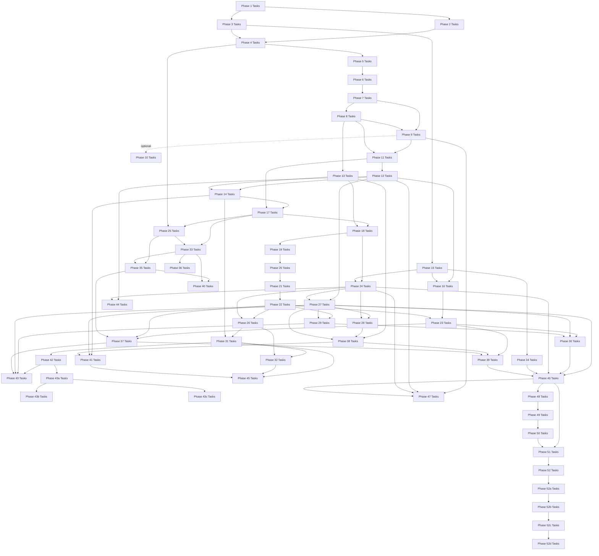

# Roadmap Task Lists

This directory turns the roadmap milestones into concrete implementation task lists.
The milestone pages in `docs/roadmap/` explain the purpose, scope, and design intent of
each phase. The task pages here translate those goals into work items that can be
implemented and validated incrementally.

Each phase task list includes:

- implementation tasks
- validation tasks
- documentation tasks
- explicit dependencies on earlier phases

Every phase includes documentation work by design. A phase is not complete until the
project explains:

- what the feature is for
- how it is implemented here
- which simplifications were made
- how a mature operating system would usually differ at a high level

## Phase Task Flow

## Task Documents

### Foundation Phases (complete)

| Phase | Focus | Status | Source Ref | Task List |
|---|---|---|---|---|
| 1 | Boot foundation | Complete | `phase-01` | [Phase 1 Tasks](./01-boot-foundation-tasks.md) |
| 2 | Memory basics | Complete | `phase-02` | [Phase 2 Tasks](./02-memory-basics-tasks.md) |
| 3 | Interrupts | Complete | `phase-03` | [Phase 3 Tasks](./03-interrupts-tasks.md) |
| 4 | Tasking | Complete | `phase-04` | [Phase 4 Tasks](./04-tasking-tasks.md) |
| 5 | Userspace entry | Complete | `phase-05` | [Phase 5 Tasks](./05-userspace-entry-tasks.md) |
| 6 | IPC core | Complete | `phase-06` | [Phase 6 Tasks](./06-ipc-core-tasks.md) |
| 7 | Core servers | Complete | `phase-07` | [Phase 7 Tasks](./07-core-servers-tasks.md) |
| 8 | Storage and VFS | Complete | `phase-08` | [Phase 8 Tasks](./08-storage-and-vfs-tasks.md) |
| 9 | Framebuffer and shell | Complete | `phase-09` | [Phase 9 Tasks](./09-framebuffer-and-shell-tasks.md) |
| 10 *(optional)* | Secure Boot signing | Complete | `phase-10` | [Phase 10 Tasks](./10-secure-boot-tasks.md) |

### POSIX and Userspace Phases (complete)

| Phase | Focus | Status | Source Ref | Task List |
|---|---|---|---|---|
| 11 | ELF loader and process model | Complete | `phase-11` | [Phase 11 Tasks](./11-process-model-tasks.md) |
| 12 | POSIX compatibility layer | Complete | `phase-12` | [Phase 12 Tasks](./12-posix-compat-tasks.md) |
| 13 | Writable filesystem | Complete | `phase-13` | *not yet created* |
| 14 | Shell and userspace tools | Complete | `phase-14` | [Phase 14 Tasks](./14-shell-and-tools-tasks.md) |
| 15 | Hardware discovery (ACPI + PCI) | Complete | `phase-15` | [Phase 15 Tasks](./15-hardware-discovery-tasks.md) |
| 16 | Network stack | Complete | `phase-16` | [Phase 16 Tasks](./16-network-tasks.md) |

### Usability Phases (complete)

| Phase | Focus | Status | Source Ref | Task List |
|---|---|---|---|---|
| 17 | Memory reclamation (free-list, CoW fork, heap growth) | Complete | `phase-17` | [Phase 17 Tasks](./17-memory-reclamation-tasks.md) |
| 18 | Directory and VFS (`getdents64`, real cwd) | Complete | `phase-18` | [Phase 18 Tasks](./18-directory-vfs-tasks.md) |
| 19 | Signal handlers (trampolines, `sigreturn`) | Complete | `phase-19` | [Phase 19 Tasks](./19-signal-handlers-tasks.md) |
| 20 | Userspace init and shell (ring-3 PID 1) | Complete | `phase-20` | [Phase 20 Tasks](./20-userspace-init-shell-tasks.md) |
| 21 | Ion shell integration (ion replaces custom shell) | Complete | `phase-21` | [Phase 21 Tasks](./21-ion-shell-tasks.md) |
| 22 | TTY and terminal control (termios, PTY) | Complete | `phase-22` | [Phase 22 Tasks](./22-tty-pty-tasks.md) |
| 22b | ANSI escape sequences | Complete | `phase-22b` | [Phase 22b Tasks](./22b-ansi-escape-tasks.md) |
| 23 | Socket API (BSD sockets over TCP/UDP stack) | Complete | `phase-23` | [Phase 23 Tasks](./23-socket-api-tasks.md) |
| 24 | Persistent storage (virtio-blk, FAT32 r/w) | Complete | `phase-24` | [Phase 24 Tasks](./24-persistent-storage-tasks.md) |
| 25 | SMP (AP startup, per-core scheduler, TLB shootdown) | Complete | `phase-25` | [Phase 25 Tasks](./25-smp-tasks.md) |

### Productivity Phases (complete)

| Phase | Focus | Status | Source Ref | Task List |
|---|---|---|---|---|
| 26 | Text editor (kibi-style full-screen editor) | Complete | `phase-26` | [Phase 26 Tasks](./26-text-editor-tasks.md) |
| 27 | User accounts (login, passwd, multi-user) | Complete | `phase-27` | [Phase 27 Tasks](./27-user-accounts-tasks.md) |
| 28 | ext2 filesystem (persistent storage) | Complete | `phase-28` | [Phase 28 Tasks](./28-ext2-filesystem-tasks.md) |
| 29 | PTY subsystem (pseudo-terminal pairs) | Complete | `phase-29` | [Phase 29 Tasks](./29-pty-subsystem-tasks.md) |
| 30 | Telnet server (remote shell access) | Complete | `phase-30` | [Phase 30 Tasks](./30-telnet-server-tasks.md) |
| 31 | Compiler bootstrap (TCC) | Complete | `phase-31` | [Phase 31 Tasks](./31-compiler-bootstrap-tasks.md) |
| 32 | Build tools (make, ar) | Complete | `phase-32` | [Phase 32 Tasks](./32-build-tools-tasks.md) |

### Kernel Infrastructure Phases (phases 33-36 complete)

| Phase | Focus | Status | Source Ref | Task List |
|---|---|---|---|---|
| 33 | Kernel memory improvements (slab, OOM retry, munmap) | Complete | `phase-33` | [Phase 33 Tasks](./33-kernel-memory-tasks.md) |
| 34 | Real-time clock and timekeeping | Complete | `phase-34` | [Phase 34 Tasks](./34-real-time-clock-tasks.md) |
| 35 | True SMP multitasking (per-core dispatch, priorities) | Complete | `phase-35` | [Phase 35 Tasks](./35-true-smp-multitasking-tasks.md) |
| 36 | Expanded memory (demand paging, mprotect, disk/RAM) | Complete | `phase-36` | [Phase 36 Tasks](./36-expanded-memory-tasks.md) |
| 37 | I/O multiplexing (select, epoll, non-blocking) | Complete | `phase-37` | [Phase 37 Tasks](./37-io-multiplexing-tasks.md) |
| 38 | Filesystem enhancements (symlinks, hard links, /proc, permissions, device nodes) | Complete | `phase-38` | [Phase 38 Tasks](./38-filesystem-enhancements-tasks.md) |
| 39 | Unix domain sockets (AF_UNIX) | Complete | `phase-39` | [Phase 39 Tasks](./39-unix-domain-sockets-tasks.md) |
| 40 | Threading primitives (clone, futex, TLS) | Complete | `phase-40` | [Phase 40 Tasks](./40-threading-primitives-tasks.md) |

### Application Phases (complete)

| Phase | Focus | Status | Source Ref | Task List |
|---|---|---|---|---|
| 41 | Expanded coreutils (head, tail, sort, find, diff, ps) | Complete | `phase-41` | [Phase 41 Tasks](./41-expanded-coreutils-tasks.md) |
| 42 | Crypto Primitives (RustCrypto crypto-lib) | Complete | `phase-42` | [Tasks](./42-crypto-primitives-tasks.md) |
| 43 | SSH (sunset or Dropbear) | Complete | `phase-43` | [Tasks](./43-ssh-server-tasks.md) |
| 43a | Crash diagnostics | Complete | `phase-43a` | [Tasks](./43a-crash-diagnostics-tasks.md) |
| 43b | Kernel trace ring | Complete | `phase-43b` | [Tasks](./43b-kernel-trace-ring-tasks.md) |
| 43c | Regression and stress | Complete | `phase-43c` | [Tasks](./43c-regression-stress-ci-tasks.md) |
| 44 | Rust cross-compilation | Complete | `phase-44` | [Tasks](./44-rust-cross-compilation-tasks.md) |
| 45 | Ports system (source-based package building) | Complete | `phase-45` | [Tasks](./45-ports-system-tasks.md) |
| 46 | System services (init, syslog, cron) | Complete | `phase-46` | [Tasks](./46-system-services-tasks.md) |

### Graphics Proof Phase (complete)

| Phase | Focus | Status | Source Ref | Task List |
|---|---|---|---|---|
| 47 | DOOM | Complete | `phase-47` | [Tasks](./47-doom-tasks.md) |

### Convergence and Release-Critical Phases

| Phase | Focus | Status | Source Ref | Task List |
|---|---|---|---|---|
| 48 | Security Foundation | Complete | `phase-48` | [Tasks](./48-security-foundation-tasks.md) |
| 49 | Architectural Declaration | Complete | `phase-49` | [Tasks](./49-architectural-declaration-tasks.md) |
| 50 | IPC Completion | Complete | `phase-50` | [Tasks](./50-ipc-completion-tasks.md) |

### Convergence Phases

| Phase | Focus | Status | Source Ref | Task List |
|---|---|---|---|---|
| 51 | Service model maturity (contract, restart, shutdown, admin) | In Progress | `phase-51` | [Tasks](./51-service-model-maturity-tasks.md) |
| 52 | First service extractions (console, keyboard to ring 3) | In Progress | `phase-52` | [Tasks](./52-first-service-extractions-tasks.md) |
| 52a | Kernel reliability fixes | Complete | `phase-52a` | [Tasks](./52a-kernel-reliability-fixes-tasks.md) |
| 52b | Kernel structural hardening | Complete | `phase-52b` | [Tasks](./52b-kernel-structural-hardening-tasks.md) |
| 52c | Kernel architecture evolution | Complete | `phase-52c` | [Tasks](./52c-kernel-architecture-evolution-tasks.md) |
| 52d | Kernel completion and roadmap alignment | Complete | `phase-52d` | [Tasks](./52d-kernel-completion-and-roadmap-alignment-tasks.md) |
| 53 | Headless hardening | Complete | `phase-53` | [Tasks](./53-headless-hardening-tasks.md) |
| 54 | Deep serverization | Complete | `phase-54` | [Tasks](./54-deep-serverization-tasks.md) |
| 54a | Post-serverization kernel hygiene | Planned | `phase-54a` | [Tasks](./54a-post-serverization-kernel-hygiene-tasks.md) |
| 55 | Hardware Substrate | Planned | `phase-55` | [Tasks](./55-hardware-substrate-tasks.md) |

### Future Task Docs
Task docs for Phases **56 and later** are intentionally deferred until closer to implementation time.

The main roadmap phases now define:

- explicit evaluation gates
- critical and non-deferrable items
- learning-documentation requirements
- related documentation / README update requirements

When a future phase moves into active implementation planning, add its task doc in this
directory using the phase task template from `docs/appendix/doc-templates.md`.

## Suggested Usage

Start from the milestone page for context, then use the task page to drive execution.
When a phase is complete, update the relevant subsystem docs before moving on.

Related documents:

- [Roadmap Guide](../README.md)
