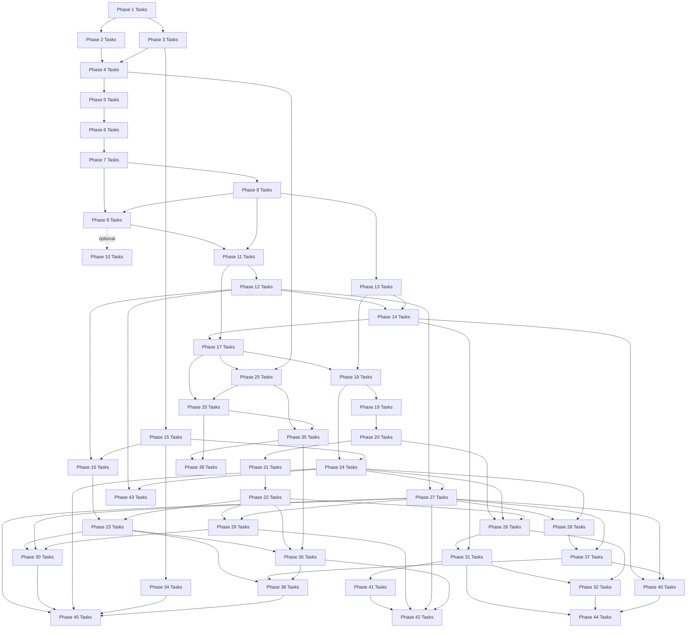

# Roadmap Task Lists

This directory turns the roadmap milestones into concrete implementation task lists.
The milestone pages in `docs/roadmap/` explain the purpose, scope, and design intent of
each phase. The task pages here translate those goals into work items that can be
implemented and validated incrementally.

Each phase task list includes:

- implementation tasks
- validation tasks
- documentation tasks
- explicit dependencies on earlier phases

Every phase includes documentation work by design. A phase is not complete until the
project explains:

- what the feature is for
- how it is implemented here
- which simplifications were made
- how a mature operating system would usually differ at a high level

## Phase Task Flow

## Task Documents

### Foundation Phases (complete)

| Phase | Focus | Task List |
|---|---|---|
| 1 | Boot foundation | [Phase 1 Tasks](./01-boot-foundation-tasks.md) |
| 2 | Memory basics | [Phase 2 Tasks](./02-memory-basics-tasks.md) |
| 3 | Interrupts | [Phase 3 Tasks](./03-interrupts-tasks.md) |
| 4 | Tasking | [Phase 4 Tasks](./04-tasking-tasks.md) |
| 5 | Userspace entry | [Phase 5 Tasks](./05-userspace-entry-tasks.md) |
| 6 | IPC core | [Phase 6 Tasks](./06-ipc-core-tasks.md) |
| 7 | Core servers | [Phase 7 Tasks](./07-core-servers-tasks.md) |
| 8 | Storage and VFS | [Phase 8 Tasks](./08-storage-and-vfs-tasks.md) |
| 9 | Framebuffer and shell | [Phase 9 Tasks](./09-framebuffer-and-shell-tasks.md) |
| 10 *(optional)* | Secure Boot signing | [Phase 10 Tasks](./10-secure-boot-tasks.md) |

### POSIX and Userspace Phases (complete)

| Phase | Focus | Task List |
|---|---|---|
| 11 | ELF loader and process model | [Phase 11 Tasks](./11-process-model-tasks.md) |
| 12 | POSIX compatibility layer | [Phase 12 Tasks](./12-posix-compat-tasks.md) |
| 13 | Writable filesystem | [Phase 13 Tasks](./13-writable-fs-tasks.md) |
| 14 | Shell and userspace tools | [Phase 14 Tasks](./14-shell-and-tools-tasks.md) |
| 15 | Hardware discovery (ACPI + PCI) | [Phase 15 Tasks](./15-hardware-discovery-tasks.md) |
| 16 | Network stack | [Phase 16 Tasks](./16-network-tasks.md) |

### Usability Phases (complete)

| Phase | Focus | Task List |
|---|---|---|
| 17 | Memory reclamation (free-list, CoW fork, heap growth) | [Phase 17 Tasks](./17-memory-reclamation-tasks.md) |
| 18 | Directory and VFS (`getdents64`, real cwd) | [Phase 18 Tasks](./18-directory-vfs-tasks.md) |
| 19 | Signal handlers (trampolines, `sigreturn`) | [Phase 19 Tasks](./19-signal-handlers-tasks.md) |
| 20 | Userspace init and shell (ring-3 PID 1) | [Phase 20 Tasks](./20-userspace-init-shell-tasks.md) |
| 21 | Ion shell integration (ion replaces custom shell) | [Phase 21 Tasks](./21-ion-shell-tasks.md) |
| 22 | TTY and terminal control (termios, PTY) | [Phase 22 Tasks](./22-tty-pty-tasks.md) |
| 23 | Socket API (BSD sockets over TCP/UDP stack) | [Phase 23 Tasks](./23-socket-api-tasks.md) |
| 24 | Persistent storage (virtio-blk, FAT32 r/w) | [Phase 24 Tasks](./24-persistent-storage-tasks.md) |

### Advanced Phases (complete)

| Phase | Focus | Task List |
|---|---|---|
| 25 | SMP (AP startup, per-core scheduler, TLB shootdown) | [Phase 25 Tasks](./25-smp-tasks.md) |
| 26 | Text editor (kibi-style full-screen editor) | [Phase 26 Tasks](./26-text-editor-tasks.md) |
| 27 | User accounts (login, passwd, multi-user) | [Phase 27 Tasks](./27-user-accounts-tasks.md) |
| 28 | ext2 filesystem (persistent storage) | [Phase 28 Tasks](./28-ext2-filesystem-tasks.md) |
| 29 | PTY subsystem (pseudo-terminal pairs) | [Phase 29 Tasks](./29-pty-subsystem-tasks.md) |

### Productivity Phases

| Phase | Focus | Task List |
|---|---|---|
| 30 | Telnet server (remote shell access) | [Phase 30 Tasks](./30-telnet-server-tasks.md) |
| 31 | Compiler bootstrap (TCC) | [Phase 31 Tasks](./31-compiler-bootstrap-tasks.md) |
| 32 | Build tools (make, ar) | [Phase 32 Tasks](./32-build-tools-tasks.md) |

### Kernel Infrastructure Phases

| Phase | Focus | Task List |
|---|---|---|
| 33 | Kernel memory improvements (slab, OOM retry, munmap) | *not yet created* |
| 34 | Real-time clock and timekeeping | *not yet created* |
| 35 | True SMP multitasking (per-core dispatch, priorities) | *not yet created* |
| 36 | I/O multiplexing (select, epoll, non-blocking) | *not yet created* |
| 37 | Filesystem enhancements (symlinks, /proc, permissions) | *not yet created* |
| 38 | Unix domain sockets (AF_UNIX) | *not yet created* |
| 39 | Threading primitives (clone, futex, TLS) | *not yet created* |

### Application Phases

| Phase | Focus | Task List |
|---|---|---|
| 40 | Expanded coreutils (head, tail, sort, find, diff, ps) | *not yet created* |
| 41 | Crypto primitives (SHA-256, Ed25519, ChaCha20) | *not yet created* |
| 42 | SSH server (encrypted remote access) | *not yet created* |
| 43 | Rust cross-compilation | *not yet created* |
| 44 | Ports system (source-based package building) | *not yet created* |
| 45 | System services (init, syslog, cron) | *not yet created* |

## Suggested Usage

Start from the milestone page for context, then use the task page to drive execution.
When a phase is complete, update the relevant subsystem docs before moving on.

Related documents:

- [Roadmap Guide](../README.md)
- [Roadmap Summary](../../08-roadmap.md)
