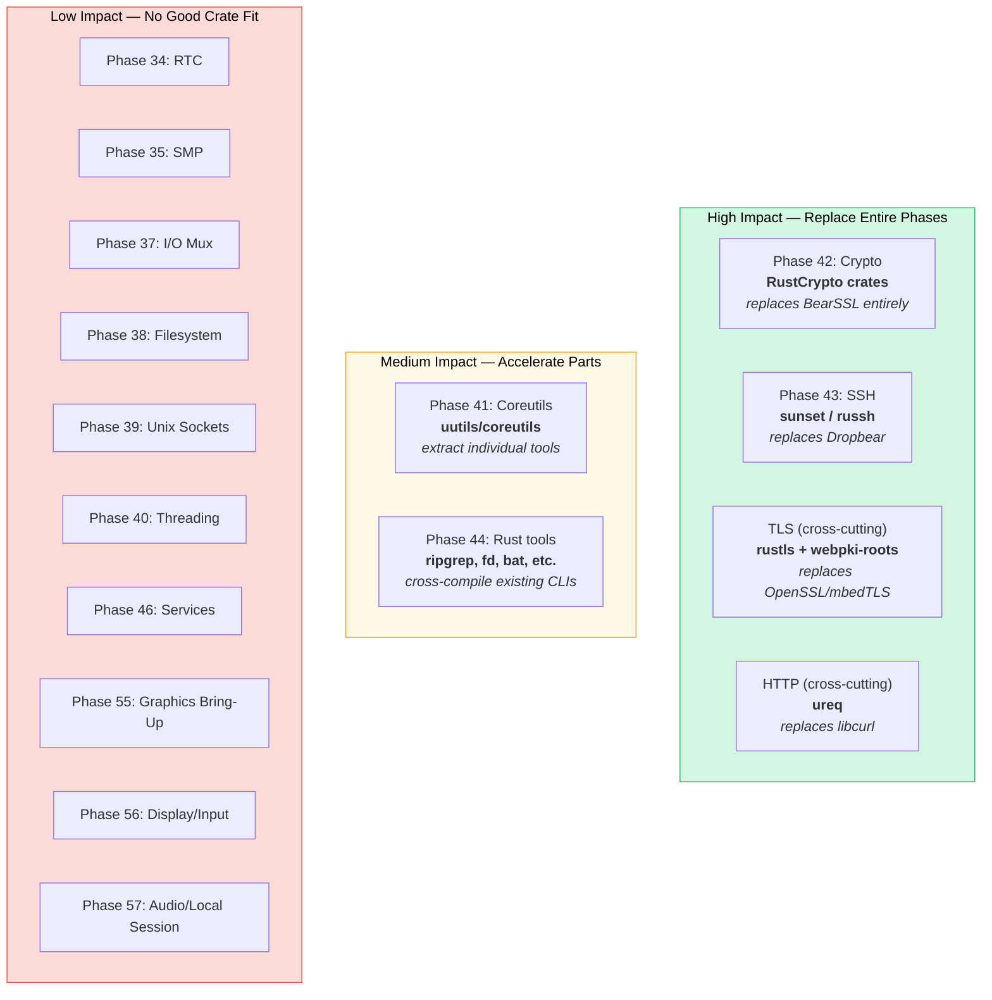
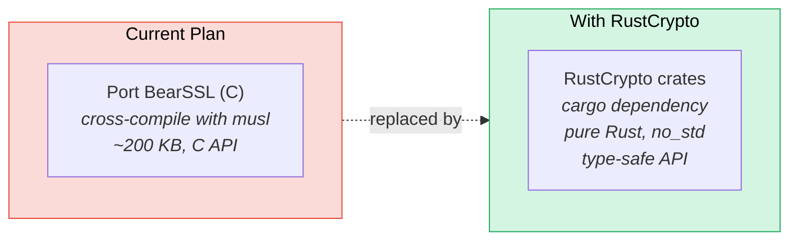
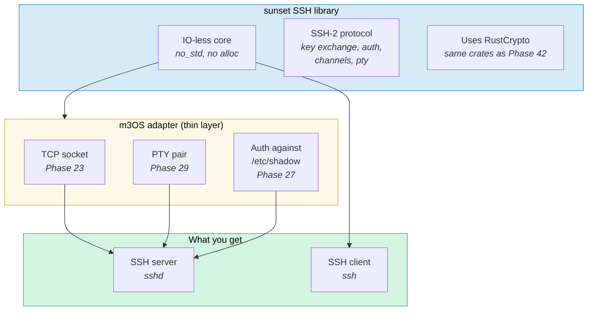
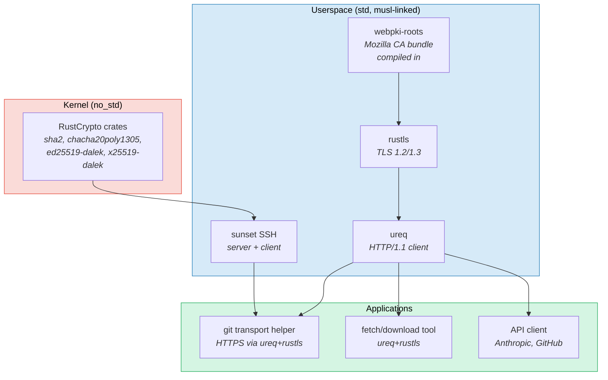

# Rust Crate Acceleration for m3OS Roadmap

This document analyzes which post-Phase 33 roadmap items can be accelerated
by leveraging existing open-source Rust libraries and projects instead of
implementing from scratch or porting C libraries. The goal is to stay in
the Rust ecosystem wherever possible -- better type safety, easier
integration with the kernel-core crate, and no C cross-compilation headaches.

## Overview



---

## High Impact: Replace Entire Implementation Plans

### Phase 42 -- Cryptography: RustCrypto Crates

**Current plan:** Port BearSSL (C library, ~200 KB) or TweetNaCl (C, ~4 KB).

**Better plan:** Use the **RustCrypto** project's individual crates. They are
pure Rust, `no_std` compatible, actively maintained, and provide exactly the
primitives Phase 42 specifies.

| Phase 42 requirement | RustCrypto crate | `no_std` | Notes |
|---|---|---|---|
| SHA-256 | `sha2` | Yes | `default-features = false` for no alloc |
| HMAC-SHA-256 | `hmac` | Yes | Generic over any hash, pairs with `sha2` |
| HKDF | `hkdf` | Yes | Tiny crate wrapping `hmac` |
| ChaCha20-Poly1305 | `chacha20poly1305` | Yes | AEAD cipher (RFC 8439) |
| AES-128/256 | `aes` + `ctr` or `cbc` | Yes | Block cipher + mode crates |
| Ed25519 signatures | `ed25519-dalek` | Yes | `features = ["alloc"]` for no_std |
| X25519 key exchange | `x25519-dalek` | Yes | Built on `curve25519-dalek` |
| CSPRNG | `rand_chacha` | Yes | ChaCha20-based, seed from `getrandom()` syscall (upgrade to RDRAND-backed planned) |

**Why this is better than BearSSL:**
- **Pure Rust** -- no C cross-compilation, no musl dependency for kernel use
- **`no_std`** -- can run in kernel space (kernel-core crate) or userspace
- **Modular** -- pull only the primitives you need, not a full TLS stack
- **Type-safe** -- key types, nonce types, tag types prevent misuse at compile time
- **Well-audited** -- `ed25519-dalek` and `curve25519-dalek` have had formal audits

**What to avoid:** `ring` -- it has C/asm components that are painful to build
for `x86_64-unknown-none` targets. The pure-Rust RustCrypto crates cross-compile
trivially.

**Integration approach:**

```toml
# kernel-core/Cargo.toml (no_std)
[dependencies]
sha2 = { version = "0.10", default-features = false }
hmac = { version = "0.12", default-features = false }
chacha20poly1305 = { version = "0.10", default-features = false, features = ["alloc"] }
ed25519-dalek = { version = "2", default-features = false, features = ["alloc"] }
x25519-dalek = { version = "2", default-features = false }
hkdf = { version = "0.12", default-features = false }
```

**Effort reduction:** Eliminates the entire BearSSL cross-compilation pipeline.
No `build_bearssl()` in xtask. No C code. Phase 42 becomes "add crate
dependencies and write a thin API wrapper."



---

### Phase 43 -- SSH: sunset (Pure Rust, no_std SSH)

**Current plan:** Port Dropbear SSH (C, ~110 KB static binary).

**Better option:** **`sunset`** -- a pure Rust SSH library with an IO-less,
`no_std`, no-alloc core. Created by Matt Johnston (who also created Dropbear).

| Property | Dropbear (C) | sunset (Rust) | russh (Rust) |
|---|---|---|---|
| Language | C | Pure Rust | Rust |
| `no_std` support | N/A (binary) | Yes (core) | No |
| Client + Server | Server only (default) | Both | Both |
| Async runtime needed | No | No (IO-less core) | Yes (tokio) |
| Crypto backend | Built-in C | RustCrypto crates | ring or aws-lc-rs |
| Binary size | ~110 KB | ~150 KB (estimated) | ~2 MB+ (tokio) |
| Maturity | Battle-tested, 20+ years | Early but functional | Mature, used by VS Code |
| Runs on embedded | Yes (widely used) | Yes (runs on RPi Pico W) | No |

**Why sunset is compelling:**
- **Same author as Dropbear** -- Matt Johnston knows SSH implementation deeply
- **IO-less core** -- the SSH protocol logic has no I/O dependencies. You
  feed it bytes, it gives you bytes back. Perfect for integration into m3OS's
  existing socket/PTY infrastructure.
- **Uses RustCrypto** -- if we adopt RustCrypto for Phase 42, sunset reuses
  the same crates (chacha20poly1305, ed25519-dalek, x25519-dalek, sha2)
- **Client AND server** -- get SSH client for free (needed for `git push`
  over SSH, an alternative to HTTPS)
- **~13 KB per session** -- extremely memory-efficient

**Why NOT russh:** It requires tokio (heavy async runtime), which pulls in
epoll, threads, and significant complexity. russh is designed for server
applications on full Linux, not toy OSes.

**Integration approach:**
- Add `sunset` as a dependency to a new `sshd` userspace crate
- Write a thin adapter that connects sunset's IO-less API to m3OS sockets
  and PTY pairs
- SSH server gets PTY allocation (Phase 29), shell exec, signal forwarding
  for free -- same infrastructure as telnetd (Phase 30)



**Risk:** sunset is early-stage. If it proves too immature, fall back to
cross-compiling Dropbear with musl (the current plan). But sunset is worth
evaluating first.

---

### TLS (Cross-Cutting): rustls + webpki-roots

**Current plan (across multiple roadmaps):** Port OpenSSL, mbedTLS, or
BearSSL for git HTTPS, pip, npm, and Claude Code.

**Better plan:** Use **`rustls`** -- a pure Rust TLS implementation -- with
**`webpki-roots`** for embedded CA certificates.

| Property | OpenSSL (C) | mbedTLS (C) | rustls (Rust) |
|---|---|---|---|
| Language | C | C | Pure Rust |
| TLS version | 1.0-1.3 | 1.0-1.3 | 1.2-1.3 only |
| Static musl binary | Works but painful | Works | Trivial |
| CA certificates | Needs file on disk | Needs file on disk | **Compiled into binary** |
| Dependencies | zlib, perl (build) | None | RustCrypto or ring |
| Size (static) | ~3 MB | ~500 KB | ~500 KB |
| Cross-compile | Documented but fiddly | Easier | `cargo build` just works |

**Why this is better:**
- **No C code** -- no cross-compilation of OpenSSL or mbedTLS
- **`webpki-roots`** embeds Mozilla's CA certificates directly in the binary.
  No `/etc/ssl/certs/ca-certificates.crt` file needed on disk.
- **Works with ureq** (see HTTP section) for a complete HTTPS client stack
- **TLS 1.3** -- GitHub, Anthropic API, and most modern services prefer it

**Impact on other roadmaps:**
- **git HTTPS** -- rebuild git with rustls-based curl, OR write a git
  credential/transport helper in Rust that uses rustls directly
- **Claude Code** -- Node.js uses OpenSSL, but `gh` (Go) has built-in TLS.
  For Rust-native tools, rustls is the answer.
- **pip** -- Python's `_ssl` module expects OpenSSL API. rustls doesn't help
  here directly, but a Rust-native HTTP download tool could replace pip for
  fetching packages.

**Note:** rustls requires `std` -- it's userspace only. The kernel crypto
(Phase 42) uses the `no_std` RustCrypto crates directly.

---

### HTTP Client (Cross-Cutting): ureq

**Current plan:** Cross-compile libcurl (C) for git HTTPS and general HTTP.

**Better plan:** Use **`ureq`** -- a minimal, synchronous Rust HTTP client.

| Property | libcurl (C) | reqwest (Rust) | ureq (Rust) |
|---|---|---|---|
| Language | C | Rust | Rust |
| Async | No (sync) | Yes (tokio) | No (sync) |
| TLS backend | OpenSSL | rustls or native-tls | rustls |
| Dependencies | OpenSSL, zlib | tokio, hyper, many | Minimal |
| musl static | Works but painful | Works but heavy | Trivial |
| Binary overhead | ~1 MB | ~3 MB | ~500 KB |

**Why ureq:**
- **Synchronous** -- no async runtime needed. Perfect for m3OS where we
  don't have tokio and don't want it.
- **Uses rustls** -- pairs with the TLS strategy above
- **Minimal deps** -- doesn't pull in half the Rust ecosystem
- **Good enough** -- handles HTTP/1.1, redirects, basic auth, JSON bodies

**Use cases on m3OS:**
- A Rust-native `fetch` or `download` tool for fetching tarballs
- A git credential helper that does HTTPS
- API client for the Anthropic API (Claude Code alternative path)
- Package fetching for a ports system (Phase 45)

---

## Medium Impact: Accelerate Parts of Phases

### Phase 41 -- Coreutils: uutils/coreutils

**Current plan:** Port sbase (suckless C utils, ~30-300 lines each) or write
minimal C versions.

**Alternative:** Extract individual tools from **`uutils/coreutils`** -- the
Rust rewrite of GNU coreutils.

| Tool | uutils status | Lines (approx) | Worth extracting? |
|---|---|---|---|
| `head` | Complete, GNU-compatible | ~500 | Maybe -- sbase version is simpler |
| `tail` | Complete, GNU-compatible | ~800 | Maybe -- `-f` (follow) is useful |
| `sort` | Complete, GNU-compatible | ~1500 | Yes -- sort is complex to implement well |
| `find` | Complete, GNU-compatible | ~2000 | Yes -- find is complex (predicates, actions) |
| `diff` | Complete | ~1000 | Yes -- diff algorithms are non-trivial |
| `sed` | Complete | ~1500 | Yes -- sed is a mini language |
| `less` | Not in uutils | N/A | No -- would need a separate pager |
| `ps` | Not in uutils (OS-specific) | N/A | No -- needs /proc, must be custom |

**Trade-offs:**
- **Pro:** uutils tools are well-tested, GNU-compatible, handle edge cases
- **Con:** Each tool pulls `uucore` (~10K lines shared library), adding weight
- **Con:** Some tools assume Linux /proc, Linux-specific syscalls
- **Recommendation:** Use uutils for complex tools (`sort`, `find`, `diff`,
  `sed`) where the algorithm matters. Write simple tools (`head`, `tail`,
  `tee`, `cut`, `tr`) by hand -- they're 30-100 lines each.

This requires Phase 44 (Rust cross-compilation) to be complete first.

---

### Phase 44 -- Rust Cross-Compilation: Existing Rust CLI Tools

**Current plan:** Document the `x86_64-unknown-linux-musl` target for Rust
programs.

**Acceleration:** Once the pipeline works, many popular Rust CLI tools
cross-compile to musl with zero modifications:

| Tool | What it does | Binary size | Dependencies |
|---|---|---|---|
| `ripgrep` (rg) | Fast grep replacement | ~5 MB | Minimal (regex) |
| `fd` | Fast find replacement | ~3 MB | Minimal |
| `bat` | cat with syntax highlighting | ~6 MB | syntect (heavy) |
| `eza` | Modern ls replacement | ~3 MB | Minimal |
| `dust` | Disk usage visualizer | ~3 MB | Minimal |
| `tokei` | Code line counter | ~3 MB | Minimal |
| `hexyl` | Hex viewer | ~1 MB | Minimal |
| `sd` | sed replacement | ~2 MB | regex |
| `xh` | HTTP client (like httpie) | ~8 MB | reqwest (heavy) |
| `miniserve` | Simple HTTP server | ~5 MB | actix/tokio |

**All of these** cross-compile with:
```bash
cargo build --target x86_64-unknown-linux-musl --release
```

**Caveat:** Tools that use threads or epoll (`ripgrep` for parallel search,
`miniserve` for serving) need Phases 36 + 39. Tools that are pure
computation (`tokei`, `hexyl`, `sd`) may work with just Phase 33 + Expanded
Memory.

---

## Low Impact: No Good Crate Fit

These phases are kernel-level work where no Rust crate provides meaningful
acceleration. They must be implemented from scratch.

### Phase 34 -- Real-Time Clock
**Why no crate:** Reading CMOS RTC registers (I/O ports 0x70/0x71) is ~50
lines of inline assembly and bit manipulation. No crate needed.

### Phase 35 -- True SMP Multitasking
**Why no crate:** Per-core run queues, load balancing, and syscall stack
management are deeply tied to the kernel's task model. This is custom
architecture work.

### Phase 37 -- I/O Multiplexing
**Why no crate:** You are implementing `epoll` and `select` as kernel
syscalls. Crates like `mio` and `tokio` are *consumers* of epoll, not
implementations of it. There is no "epoll implementation crate" because
epoll is an OS primitive. One exception worth noting: **`embassy-executor`**
is a `no_std` async executor that could theoretically inform the design of
an in-kernel event dispatch system, but it's not a drop-in.

### Phase 38 -- Filesystem Enhancements
**Why no crate:** Symlinks, `/proc`, device nodes, and permission enforcement
are VFS-layer kernel code. No crate implements these.

### Phase 39 -- Unix Domain Sockets
**Why no crate:** AF_UNIX sockets are kernel IPC primitives. No crate
implements them.

### Phase 40 -- Threading Primitives
**Why no crate:** `clone(CLONE_THREAD)`, `futex()`, and TLS are kernel
syscall implementations. No crate provides these.

### Phase 46 -- System Services
**Why no crate:** No mature Rust service manager exists for embedded/toy OS
use. Write your own -- it's straightforward init/fork/waitpid/setsid code.
Model after runit (~2000 lines C) for simplicity.

### Phase 55 -- Graphics Bring-Up
**Why no crate:** Uses doomgeneric (C), which requires implementing 4
platform functions. The Rust ecosystem has no DOOM port that would be easier.
The current plan (cross-compile doomgeneric with musl) is the right approach.

### Phase 56 -- Display and Input Architecture
**Why no crate:** PS/2 mouse is hardware register programming (IRQ 12,
3-byte packets). ~100 lines of driver code. No crate needed.

### Phase 57 -- Audio and Local Session
**Why no crate:** `cpal` and `rodio` talk to host OS audio APIs (ALSA,
PulseAudio), not hardware. You need to program HDA or AC97 registers
directly -- PCI BARs, DMA buffer descriptor lists, codec verbs. This is
pure driver work. AC97 is simpler than HDA and well-suited for a toy OS.

---

## The Rust-Native Stack

Combining all the high-impact crates, m3OS could have a fully Rust-native
networking and security stack with zero C dependencies:



**What this eliminates from the C porting plan:**
- BearSSL / OpenSSL / mbedTLS (replaced by RustCrypto + rustls)
- Dropbear SSH (replaced by sunset)
- libcurl (replaced by ureq)
- CA certificate files on disk (replaced by webpki-roots)
- All C cross-compilation for networking/security

**What still needs C cross-compilation:**
- TCC (already done, Phase 31)
- Clang/LLVM (if pursuing that roadmap)
- git (C codebase, but could use Rust transport helper for HTTPS)
- pdpmake (already done, Phase 32)
- ion shell (already done, Phase 21)
- doomgeneric (Phase 55)

---

## Priority Order

Based on dependency chains and impact:

```mermaid
gantt
    title Rust Crate Integration Priority
    dateFormat X
    axisFormat %s

    section Phase 42 (Crypto)
    Add RustCrypto to kernel-core        :crit, rc, 0, 1
    CSPRNG via rand_chacha + RDRAND      :rng, after rc, 1

    section Phase 43 (SSH)
    Evaluate sunset feasibility          :eval, after rc, 1
    Implement sshd with sunset           :sshd, after eval, 1
    Implement ssh client with sunset     :sshc, after sshd, 1

    section TLS + HTTP (cross-cutting)
    Add rustls to userspace              :tls, after rc, 1
    Add ureq HTTP client                 :http, after tls, 1
    Build fetch/download tool            :fetch, after http, 1

    section Phase 44 (Rust tools)
    Cross-compile ripgrep, fd            :tools, after tls, 1
    Extract uutils sort, find, diff      :uu, after tools, 1
```



## Summary Table

| Phase | Current Plan | Rust Crate Alternative | Impact | Effort Saved |
|---|---|---|---|---|
| **42 (Crypto)** | Port BearSSL (C) | RustCrypto crates (no_std) | **High** | Eliminates C cross-compile |
| **43 (SSH)** | Port Dropbear (C) | sunset (no_std Rust SSH) | **High** | Eliminates C cross-compile, get client+server |
| **TLS** | Port OpenSSL/mbedTLS (C) | rustls + webpki-roots | **High** | Eliminates C cross-compile, no CA files |
| **HTTP** | Port libcurl (C) | ureq | **High** | Eliminates C cross-compile |
| **41 (Coreutils)** | Port sbase (C) | uutils (selective) | **Medium** | Better for complex tools (sort, find, diff) |
| **44 (Rust tools)** | Document pipeline | Cross-compile existing CLIs | **Medium** | Free tools once pipeline works |
| **34-40, 46-49** | Implement from scratch | No good fit | **None** | Kernel work, must be custom |
