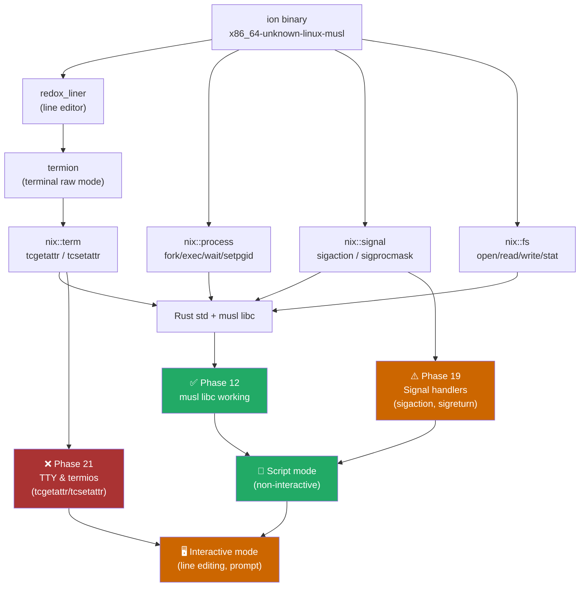
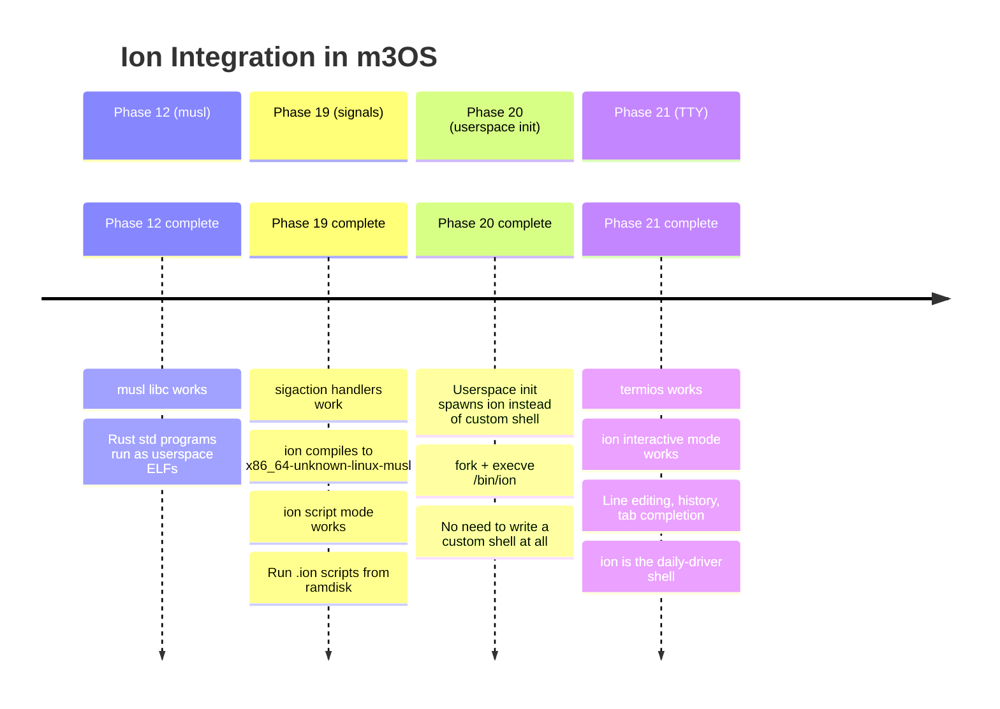
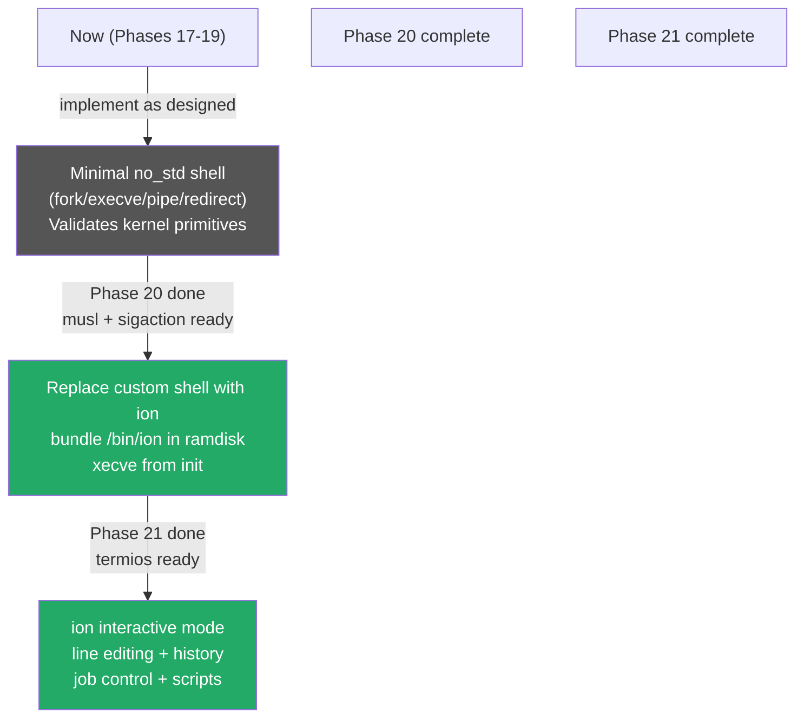

# Alternative Shell Options for Earlier Integration

> **Follow-up to**: [brush-integration-analysis.md](./brush-integration-analysis.md)  
> **Question**: Is there a Rust shell we can use *earlier* than brush requires?  
> **Answer**: Yes — **ion** (from Redox OS) is the best candidate. No tokio. No threads.
> Already ported to a custom Rust OS. Feasible after Phase 12 + 19 (script mode) or
> Phase 12 + 19 + 21 (interactive mode).

---

## Candidates Evaluated

| Shell | Async? | Threads? | Tokio? | Redox-tested? | Feasible for m3OS? |
|---|---|---|---|---|---|
| **ion** (Redox OS) | ❌ No | ❌ No | ❌ No | ✅ Yes | ✅ **Best option** |
| **brush** | ✅ Yes | ✅ Yes | ✅ Yes | ❌ No | 🔴 Blocked (no phase) |
| **shrs** | ❌ No | ❌ No | ❌ No | ❌ No | ⚠️ Partial — `skim` dep |
| **brush-parser only** | ❌ No | ❌ No | ❌ No | ❌ No | ✅ Parser only, write executor |
| **shrs_lang only** | ❌ No | ❌ No | ❌ No | ❌ No | ✅ Parser only, write executor |

---

## The Clear Winner: Ion Shell

[**ion**](https://github.com/redox-os/ion) is the shell for Redox OS — another custom
Rust OS with its own kernel and userspace. This is the decisive factor: ion was already
ported to run on a non-Linux, non-POSIX OS that had to implement its own syscall layer.
m3OS is in almost exactly the same position.

### Ion's Design Properties

- **Synchronous, single-threaded** — classic REPL loop: read line → parse → fork + exec → waitpid
- **No tokio, no async/await, no thread pool**
- **No epoll, no eventfd, no timerfd**
- **Embeddable as a library** (`ion_shell::Shell`) — not just a binary
- **MIT licensed**
- **Not POSIX-compliant by design** — intentionally cleaner syntax than bash, avoids
  ShellShock-class bugs
- Has its own test suite and manual

### Ion's Actual Dependencies

```toml
# ion Cargo.toml (key deps only)
nix = { features = ["fs", "term", "process", "signal"] }  # NO threads feature
redox_liner = "0.5"   # line editor → uses termion → termios
regex = "1"           # pure Rust
glob = "0.3"          # pure Rust
thiserror = "1"       # pure Rust
atty = "0.2"          # is stdin a tty? — trivially implemented
```

**No tokio. No rayon. No async. No crossterm thread loop. No epoll.**

The `nix` features used map directly to m3OS's existing syscall surface:

| nix Feature | Syscalls Used | m3OS Status |
|---|---|---|
| `process` | `fork`, `execve`, `waitpid`, `getpid`, `getpgid`, `setpgid` | ✅ Done |
| `signal` | `sigaction`, `kill`, `sigprocmask` | ⚠️ Phase 19 |
| `fs` | `open`, `read`, `write`, `stat`, `lseek`, `close`, `dup2` | ✅ Done |
| `term` | `tcgetattr`, `tcsetattr` (termios) | ❌ Phase 21 |

---

## Gap Analysis: Ion vs. m3OS



### Two Milestones, Not Five

| Mode | Phases Required | What You Get |
|---|---|---|
| **Script mode** | Phase 12 + Phase 19 | Run `.ion` scripts, pipe output, non-interactive |
| **Interactive mode** | Phase 12 + Phase 19 + Phase 21 | Full interactive shell with line editing, history, completions |

Compare to brush: **Phase 12 + 19 + 21 + threading (no phase) + epoll (no phase)**.
Ion's interactive mode is feasible in the existing roadmap. Brush's full binary is not.

---

## Two-Stage Integration Plan



### Stage 1 — After Phase 12 + 19: Ion as Script Interpreter

Ion's `main.rs` calls `atty::isatty(stdin)` to decide between interactive and script
modes. With non-interactive stdin (pipe or `-c` flag), ion skips `redox_liner` entirely
and never touches `tcgetattr`. This means:

- Compile ion as `x86_64-unknown-linux-musl`
- Bundle in the ramdisk as `/bin/ion`
- Use it from kernel init with `execve("/bin/ion", ["-c", "echo hello"], ...)`
- No termios needed

### Stage 2 — After Phase 21: Full Interactive Ion

Once `tcgetattr`/`tcsetattr` are implemented, `redox_liner` (via `termion`) can put the
terminal into raw mode. Ion then delivers:

- History (up/down arrow)
- Tab completion
- Vi and Emacs key bindings
- Syntax validation
- Pipelines, redirection, variables, arrays, functions, loops

---

## Ion vs. Writing Our Own Shell

The Phase 20 plan calls for a hand-rolled `no_std` shell. Here is the honest tradeoff:

| | Phase 20 `no_std` shell | Ion (Phase 12+19+20) |
|---|---|---|
| **Syntax** | Whitespace tokenizer only | Full ion language: arrays, functions, variables, loops, `match` |
| **Correctness** | Bugs guaranteed | Existing test suite |
| **Line editing** | None (raw byte reader) | Full `redox_liner` (history, completion, Vi/Emacs) |
| **Signal handling** | Manual | Built-in job control (`fg`, `bg`, `jobs`) |
| **Pipes** | 1-level (`cmd1 | cmd2`) | N-way pipelines |
| **Scripting** | None | Full `.ion` scripts, functions, loops |
| **Effort to maintain** | High (we own all bugs) | Low (upstream maintained) |
| **Educational value** | High (see every syscall) | Lower (black box) |
| **Ready when?** | Phase 20 | Phase 12 + 19 (scripts) / Phase 21 (interactive) |
| **Dependency on roadmap** | Phase 20 tasks | Phases 12, 19, (21) |

**Recommendation:** Still implement the Phase 20 minimal `no_std` shell as designed —
it is the right educational step and demonstrates the kernel works. But at Phase 20
completion, **replace the custom shell with ion** instead of continuing to extend it.
The custom shell becomes a validation tool, not the permanent solution.

---

## Redox Precedent

Redox is the most relevant reference point: it is a microkernel OS written in Rust,
with a custom syscall ABI, no Linux kernel underneath, and ion as its interactive shell.
The Redox team already solved the exact porting problem m3OS faces.

Key differences between Redox's syscall layer and m3OS's:

| Feature | Redox | m3OS |
|---|---|---|
| Syscall ABI | Custom Redox numbers | Linux x86_64 numbers ✅ (easier) |
| `fork` | `clone` equivalent | ✅ Done |
| `execve` | `exec` | ✅ Done |
| `sigaction` | Partial | Phase 19 |
| `termios` | `termios` crate | Phase 21 |
| `libc` | `libredox` custom | musl (Phase 12) |

m3OS is actually in a **better** position than Redox for porting ion, because m3OS
targets the **Linux ABI** — the same ABI ion was originally written for on Linux.
The Redox port required adapting to a non-Linux syscall layer. m3OS does not.

---

## shrs_lang as an Alternative Parser

If the goal is only to extract a parser (as with `brush-parser`), **shrs_lang** is
worth noting. It uses LALRPOP (an LR(1) parser generator) to implement POSIX shell
grammar:

```toml
# shrs_lang deps (parser only)
lalrpop-util = "0.19"
regex = "1"
glob = "0.3"
nix = { features = ["fs", "term", "process", "signal"] }
```

It is less battle-tested than `brush-parser` but is also less mature. For m3OS the
choice between `brush-parser` and `shrs_lang` as a parser extraction is:
- `brush-parser` → better tested (1,500 bash compat tests), bash grammar
- `shrs_lang` → POSIX grammar (simpler subset), LALRPOP-based

Neither is necessary if you use ion as the shell binary directly.

---

## Revised Recommendation



1. **Phase 20**: Build the minimal `no_std` shell as specified — it validates that
   `fork`/`execve`/`waitpid`/`pipe`/`dup2` all work correctly end-to-end. Keep it simple.

2. **Phase 20 follow-up**: Cross-compile ion to `x86_64-unknown-linux-musl`, add to
   ramdisk, have init `execve` it. Delete the custom shell. You instantly gain a real
   shell language.

3. **Phase 21**: Implement `tcgetattr`/`tcsetattr` — ion's interactive mode activates
   with zero additional work. Full line editing, history, and job control appear.

---

## References

- [ion — Redox OS shell](https://github.com/redox-os/ion)
- [ion manual](https://doc.redox-os.org/ion-manual/)
- [redox_liner — line editor](https://gitlab.redox-os.org/redox-os/liner)
- [shrs — rusty shell toolkit](https://github.com/MrPicklePinosaur/shrs)
- [brush-integration-analysis.md](./brush-integration-analysis.md)
- [docs/roadmap/20-userspace-init-shell.md](../roadmap/20-userspace-init-shell.md)
- [docs/roadmap/21-tty-pty.md](../roadmap/21-tty-pty.md)
