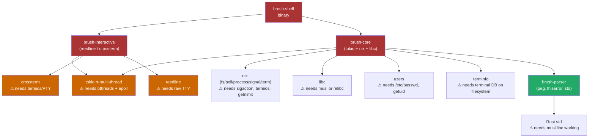
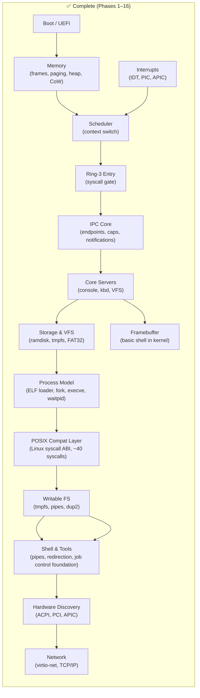
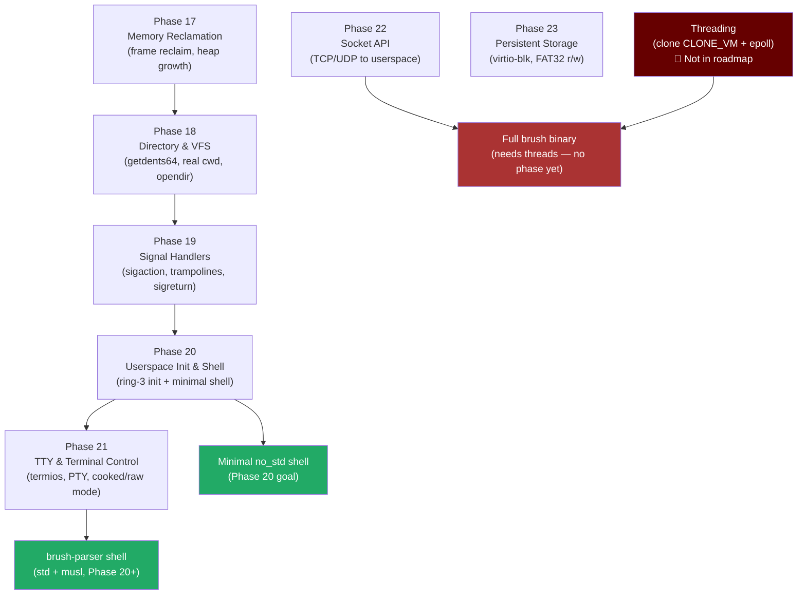
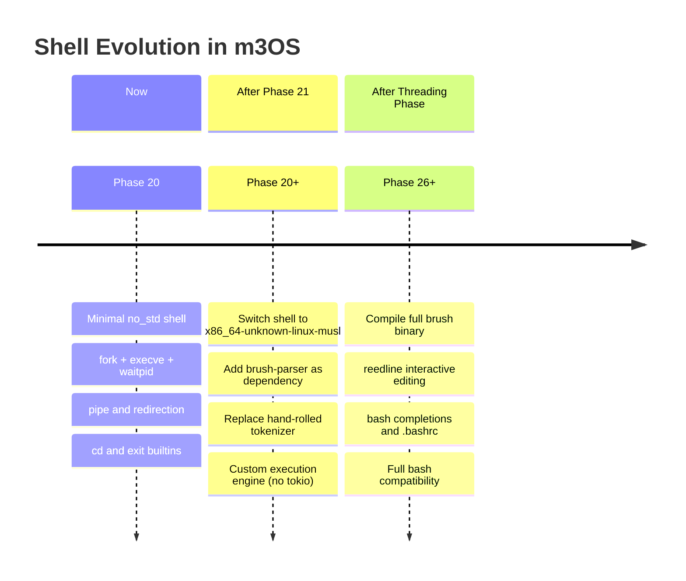

# brush Shell Integration Analysis

> **Date**: 2026-03-26  
> **Subject**: Feasibility of integrating [brush](https://github.com/reubeno/brush)
> (Bourne Rusty Shell) into m3OS as the userspace shell  
> **Conclusion**: Full brush binary is blocked for years; `brush-parser` crate is the
> right thing to extract once musl is working (Phase 12).

---

## What Is brush?

`brush` (**B**o(u)rn(e) **RU**sty **SH**ell) is a bash- and POSIX-compatible shell
written in Rust. It is validated against ~1,500 bash compatibility tests and is intended
as a daily-driver shell on Linux and macOS.

Its workspace is split into focused crates:

| Crate | Role |
|---|---|
| `brush-parser` | PEG-based tokenizer and AST for the full bash grammar |
| `brush-core` | Shell execution engine — async, OS-integrated (tokio + nix) |
| `brush-builtins` | 50+ builtins built on top of `brush-core` |
| `brush-interactive` | Line-editor integration (reedline / crossterm) |
| `brush-shell` | Binary entry point tying everything together |

---

## Dependency Stack

The diagram below shows the OS-level requirements that flow up from brush's key crates.



`brush-parser` (green) is the only crate that is realistically extractable in the
near term. Everything above it is blocked by OS features m3OS does not yet have.

---

## Gap Analysis: What brush Needs vs. What m3OS Has

### Blocker Severity Legend

| Symbol | Meaning |
|---|---|
| ✅ | Implemented and working |
| ⚠️ | Partial / stub |
| ❌ | Not implemented |
| 🔴 | Hard blocker — not in any current roadmap phase |

### Full Gap Table

| OS Feature | Required By | m3OS Status | Roadmap Phase |
|---|---|---|---|
| Rust `std` / musl libc | `brush-parser`, everything | ❌ designed, not built | Phase 12 |
| `sigaction` user handlers | `brush-core` (trap builtin) | ❌ stub only | Phase 19 |
| `termios` (`tcgetattr`/`tcsetattr`) | `crossterm`, `nix::term` | ❌ ioctl stub only | Phase 21 |
| PTY / raw TTY | `reedline`, line editing | ❌ not started | Phase 21 |
| `clone(CLONE_VM)` — threads | tokio `rt-multi-thread` | 🔴 no phase exists | — |
| `epoll_create` / `epoll_ctl` / `epoll_wait` | tokio I/O driver | 🔴 no phase exists | — |
| `eventfd` | tokio wakeup | 🔴 no phase exists | — |
| `timerfd_create` / `timerfd_settime` | tokio timer wheel | 🔴 no phase exists | — |
| `getrlimit` / `setrlimit` | `nix::resource` | ❌ not implemented | — |
| `/etc/passwd`, `getuid` | `uzers` | ❌ not implemented | — |
| Terminal database on filesystem | `terminfo` | ❌ not implemented | — |
| Socket syscalls | `tokio::net` | ❌ not started | Phase 22 |

### The Hard Wall: Tokio Threads

The single biggest blocker is **Tokio's multi-threaded runtime**, which brush-core
enables unconditionally on Unix targets. Tokio needs:

1. `clone(CLONE_VM | CLONE_FILES | CLONE_SIGHAND)` — shared address-space threads,
   not just `fork`-style processes
2. `epoll_create1` / `epoll_ctl` / `epoll_wait` — I/O readiness events
3. `eventfd` — cross-thread wakeup
4. `timerfd_create` — async timer wheel

**None of these exist in m3OS and none appear in the current 25-phase roadmap.** Even
compiling brush against `x86_64-unknown-linux-musl` and dropping it into the ramdisk
would fail at Tokio runtime initialization before a single shell command could run.

---

## What m3OS Currently Has (Phases 1–16 Complete)



The syscall surface already covers ~40 Linux-compatible calls: `read`, `write`,
`open`, `close`, `fork`, `execve`, `waitpid`, `pipe`, `dup2`, `mmap`, `brk`,
`kill`, `getpid`, `getdents64`, `mkdir`, `unlink`, `rename`, `nanosleep`, and more.

---

## Phases Still Needed Before Any Shell



---

## Three Options and Their Tradeoffs

### Option A — Phase 20 Minimal `no_std` Shell (Recommended for now)

Build the minimal shell exactly as Phase 20 specifies: `no_std`, syscall wrappers only,
byte-by-byte line reader, whitespace tokenizer, `fork`/`execve`/`waitpid`, pipe, `>` /
`<` redirection, `cd` and `exit` builtins.

**Pros:**
- Achievable now with existing infrastructure
- Maximally educational — every syscall is visible
- Aligns with the roadmap

**Cons:**
- No variable expansion, no glob, no bash syntax
- Hand-rolled tokenizer will have bugs

**Effort:** Low. Kernel already provides everything this needs.

---

### Option B — `brush-parser` in a Custom Shell (Best mid-term path)

After Phase 12 (musl) and Phase 21 (TTY), compile `userspace/shell` as a
`x86_64-unknown-linux-musl` Rust binary (switching from `no_std` to `std`). Add
`brush-parser` as a dependency. Write your own execution engine without tokio — just
`fork`/`execve`/`waitpid` plus your signal and pipe machinery.

```
brush-parser  ──────────►  custom executor  ──────────►  kernel syscalls
(parse only, reused)      (no tokio, no nix)           (fork/exec/wait/pipe)
```

**Pros:**
- Skip reinventing the hardest part: a correct, tested bash-syntax parser
- bash grammar is subtle (here-docs, process substitution, arithmetic, arrays) —
  1,500 regression tests come with the parser for free
- MIT license; crate is self-contained
- No tokio, no threading required — just `std`

**Cons:**
- Still need to write the entire execution layer
- Parser is `std`-only; requires musl working first
- Execution semantics (variable scoping, IFS, word-splitting) must be reimplemented

**Effort:** Medium. `brush-parser` is a crate dependency; execution engine is ~2–3 kloc.

**Prerequisite phases:** 12 (musl), 19 (signal handlers), 20 (ring-3 shell), 21 (TTY).

---

### Option C — Full brush Binary (Long-term, speculative)

Once m3OS has a working musl libc, signal handlers, TTY/PTY, **and** a threading
implementation (`clone(CLONE_VM)` + `epoll`), compile brush as
`x86_64-unknown-linux-musl` and load it as the userspace shell. You get reedline's
interactive editing, bash completions, syntax highlighting, `~/.bashrc` support, and
full bash compatibility for free.

**Pros:**
- Zero shell code to write or maintain
- Full bash compatibility, job control, programmable completion, everything
- reedline line editor is best-in-class

**Cons:**
- Threading is a **new phase** — not currently planned. It is a substantial kernel
  feature (shared address-space `clone`, TLS, futex, pthreads). Probably Phase 26+.
- `epoll` / `eventfd` / `timerfd` are each non-trivial kernel additions
- When it does work, it will mostly "just work" since m3OS targets the Linux ABI

**Effort:** Very high (new kernel phases). Once threads exist: Low (just compile brush).

**Prerequisite phases:** 12, 19, 20, 21, plus new threading and epoll phases.

---

## Recommended Path



1. **Implement Phase 20's minimal shell as designed.** It is the correct educational
   foundation and the only feasible path right now.

2. **After Phase 21 (TTY):** Update `userspace/shell` to compile as
   `x86_64-unknown-linux-musl` (add `brush-parser` to `Cargo.toml`, delete the
   hand-rolled tokenizer, keep your execution engine). This is the sweet spot of
   effort vs. correctness.

3. **Add threading to the roadmap** as a future phase if full brush is desired. It is
   non-trivial but the Linux ABI foundation means brush should largely work once
   `clone(CLONE_VM)` and `epoll` are in place.

---

## `brush-parser` Integration Sketch

Once musl is working, adding the parser to the shell crate is mechanical:

```toml
# userspace/shell/Cargo.toml
[dependencies]
brush-parser = { version = "^0.3.0", git = "https://github.com/reubeno/brush" }
```

```rust
// userspace/shell/src/main.rs  (std, x86_64-unknown-linux-musl)
use brush_parser::{parse_command, ast};

fn run_line(line: &str) -> Result<(), Error> {
    let commands = parse_command(line)?;
    for cmd in commands {
        execute(cmd)?;
    }
    Ok(())
}

fn execute(cmd: ast::Command) -> Result<(), Error> {
    // Your fork/execve/waitpid logic here.
    // No tokio. No nix. Just your syscall wrappers.
    todo!()
}
```

The parser handles brace expansion, here-docs, process substitution, arithmetic,
arrays, and all bash control flow. Your execution engine handles what the kernel
already provides: `fork`, `execve`, `waitpid`, `pipe`, `dup2`, `open`, `close`.

---

## References

- [brush repository](https://github.com/reubeno/brush)
- [brush-parser crate](https://github.com/reubeno/brush/tree/main/brush-parser)
- [docs/roadmap/20-userspace-init-shell.md](../roadmap/20-userspace-init-shell.md)
- [docs/roadmap/21-tty-pty.md](../roadmap/21-tty-pty.md)
- [docs/12-posix-compatibility-layer.md](../12-posix-compatibility-layer.md)
- [docs/14-shell-and-tools.md](../14-shell-and-tools.md)
